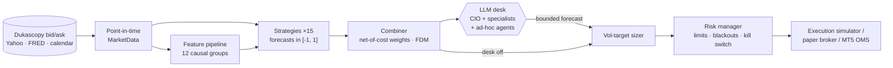

# Aurum: systematic gold (XAUUSD) research and trading

Aurum v2 is a rebuild of this repo as an institutional-style systematic trading stack for spot
gold. It covers point-in-time data, a leakage-tested feature library, 15 strategies
(rule-based, machine learning, reinforcement learning), net-of-cost portfolio construction,
volatility targeting, a hard risk manager, an event-driven simulator with realistic costs and
financing, and walk-forward research with deflated statistics. On top sits an **LLM trading
desk**: a Claude-powered Chief Investment Officer that consults specialist agents, **creates
new agents on demand**, and makes the call. It can never bypass the risk manager.

> **Honest status.** Under a pre-registered protocol on 14 years of real bid/ask data, **no
> strategy has a statistically demonstrated edge** (best walk-forward DSR 0.05, against a
> 0.95 bar). See [docs/RESULTS.md](docs/RESULTS.md). The trend book did well in the 2025–26
> holdout (Sharpe 1.34, 95% CI [−0.08, 2.78]), but that is not proof. Use Aurum as a research and
> paper-trading platform. The v1 README's claims of "80–120% annual returns" had no evidence
> behind them and have been removed.

---

## Contents

- [What's inside](#whats-inside)
- [Architecture](#architecture)
- [Quick start](#quick-start)
- [The LLM trading desk](#the-llm-trading-desk)
- [Strategies](#strategies)
- [Research methodology](#research-methodology)
- [Live and paper trading](#live-and-paper-trading)
- [Project layout](#project-layout)
- [Testing](#testing)
- [What changed from v1](#what-changed-from-v1)
- [Disclaimer](#disclaimer)

## What's inside

| Layer | Highlights |
|---|---|
| **Data** | Free Dukascopy **bid/ask** history (M1 → M15/H1/H4/D1, 2012 onward) with real spreads; MT5 CSV import with broker-timezone/DST handling; Yahoo and FRED macro (DXY, 10y, **real yields**, breakevens, VIX, S&P, silver, oil, Fed funds) stamped with publication lags; NFP/FOMC calendar |
| **Point-in-time core** | Every frame carries `available_at`. Higher-timeframe bars and macro data are joined only once published. v1 leaked up to 55 minutes of future per bar. |
| **Features** | 12 causal groups: returns, trend, momentum, mean-reversion, range, 5 volatility estimators (Parkinson, Garman–Klass, Rogers–Satchell, Yang–Zhang…), microstructure, DST-aware sessions, multi-timeframe, macro betas/correlations, event proximity, regime. Every group passes a future-perturbation leakage test. |
| **Strategies** | 15 registered: TSMOM, EWMAC, Donchian, Kalman trend, z-score fade, RSI(2), Bollinger, volatility squeeze, London/NY opening-range breakout, macro factor, risk-off, cost-aware seasonality, calibrated GBM, **meta-labelling** (triple barrier), **PPO reinforcement learning** |
| **Models** | GARCH(1,1), HAR-RV, EWMA vol, Gaussian HMM regimes (causal forward filter) |
| **Portfolio** | Forecast combiner (net-of-cost Sharpe-shrinkage / inverse-vol / HRP / equal) with a forecast diversification multiplier; volatility-targeting sizer with drawdown de-risking and a rebalance band |
| **Risk** | Pre-trade limits (leverage, margin, lots, spread, trades per day, stale data), NFP/FOMC blackouts, daily-loss and max-drawdown **kill switch that survives restarts**, VaR/ES, stress tests |
| **Execution** | One event-driven simulator shared by research, RL, paper and live: fill at next open, mid ± half spread ± slippage, intrabar SL/TP (stop first), commission, **rate-based financing** (Fed funds + markup, triple Wednesday) |
| **Research** | Walk-forward with per-fold refits, purge and embargo, stitched OOS; purged k-fold and CPCV; PSR, **Deflated Sharpe**, **PBO**, bootstrap CIs; holdout ledger; HTML tearsheets; full provenance |
| **LLM desk** | Claude CIO plus specialists (macro, quant, risk, execution) plus **ad-hoc agents created at runtime**; overlay/advisory/discretionary policies bounded by risk; JSONL audit journal; cost caps |
| **Live** | Paper broker, MetaTrader 5 adapter (magic-number isolation, retcode handling, filling-mode fallback), idempotent OMS, bar-close runner, drift (PSI) and slippage monitoring, webhook alerts |

About 35k lines of library code and about 1,450 tests.

## Architecture



Research, the RL environment, paper trading and live trading all go through **the same
sizer, risk manager and cost model**. What you backtest is what you trade: the test suite
replays bars through the live runner on the paper broker and requires its equity to match
`run_backtest` bar for bar, to within a millionth of a dollar.

## Quick start

```bash
git clone https://github.com/zero-was-here/tradingbot.git && cd tradingbot
python -m venv .venv && source .venv/bin/activate          # Python 3.10+
pip install -e ".[all]"                                     # or: pip install -e ".[dev]" (core only)

aurum data download                  # ~130 MB: Dukascopy XAUUSD 2012→yesterday + macro (resumable, cached)
aurum data info

aurum walkforward -c configs/trend_core.yaml   # ~15 s; writes runs/walkforward_<utc>_<hash>/tearsheet.html
aurum walkforward -c configs/default.yaml      # all 14 strategies incl. ML, ~3 min on 8 cores
aurum report --run runs/walkforward_<utc>_<hash>

aurum desk demo                      # offline LLM-desk demo (scripted client, no API key)
aurum strategies list
aurum features list
```

The core-only install has no Yahoo macro download (`[data]`: yfinance), no live Claude calls
(`[agents]`; `desk demo` still works) and no RL (`[rl]`). The free Dukascopy feed is heavily
rate-limited (HTTP 429/503), so the first full download takes about an hour or more;
re-running it resumes from the cache.

Every run writes `summary.json`, per-book results, OOS forecasts, a self-contained HTML
tearsheet and a provenance record (config hash, data hash, git SHA, package versions). Both
walk-forward configs also evaluate the 2025–26 holdout (`walkforward.holdout_start`), which
[docs/RESULTS.md](docs/RESULTS.md) has already used. To stay out of it, add
`--set data.end=2024-12-31T23:59:59Z --set walkforward.holdout_start=null`, as the
protocol's selection runs did.

## The LLM trading desk

At each decision (for example every H1 close) a **Chief Investment Officer** agent running on
Claude (`claude-opus-5` by default) receives the quant book's forecast and runs a short
investment-committee process:

1. **It reads the tape.** Point-in-time tools cover the market snapshot, per-strategy
   signals, risk status, macro, the event calendar, backtest statistics and positions.
2. **It consults standing specialists** that run in parallel as independent Claude
   tool-use loops, each writing a structured memo (stance, confidence, key points, risks,
   suggested exposure):
   - Macro Strategist
   - Quant Analyst
   - Risk Officer
   - Execution Trader
3. **It creates new agents when it needs them.** `create_specialist(name, mandate, tools,
   question)` spins up an ad-hoc analyst at runtime (for example an "FOMC event-risk analyst"
   or a "dollar-liquidity analyst") with a custom mandate and a whitelisted subset of data
   tools. Agents are capped per cycle and cannot spawn further agents.
4. **It decides.** `submit_decision` returns `follow_quant | scale | veto | override |
   hold` with confidence, horizon, rationale, key risks and recorded dissent.

**Safety model.** The desk outputs a *forecast*, never lots or orders. A `DecisionPolicy`
bounds it:
- `overlay` (default) may only scale the quant forecast toward zero or veto it; it never
  flips direction or adds risk;
- `advisory` only logs;
- `discretionary` may set a bounded forecast.

The result then goes through the **same vol-target sizer and risk manager** as everything
else, so a halted book stays flat whatever the LLM wants. API failures, refusals or budget
overruns fall back to the quant forecast (`agents.policy.on_failure: follow_quant`, the
default). Every cycle is journaled to JSONL (prompts, tool calls, memos, decision, token
usage and cost). Prompts treat all market text as untrusted data.

```bash
export ANTHROPIC_API_KEY=...                         # your own key; never put it in YAML
aurum desk demo                                      # free, offline
aurum desk run    -c configs/desk_overlay.yaml       # ONE paid cycle on the latest bar (~$0.60 planned, $2 cap)
aurum desk replay -c configs/desk_overlay.yaml --start 2024-10-01 --end 2024-12-31 --every 48   # 31 paid cycles, ~$19
```

`desk replay` prints the cycle count and cost estimate and refuses to start without `--yes`.
The per-cycle cost cap is `agents.desk.max_cost_usd_per_cycle` ($2 in `desk_overlay.yaml`,
$3 if unset), and a replay also stops calling the desk once its total budget
`agents.replay_max_cost_usd` ($25) is spent. Keep replays before 2025: a window inside the
holdout spends it, and the CLI warns. In replay, LLMs may have memorised historical prices;
`anonymise: true` shifts dates and rebases prices to reduce this, but it cannot remove it.
Treat desk replays as illustrative, not as evidence.

## Strategies

| Family | Strategy | Idea |
|---|---|---|
| Trend | `tsmom` | Multi-horizon (1w/1m/3m) time-series momentum, vol-normalised (Moskowitz, Ooi & Pedersen 2012) |
| | `ema_cross` | EWMAC 32/128 with a continuous, Carver-scaled forecast |
| | `donchian` | Turtle-style 120/60-bar channel breakout with an ATR stop |
| | `kalman_trend` | Local-linear-trend Kalman slope t-stat |
| Breakout | `vol_squeeze` | Bollinger inside Keltner, trading the release direction |
| | `orb` | London and New York opening-range breakout (DST-aware) |
| Mean reversion | `zscore_fade`, `rsi2`, `bollinger_revert` | Fade stretches: z-score gated by an efficiency-ratio filter, RSI(2) by a 200-bar trend filter, Bollinger on a close back inside the band |
| Macro | `macro_factor` | Long gold when the dollar and real yields fall (point-in-time) |
| | `risk_off` | Long-only safe-haven response to VIX spikes |
| Learned | `intraday_seasonality` | Hour-of-week drift with empirical-Bayes shrinkage, cost-aware |
| | `ml_gbm` | Calibrated gradient boosting on 12 feature groups, triple-barrier labels, validation **skill gate** |
| | `meta_label` | Machine learning sizes or filters a primary signal (López de Prado, AFML ch. 3 and 10) |
| | `rl_ppo` | PPO on the shared simulator (random starts, PIT observations, reward kept separate from equity) |

Add your own: subclass `aurum.strategies.base.Strategy`, implement `generate()`, and decorate
it with `@register_strategy` in one of the `aurum/strategies/` modules (a new module must be
added to the import list in `aurum/strategies/base.py` and in
`tests/test_strategies_leakage.py`). The generic leakage harness then runs on it
automatically. Add it to the random-walk no-edge cases in
`tests/test_strategies_rules_randomwalk.py` yourself.

## Research methodology

- **Timing.** Decide at the close of bar *t* and fill at the open of *t+1*. Nothing uses
  data before its `available_at`.
- **Walk-forward.** Rolling 3-year train and 6-month test windows. Every trainable piece
  (scaler, ML, seasonality table, combiner) is refit per fold on past data only. The
  combiner is fit on **earlier folds' OOS forecasts**, not on in-sample ones.
- **Statistics.** Headline Sharpe is computed on daily returns, and is reported with a
  bootstrap CI, PSR, **DSR** corrected for the number of trials, and **PBO**.
- **Holdout.** A final holdout is evaluated once. A ledger (`holdout_ledger.jsonl` next to
  the run directories) records every look. When a different configuration evaluates an
  already-seen holdout window, the run warns and raises the DSR `n_trials`. Re-running the
  same deterministic configuration is not counted as a new trial.
- **Pre-registration.** The protocol ([docs/RESEARCH_PROTOCOL.md](docs/RESEARCH_PROTOCOL.md))
  was written before the first full run, and all its results are in
  [docs/RESULTS.md](docs/RESULTS.md).

## Live and paper trading

```bash
aurum train-final -c configs/live_paper.yaml --out artifacts/live_paper   # fit on data to date
aurum live run    -c configs/live_paper.yaml --max-cycles 24               # dry-run, paper broker
```

- **`train-final`** fits the production artifact on all data up to `--cutoff` (default: the
  last bar). Its combiner weights come from out-of-sample walk-forward forecasts. Without
  `--from-run <walk-forward dir>` it first runs that walk-forward itself (all 14 strategies
  in `live_paper.yaml`, about 3–7 minutes), including a holdout evaluation that goes into the
  ledger.
- **What `live_paper.yaml` trades.** Its paper broker replays `data_store/xauusd_H1.parquet`
  on a simulated clock, starting after `paper.warmup_bars` (6,000 bars, i.e. December 2012).
  An artifact fitted on data to date is therefore **in-sample** on that replay: it tests the
  plumbing, not the strategy. For an out-of-sample replay, fit with
  `train-final --cutoff <date>` and set `live.options.paper.start` after that date. For
  real-time paper trading on MT5 quotes, set `live.options.paper.data: mt5`.
- **Dry-run by default.** Orders are planned and logged but not sent. Set
  `live.dry_run: false` to fill on the paper broker.
- **MetaTrader 5** (`live.broker: mt5`, Windows only) reads `MT5_LOGIN`, `MT5_PASSWORD`,
  `MT5_SERVER` and `MT5_PATH` from the environment. It only ever touches positions with its
  own magic number.
- **Real money needs two opt-ins.** A non-demo account is refused unless
  `live.allow_live_real: true` **and** `--i-understand-real-money` are both set. Given the
  results above, we recommend against it.
- The kill switch persists in `state_dir` and needs a human reset. There is a single-runner
  lock, idempotent order IDs (a restart never double-sends), a decision log for every bar,
  and slippage and PnL-band alerts through an optional webhook. PSI feature-drift alerts
  need a feature reference in the artifact, so an artifact whose strategies use no shared
  feature pipeline (such as `live_paper.yaml`'s) has none.
- The runner resumes from `state_dir`: a second run continues after the last processed bar.
  Use a fresh `live.state_dir` to start over.

## Project layout

```
aurum/
  core/        timeframes, instrument spec, shared types & protocols, typed YAML config
  data/        schema, point-in-time joins, resampling, Dukascopy, MT5/CSV, macro, calendar, store
  features/    12 causal feature groups + scaler pipeline
  models/      EWMA / GARCH / HAR volatility, Gaussian HMM
  labels/      triple-barrier labels, uniqueness weights
  strategies/  15 strategies + registry
  portfolio/   forecast combiner, sizers
  risk/        risk manager (kill switch, blackouts), VaR/ES
  execution/   cost & financing model, event-driven simulator
  backtest/    engine, metrics, result container
  research/    splits (WF / purged k-fold / CPCV), stats (PSR/DSR/PBO), walk-forward, tearsheet
  rl/          Gymnasium env on the shared simulator, PPO training
  agents/      LLM trading desk (Claude): CIO, specialists, ad-hoc agents, policy, journal
  live/        brokers (paper, MT5), OMS, runner, monitor
  cli.py       `aurum` command
configs/       default, trend_core, fast, live_paper, desk_overlay
docs/          RESEARCH_PROTOCOL, RESULTS, INTERFACES
SPEC.md        binding engineering contract between modules
mt5_ea/        GoldHedgerPro v4 (standalone MQL5 grid EA from v1, see warning below)
legacy/        the v1 Python code, kept for reference (not maintained)
```

## Testing

```bash
pytest -m "not network"          # ~1,450 tests, a few minutes
ruff check aurum tests
```

The suite covers:

- a future-perturbation leakage harness for every feature and strategy (with negative
  controls proving it catches leaks);
- random-walk no-edge tests;
- hand-computed PnL, cost and financing cases;
- simulator, paper broker and RL environment parity;
- walk-forward boundary tests;
- risk kill-switch persistence;
- OMS idempotency;
- MT5 adapter behaviour against a fake terminal;
- LLM-desk cycles against a scripted fake Claude client.

## What changed from v1

An audit of v1 (its README is kept as [legacy/README_v1.md](legacy/README_v1.md)) found that
nothing in the old repo could produce trustworthy numbers:

- higher-timeframe and macro features leaked the future;
- the scaler was fitted on the full sample;
- reward shaping was compounded into reported equity;
- the backtester fed random noise to a mock agent;
- crisis validation was hard-coded to pass;
- the Dreamer agent could not learn;
- live trading had no stop-losses or kill switch and could close other EAs' positions.

v1 is kept in `legacy/` for reference only.

**`mt5_ea/GoldHedgerPro_v4.mq5` warning.** This standalone EA is a grid/martingale-style
hedger. The audit found that its rolling grid has effectively **unbounded tail risk** and that
its risk state resets on restart. It is not part of Aurum, and we do not recommend running it
with real money.

## Disclaimer

This software is for research and education. It is not investment advice. Trading leveraged
products such as CFDs and gold can lose more than your initial deposit. Past performance,
backtested or real, does not predict future results. You are solely responsible for any use
of this code with real money.

License: MIT (see `LICENSE`).
