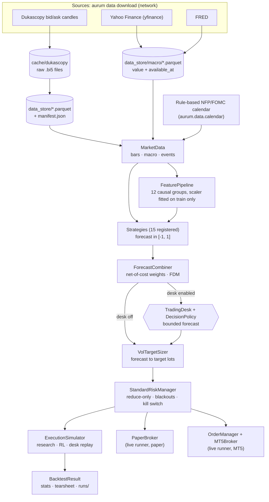
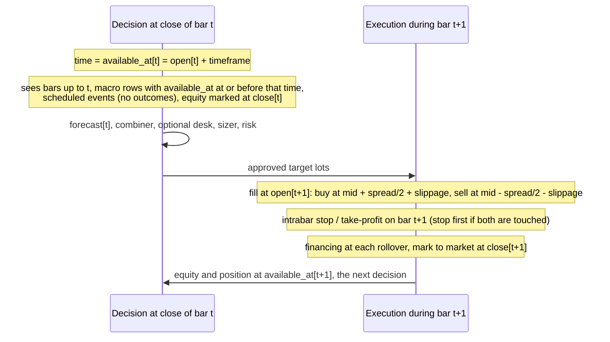

# Architecture

Aurum is a single Python package, `aurum`, organised as a pipeline. Point-in-time market data
feeds causal features and strategies. Strategies emit *forecasts*. A combiner blends them, an
optional LLM desk may bound them, a volatility-targeting sizer turns them into lots, a
reduce-only risk manager approves the lots, and an execution layer fills them. The same
classes run in four places: walk-forward research, the reinforcement-learning environment,
the LLM-desk replay and the live/paper runner. That is how Aurum keeps "what you backtest" and
"what you trade" the same. This page describes the design principles, the data flow, the timing
model, the module map, the parity guarantees and the tests that enforce them, and where to plug
in your own code. [SPEC.md](../SPEC.md) is the binding contract between modules;
[INTERFACES.md](INTERFACES.md) lists the public APIs.

**On this page**

- [Design principles](#design-principles)
- [End-to-end data flow](#end-to-end-data-flow)
- [Decision timing](#decision-timing)
- [Module map](#module-map)
- [One configuration drives every entry point](#one-configuration-drives-every-entry-point)
- [Shared components and parity guarantees](#shared-components-and-parity-guarantees)
- [Extension points](#extension-points)
- [Related pages](#related-pages)

## Design principles

| Principle | What it means | Where it is enforced |
|---|---|---|
| **Point-in-time or nothing** | A value may influence a decision at time `T` only if it was available at `T`. Every bar and every macro row carries `available_at`, and joins use `aurum.data.pit.asof_join`. | `aurum.data.schema.validate_bars` requires `available_at > open`. Future-perturbation leakage tests cover every feature group, every strategy and the whole walk-forward: `tests/test_features_leakage.py`, `tests/test_strategies_leakage.py`, `tests/test_final_e2e_leakage.py`. |
| **One simulator** | PnL is computed in one place, `aurum.execution.simulator.ExecutionSimulator`. Research, RL and the desk replay drive it directly. The paper broker reuses its cost model and intrabar exit rule and is tested to match it. | Parity tests, listed [below](#parity-guarantees-and-the-tests-that-enforce-them) |
| **Alpha ≠ sizing ≠ risk** | Strategies emit forecasts in [-1, 1], never lots. The combiner blends forecasts. The sizer turns a forecast into lots. The risk manager can only move the position toward zero, or halt. The LLM desk outputs a bounded forecast, never orders. | `Strategy._finalize` clips to [-1, 1]. The backtest engine clamps any risk approval outside `[min(0, requested), max(0, requested)]` and logs it. `DecisionPolicy` bounds the desk. `tests/test_engine_hook.py` shows a forecast hook cannot bypass a halt. |
| **Safe by default** | Live trading defaults to dry-run. Real money needs a config value *and* a CLI flag. The kill switch persists across restarts. Secrets come only from the environment. Desk failures fall back to the quant forecast by default (`agents.policy.on_failure: follow_quant`). | `aurum.live.runner`, `aurum.risk.manager`, `aurum.core.config` (rejects secrets in YAML). Tested in `tests/test_live_runner.py` and `tests/test_final_live_safety.py`. |
| **Deterministic and reproducible** | Stochastic components take a `seed`. Every run writes its resolved config, config hash, data hashes, git SHA and package versions (`provenance.json`). Walk-forward results do not depend on the executor (process, thread or serial). | `aurum.core.config.AurumConfig.config_hash`, `aurum.research.walkforward.provenance` |

Each module also ships tests that run offline on `aurum.data.synthetic` data. See
[development.md](development.md).

## End-to-end data flow



Step by step, for one bar close:

1. **Data.** `AurumConfig.data.load()` returns a `MarketData` bundle. It holds the bars (mid
   OHLC, the recorded bid/ask `spread`, `volume` and `available_at`, indexed by bar **open**
   time in UTC), macro frames (each row carries its publication time as `available_at`) and
   scheduled events. The live runner builds the same bundle from `broker.latest_bars`, which
   returns closed bars only. See [data.md](data.md).
2. **Features.** Registered feature groups compute causal columns on the full history. A
   `FeaturePipeline` scales them with statistics fitted on training rows only. With the
   default `features.enabled: auto`, no strategy receives the shared pipeline. Rule-based
   strategies compute their own indicators from the bars, and `ml_gbm` and `meta_label` build
   and fit their own pipelines on each fold's training slice. A strategy that declares
   `uses_features = True` gets the shared, per-fold-fitted pipeline. See
   [features.md](features.md).
3. **Strategies.** Each `Strategy.generate` returns `forecast[t]` in [-1, 1], decided at the
   close of bar `t`. Trainable strategies are fitted on training data only. See
   [strategies.md](strategies.md) and [ml-and-rl.md](ml-and-rl.md).
4. **Combiner.** `ForecastCombiner` weights strategies by net-of-cost performance (fitted in
   research on earlier folds' out-of-sample forecasts) and applies a forecast diversification
   multiplier. See [portfolio-and-risk.md](portfolio-and-risk.md).
5. **LLM desk (optional).** `TradingDesk.run_cycle` returns a final forecast. With the default
   `overlay` policy, it can only scale the quant forecast toward zero or veto it. See
   [llm-desk.md](llm-desk.md).
6. **Sizing.** `VolTargetSizer.target_lots` computes
   `notional = forecast × target_vol / vol_ann × equity`, caps it at `max_leverage`, applies
   drawdown de-risking, rounds to the lot grid and applies a rebalance band.
7. **Risk.** `StandardRiskManager.evaluate` applies pre-trade limits (leverage, margin, lots,
   spread, trades per day, stale data), event blackouts, and the daily-loss and max-drawdown
   kill switch. It returns approved lots that are never further from zero than requested.
8. **Execution.** The simulator (or the paper broker, or the OMS against MT5) trades to the
   approved lots at the next open, with spread, slippage, commission and financing. See
   [execution-and-costs.md](execution-and-costs.md) and [live-trading.md](live-trading.md).

The same chain as runnable code, on synthetic data (a random walk, so no edge is expected):

```python
import pandas as pd

from aurum.backtest.engine import run_backtest
from aurum.core.types import MarketData
from aurum.data.synthetic import make_synthetic_bars, make_synthetic_events, make_synthetic_macro
from aurum.execution.costs import CostModel
from aurum.portfolio.combiner import ForecastCombiner
from aurum.portfolio.sizing import VolTargetSizer
from aurum.risk.manager import RiskLimits, StandardRiskManager
from aurum.strategies.base import get_strategy

# 1. point-in-time market data (a random walk: no edge by construction)
bars = make_synthetic_bars(6000, "H1", seed=1)
md = MarketData(bars=bars, macro=make_synthetic_macro(bars, seed=1),
                events=make_synthetic_events(bars.index[0], bars.index[-1]))

# 2. alpha: causal forecasts in [-1, 1], decided at the close of each bar
forecasts = pd.DataFrame({n: get_strategy(n).generate(md) for n in ("tsmom", "ema_cross", "donchian")})

# 3. combiner: fitted on the first half only, then applied row by row
split = bars.index[3000]
train = forecasts.index < split
combiner = ForecastCombiner(method="equal").fit(forecasts[train], bars["close"][train])
combined = combiner.combine(forecasts)

# 4. sizing -> risk -> execution, on the second half, through the one simulator
res = run_backtest(md, combined, sizer=VolTargetSizer(target_vol=0.10),
                   risk=StandardRiskManager(RiskLimits(max_drawdown=None, daily_loss_persistent=False)),
                   costs=CostModel(), start=split)
print({k: round(float(res.metrics[k]), 3) for k in ("sharpe", "max_drawdown", "total_costs", "n_trades")})
print("PnL identity holds:", abs(res.reconcile()["residual"]) < 1e-6)
```

```text
rate financing: no 'fedfunds' series supplied (md.macro / rates=); every rollover uses fallback_rate=0.0300
{'sharpe': -0.762, 'max_drawdown': -0.053, 'total_costs': 547.953, 'n_trades': 41.0}
PnL identity holds: True
```

The first line is a logged warning. The synthetic macro set has no `fedfunds` series, so
rate-based financing uses its fallback rate. `reconcile()` checks the accounting identity
*equity change = price PnL − costs + swap*. The walk-forward engine
(`aurum.research.walkforward`) does the same things at scale: per-fold refits, stitched
out-of-sample forecasts, and one continuous backtest per book. See [research.md](research.md).

## Decision timing

All timestamps are tz-aware UTC. A bar is indexed by its **open** time. Its
`available_at = open + timeframe` is the moment it is complete. Decisions are made at the close
of bar `t`, that is at `available_at[t]`, and fill at the **open** of bar `t+1`.



The rules behind the diagram:

- **Bars.** A decision at `available_at[t]` may use bars `0..t`. `ExecutionSimulator.step` is
  called at that close. It uses bar `t+1` only to settle the order: the fill price, the
  high-low range for the slippage term, the intrabar exit check and the mark-to-market at
  `close[t+1]`.
- **Higher timeframes.** H4 and D1 bars built from H1 are emitted only once their bucket is
  complete, and are aligned with the same `available_at` rule.
- **Macro.** A daily print counts only from its publication time. Yahoo cash indices become
  available at date + 21:30 UTC, Yahoo futures and ICE at date + 22:30 UTC, and FRED series at
  21:30 UTC on the next US business day.
- **Events.** Scheduled release times are public in advance, so they may be used before the
  event. Outcome columns are stripped from upcoming events.
- **Financing.** Rollovers fall at `Instrument.rollover_hour_utc` (21 for XAUUSD) on weekdays,
  with three nights charged on `triple_swap_weekday` (Wednesday). In rate mode the benchmark
  rate is read as of the rollover instant.
- **Live.** The runner decides at `available_at`. It sends orders `bar_close_delay_seconds`
  later (default 5 s), so the venue has published the bar. If the market is closed, it retries
  the same decision when quotes return, which reproduces the simulator's "fill at the next
  open".

Timing and point-in-time joins, shown with code:

```python
import pandas as pd

from aurum.data.synthetic import make_synthetic_bars
from aurum.execution.costs import CostModel
from aurum.execution.simulator import ExecutionSimulator

pd.set_option("display.width", 120)
bars = make_synthetic_bars(3, "H1", seed=0)
print(bars[["open", "close", "spread", "available_at"]].round({"open": 3, "close": 3, "spread": 3}))

# Decide at the close of bar 0 (available_at[0]); the simulator fills at the OPEN of bar 1.
costs = CostModel(slippage_fixed=0.02, slippage_range_frac=0.0, financing="none")
sim = ExecutionSimulator(bars, costs=costs)
step = sim.step(1.0)                        # target: +1 lot, decided at 01:00 UTC
buy = bars["open"].iloc[1] + costs.effective_spread(bars["spread"].iloc[1]) / 2 + 0.02
print("filled in bar opening at", step.time, "at", round(step.fills[0].price, 4))
print("open[1] + spread/2 + slippage =", round(buy, 4))
```

```text
                               open     close  spread              available_at
time                                                                           
2020-01-06 00:00:00+00:00  1800.000  1800.384   0.303 2020-01-06 01:00:00+00:00
2020-01-06 01:00:00+00:00  1800.400  1799.975   0.168 2020-01-06 02:00:00+00:00
2020-01-06 02:00:00+00:00  1799.893  1801.944   0.284 2020-01-06 03:00:00+00:00
filled in bar opening at 2020-01-06 01:00:00+00:00 at 1800.5042
open[1] + spread/2 + slippage = 1800.5042
```

```python
import pandas as pd

from aurum.data.pit import asof_join
from aurum.data.synthetic import make_synthetic_bars

bars = make_synthetic_bars(48, "H1", seed=0, weekend_gaps=False)   # H1 bars from Mon 2020-01-06 00:00 UTC

# A daily series: observed on a date, usable only once published (``available_at``).
rate = pd.DataFrame(
    {"value": [1.55, 1.54],
     "available_at": pd.to_datetime(["2020-01-06 21:30", "2020-01-07 21:30"], utc=True)},
    index=pd.to_datetime(["2020-01-03", "2020-01-06"], utc=True),   # observation dates
)
seen = asof_join(bars["available_at"], rate, columns=["value"])     # one row per bar
for t in ["2020-01-06 20:00", "2020-01-06 21:00", "2020-01-07 21:00"]:
    t = pd.Timestamp(t, tz="UTC")
    print(t, "decided at", bars.loc[t, "available_at"], "sees", seen.loc[t, "value"])
```

```text
2020-01-06 20:00:00+00:00 decided at 2020-01-06 21:00:00+00:00 sees nan
2020-01-06 21:00:00+00:00 decided at 2020-01-06 22:00:00+00:00 sees 1.55
2020-01-07 21:00:00+00:00 decided at 2020-01-07 22:00:00+00:00 sees 1.54
```

Friday's print was published on Monday at 21:30 UTC. The bar that closes at 21:00 cannot see
it; the bar that closes at 22:00 can. Missing values stay `NaN`: `asof_join` never
back-fills.

## Module map

| Package | Responsibility | Key names |
|---|---|---|
| `aurum.core` | Shared vocabulary: timeframes, the instrument specification, value types, protocols and the typed configuration | `Timeframe`, `get_timeframe`, `infer_bars_per_year`; `Instrument`, `XAUUSD`; `MarketData`, `Order`, `Fill`, `Trade`, `Side`; `PositionSizer`, `RiskManager`, `RiskContext`, `RiskDecision` (`interfaces.py`); `AurumConfig`, `load_config`, `ConfigError` |
| `aurum.data` | Canonical bar schema, point-in-time joins, resampling, the Dukascopy downloader, MT5/CSV loaders, Yahoo/FRED macro, the NFP/FOMC calendar, synthetic data, the parquet store | `make_bars`, `validate_bars`, `asof_join`, `resample_bars`, `download_dukascopy`, `prefetch_cache`, `build_dataset`, `load_mt5_csv`, `fetch_yahoo_daily`, `fetch_fred`, `load_macro_dir`, `generate_rule_based_calendar`, `make_synthetic_bars`, `load_bars`, `save_bars`, `frame_hash` |
| `aurum.features` | 12 causal feature groups and the train-only-fitted scaler pipeline | `register_feature`, `FeatureSpec`, `list_features`; `FeaturePipeline` (`compute`, `fit`, `transform`, `save`/`load`, `parity_report`) |
| `aurum.models` | Volatility forecasters and a causal regime model | `ewma_volatility`, `Garch11`, `HarRV`, `blend_vol`; `GaussianHMM` |
| `aurum.labels` | Supervised-learning targets | `triple_barrier_labels`, `meta_labels`, `uniqueness_weights` |
| `aurum.strategies` | 15 registered alpha models and the registry | `Strategy`, `register_strategy`, `get_strategy`, `list_strategies`; for example `TimeSeriesMomentum` (`tsmom`), `MLGBMStrategy` (`ml_gbm`), `RLPolicyStrategy` (`rl_ppo`) |
| `aurum.portfolio` | Forecast combination and position sizing | `ForecastCombiner`; `VolTargetSizer`, `FixedFractionalSizer` |
| `aurum.risk` | The reduce-only pre-trade risk manager; VaR, ES and stress tests | `RiskLimits`, `StandardRiskManager` (`evaluate`, `on_bar`, `halt`, `reset_halt`); `var_es`, `stress_test`, `risk_report` |
| `aurum.execution` | The cost and financing model and the execution simulator | `CostModel`, `FinancingModel`, `RateCurve`; `ExecutionSimulator`, `StepResult`, `intrabar_exit` |
| `aurum.backtest` | The thin engine (forecast, sizer, risk, simulator), the result container and metrics | `run_backtest`, `run_target_lots`, `buy_and_hold_benchmark`; `BacktestResult`; `compute_metrics`, `daily_returns` |
| `aurum.research` | Leak-free splits, overfitting statistics, the walk-forward protocol and tearsheets | `walk_forward_splits`, `purged_kfold`, `cpcv_splits`; `sharpe_summary`, `deflated_sharpe`, `pbo_cscv`, `stationary_bootstrap`; `run_walk_forward`, `run_single_backtest`, `fit_quant_book`; `write_tearsheet` |
| `aurum.rl` | A Gymnasium environment on the shared execution stack, and PPO training | `GoldTradingEnv`, `EnvConfig`, `rollout`; `RLTrainConfig`, `train_ppo` |
| `aurum.agents` | The LLM trading desk: Chief Investment Officer, specialists, ad-hoc agents, policy, journal and cost ledger | `TradingDesk`, `DecisionPolicy`, `DeskConfig`, `DeskDataProvider`, `HistoricalDeskDataProvider`, `StaticDeskDataProvider`, `CycleJournal`, `UsageLedger`, `demo`; `testing.FakeAnthropicClient` |
| `aurum.live` | The production path: broker protocol, paper and MT5 brokers, the idempotent OMS, the bar-close runner, monitoring and atomic state files | `Broker`, `Clock`, `SimulatedClock`; `PaperBroker`, `ReplayFeed`, `BrokerDataFeed`; `MT5Broker`; `OrderManager`; `LiveRunner`, `LiveConfig`, `save_artifact`, `load_artifact`; `DriftMonitor`, `AlertManager`; `atomic_write_json` |
| `aurum.cli` | The `aurum` command (also `python -m aurum`) | `main`, `build_parser`. See [cli.md](cli.md). |

Optional dependencies load lazily. `aurum.strategies.rl` does not import torch until a policy is
used, and `aurum.agents` does not import `anthropic` until a desk is built without a client. So
the core install can import every package.

## One configuration drives every entry point

Every command builds one `AurumConfig` from YAML via `load_config`. YAML files can
`extends:` other files (deep merge, lists replaced), and `--set key.path=value` overrides
are applied on top. Unknown keys fail with a "did you mean" hint. Validation builds the real
downstream objects (`CostModel`, `VolTargetSizer`, `RiskLimits`, `ForecastCombiner`,
`DecisionPolicy`, ...), so most range errors surface when the config loads. A few settings
(strategy names and parameters, feature groups, `instrument.triple_swap_weekday`,
`live.options` keys) are only checked when a command builds the object that uses them; see
[configuration.md](configuration.md#validation).

- **Research** (`walkforward`, `backtest`, `train-final`) uses `costs`, `sizing`,
  `combiner`, `backtest` and `risk.research`. `risk.research` is layered over
  `RESEARCH_RISK_DEFAULTS`: daily-loss halts last one day and there is no max-drawdown kill.
- **The desk replay** uses the same research objects plus the `agents` section.
- **The live runner** receives `AurumConfig.live_runner_mapping()`: the same `costs`, the
  research sizer settings and `risk.live`, the conservative live limits with a persistent kill
  switch. `live.options` may only *add* runner settings. It cannot override `dry_run`,
  `allow_live_real`, `broker`, `magic`, or the risk, sizer and cost sections. The live runner
  implements only volatility targeting, so `train-final`, `live artifact` and `live run` refuse
  a config whose `sizing.method` is not `vol_target`.
- **Secrets** never live in YAML. `ANTHROPIC_API_KEY`, `MT5_PASSWORD`,
  `AURUM_ALERT_WEBHOOK_URL` and `AURUM_ARTIFACT_KEY` are read from the environment and excluded
  from saved configs and from the hash.
- **`config_hash()`** is the SHA-256 of every field that can change results. The output
  section, the run name, execution knobs such as `walkforward.n_jobs`, and secrets are
  excluded. It names run directories, keys the holdout ledger, and links a trading artifact
  to the walk-forward that validated it (`train-final --from-run` refuses a different hash
  without `--allow-config-mismatch`).

Details are in [configuration.md](configuration.md).

## Shared components and parity guarantees

### Who uses what

| Component | Walk-forward / backtest | RL environment | Desk replay | Live runner |
|---|---|---|---|---|
| Market data | `cfg.data.load()` | `cfg.data.load()`, split by `rl.train_end` / `rl.val_end` | `cfg.data.load()` | `broker.latest_bars` (closed bars only), `macro_dir`, rule-based calendar |
| Features | `FeaturePipeline` fitted per fold (for strategies that use it) | `FeaturePipeline` (`RLTrainConfig.feature_groups`) | as research (`fit_quant_book`) | pipeline loaded from the artifact, computed on `3 × max_lookback` bars of history (at least 300) unless `live.history_bars` is set |
| Strategies and combiner | cloned and refitted per fold; combiner fitted on earlier OOS folds | the PPO policy is the strategy | fitted once before the replay window | pickled in the artifact by `train-final` |
| Sizer | `VolTargetSizer` from `sizing` | `VolTargetSizer` from `rl.params.env.sizer` | `VolTargetSizer` from `sizing` | `VolTargetSizer` from the artifact's sizer settings (from `sizing`) |
| Risk | `StandardRiskManager`, research limits | `StandardRiskManager` from `rl.params.env.risk` | `StandardRiskManager`, research limits | `StandardRiskManager`, `risk.live` limits, state in `state_dir` |
| Execution | `ExecutionSimulator` via `run_backtest` | `ExecutionSimulator` | `ExecutionSimulator` via `run_backtest(forecast_hook=...)` | `PaperBroker` (same `CostModel`, `FinancingModel` and `intrabar_exit`) or `OrderManager` + `MT5Broker` |
| Costs | `CostModel` from `costs` | `CostModel` from `rl.params.env.costs` | `CostModel` from `costs` | `CostModel` from `costs` |

The RL environment uses the same classes, but its sizer, risk and cost *settings* come from
`rl.params.env` (`aurum.rl.env.EnvConfig`), not from the top-level `sizing`, `risk.research` and
`costs` sections. Its defaults are a 10% vol target, 2x leverage and a 0.10 rebalance band,
with `RiskLimits` defaults plus `daily_loss_persistent: false`. Set them explicitly to match
your research config. See [ml-and-rl.md](ml-and-rl.md).

### Parity guarantees and the tests that enforce them

| Guarantee | Test |
|---|---|
| The live runner on the paper broker reproduces `run_backtest` equity bar for bar, within 1e-6 USD | `tests/test_live_runner.py::test_paper_run_matches_backtest_and_logs_everything` |
| The same, with rate-based financing read from the runner's `macro_dir` | `tests/test_integrator_wave3.py::test_paper_run_uses_macro_dir_rates_and_matches_the_engine` |
| The live post-stop re-entry cooldown matches the engine's | `tests/test_live_runner.py::test_stop_cooldown_matches_the_backtest_engine` |
| `PaperBroker` equals `ExecutionSimulator`: identical equity at every decision (within 1e-6) and identical fill prices, with and without stops; identical swap over rollovers | `tests/test_live_paper.py::test_paper_equals_simulator`, `::test_paper_swap_matches_simulator_over_rollovers` |
| Rate financing is identical in the simulator, the paper broker, the RL environment and the engine; `intrabar_exit` is one shared function | `tests/test_financing_parity.py` |
| An RL evaluation rollout reproduces `run_backtest` equity (within 1e-8) and positions for the same forecasts, including through kill-switch halts | `tests/test_rl_env.py::test_rollout_equity_matches_run_backtest`, `::test_rollout_matches_engine_through_kill_switch`, `tests/test_integrator_wave3.py::test_rl_evaluation_env_reads_macro_rates_and_matches_the_engine` |
| The desk-replay hook changes nothing when absent or when it returns the input, and cannot bypass a risk halt or the kill switch | `tests/test_engine_hook.py` |
| Features computed on the live runner's history window equal full-history features on the decision row | `tests/test_stability_regime.py::test_sliding_window_parity_every_default_column`, `::test_pipeline_live_history_parity` |
| Rule-strategy forecasts on the live history window match full-history forecasts within 0.05 | `tests/test_strategies_rules.py::test_live_history_parity` |
| Perturbing the future leaves every earlier walk-forward output bit-identical: forecasts, weights, lots, equity | `tests/test_final_e2e_leakage.py` |

To run the parity subset yourself:

```bash
pytest tests/test_live_runner.py tests/test_live_paper.py tests/test_rl_env.py \
       tests/test_financing_parity.py tests/test_engine_hook.py tests/test_integrator_wave3.py
```

### Where they deliberately differ

- **Risk limits.** Research uses `risk.research` (a daily-loss halt lasts one day, no
  permanent drawdown kill, so research can report drawdowns). Live uses `risk.live`, with a
  persistent kill switch that needs a human `reset_halt(confirm="RESET")`. The parity tests
  pin identical limits on both sides.
- **History length.** The live runner computes features and forecasts on a sliding window
  (`history_multiple = 3` × the artifact's maximum lookback), not the full history. The
  sliding-window tests above bound the difference. For rule strategies the bound is a
  tolerance (0.05 on the forecast), not bit equality.
- **The paper broker is not the simulator object.** It keeps positions the way a broker does
  (executed prices, commission booked to the balance, swap accrued on the position). It uses
  the same `CostModel` arithmetic, `FinancingModel` and `intrabar_exit`, and the tests above
  hold it to the simulator's equity path.
- **Real venues.** MT5 fills, partial fills, requotes and broker-side stops are not simulated.
  The simulator has no partial fills, liquidity limits or margin stop-out model. See
  [execution-and-costs.md](execution-and-costs.md) for its known limitations.

## Extension points

### Registries

Strategies and feature groups register themselves with decorators. Configs refer to them
by name.

```python
import numpy as np
import pandas as pd

from aurum.core.interfaces import PositionSizer, RiskManager
from aurum.core.types import MarketData
from aurum.data.synthetic import make_synthetic_bars
from aurum.features.base import register_feature
from aurum.features.pipeline import FeaturePipeline
from aurum.portfolio.sizing import VolTargetSizer
from aurum.risk.manager import StandardRiskManager
from aurum.strategies.base import Strategy, get_strategy, register_strategy


@register_feature("my_drift", family="my_drift", lookback=48)
def my_drift(md: MarketData, n: int = 48) -> pd.DataFrame:
    """Rolling mean of log returns (causal: trailing window only)."""
    r = np.log(md.bars["close"]).diff()
    return pd.DataFrame({f"my_drift_mean_{n}": r.rolling(n).mean()}, index=md.bars.index)


@register_strategy
class SignOfDrift(Strategy):
    name = "sign_of_drift"
    description = "Toy example: sign of the trailing mean log return."

    @classmethod
    def default_params(cls):
        return {"n": 48}

    @property
    def warmup_bars(self) -> int:
        return self.params["n"]

    def generate(self, md, features=None):
        r = np.log(md.bars["close"]).diff()
        return self._finalize(np.sign(r.rolling(self.params["n"]).mean()), md.bars.index)


md = MarketData(bars=make_synthetic_bars(500, "H1", seed=3))
f = get_strategy("sign_of_drift", n=24).generate(md)
print(f.name, f.between(-1, 1).all(), (f.iloc[:24] == 0).all())
X = FeaturePipeline(groups=["my_drift"]).compute(md)
print(list(X.columns), int(X.iloc[:, 0].isna().sum()))
print(isinstance(VolTargetSizer(), PositionSizer), isinstance(StandardRiskManager(), RiskManager))
```

```text
sign_of_drift True True
['my_drift_mean_48'] 48
True True
```

The contracts, from `aurum/strategies/base.py` and `aurum/features/base.py`:

- **Strategy.** `generate(md, features=None)` must be causal: `forecast[t]` may use only data
  available at the close of `t`. Return it through `self._finalize(...)`, which aligns the
  series, clips it to [-1, 1], zeroes the warm-up and replaces NaN/inf with 0. Anything learned
  in `fit(md, features=None)` must be stored on `self`. Set `trainable = True` if `fit` learns
  from data, so the walk-forward refits the strategy per fold. Declare label or holding
  horizons as parameters (for example `label_horizon`, `max_holding`) so `walkforward.purge:
  auto` can purge them.
- **Feature group.** Return a frame indexed exactly like `md.bars.index`, with columns prefixed
  by the family. Row `t` may use only information available at `available_at[t]`. No
  `shift(-k)`, centred windows, `bfill` or full-sample statistics; warm-up rows are NaN.
  Declare `requires_macro` / `requires_events` when you need them.
- **Discovery.** `list_strategies()` and `list_features()` import a fixed list of modules. For
  a new strategy to be usable from YAML configs and the CLI, put it in a module under `aurum/strategies/`, add that module to the
  import list in `aurum/strategies/base.py`, and add it to `tests/test_strategies_leakage.py`
  so the leakage harness runs on it. Add it to the random-walk no-edge cases in
  `tests/test_strategies_rules_randomwalk.py` too. Feature modules are listed in
  `aurum/features/base.py`.

### Protocols

`aurum/core/interfaces.py` defines the two structural interfaces that the backtest engine,
the RL environment and the live runner all drive. Any object with the right methods works;
the protocols are `runtime_checkable`.

| Protocol | Method(s) | Built-in implementation |
|---|---|---|
| `PositionSizer` | `target_lots(forecast, vol_ann, equity, price, instrument, *, current_lots=0.0, drawdown=0.0) -> float`: signed lots, already rounded with `instrument.round_lots` | `VolTargetSizer`, `FixedFractionalSizer` |
| `RiskManager` | `evaluate(ctx: RiskContext) -> RiskDecision` and `on_bar(time, equity)`. The engine calls `on_bar`, then `evaluate`, at every close. | `StandardRiskManager` |

`RiskContext` carries the decision time (`available_at[t]`), equity, current and target lots,
price, spread, annualised vol, optional data age (live), upcoming and recent events, and
extras. `RiskDecision` returns `approved_lots`, `halted` and `reasons`. However a custom risk
manager behaves, the engine enforces reduce-only: approvals outside `[min(0, requested),
max(0, requested)]` are clamped and logged. Keep in mind that the live runner itself builds
`VolTargetSizer` and `StandardRiskManager`. Custom implementations plug into
`run_backtest` and your own loops, not into `aurum live run`.

Other protocols live next to their consumers:

| Protocol | Module | Purpose |
|---|---|---|
| `Broker` | `aurum/live/broker.py` | Venue interface for the OMS and runner: account, positions filtered by symbol **and** magic, orders, closed bars only, demo flag, server time, quotes, deal lookup |
| `Clock` | `aurum/live/broker.py` | Time source. `SimulatedClock` replays hundreds of bars instantly; `SystemClock` is the wall clock. |
| `BarFeed` | `aurum/live/paper.py` | Market data for `PaperBroker` (`ReplayFeed`, `BrokerDataFeed`) |
| `DeskDataProvider` | `aurum/agents/providers.py` | JSON snapshots for the LLM desk: market, quant signals, risk, macro, calendar, backtest stats, positions |
| `AlertSink` | `aurum/live/monitor.py` | Alert destinations: log, JSONL, webhook |

### Other seams

- **Combiner methods.** `combiner.method` is `sharpe_shrink`, `equal`, `inverse_vol`, `hrp` or
  `fixed` (weights from `strategies[].weight`).
- **Costs.** `CostModel` (spread multiplier, minimum spread, slippage, impact, commission) and
  `FinancingModel` (`rate`, `fixed` or `none`) are configured under `costs`.
- **Data.** `aurum.data.loaders.load_mt5_csv` and `load_csv` produce the canonical bars schema
  from your own files. Point `data.bars_path` at a parquet file written with
  `aurum.data.store.save_bars`.

## Related pages

- [getting-started.md](getting-started.md): install, data and first runs
- [data.md](data.md), [features.md](features.md), [strategies.md](strategies.md),
  [ml-and-rl.md](ml-and-rl.md): the research building blocks in depth
- [portfolio-and-risk.md](portfolio-and-risk.md),
  [execution-and-costs.md](execution-and-costs.md): sizing, limits, fills, financing
- [research.md](research.md), [RESEARCH_PROTOCOL.md](RESEARCH_PROTOCOL.md),
  [RESULTS.md](RESULTS.md): methodology and results
- [llm-desk.md](llm-desk.md), [live-trading.md](live-trading.md): the desk and the production path
- [configuration.md](configuration.md), [cli.md](cli.md), [development.md](development.md)
- [SPEC.md](../SPEC.md) and [INTERFACES.md](INTERFACES.md): the contract and the API map
