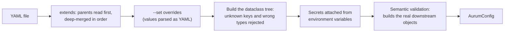

# Configuration

One YAML file drives every Aurum entry point: research backtests, walk-forward runs, the
LLM desk, RL training and the live runner. Research, the desk replay and the live runner build
their sizer, risk manager and cost model from the same typed tree, so research and live cannot
silently diverge. RL training is the exception: its environment takes these settings from
`rl.params.env` (see [`rl`](#rl)). This page is
the reference for that file. It covers how a file is loaded (`extends` inheritance, deep
merge, `--set` overrides), what is validated and when, how secrets are kept out of YAML,
what the config hash covers, how the shipped configs differ, and every section and key with
its type, default, meaning and validation. It is generated from the dataclasses in
[`aurum/core/config.py`](../aurum/core/config.py) and the downstream classes they build;
every example was validated against the current code.

**On this page**

- [How a configuration is loaded](#how-a-configuration-is-loaded)
- [Inheritance with `extends`](#inheritance-with-extends)
- [Command-line overrides with `--set`](#command-line-overrides-with---set)
- [Validation](#validation)
- [Secrets and environment variables](#secrets-and-environment-variables)
- [The config hash](#the-config-hash)
- [Shipped configs](#shipped-configs)
- [Reference](#reference): [top level](#top-level), [`data`](#data), [`instrument`](#instrument),
  [`costs`](#costs), [`features`](#features), [`strategies`](#strategies),
  [`combiner`](#combiner), [`sizing`](#sizing), [`risk`](#risk), [`backtest`](#backtest),
  [`walkforward`](#walkforward), [`agents`](#agents), [`live`](#live), [`rl`](#rl),
  [`output`](#output)
- [Durations](#durations)
- [Examples](#examples)
- [Python API](#python-api)
- [Limitations](#limitations)
- [See also](#see-also)

## How a configuration is loaded



Every command that takes `--config` (or `-c`) loads the file this way, and so does
`load_config()` in Python. Relative paths inside the config (`data.dir`, `output.dir`,
`live.state_dir`, ...) resolve against the **current working directory**, so run the CLI
from the repository root. Two commands inspect a configuration without running anything:

```bash
aurum config validate -c configs/trend_core.yaml     # checks it and prints the hash
aurum config show -c configs/trend_core.yaml         # prints the resolved YAML (no secrets), then the same line
```

```text
# config OK: configs/trend_core.yaml  hash 06a2fca027fc67d5b33bcc96fef2be2ac902a4938cadd6020b270943fbc97064
```

Without `--config`, `aurum config show` prints the built-in defaults. Hashes change between
code versions whenever a field is added or a default changes, so yours may differ from the
one above.

## Inheritance with `extends`

A file may start with `extends:` naming one parent or a list of parents. Relative paths are
resolved against the directory of the file that contains them. The rules:

1. Parents are read first (recursively, so a parent may extend another file), and merged
   in the order listed: a later parent wins over an earlier one.
2. The file's own keys are then merged on top.
3. **Mappings merge key by key, recursively. Lists and scalars replace wholesale.** A child
   that sets `strategies:` replaces the whole strategy list; a child that sets
   `walkforward: {test: 3M}` changes only `test`.
4. `null` replaces a value. That works for optional keys (`walkforward: {holdout_start: null}`);
   setting a whole section to `null` is an error (`data: expected a mapping, got NoneType`).
   There is no way to delete a key that a parent set inside a free-form mapping such as
   `risk.research`; set it to the value you want instead.
5. A circular chain is an error (`circular 'extends' chain: ...`).

`--set` overrides are applied after the whole chain is merged. `extends` only works in
files: a mapping passed to `load_config()` has its `extends` key ignored.

Every shipped config extends `default.yaml`. A three-level example, checked with
`load_config`: a child extending `[base.yaml, a.yaml, b.yaml]`, where `a.yaml` sets
`walkforward.test: 3M` and `embargo: 48` and `b.yaml` sets `walkforward.test: 1Y`, ends up
with `test: 1Y` (the later parent wins), `embargo: 48`, and `train` from `base.yaml`; a
`--set walkforward.embargo=12` then gives `embargo: 12`.

## Command-line overrides with `--set`

`--set KEY.PATH=VALUE` is repeatable and accepted by every command that takes `--config`.

- The key is a dotted path into the merged YAML. Missing intermediate mappings are created
  (`--set data.synthetic.n=30000` works although `data.synthetic` is absent from
  `default.yaml`).
- The value is parsed as YAML, so types come out as in a file: `48` is an integer, `3M` a
  string, `null` (or an empty value, `--set walkforward.holdout_start=`) is null, `true` a
  boolean, `2025-01-01` a date (accepted wherever a string is expected), and
  `[{name: tsmom}]` a list. Quote the argument for your shell when it contains spaces,
  brackets or braces.
- The text is split at the **first** `=`, so values may contain `=`.
- Lists cannot be indexed. `--set strategies.0.params.fast=16` fails with
  `'strategies' is not a mapping`; replace the whole list instead.
- Secret keys cannot be set: `--set agents.api_key=...` fails with
  `agents.api_key: secrets cannot be overridden; set $ANTHROPIC_API_KEY`.
- Overrides are part of the resolved config: they change the config hash (unless the key is
  unhashed) and are written to each run's `config.yaml`.

```bash
aurum config show -c configs/trend_core.yaml --set walkforward.test=3M \
  --set 'strategies=[{name: tsmom}, {name: donchian}]'

# exclude the 2025-26 holdout entirely (how the protocol's selection runs were made)
aurum walkforward -c configs/default.yaml \
  --set data.end=2024-12-31T23:59:59Z --set walkforward.holdout_start=null
```

## Validation

Loading rejects a bad configuration with a `ConfigError` that lists every problem it found
(the CLI prints them and exits with code 2):

```text
$ aurum config validate -c configs/default.yaml --set walkforward.train=3parsecs --set walkforward.pbo_splits=5
aurum: configuration error: 2 configuration problems:
  - walkforward.train: unknown duration unit 'parsecs' in '3parsecs' (Y, M, W, D, h, min or bars)
  - walkforward.pbo_splits must be an even integer >= 2

$ aurum config validate -c configs/default.yaml --set walkforward.tset=3M
aurum: configuration error: walkforward.tset: unknown key (did you mean 'test'?); valid keys: ['anchored', 'combiner_fit', 'combiner_min_obs', 'embargo', 'executor', 'history_bars', 'holdout_start', 'min_test_bars', 'min_train_bars', 'n_boot', 'n_jobs', 'n_trials', 'on_strategy_error', 'pbo_splits', 'purge', 'regenerate_per_fold', 'step', 'strategy_backtests', 'test', 'train']
```

Validation runs in two stages. The **structural** stage rejects unknown keys (with a "did
you mean" hint), missing required keys and wrong scalar types (a YAML date is accepted where
a string is expected; a string such as `"1e-3"` is accepted where a number is expected). If
it finds problems, those are reported and the semantic stage does not run. The
**semantic** stage then checks value ranges, mostly by building the real downstream objects
(`Instrument`, `CostModel`, the sizer, `RiskLimits` for both modes, `ForecastCombiner`,
`DecisionPolicy`, `DeskConfig`) and collecting their errors.

Some settings can only be checked later, when the object that uses them is built:

| Checked when | What |
|---|---|
| Loading (every command, `aurum config validate`) | Everything in the reference tables below unless noted. |
| Strategies are built (start of `backtest`, `walkforward`, `train-final`, `desk run`/`replay`, `live artifact`) | `strategies[].name` (unknown names get a "did you mean") and `strategies[].params` (unknown parameters are listed with the valid ones). Exit code 2. |
| Fold planning (start of `walkforward`) | Resolved `step >= test`, resolved `train >= min_train_bars`, at least one fold, a non-empty holdout. |
| The feature pipeline is built | `features.groups`, `features.overrides`, `features.warmup`. |
| The simulator runs | `instrument.triple_swap_weekday` must be 0 to 4. A value such as 6 passes validation and fails at the first backtest. |
| `aurum rl train` | `rl.params`. |
| `aurum live run` | Unknown `live.options` keys and the runner's own checks. |

## Secrets and environment variables

Secrets never live in YAML. Four config fields are secrets, and each is read **only** from
its environment variable:

| Field | Environment variable | Used by |
|---|---|---|
| `agents.api_key` | `ANTHROPIC_API_KEY` | The LLM desk (`aurum desk run`, `aurum desk replay` without `--fake`). |
| `live.mt5_password` | `MT5_PASSWORD` | The MetaTrader 5 broker. |
| `live.alert_webhook` | `AURUM_ALERT_WEBHOOK_URL` | Live monitoring alerts. |
| `live.artifact_key` | `AURUM_ARTIFACT_KEY` | The HMAC key of trading artifacts. |

- A file that gives any of them a non-null value is rejected:
  `agents.api_key: secrets must not be stored in config files; set $ANTHROPIC_API_KEY instead`.
  `null` is allowed.
- `--set` cannot set them either (see above).
- Inside `live.options`, keys that look like credentials are rejected at any depth: names
  such as `password`, `passwd`, `pass`, `secret`, `token`, `api_key`, `credential(s)`,
  `login` (also with a prefix, like `mt5_password`), a key named `env`, and a `webhook` key
  with a string value.
- The loaded value is wrapped in a `Secret` whose `repr` is masked
  (`Secret(<set from $ANTHROPIC_API_KEY>)`). Secrets are left out of `to_dict()`,
  `to_yaml()`, `aurum config show`, saved `config.yaml` files and the config hash. An empty
  environment variable counts as unset.
- The MT5 broker also reads `MT5_LOGIN`, `MT5_SERVER` and `MT5_PATH` itself; they are not
  config fields.
- **No other field can be set from the environment.** A run is fully described by its YAML
  and its `--set` overrides.

## The config hash

`AurumConfig.config_hash()` is the SHA-256 of the canonical JSON (sorted keys, compact
separators) of every field that can change results. It is printed by `aurum config`, used
as the `<hash8>` suffix of run directories, stored in `summary.json`, `provenance.json` and
the [holdout ledger](research.md#the-holdout-and-the-ledger), and compared by
`aurum train-final --from-run`, which refuses a walk-forward made with a different hash
unless `--allow-config-mismatch` is given.

**Not hashed:** `name`, `source`, the whole `output` section, `walkforward.n_jobs`,
`walkforward.executor`, `agents.journal_dir`, and the four secrets.

**Hashed:** everything else, including sections that do not affect research results
(`live`, `agents` and `rl`) and paths such as `data.dir` and `data.bars_path`. What that
implies:

| Change | Hash |
|---|---|
| Reordering keys inside a mapping | Unchanged |
| `100000` versus `100000.0` for a float field | Unchanged (values are coerced to the field type first) |
| `name`, `output.dir`, `--jobs`, `--executor`, `--no-tearsheet` | Unchanged |
| Reordering the `strategies` list | **Changed** (lists are ordered) |
| `embargo: 24` versus `embargo: "24bars"`; `train: 3Y` versus `train: 36M` | **Changed**, although they resolve to the same bars |
| `live.state_dir`, `data.dir`, any `agents` or `rl` setting | **Changed**, although research results are the same |

Because of the last row, `desk_overlay.yaml` and `live_paper.yaml` have hashes different
from `default.yaml` even though their research settings are identical. For the holdout
ledger they are different configurations: evaluating the holdout with one of them (for
example `aurum train-final -c configs/live_paper.yaml` without `--from-run`) counts as a new
trial for later runs. The hash describes the configuration, not the code: compare
`git_sha` in `provenance.json` as well.

## Shipped configs

| File | Extends | Purpose |
|---|---|---|
| [`default.yaml`](../configs/default.yaml) | (none) | The research default: H1 bars from 2013, the full 14-strategy rule-based and ML set, research and live risk limits, 3Y/6M walk-forward with a 24-bar embargo, the 2025-01-01 holdout and the pre-registered `n_trials: 23`. LLM desk disabled. |
| [`trend_core.yaml`](../configs/trend_core.yaml) | `default.yaml` | The pre-registered alternative: 7 trend, breakout and macro strategies. |
| [`fast.yaml`](../configs/fast.yaml) | `default.yaml` | Smoke/CI: 7 strategies on data from 2019, a 2Y training window, a 2026 holdout. A smoke test, never evidence. |
| [`desk_overlay.yaml`](../configs/desk_overlay.yaml) | `default.yaml` | The LLM desk as an overlay on the quant book (`aurum desk run`/`replay`, and the live runner). Needs `ANTHROPIC_API_KEY`. |
| [`live_paper.yaml`](../configs/live_paper.yaml) | `default.yaml` | Paper trading through the live runner: paper broker, dry run, its own state and artifact directories. |

`default.yaml` against the built-in defaults (the resolved values that differ):

| Key | Built-in | `default.yaml` |
|---|---|---|
| `name` | `aurum` | `default` |
| `seed` | `0` | `7` |
| `data.start` | `null` | `"2013-01-01"` (2012 Dukascopy data has zero spreads and flat bars) |
| `strategies` | `[]` | `tsmom`, `ema_cross`, `donchian`, `kalman_trend`, `zscore_fade`, `rsi2`, `bollinger_revert`, `vol_squeeze`, `orb`, `macro_factor`, `risk_off`, `intraday_seasonality`, `ml_gbm`, `meta_label` |
| `risk.research` | `{}` | `max_daily_loss: 0.03`, `daily_loss_persistent: false`, `max_drawdown: null`, `max_leverage: 3.0`, `max_spread: 2.0`, `blackout_mode: no_new_risk` |
| `risk.live` | `{}` | `max_daily_loss: 0.03`, `daily_loss_persistent: true`, `max_drawdown: 0.20`, `max_leverage: 3.0`, `max_spread: 1.5`, `stale_data_seconds: 7200`, `blackout_mode: no_new_risk` |
| `walkforward.embargo` | `0` | `24` |
| `walkforward.holdout_start` | `null` | `"2025-01-01"` |
| `walkforward.n_trials` | `null` | `23` |
| `rl.train_start` | `null` | `"2013-01-01"` |
| `rl.params` | `{}` | `{total_timesteps: 200000, n_envs: 4}` |

The other files against `default.yaml`:

| File | Differences |
|---|---|
| `trend_core.yaml` | `name`; `strategies`: `tsmom`, `ema_cross`, `donchian`, `kalman_trend`, `vol_squeeze`, `macro_factor`, `risk_off`; restates `walkforward.n_trials: 23`. No trainable strategy, so `purge: auto` resolves to 0. |
| `fast.yaml` | `name`; `data.start: "2019-01-01"`; `strategies`: `tsmom`, `ema_cross`, `donchian`, `zscore_fade`, `rsi2`, `macro_factor`, `intraday_seasonality`; `walkforward.train: 2Y`, `holdout_start: "2026-01-01"`, `n_boot: 300`. It inherits `n_trials: 23`. Its holdout overlaps the protocol's 2025–26 holdout, so running it into the same output directory as protocol runs adds a prior look for them. |
| `desk_overlay.yaml` | `name`; `agents.enabled: true`; `agents.desk`: `chief: {effort: high, max_turns: 8}`, `specialist: {effort: medium, max_turns: 5}`, `max_specialists_per_cycle: 4`, `max_parallel_agents: 4`, `max_cost_usd_per_cycle: 2.0`, `cache_ttl: 1h`; `live.use_desk: true`. It also restates the default `agents` policy and replay values. |
| `live_paper.yaml` | `name`; `live.state_dir: runs/live/paper`; `live.artifact_dir: artifacts/live_paper`; `live.options`: `bar_close_delay_seconds: 5.0`, `on_error: hold`, `paper: {data: replay, bars_path: data_store/xauusd_H1.parquet, warmup_bars: 6000, initial_equity: 100000}`. It also restates the default `live` values and `agents.enabled: false`. |

Every child also restates `costs.financing.mode: rate`, which is the default and changes
nothing. To see the differences yourself, compare `aurum config show` outputs.

## Reference

Types use Python notation: `int | str` means either is accepted, `null` means the YAML null.
"Validation" lists the checks made at load time unless it says otherwise (see
[Validation](#validation)). The **Hash** column is omitted; see
[The config hash](#the-config-hash) for the few unhashed fields.

### Top level

| Key | Type | Default | Meaning and validation |
|---|---|---|---|
| `extends` | `str \| list[str]` | none | Parent file(s), see [Inheritance](#inheritance-with-extends). Removed after merging. |
| `name` | `str` | `aurum` | Label used in run titles, the tearsheet and the ledger. Not hashed. |
| `seed` | `int` | `0` | Seed for the bootstrap confidence intervals, for strategies whose parameters include a `seed` (currently `ml_gbm` and `meta_label`) unless their `params` set one, and default `rl.params.seed`. |
| `source` | `str \| null` | `null` | Set by the loader to the file path; a value given in a file is replaced. Not hashed. |
| `data`, `instrument`, `costs`, `features`, `strategies`, `combiner`, `sizing`, `risk`, `backtest`, `walkforward`, `agents`, `live`, `rl`, `output` | sections | | Described below. Any other top-level key is an error. |

### `data`

Where the bars, macro series and event calendar come from. Details on the store and file
formats: [data.md](data.md).

| Key | Type | Default | Meaning and validation |
|---|---|---|---|
| `dir` | `str` | `data_store` | Data store directory (created by `aurum data download`). |
| `symbol` | `str` | `XAUUSD` | Part of the default bar file name; recorded in the holdout ledger. |
| `timeframe` | `str` | `H1` | One of `M1`, `M5`, `M15`, `M30`, `H1`, `H4`, `D1` (case-insensitive). The live runner trades this timeframe. |
| `bars_path` | `str \| null` | `null` | Explicit bar file. Default: `{dir}/{symbol in lower case}_{TIMEFRAME}.parquet`, e.g. `data_store/xauusd_H1.parquet`. Set it to use `data_store/xauusd_D1_nyclose.parquet` with `timeframe: D1`. |
| `macro` | `bool` | `true` | Load the macro series. `false` means no macro data at all: `macro_factor` and `risk_off` lose their inputs, and rate-based financing falls back to `costs.financing.fallback_rate`. |
| `macro_dir` | `str \| null` | `null` | Default `{dir}/macro`. A missing directory logs a warning and runs without macro data. |
| `events` | `str` | `rule_based` | `rule_based` (the NFP/FOMC schedule), `none`, or a path ending in `.csv` (an event calendar file). Anything else is an error. |
| `start` | `str \| null` | `null` | Drop bars before this timestamp (inclusive; naive timestamps are UTC). |
| `end` | `str \| null` | `null` | Drop bars after this timestamp. A date-only value (10 characters or fewer) includes that whole day. `start` must be before `end`. |
| `verify_hash` | `bool` | `true` | Check the bar file against the content hash stored in it; a mismatch is an error. |
| `synthetic` | mapping `\| null` | `null` | Generate bars instead of reading files (below). `data.start`/`end` still apply. |

`data.synthetic` (generator: [`make_synthetic_bars`](data.md#synthetic-data)):

| Key | Type | Default | Meaning and validation |
|---|---|---|---|
| `n` | `int` | `5000` | Number of bars, `>= 50`. |
| `model` | `str` | `gbm` | `gbm` (driftless random walk by default), `trend`, `mean_revert`, `regime` or `jump`. |
| `seed` | `int` | `0` | Generator seed (independent of the top-level `seed`). |
| `start` | `str` | `2020-01-06` | First bar. |
| `annual_vol` | `float` | `0.16` | Annualised volatility of the generated returns. |
| `drift` | `float` | `0.0` | Per-bar log-return drift. |
| `spread` | `float` | `0.30` | Typical spread in USD/oz (randomised per bar). |
| `start_price` | `float` | `1800.0` | Starting price. |
| `regime_params` | mapping `\| null` | `null` | Model parameters: `phi` (trend), `kappa` (mean_revert), `p_stay`, `vol_mult`, `drifts` (regime), `jump_prob`, `jump_sigma` (jump). |
| `macro` | `bool` | `true` | Also generate daily macro series (only when `data.macro` is true). They contain no `fedfunds` series, so rate financing uses `fallback_rate`. |
| `events` | `bool` | `true` | Also generate an event calendar (unless `data.events: none`). |

### `instrument`

The contract specification, passed to `aurum.core.instrument.Instrument`. The defaults
describe a typical XAUUSD CFD.

| Key | Type | Default | Meaning and validation |
|---|---|---|---|
| `symbol` | `str` | `XAUUSD` | Instrument symbol; also the default broker symbol for `live`. |
| `contract_size` | `float` | `100.0` | Ounces per lot. Must be positive. |
| `tick_size` | `float` | `0.01` | Minimum price increment, USD/oz. |
| `lot_step` | `float` | `0.01` | Lot granularity. Must be positive. |
| `min_lot` | `float` | `0.01` | Smaller sizes round to zero (never up into risk). |
| `max_lot` | `float` | `50.0` | Hard cap on lots. |
| `margin_rate` | `float` | `0.01` | Margin as a fraction of notional (1:100). |
| `commission_per_lot` | `float` | `0.0` | USD per lot per side, unless `costs.commission_per_lot` overrides it. |
| `swap_long_per_lot` | `float` | `-45.0` | USD per lot per night held long. Used only by `costs.financing.mode: fixed`. |
| `swap_short_per_lot` | `float` | `15.0` | USD per lot per night held short. Used only by `mode: fixed`. |
| `triple_swap_weekday` | `int` | `2` | Weekday (0 = Monday) whose rollover charges three nights. Must be 0 to 4, but this is only checked when the simulator runs. |
| `rollover_hour_utc` | `int` | `21` | Hour of the daily rollover in UTC. |

### `costs`

The execution cost model (`aurum.execution.costs.CostModel`). Formulas and the financing
model: [execution-and-costs.md](execution-and-costs.md#cost-model).

| Key | Type | Default | Meaning and validation |
|---|---|---|---|
| `spread_multiplier` | `float` | `1.0` | Multiplies each bar's recorded spread (use 1.5 to 2 to stress-test). Finite, `>= 0`. |
| `min_spread` | `float` | `0.10` | Floor on the effective spread, USD/oz. Finite, `>= 0`. |
| `slippage_fixed` | `float` | `0.02` | Adverse slippage per fill, USD/oz. Finite, `>= 0`. |
| `slippage_range_frac` | `float` | `0.02` | Plus this fraction of the execution bar's high-low range. Finite, `>= 0`. |
| `impact_coef` | `float` | `0.0` | Square-root impact, USD/oz per sqrt(lot). Finite, `>= 0`. |
| `commission_per_lot` | `float \| null` | `null` | USD per lot per side; `null` uses `instrument.commission_per_lot`. `>= 0`. |
| `financing` | mapping | see below | Overnight financing at each rollover. |

`costs.financing` (`FinancingModel`, see
[Overnight financing](execution-and-costs.md#overnight-financing)):

| Key | Type | Default | Meaning and validation |
|---|---|---|---|
| `mode` | `str` | `rate` | `rate` (benchmark rate plus or minus a markup on notional), `fixed` (the instrument's per-lot swaps) or `none`. |
| `markup_long` | `float` | `0.025` | Annual markup a long pays on top of the benchmark. In `[0, 1)`. |
| `markup_short` | `float` | `0.025` | Annual markup deducted from what a short receives. In `[0, 1)`. |
| `lease_rate` | `float` | `0.0` | Annual gold lease rate earned by longs. In `(-1, 1)`. |
| `rate_series` | `str` | `fedfunds` | Name of the benchmark series in the macro data, read point-in-time at each rollover. Non-empty. |
| `rate_unit` | `str` | `percent` | Unit of that series: `percent`, `fraction` or `bps`. |
| `fallback_rate` | `float` | `0.03` | Annual benchmark used before the series starts or without macro data. In `(-1, 1)`. |
| `day_count` | `float` | `360.0` | Days per year of the rate convention. Positive. |

### `features`

Settings of the shared `FeaturePipeline` ([features.md](features.md)).

| Key | Type | Default | Meaning and validation |
|---|---|---|---|
| `enabled` | `bool \| str` | `auto` | `true`, `false` or `auto`. With `auto`, only strategies that declare `uses_features = True` receive the pipeline's features; no registered strategy declares it, so the shared pipeline is not computed (`ml_gbm` and `meta_label` build and fit their own pipeline per fold). With `true`, every trainable strategy receives them. With `false`, none does. |
| `groups` | `list[str] \| null` | `null` | Feature groups to compute; `null` means all registered groups (`aurum features list`). Unknown names fail when the pipeline is built. |
| `overrides` | mapping | `{}` | `{group: {param: value}}` passed to a group's function. Every group named must be in the pipeline (checked when it is built). |
| `scaler` | `str` | `robust` | `robust` (median and IQR), `standard` or `none`. Fitted on training rows only. |
| `clip` | `float \| null` | `5.0` | Clip scaled values to `[-clip, clip]`; positive, or `null` for no clipping. |
| `warmup` | `int \| null` | `null` | Explicit warm-up in bars instead of the pipeline's estimate. `>= 0`, checked when the pipeline is built. |

### `strategies`

A list of strategy entries. The list replaces the parent's list wholesale. The registry
and each strategy's parameters: [strategies.md](strategies.md) and `aurum strategies list`.

| Key | Type | Default | Meaning and validation |
|---|---|---|---|
| `name` | `str` | required | Registry name, for example `tsmom`. Unknown names fail when strategies are built. |
| `params` | mapping | `{}` | Constructor parameters. Unknown parameters fail when strategies are built. |
| `id` | `str \| null` | `null` | Unique key; defaults to `name`. It names the forecast column, the book directory and the row in `stats.csv`, so one strategy can appear several times with different `params`. Duplicate keys are an error. |
| `weight` | `float \| null` | `null` | Only allowed with `combiner.method: fixed` (any other method makes it an error). `>= 0`. |
| `enabled` | `bool` | `true` | `false` keeps the entry in the file but skips it in runs. `aurum backtest --strategy ID` can still select it. |

An empty list loads, but every command that evaluates strategies then fails with
`no enabled strategies to evaluate`.

### `combiner`

The `ForecastCombiner` ([portfolio-and-risk.md](portfolio-and-risk.md#forecast-combiner)).
In research, how and on what it is fitted is set by `walkforward.combiner_fit`.

| Key | Type | Default | Meaning and validation |
|---|---|---|---|
| `method` | `str` | `sharpe_shrink` | `sharpe_shrink`, `equal`, `inverse_vol`, `hrp`, or `fixed` (normalised `strategies[].weight` values, with a missing weight counting as 1; at least one must be positive; `max_weight` is not applied). |
| `shrinkage` | `float` | `0.5` | For `sharpe_shrink`: 1 ignores Sharpe differences. In `[0, 1]`. |
| `max_weight` | `float` | `0.4` | Per-strategy weight cap. In `(0, 1]`. |
| `fdm_cap` | `float` | `2.5` | Cap on the forecast diversification multiplier. `>= 1`. |
| `vol_halflife` | `float` | `48.0` | Half-life in bars of the EWMA volatility used to normalise strategy returns. |
| `min_periods` | `int` | `20` | Warm-up bars for that volatility. |
| `corr_floor` | `float` | `0.0` | Floor on pairwise correlations in the FDM. |
| `allow_unallocated` | `bool` | `true` | Strategies with a non-positive **net** Sharpe get no weight and the cap never forces weight onto them, so weights may sum to less than 1. `false` restores sum-to-one weights. |
| `cost_multiplier` | `float` | `1.0` | Scales the estimated turnover cost the combiner scores strategies net of (0 scores gross). Finite, `>= 0`. |

### `sizing`

The position sizer ([portfolio-and-risk.md](portfolio-and-risk.md#position-sizing)). The
live runner and `aurum train-final` support only `vol_target`; they refuse a config that
uses another method, because live positions would then not match the research backtests.

| Key | Type | Default | Meaning and validation |
|---|---|---|---|
| `method` | `str` | `vol_target` | `vol_target` or `fixed_fractional`. |
| `target_vol` | `float` | `0.10` | Annualised volatility for a forecast of ±1 (`vol_target`). Positive. |
| `max_leverage` | `float` | `2.0` | Cap on notional / equity. Positive. |
| `max_lots` | `float \| null` | `null` | Absolute cap on lots (the instrument's `max_lot` also applies). Positive or `null`. |
| `rebalance_band` | `float` | `0.10` | Ignore position changes smaller than this fraction. In `[0, 1)`. |
| `kelly_cap` | `float \| null` | `null` | Cap on the position's ex-ante volatility as a fraction of equity (`vol_target`). Positive or `null`. |
| `drawdown_derisk` | `list[list[float]] \| null` | `[[0.10, 0.5], [0.15, 0.25]]` | `[drawdown threshold, exposure multiplier]` pairs; the lowest multiplier whose threshold is reached applies. Thresholds in `(0, 1)`, multipliers in `[0, 1]`. `null` or `[]` turns it off. |
| `min_vol` | `float` | `0.02` | Floor on the volatility forecast used for sizing (`vol_target`). Positive. |
| `risk_per_trade` | `float` | `0.005` | Fraction of equity risked per trade (`fixed_fractional` only). In `(0, 0.2)`. |
| `stop_atr` | `float` | `2.0` | Stop distance in ATRs (`fixed_fractional` only). Positive. |

Only the selected sizer is built during validation, so the `fixed_fractional` keys are
range-checked only when that method is selected, and vice versa.

### `risk`

Risk limits for research backtests and for live trading, given as keyword arguments of
`RiskLimits` ([portfolio-and-risk.md](portfolio-and-risk.md#risklimits)).

| Key | Type | Default | Meaning and validation |
|---|---|---|---|
| `enabled` | `bool` | `true` | `false` removes the risk manager from research backtests (walk-forward, backtest and desk-replay books). The live runner always applies `risk.live`. |
| `research` | mapping | `{}` | Research limits, layered over `RESEARCH_RISK_DEFAULTS` (`daily_loss_persistent: false`, `max_drawdown: null`), which are layered over the `RiskLimits` defaults. |
| `live` | mapping | `{}` | Live limits, layered directly over the (conservative) `RiskLimits` defaults. |

Keys accepted in `risk.research` and `risk.live` (anything else is an error that lists the
valid keys):

| Key | `RiskLimits` default | Meaning and validation |
|---|---|---|
| `max_lots` | `null` | Cap on the absolute position in lots. Positive or `null`. |
| `max_leverage` | `3.0` | Cap on notional / equity. Positive or `null`. |
| `max_daily_loss` | `0.03` | Halt when equity falls this fraction below the day's start. In `(0, 1)` or `null`. |
| `max_drawdown` | `0.20` | Kill switch when equity falls this fraction below its peak. In `(0, 1)` or `null`. `null` in research by default. |
| `max_spread` | `null` | Block new risk when the spread (USD/oz) exceeds this. Positive or `null`. |
| `event_blackout_before_min` | `30.0` | Minutes before a scheduled event with blackout. `>= 0`. |
| `event_blackout_after_min` | `30.0` | Minutes after it. `>= 0`. |
| `event_min_importance` | `3` | Events with at least this importance trigger the blackout. |
| `blackout_mode` | `no_new_risk` | `no_new_risk` or `flatten`. |
| `max_trades_per_day` | `null` | After this many position changes in a day, only reductions. `>= 0` or `null`. |
| `stale_data_seconds` | `null` | Block new risk when the data is older than this. Positive or `null`. |
| `max_margin_utilisation` | `0.5` | Cap on required margin / equity. Positive or `null`. |
| `daily_reset` | `utc` | When the trading day starts: `utc` (midnight) or `rollover` (`instrument.rollover_hour_utc`). |
| `daily_loss_persistent` | `true` | `true`: a daily-loss halt is a hard kill that needs a human reset. `false`: it clears the next day. `false` in research by default. |
| `event_lookahead_min` | `0.0` | Extra minutes added before each event. `>= 0`. |

`default.yaml` sets both mappings explicitly; see [Shipped configs](#shipped-configs).

### `backtest`

Settings of the backtest engine (`run_backtest`), shared by every research book and, for
the stop settings, the live runner.

| Key | Type | Default | Meaning and validation |
|---|---|---|---|
| `initial_equity` | `float` | `100000.0` | Starting equity in USD. Positive. |
| `stop_atr_mult` | `float \| null` | `null` | Protective stop at `entry ∓ k × ATR` when a position is opened or reversed. Positive or `null` (no stop). |
| `take_profit_atr_mult` | `float \| null` | `null` | Take-profit at `entry ± k × ATR`. Positive or `null`. |
| `atr_period` | `int` | `14` | ATR period for the two settings above. `>= 1`. |
| `stop_cooldown_bars` | `int` | `0` | After a stop-out, block re-entry in the same direction for this many decisions. `>= 0`. |
| `event_horizon_hours` | `float` | `24.0` | How far before and after each decision the event calendar is shown to the risk manager. |
| `start` | `str \| null` | `null` | Default `--start` of `aurum backtest` (the evaluation start). Not used by the walk-forward. |
| `end` | `str \| null` | `null` | Default `--end` of `aurum backtest`. `start` must be before `end`. |
| `benchmark` | `bool` | `true` | Add a buy-and-hold benchmark book to research runs. |

### `walkforward`

The research protocol. How each setting is used: [research.md](research.md#the-walk-forward-protocol).

| Key | Type | Default | Meaning and validation |
|---|---|---|---|
| `train` | `int \| str` | `3Y` | Training window, in bars or as a [duration](#durations). With `anchored: true` it is the first window's length. |
| `test` | `int \| str` | `6M` | Test window. |
| `step` | `int \| str \| null` | `null` | Distance between test starts; `null` = `test`. A resolved `step` below `test` fails at fold planning; above `test`, the bars in between are traded flat. |
| `anchored` | `bool` | `false` | `true`: expanding training windows from the first bar, and the combiner uses all earlier OOS history. |
| `purge` | `int \| str` | `auto` | Gap for label overlap: `auto` (the largest label horizon of the trainable strategies), bars (`>= 0`) or a duration. Never below that horizon. |
| `embargo` | `int \| str` | `0` | Additional gap before each test block: bars or a duration. `0` means none. |
| `holdout_start` | `str \| null` | `null` | Every bar from this timestamp on is excluded from all folds and evaluated once at the end, and recorded in the holdout ledger. Must parse as a timestamp. |
| `min_train_bars` | `int` | `500` | Minimum resolved training length (also for the holdout fit, `aurum backtest` and the quant book fits). `>= 30`. |
| `min_test_bars` | `int` | `20` | A truncated last test block is kept only if it has this many bars. `>= 1`. |
| `history_bars` | `int \| null` | `null` | Cap on the history before each training window given to per-fold strategies for warm-up; `null` = everything from the first bar. `>= 0` or `null`. |
| `regenerate_per_fold` | `bool` | `false` | Also regenerate non-trainable strategies per fold (identical results, slower). |
| `combiner_fit` | `str` | `oos` | `oos`: fit fold k's combiner on earlier folds' OOS forecasts. `train`: fit it on the training-window forecasts (in-sample for trainable strategies; noted in the report). |
| `combiner_min_obs` | `int` | `500` | OOS bars needed before `oos` weights replace equal weights. `>= 30`. |
| `n_trials` | `int \| null` | `null` | Number of trials for the Deflated Sharpe Ratio; `null` = the number of strategies in the run. The ledger adds prior looks by other configs. `>= 1` or `null`. |
| `pbo_splits` | `int` | `16` | CSCV blocks for PBO. Even, `>= 2`; reduced automatically on short samples. |
| `n_boot` | `int` | `1000` | Stationary-bootstrap resamples for the Sharpe confidence intervals. `>= 100`. |
| `strategy_backtests` | `bool` | `true` | Also backtest every strategy on its own. Needed for per-strategy statistics and PBO. |
| `on_strategy_error` | `str` | `raise` | `raise` aborts the run when a strategy fails; `drop` removes it and records it under `dropped`. |
| `n_jobs` | `int` | `0` | Parallel workers; `0` = `min(cpu_count, 8)`. `>= 0`. Not hashed. CLI: `--jobs`. |
| `executor` | `str` | `auto` | `auto`, `process`, `thread` or `serial`. Not hashed. CLI: `--executor`. |

### `agents`

The LLM trading desk. Its behaviour, safety model and costs: [llm-desk.md](llm-desk.md).

| Key | Type | Default | Meaning and validation |
|---|---|---|---|
| `enabled` | `bool` | `false` | Informational in this version: no command reads it. `aurum desk run` and `aurum desk replay` run whatever its value, and the live runner uses `live.use_desk`. It is hashed. |
| `policy` | mapping | see below | The `DecisionPolicy` that bounds the desk's output. |
| `desk` | mapping | `{}` | `DeskConfig` keyword arguments (below). Unknown keys are an error. |
| `journal_dir` | `str` | `runs/desk_journal` | Where desk cycles are journaled (`--journal-dir` overrides). Not hashed. |
| `anonymise` | `bool` | `true` | Replays shift dates and rebase prices to reduce the model's memorisation of history. |
| `lookback_bars` | `int` | `250` | Bars of history the desk's data tools show. `>= 2`. |
| `replay_every` | `int` | `24` | A desk cycle every N bars in `aurum desk replay` (`--every` overrides). `>= 1`. |
| `replay_max_cost_usd` | `float` | `25.0` | Hard budget of a replay in USD (`--max-cost` overrides). Positive. |
| `expected_cost_per_cycle_usd` | `float` | `0.60` | Planning estimate used for the cost preview a replay prints before asking for `--yes`. |
| `api_key` | secret | `null` | From `ANTHROPIC_API_KEY` only. |

`agents.policy`:

| Key | Type | Default | Meaning and validation |
|---|---|---|---|
| `mode` | `str` | `overlay` | `overlay` (scale toward zero or veto only), `advisory` (log only) or `discretionary` (a bounded forecast). |
| `max_abs_forecast` | `float` | `1.0` | Bound on the forecast the desk may set. In `(0, 1]`. |
| `on_failure` | `str` | `follow_quant` | What happens on an API failure, refusal, invalid or low-confidence decision: `follow_quant`, `veto` or `hold`. |
| `min_confidence` | `float` | `0.0` | Decisions below this confidence are treated as failures. In `[0, 1]`. |

`agents.desk` accepts the `DeskConfig` fields: `chief` and `specialist` (each a mapping of
`model`, `effort`, `max_tokens`, `thinking`, `fallbacks`, `max_turns`), `role_models`
(per-role overrides of the same shape), `max_specialists_per_cycle` (default 6),
`max_parallel_agents` (4), `max_cost_usd_per_cycle` (3.0), `max_tokens_per_cycle`,
`soft_budget_fraction`, `chief_budget_reserve`, `max_cycle_seconds`, `prompt_caching`,
`cache_ttl` (`5m` or `1h`), `request_timeout_s`, `tool_result_max_chars`,
`journal_max_chars`, `max_text_field_chars`, `adhoc_tool_whitelist`, `prices` and
`skip_llm_when_outcome_fixed`. Defaults, ranges and meanings are in
[llm-desk.md](llm-desk.md#configuration). The live runner receives only the flat (non-mapping)
`agents.desk` keys: nested settings such as `chief`, `specialist`, `role_models` and
`prices` are not passed to it, and it logs a warning when `live.use_desk` is on.

### `live`

Live and paper trading through `aurum live run`
([live-trading.md](live-trading.md)). The runner receives these fields plus the same
instrument, costs, sizing (`vol_target` only), live risk limits and desk policy the research
runs use, plus the timeframe (`data.timeframe`), stop settings (`backtest`), macro directory
(`data`, when `data.macro` is true) and calendar (`data.events`).

| Key | Type | Default | Meaning and validation |
|---|---|---|---|
| `broker` | `str` | `paper` | `paper` or `mt5`. |
| `dry_run` | `bool` | `true` | Plan and log orders without sending them. |
| `allow_live_real` | `bool` | `false` | Needed, together with the CLI flag `--i-understand-real-money`, to trade a real-money account. Setting it with the `paper` broker is an error. |
| `magic` | `int` | `20260926` | MT5 magic number identifying this system's orders. `0 < magic < 2**31`. |
| `poll_seconds` | `float` | `30.0` | Retry poll interval while the market is closed. Positive. |
| `symbol` | `str \| null` | `null` | Broker symbol; `null` = `instrument.symbol`. |
| `history_bars` | `int \| null` | `null` | Bars of history the runner fetches; `null` lets the runner choose (3x the artifact's lookback, at least 300). `>= 100` or `null`. |
| `state_dir` | `str` | `runs/live` | Runner, OMS and kill-switch state (`runner_state.json`, `oms_state.json`, `risk_state.json`) and the resolved runner config (`aurum_live_config.yaml`). |
| `artifact_dir` | `str \| null` | `artifacts/live` | The trading artifact the runner loads, and the default output of `aurum live artifact`. |
| `use_desk` | `bool` | `false` | Put the LLM desk between the quant forecast and the sizer. |
| `options` | mapping | `{}` | Extra runner settings (below). |
| `mt5_password`, `alert_webhook`, `artifact_key` | secret | `null` | From `MT5_PASSWORD`, `AURUM_ALERT_WEBHOOK_URL` and `AURUM_ARTIFACT_KEY` only. |

`live.options` may **add** runner settings but never override one the typed config
already sets. At load time it rejects:

- the sections `risk`, `sizer` and `costs` (set `risk.live`, `sizing` and `costs` instead);
- any key the typed config already provides: `allow_live_real`, `artifact_dir`,
  `atr_period`, `broker`, `calendar`, `calendar_csv`, `dry_run`, `history_bars`,
  `macro_dir`, `magic`, `retry_poll_seconds`, `state_dir`, `stop_atr_mult`,
  `stop_cooldown_bars`, `symbol`, `take_profit_atr_mult` and `timeframe`, even when its
  value is `null`. Inside the `desk` mapping the check is per key: `enabled`,
  `max_abs_forecast`, `min_confidence`, `mode` and `on_failure` are rejected, and so is
  any `desk.config` key that `agents.desk` already sets;
- credential-looking keys (see [Secrets](#secrets-and-environment-variables)).

The keys it can add, with the runner's defaults: `bar_close_delay_seconds` (5.0),
`history_multiple` (3.0), `min_history_bars` (300), `max_bar_age_seconds` (null),
`retry_poll_max_seconds` (300.0), `max_defer_seconds` (null), `spread_source` (`bar`),
`on_error` (`hold`), `flatten_on_shutdown` (false), `macro_refresh_hours` (24.0),
`macro_max_age_days` (7.0), and the sections `monitor`, `paper`, `mt5` and `oms`. Unknown
keys pass `aurum config validate` and are rejected by the runner when `aurum live run`
starts. Their meanings: [live-trading.md](live-trading.md).

```text
$ aurum config validate -c configs/live_paper.yaml --set live.options.dry_run=false --set live.options.risk.max_drawdown=0.5
aurum: configuration error: 2 configuration problems:
  - live.options.dry_run: overrides a value the typed config already sets (True); set it in its own config field instead
  - live.options.risk: set these values in 'risk.live' (the SAME settings the research runs use), not in live.options
```

### `rl`

`aurum rl train`: PPO training with a date-based train/validation split
([ml-and-rl.md](ml-and-rl.md)).

| Key | Type | Default | Meaning and validation |
|---|---|---|---|
| `train_start` | `str \| null` | `null` | First training day; `null` = the first loaded bar. |
| `train_end` | `str` | `2019-12-31` | Last training day (inclusive). Must be after `train_start`. |
| `val_end` | `str` | `2021-12-31` | Last validation day (inclusive); validation starts the day after `train_end`. Must be after `train_end`. The command needs at least 1,000 training and 100 validation bars. |
| `out_dir` | `str` | `runs/rl/ppo` | Where the trained policy artifact is written. |
| `params` | mapping | `{}` | `RLTrainConfig` keyword arguments (PPO hyper-parameters, environment settings, feature groups, early stopping). `seed` defaults to the top-level `seed`. Checked only when `aurum rl train` runs, so loading a config never imports torch. |

The RL environment does **not** read the top-level `sizing`, `risk` and `costs` sections. It
uses `rl.params.env.sizer`, `rl.params.env.risk` and `rl.params.env.costs` (`EnvConfig`
defaults: a 10% vol target, 2x leverage, a 0.10 rebalance band, `RiskLimits` defaults with
`daily_loss_persistent: false`, so a 20% max-drawdown kill, and `CostModel()` defaults). If
you change those top-level sections, set the matching `rl.params.env` values too
([ml-and-rl.md](ml-and-rl.md#aurum-rl-train)).

### `output`

Where run artefacts go. The whole section is excluded from the config hash.

| Key | Type | Default | Meaning and validation |
|---|---|---|---|
| `dir` | `str` | `runs` | Root of the run directories, and the location of the holdout ledger (`{dir}/holdout_ledger.jsonl`). |
| `run_name` | `str \| null` | `null` | Fixed run directory name (`{dir}/{run_name}`). An existing directory is reused and its files are overwritten. `null` gives `{dir}/<command>_<utc>_<hash8>`. |
| `save_results` | `bool` | `true` | Write the run directory (`--no-write` sets it to false). |
| `tearsheet` | `bool` | `true` | Write the HTML tearsheets (`--no-tearsheet` sets it to false). |
| `dark_charts` | `bool` | `true` | Also embed dark-mode renders of each chart (about twice the tearsheet size). |

## Durations

`walkforward.train`, `test`, `step`, `embargo` and `purge` accept an integer number of bars
or a string with a unit:

| Unit | Meaning | Examples |
|---|---|---|
| none, `b`, `bar`, `bars` | Bars | `500`, `"500bars"`, `"250b"` |
| `Y`, `yr`, `year`, `years` | 365.25 days | `"3Y"`, `"1.5Y"` |
| `M`, `mo`, `month`, `months` | 365.25 / 12 days. Upper-case `M` only; `m` is an error. | `"6M"` |
| `W`, `week(s)` | 7 days | `"2W"` |
| `D`, `day(s)` | 1 day | `"10D"` |
| `h`, `hour(s)` | 1/24 day | `"12h"` |
| `min`, `minute(s)` | 1/1440 day | `"90min"` |

Units other than `M` are case-insensitive, and a space between number and unit is allowed.
Durations must be positive (a zero `embargo` or `purge` is written as `0`). Day-based
durations are converted to bars with the **calendar** density of the research span (bars
per calendar day, weekends included), so `"12h"` on H1 is about 8 bars rather than 12; give
short gaps in bars. Details: [research.md](research.md#fold-geometry).

## Examples

The files below extend the shipped configs, so save them in `configs/` (where
`extends: default.yaml` resolves). Each was checked with `aurum config validate`.

**Several parameterisations of one strategy.** Each `id` becomes its own forecast column,
book and `stats.csv` row:

```yaml
# configs/ewmac_speeds.yaml
extends: default.yaml
name: ewmac_speeds

strategies:
  - {name: ema_cross, id: ewmac_16_64, params: {fast: 16, slow: 64}}
  - {name: ema_cross, id: ewmac_32_128}                 # the registry defaults (32/128)
  - {name: ema_cross, id: ewmac_64_256, params: {fast: 64, slow: 256}}
  - {name: donchian, enabled: false}                    # kept in the file, skipped by runs

walkforward:
  n_trials: 26          # every configuration you have evaluated on this data (see research.md)
```

The value of `n_trials` here is only an illustration: count your own trials
([research.md](research.md#deflated-sharpe-ratio-dsr-and-n_trials)).

**Fixed weights** instead of estimated ones:

```yaml
# configs/trend_fixed.yaml
extends: trend_core.yaml
name: trend_fixed

combiner:
  method: fixed         # weights below are normalised; no Sharpe estimation at all
strategies:
  - {name: tsmom, weight: 2}
  - {name: ema_cross, weight: 1}
  - {name: donchian, weight: 1}
```

**An offline smoke test** on synthetic bars, with its own output root so its holdout looks
stay out of `runs/holdout_ledger.jsonl`:

```yaml
# configs/smoke_synthetic.yaml
extends: fast.yaml
name: smoke_synthetic

data:
  synthetic: {n: 30000, model: gbm, seed: 1}
walkforward:
  holdout_start: "2024-01-01"
output:
  dir: runs/smoke       # its own holdout ledger, away from runs/holdout_ledger.jsonl
```

`aurum walkforward -c configs/smoke_synthetic.yaml` runs end to end without `data_store/`.

**Daily bars closed at the New York close.** Strategy look-backs are counted in bars, so
horizons tuned for H1 mean something else on D1; treat this as a new study:

```yaml
# configs/daily_nyclose.yaml
extends: trend_core.yaml
name: daily_nyclose

data:
  timeframe: D1                                    # valid: M1 M5 M15 M30 H1 H4 D1
  bars_path: data_store/xauusd_D1_nyclose.parquet  # the NY-close daily file from `aurum data download`
walkforward:
  embargo: 1            # bars: one trading day on D1 (default.yaml's 24 is one day on H1)
```

**One-off changes from the command line:**

```bash
# stress costs (a different config hash: a new trial for the ledger)
aurum walkforward -c configs/trend_core.yaml --set costs.spread_multiplier=2 --set combiner.cost_multiplier=2

# fitted in-sample combiner weights in a single-split backtest
aurum backtest -c configs/trend_core.yaml --start 2020-01-01 --set walkforward.combiner_fit=train

# keep a scratch experiment's runs and ledger apart
aurum walkforward -c configs/fast.yaml --set output.dir=runs/scratch
```

## Python API

```python
from aurum.core.config import ConfigError, load_config

cfg = load_config("configs/trend_core.yaml", overrides=["walkforward.test=3M"])
print(cfg.walkforward.test, cfg.config_hash()[:12], [s.key for s in cfg.enabled_strategies()])

try:
    load_config("configs/default.yaml", overrides=["walkforward.tset=3M", "sizing.target_vol=high"])
except ConfigError as exc:
    for p in exc.problems:
        print("-", p[:110])

# secrets come from the environment only (a mapping is passed here instead of os.environ)
desk = load_config("configs/desk_overlay.yaml", env={"ANTHROPIC_API_KEY": "sk-ant-example"})
print(desk.agents.api_key, "api_key" in desk.to_dict()["agents"])
print(desk.config_hash() == load_config("configs/desk_overlay.yaml", env={}).config_hash())
```

```text
3M 1fcca1cc0116 ['tsmom', 'ema_cross', 'donchian', 'kalman_trend', 'vol_squeeze', 'macro_factor', 'risk_off']
- sizing.target_vol: expected a number, got 'high'
- walkforward.tset: unknown key (did you mean 'test'?); valid keys: ['anchored', 'combiner_fit', 'combiner_min_o
Secret(<set from $ANTHROPIC_API_KEY>) False
True
```

The main entry points:

| Function or method | Purpose |
|---|---|
| `load_config(source=None, *, overrides=(), env=None, validate=True)` | Load a YAML path, a mapping or the defaults (`None`), apply overrides and secrets (from `env`, default `os.environ`), and validate. |
| `config_from_dict(data, *, env=None, validate=True, source=None)` | Build from an already merged mapping (`extends` is ignored). |
| `apply_overrides(data, overrides)` | Apply `--set`-style strings to a raw mapping. |
| `parse_duration(value)`, `duration_to_bars(value, bars_per_day)` | The duration rules above. |
| `AurumConfig.config_hash()` | The SHA-256 described above. |
| `AurumConfig.to_dict(redact=True, for_hash=False)`, `to_yaml()`, `save(path)` | Plain, secret-free representations. A saved file loads back to the same hash. |
| `AurumConfig.enabled_strategies(only=None)`, `build_strategies(only=None)` | Strategy entries and instantiated strategies (`{id: Strategy}`). |
| `DataConfig.load()` | Load `MarketData` (bars, macro, events) point-in-time, or generate synthetic data. |
| `CostsConfig.build()`, `SizingConfig.build()`, `CombinerConfig.build()`, `FeaturesConfig.build()`, `RiskConfig.build(mode)`, `PolicyConfig.build()`, `AgentsConfig.desk_config()` | The downstream objects. |
| `AurumConfig.live_runner_mapping()` | The secret-free mapping the live runner receives. |

## Limitations

- **Late checks.** Strategy names and parameters, feature groups, `rl.params`, unknown
  `live.options` keys and `instrument.triple_swap_weekday` are not checked by
  `aurum config validate`; they fail when the object that uses them is built.
- **`agents.enabled` is not read** by any command in this version.
- **The hash is textual.** Equivalent spellings (`24` and `"24bars"`, `3Y` and `36M`) and
  reordered strategy lists hash differently, and results-neutral sections (`live`,
  `agents`, `rl`, `data.dir`) are hashed. For the holdout ledger that means over-counting
  trials, never under-counting.
- **No per-key deletion.** A child config cannot remove a key a parent set inside a
  free-form mapping; it can only override it.
- **Relative paths** resolve against the current working directory, not the config file.

## See also

- [research.md](research.md): how `walkforward`, `backtest` and `output` are used, the
  holdout ledger and the config hash in practice.
- [cli.md](cli.md): every command, its options and exit codes.
- [data.md](data.md), [features.md](features.md), [strategies.md](strategies.md): the
  `data`, `features` and `strategies` sections in depth.
- [portfolio-and-risk.md](portfolio-and-risk.md) and
  [execution-and-costs.md](execution-and-costs.md): `combiner`, `sizing`, `risk`, `costs`.
- [llm-desk.md](llm-desk.md), [live-trading.md](live-trading.md),
  [ml-and-rl.md](ml-and-rl.md): `agents`, `live`, `rl`.
