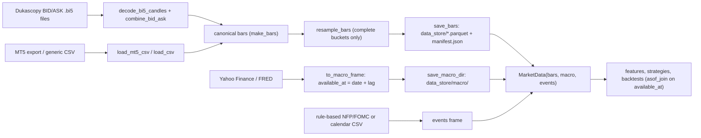

# Data

Everything in Aurum reads market data through one shape: a **canonical bars frame**
(UTC bar-open index, mid-price OHLC, a spread in USD/oz and an `available_at` timestamp),
optionally bundled with daily macro series and an economic-event calendar in a
`MarketData` object. This page covers that contract, the point-in-time join and resampling
rules that keep research free of look-ahead, the data sources (Dukascopy bid/ask history,
MT5 and CSV exports, Yahoo Finance and FRED macro series, a rule-based NFP/FOMC calendar),
the parquet store with its content hashes, the data-quality report, and the synthetic
generators the test suite runs on. The code lives in [`aurum/data/`](../aurum/data/) and
[`aurum/core/types.py`](../aurum/core/types.py).

**On this page**

- [The bars contract](#the-bars-contract)
- [MarketData](#marketdata)
- [Point-in-time alignment](#point-in-time-alignment)
- [Resampling to higher timeframes](#resampling-to-higher-timeframes)
- [Dukascopy history](#dukascopy-history)
- [`aurum data download` and `aurum data info`](#aurum-data-download-and-aurum-data-info)
- [MT5 and CSV imports](#mt5-and-csv-imports)
- [Macro series](#macro-series)
- [Economic calendar](#economic-calendar)
- [Storage, hashes and the manifest](#storage-hashes-and-the-manifest)
- [Data-quality report](#data-quality-report)
- [Synthetic data](#synthetic-data)
- [Known limitations](#known-limitations)



## The bars contract

The rule behind every design choice here is SPEC §0.1: *a value may influence a decision
at time `T` only if it was available at `T`*. Bars are labelled by their OPEN time and carry
the instant they become complete, so no consumer has to guess.

| Field | Type | Units | Meaning |
|---|---|---|---|
| index `time` | tz-aware `DatetimeIndex`, **UTC** | | Bar OPEN time. Strictly increasing, no duplicates. |
| `open`, `high`, `low`, `close` | float > 0 | USD/oz | **Mid** prices. |
| `volume` | float >= 0 | source-specific | MT5 tick volume, Dukascopy bid-side volume, or 0 when unknown. Use it for relative activity only. |
| `spread` | float >= 0 | USD/oz (price units) | Typical full bid/ask spread during the bar; `0.25` means 25 cents. Fills are modelled at mid ± spread/2 (see [Execution and costs](execution-and-costs.md)). |
| `available_at` | tz-aware UTC timestamp | | `open + timeframe`: the instant the bar is complete. Anything derived from the bar may only be acted on at or after it. |

`df.attrs["timeframe"]` holds the timeframe name (`"M1"`, `"M5"`, `"M15"`, `"M30"`, `"H1"`,
`"H4"` or `"D1"`, from [`aurum/core/timeframes.py`](../aurum/core/timeframes.py)). Code must
not rely on `attrs` surviving pandas operations; timing always comes from `available_at`.

`make_bars(df, timeframe, *, default_spread=None)` coerces a frame with a tz-aware index of
bar-open times into this schema: it converts the index to UTC, names it `time`, adds
`volume = 0` if missing, fills a missing `spread` column with `default_spread` (required in
that case), computes `available_at`, puts the canonical columns first and validates.

```python
import pandas as pd
from aurum.data import make_bars

idx = pd.date_range("2024-01-15 09:00", periods=3, freq="h", tz="UTC")
df = pd.DataFrame(
    {"open": [2050.1, 2051.0, 2049.8], "high": [2052.3, 2051.9, 2050.6],
     "low": [2049.7, 2049.5, 2047.9], "close": [2051.0, 2049.8, 2048.2]},
    index=idx,
)
bars = make_bars(df, "H1", default_spread=0.30)
print(bars.to_string())
print(bars.attrs)
```

```text
                             open    high     low   close  volume  spread              available_at
time                                                                                               
2024-01-15 09:00:00+00:00  2050.1  2052.3  2049.7  2051.0     0.0     0.3 2024-01-15 10:00:00+00:00
2024-01-15 10:00:00+00:00  2051.0  2051.9  2049.5  2049.8     0.0     0.3 2024-01-15 11:00:00+00:00
2024-01-15 11:00:00+00:00  2049.8  2050.6  2047.9  2048.2     0.0     0.3 2024-01-15 12:00:00+00:00
{'timeframe': 'H1'}
```

`validate_bars(df, *, check_ohlc=True)` raises `SchemaError` (a `ValueError`) unless: every
canonical column is present; the index is a UTC `DatetimeIndex`, strictly increasing, without
duplicates; OHLC are finite and positive; `high` is not below open/close/low and `low` not
above open/close/high (with a 1e-9 relative tolerance); `spread` and `volume` are
non-negative; `available_at` is tz-aware, has no `NaT` and is strictly after the bar's open.
Extra columns are allowed after the canonical ones.

Decisions are made at the close of bar `t` (`available_at[t]`) and fill at the open of bar
`t+1` (SPEC §1). The [architecture page](architecture.md) shows how this timing flows through
the system.

## MarketData

[`MarketData`](../aurum/core/types.py) is the bundle every feature group, strategy and
backtest receives:

| Field | Type | Contents |
|---|---|---|
| `bars` | DataFrame | Canonical bars of the trading timeframe. |
| `macro` | `dict[str, DataFrame]` (default `{}`) | Daily series, each with a tz-aware UTC index, a `value` column and `available_at` ([Macro series](#macro-series)). |
| `events` | DataFrame or `None` | Economic calendar ([Economic calendar](#economic-calendar)). |

`md.slice(end=None, start=None)` restricts the bars to open times in `[start, end]`
(inclusive) and leaves `macro` and `events` untouched: consumers align those against each
bar's `available_at`, so rows published later are never visible to an earlier decision.

With a config file, `DataConfig.load()` builds the `MarketData` for you: bars from
`data.bars_path` or `{data.dir}/{symbol in lower case}_{TIMEFRAME}.parquet` (e.g.
`data_store/xauusd_H1.parquet`), macro from `data.macro_dir` or `{data.dir}/macro/` when
`data.macro: true`, and events from `data.events` (`rule_based`, `none`, or a calendar CSV
path). `data.synthetic` swaps in generated data (see
[Synthetic data](#synthetic-data)). See [Configuration](configuration.md) for every key.

## Point-in-time alignment

`asof_join` is the sanctioned way (SPEC §0.1) to put a secondary frame (higher-timeframe bars,
daily macro series, anything with an `available_at` column) onto trading bars. For each
decision time it takes the latest `right` row with `available_at <= time`.

```text
asof_join(decision_times, right, *, columns=None, available_col="available_at",
          tolerance=None, index=None) -> pd.DataFrame
```

| Parameter | Meaning |
|---|---|
| `decision_times` | Normally `bars["available_at"]` (a Series keeps the bars index on the result). |
| `right` | Frame with a tz-aware `available_at` column. |
| `columns` | Columns to return (default: all except `available_at`). |
| `tolerance` | Optional maximum staleness (`pd.Timedelta`); older matches become NaN. |
| `index` | Index for the result (default: the Series' index, or the times). |

Rows with no eligible `right` row are NaN and are never back-filled; so are rows whose
decision time is `NaT`. If two `right` rows share an `available_at`, the last one wins.

```python
import pandas as pd
from aurum.data import asof_join, make_synthetic_bars

bars = make_synthetic_bars(30, "H1", start="2024-01-15")      # Monday, 00:00 UTC onwards
macro = pd.DataFrame(
    {"value": [103.2, 103.5]},
    index=pd.DatetimeIndex(["2024-01-12", "2024-01-15"], tz="UTC", name="date"),
)
macro["available_at"] = macro.index + pd.Timedelta(hours=22, minutes=30)   # after the close

aligned = asof_join(bars["available_at"], macro, columns=["value"])
view = bars[["available_at"]].join(aligned)
print(view.iloc[[0, 21, 22, 23, 24]].to_string())
```

```text
                                       available_at  value
time                                                      
2024-01-15 00:00:00+00:00 2024-01-15 01:00:00+00:00  103.2
2024-01-15 21:00:00+00:00 2024-01-15 22:00:00+00:00  103.2
2024-01-15 22:00:00+00:00 2024-01-15 23:00:00+00:00  103.5
2024-01-15 23:00:00+00:00 2024-01-16 00:00:00+00:00  103.5
2024-01-16 00:00:00+00:00 2024-01-16 01:00:00+00:00  103.5
```

Monday's print (available 22:30 UTC) first appears on the bar that closes at 23:00. The bar
closing at 22:00 still sees Friday's value. Joining on the observation *date* instead would
use the Monday close all day Monday; the feature leakage harness has a negative control for
exactly that mistake (see [Features](features.md#leakage-testing)).

## Resampling to higher timeframes

`resample_bars(bars, to, *, daily_anchor_hour_utc=0, complete_until=None)` aggregates
canonical bars to a coarser timeframe without leaking the future:

- **Labels and aggregation.** Output bars are labelled by their OPEN time. `open` is the
  first open, `high` the max, `low` the min, `close` the last close, `volume` the sum and
  `spread` the mean of the base bars.
- **Buckets.** Boundaries are fixed-length (`Timedelta`) from UTC midnight.
  `daily_anchor_hour_utc` (0 to 23) shifts H4 and D1 buckets, e.g. `22` aligns days to the
  New York 17:00 close that most brokers use. A fixed-length rule is used because pandas 3
  treats `"1D"` as a calendar-day offset and silently ignores `offset=`, which would lose the
  anchor.
- **Complete buckets only.** A bucket is emitted only if its last base bar ends exactly at
  the bucket end, or if base data exists after the bucket (an early close, such as a Friday).
  The trailing in-progress bucket is dropped.
- **`available_at` = bucket end** (never earlier than the last base bar in it). An HTF bar is
  therefore visible to a base bar only once it is finished. The v1 code labelled H1 bars at
  00:00 and forward-filled them onto M5 bars from 00:00, which leaked 55 minutes of future.
- **`complete_until`** (UTC, optional) asserts that the base data is final up to that
  instant, as for a historical download of whole days. Buckets ending at or before it count
  as complete even if their last base bar ends early, so a dataset ending on a Friday keeps
  its Friday bar. It never makes a bar available earlier. Leave it `None` for live data.
- Resampling into a *finer* timeframe raises `ValueError`.

```python
from aurum.data import make_synthetic_bars, resample_bars

# Mon 2024-01-15 00:00 .. Fri 2024-01-19 20:00 UTC (the synthetic market closes Friday 21:00)
h1 = make_synthetic_bars(117, "H1", start="2024-01-15")

d1 = resample_bars(h1, "D1")                                  # buckets at 00:00 UTC
print(d1[["open", "close", "available_at"]].tail(2).to_string())
print(d1.index.day_name().tolist())
print(resample_bars(h1, "D1", complete_until="2024-01-20").index.day_name().tolist())
print(resample_bars(h1, "D1", daily_anchor_hour_utc=22).index[:2].tolist())
```

```text
                                  open        close              available_at
time                                                                         
2024-01-17 00:00:00+00:00  1810.436051  1819.649287 2024-01-18 00:00:00+00:00
2024-01-18 00:00:00+00:00  1819.703932  1834.767454 2024-01-19 00:00:00+00:00
['Monday', 'Tuesday', 'Wednesday', 'Thursday']
['Monday', 'Tuesday', 'Wednesday', 'Thursday', 'Friday']
[Timestamp('2024-01-14 22:00:00+0000', tz='UTC'), Timestamp('2024-01-15 22:00:00+0000', tz='UTC')]
```

Friday is dropped without `complete_until` because nothing after it proves the session is
over. With the 22:00 anchor the first bucket opens on Sunday 22:00, so it only contains
Monday's bars here.

> **Leading partial bucket.** `resample_bars` cannot tell "not loaded" from "market
> closed". If your base data starts inside a bucket (as in the anchored example above), the
> first HTF bar covers only part of its period. Drop bars that open before your data start.
> `build_dataset` and `download_dukascopy` do this for you.

`align_htf(base, htf_frame, columns=None)` maps any HTF-indexed frame with an
`available_at` column onto base bars; it is `asof_join(base["available_at"], htf_frame)`.
The `mtf` feature group maps its H4/D1 features onto the base bars this way, and the `macro`
group builds its daily gold series with `resample_bars` (see [Features](features.md)).

## Dukascopy history

Dukascopy Bank publishes free historical **bid** and **ask** candles for its ECN feed. It is
the primary source for the research dataset
([`aurum/data/dukascopy.py`](../aurum/data/dukascopy.py)).

### File format

| Resolution | One file per | URL |
|---|---|---|
| Minute candles | UTC day and side | `https://datafeed.dukascopy.com/datafeed/{SYM}/{YYYY}/{MM-1:02d}/{DD:02d}/{BID\|ASK}_candles_min_1.bi5` |
| Hour candles (`source_resolution="H1"`) | UTC month and side | `https://datafeed.dukascopy.com/datafeed/{SYM}/{YYYY}/{MM-1:02d}/{BID\|ASK}_candles_hour_1.bi5` |

- The month in the path is **zero-based** (January is `00`).
- Payloads are LZMA-compressed ("LZMA alone" container) sequences of 24-byte big-endian
  records `>IIIIIf`: seconds from the period start (UTC), **open, close, low, high**
  (note the order), volume.
- Prices are integers in points: `price = int / price_scale`. For XAUUSD the scale is 1000.
  With `price_scale=None` it is detected once from the data: the symbol's known scale is
  used if the median raw price maps into a plausible range (XAUUSD 200 to 20,000), otherwise
  the closest plausible power of ten is chosen with a warning, and nothing plausible raises
  `ValueError` instead of guessing.
- Every file holds every minute (hour) of its period. Periods without ticks (weekends, the
  daily break, holidays) are flat zero-volume filler candles. They are dropped: a candle is
  kept only if either side has non-zero volume or a non-degenerate range. Keeping them would
  create fake zero-range bars that bias volatility and cost estimates downward.

### From bid/ask to canonical bars

| Output | Construction |
|---|---|
| `open/high/low/close` | `(bid + ask) / 2` for each field |
| `spread` | `max(0, ((ask_open - bid_open) + (ask_close - bid_close)) / 2)`: the average of the opening and closing quoted spreads, floored at 0 for crossed quotes |
| `volume` | bid-side Dukascopy volume (Dukascopy's own units) |

The mid high/low is a slight outer bound: bid and ask extremes need not print on the same
tick, so `(bid_high + ask_high) / 2` can exceed the true mid-path maximum.

The decoder is a pure function, so you can exercise it without the network:

```python
import datetime as dt
import lzma
import struct

from aurum.data.dukascopy import cache_path, combine_bid_ask, datafeed_url, decode_bi5_candles

def bi5(records):
    """Encode (seconds, open, close, low, high, volume) records like a Dukascopy file."""
    payload = b"".join(struct.pack(">IIIIIf", *r) for r in records)
    return lzma.compress(payload, format=lzma.FORMAT_ALONE)

day = dt.date(2024, 1, 15)
bid = bi5([(0, 2050100, 2050600, 2049900, 2050800, 3.5),
           (60, 2050600, 2050300, 2050200, 2050900, 2.1),
           (120, 2050300, 2050300, 2050300, 2050300, 0.0)])   # flat filler: no ticks
ask = bi5([(0, 2050420, 2050910, 2050230, 2051120, 3.1),
           (60, 2050910, 2050640, 2050520, 2051230, 1.9),
           (120, 2050640, 2050640, 2050640, 2050640, 0.0)])

mid = combine_bid_ask(decode_bi5_candles(bid, day, None), decode_bi5_candles(ask, day, None))
print(mid.to_string())
print(datafeed_url("XAUUSD", day, "BID"))
print(cache_path("cache/dukascopy", "XAUUSD", day, "BID"))
```

```text
                               open      high       low     close  volume  spread
time                                                                             
2024-01-15 00:00:00+00:00  2050.260  2050.960  2050.065  2050.755     3.5   0.315
2024-01-15 00:01:00+00:00  2050.755  2051.065  2050.360  2050.470     2.1   0.325
https://datafeed.dukascopy.com/datafeed/XAUUSD/2024/00/15/BID_candles_min_1.bi5
cache/dukascopy/XAUUSD/2024/00/15/BID_candles_min_1.bi5
```

### Cache layout

Raw files are cached under `cache_dir` (default `cache/dukascopy`, gitignored) in a layout
that mirrors the feed:

```text
cache/dukascopy/XAUUSD/2024/00/15/BID_candles_min_1.bi5    # minute file, 15 Jan 2024
cache/dukascopy/XAUUSD/2024/00/15/ASK_candles_min_1.bi5
cache/dukascopy/XAUUSD/2024/00/BID_candles_hour_1.bi5      # hour file, January 2024
```

- Writes are atomic (temporary file, then rename).
- HTTP 404 means "no data" and is cached as an empty file, except for periods that ended
  less than 3 days before today: Dukascopy publishes a file only once its period is
  complete, so a recent empty answer may mean "not yet".
- A truncated or corrupt LZMA body (possible even with HTTP 200) is never cached; it is
  re-fetched.
- `offline=True` never touches the network: a cache miss raises `DukascopyError`.

### Rate limits

The free feed throttles hard. The module documents what its authors observed in 2026-09:
more than 4 concurrent requests get HTTP 503, and sustained use is slowed down and then
answered with HTTP 429 for extended periods. Dukascopy points bulk-history users to a
requester-pays S3 export instead. The downloader copes with:

- a hard cap of 8 workers (`max_workers` is clipped to 8);
- a shared adaptive (AIMD) concurrency limiter: a throttled reply halves the allowed
  concurrency and imposes a global, jittered pause of 5 s that doubles with each consecutive
  throttled reply (capped at 300 s); every `4 x limit` consecutive successes raise the limit
  by one;
- `Retry-After` is honoured (capped at 5 minutes); throttled requests are retried up to 40
  times, other errors up to `retries=6` times with exponential backoff and jitter;
- files that still fail are retried in up to 3 passes, 20 s apart, before
  `download_dukascopy` raises.

### Python API

`download_dukascopy(symbol="XAUUSD", start, end=None, timeframe="M1", **options)` downloads
(or reads from the cache) and returns canonical bars with `attrs` `source`, `symbol`,
`price_scale` and `source_resolution`.

| Option | Default | Meaning |
|---|---|---|
| `start`, `end` | required, `None` | Dates in UTC. A bare-date `end` is inclusive (the whole day); a timestamp with a time is an exclusive bound on bar open time. `end=None` means up to the last complete UTC day. |
| `timeframe` | `"M1"` | Output timeframe. Coarser timeframes are built with `resample_bars`, with `complete_until` = the earlier of `end` and today 00:00 UTC (whole past days are final), and aggregated bars that open before `start` dropped. |
| `cache_dir` | `"cache/dukascopy"` | Raw-file cache; `None` disables it. |
| `price_scale` | `None` | Integer-to-price divisor; `None` auto-detects. |
| `max_workers` | `8` | Concurrent requests, capped at 8. The docstring calls 4 the practical sweet spot. |
| `source_resolution` | `"M1"` | `"M1"` (daily minute files) or `"H1"` (monthly hour files, about 24x fewer requests, for H1/H4/D1 work). `timeframe` must not be finer. The trailing month that is not yet complete falls back to minute files. |
| `skip_saturday` | `True` | Saturday UTC minute files only contain filler for metals/FX; skipping them saves about 14% of requests. |
| `daily_anchor_hour_utc` | `0` | Forwarded to `resample_bars` for H4/D1. |
| `retries` | `6` | Retries for non-throttling errors. |
| `offline` | `False` | Cache only. |

`prefetch_cache(symbol="XAUUSD", start, end=None, *, cache_dir, source_resolution="M1",
max_workers=8, time_budget_s=None, newest_first=True, skip_saturday=True, ...)` fills the
cache without decoding. It fetches **newest first** within an optional wall-clock budget,
skips files already cached, never raises on individual failures, and returns a
`PrefetchReport(planned, already_cached, fetched, failed, not_attempted, elapsed_s,
contiguous_start, stopped_early)` (file counts are BID + ASK files). Because it works
backward, an interrupted run still leaves a contiguous cached range ending at `end`, which
is what an offline build consumes. Re-run it to resume.

`build_dataset(out_dir, *, symbol="XAUUSD", start="2012-01-01", end="2026-09-25",
cache_dir="cache/dukascopy", m15_start=None, max_workers=4, offline=False,
ny_close_anchor_hour=22, h1_source="auto")` writes the research files and a manifest:

| File | Content |
|---|---|
| `xauusd_M15.parquet` | M15 bars |
| `xauusd_H1.parquet` | H1 bars |
| `xauusd_H4.parquet` | H4 bars, UTC-midnight anchor |
| `xauusd_D1.parquet` | D1 bars, UTC-midnight anchor (SPEC default; Sunday-evening sessions form short "Sunday" bars) |
| `xauusd_D1_nyclose.parquet` | D1 bars anchored at `ny_close_anchor_hour` (22 UTC): one bar per trading session, no stubs |
| `manifest.json` | Build path, row counts, ranges, content hashes, notes and a quality report per file |

`h1_source` picks the build path. `"M1"` aggregates every file directly from minute bars (the
SPEC §3.2 path). `"H1"` builds H1 from monthly hour files, resamples H4/D1 from it, and builds
M15 from minute files over `[m15_start, end]` (default: the contiguous cached range). Hour-file
highs and lows are a slightly looser outer bound than the minute-level construction. `"auto"`
uses `"M1"` if the minute cache already covers the whole range, else `"H1"`. It never
starts a full minute download by itself: fill the cache with `prefetch_cache` first.

To rebuild from an existing cache without the network:

```python
from aurum.data import build_dataset

manifest = build_dataset("data_store", start="2012-01-01", end="2026-09-25",
                         cache_dir="cache/dukascopy", offline=True)
```

The build is deterministic: rebuilding offline from the same raw cache reproduces the
manifest's content hashes exactly.

## `aurum data download` and `aurum data info`

`aurum data download` wraps the functions above. It needs the network and it is slow: the
README estimates an hour or more for the first full download because of the throttling.
Re-running it resumes from the cache.

| Flag | Default | Meaning |
|---|---|---|
| `--out` | `data_store` | Output directory (gitignored). |
| `--symbol` | `XAUUSD` | Dukascopy symbol. |
| `--start` | `2012-01-01` | First day. |
| `--end` | yesterday (UTC) | Inclusive end date. |
| `--timeframes` | `all` | `all`: `prefetch_cache` (unless `--offline`), then `build_dataset` (M15, H1, H4, D1, D1_nyclose + manifest). A list such as `H1,H4`: one `download_dukascopy` call per timeframe (minute source, UTC-midnight anchor), saved as `xauusd_H1.parquet` etc., no manifest. |
| `--cache` | `cache/dukascopy` | Raw-file cache. |
| `--workers` | `4` | Concurrent requests (capped at 8). |
| `--time-budget` | none | Seconds for the prefetch pass. |
| `--offline` | off | Build the bars only from the local cache (no Dukascopy requests). Macro is still fetched unless you also pass `--no-macro`. |
| `--no-bars` / `--no-macro` | off | Skip the bar or the macro part. |
| `--macro-start` | `2011-01-01` | First day of the macro download. |
| `--macro-cache` | `cache/macro` | Raw macro cache. |

In `all` mode, `build_dataset` runs with `h1_source="auto"`: if the prefetch did not fill
the minute cache for the whole range (for example because `--time-budget` ran out), it takes
the H1 path described above and builds M15 only over the contiguous cached range.

The macro part calls `fetch_yahoo_daily` and `fetch_fred` with their default series and
writes `<out>/macro/<name>.parquet`. Without the optional `yfinance` dependency
(`pip install -e ".[data]"`) it prints a warning and the Yahoo series are skipped unless
already cached.

`aurum data info [--dir DIR | --config C]` is offline. It loads every bar file with hash
verification and summarises the macro directory and the manifest. On the authors' dataset
(built through 2026-09-25) it prints:

```text
file                       timeframe    rows                      first                       last  median_spread          hash  check
--------------------------------------------------------------------------------------------------------------------------------------
xauusd_D1.parquet                 D1    4585  2012-01-01 00:00:00+00:00  2026-09-25 00:00:00+00:00          0.343  b9e5cd6df941     ok
xauusd_D1_nyclose.parquet         D1    3841  2012-01-01 22:00:00+00:00  2026-09-24 22:00:00+00:00          0.337  131df1e6ed86     ok
xauusd_H1.parquet                 H1   87829  2012-01-01 22:00:00+00:00  2026-09-25 20:00:00+00:00          0.333  a9d73169411a     ok
xauusd_H4.parquet                 H4   23581  2012-01-01 20:00:00+00:00  2026-09-25 20:00:00+00:00          0.337  2e00965f1bd5     ok
xauusd_M15.parquet               M15  349660  2012-01-01 22:45:00+00:00  2026-09-25 20:45:00+00:00          0.332  58144724438a     ok

macro:
series        rows       first        last          last_available_at
---------------------------------------------------------------------
breakeven10y  3935  2011-01-03  2026-09-25  2026-09-28 21:30:00+00:00
dxy           3957  2011-01-03  2026-09-25  2026-09-25 22:30:00+00:00
fedfunds      5746  2011-01-01  2026-09-24  2026-09-25 21:30:00+00:00
gold_fut      3956  2011-01-03  2026-09-25  2026-09-25 22:30:00+00:00
oil           3956  2011-01-03  2026-09-25  2026-09-25 22:30:00+00:00
real10y       3934  2011-01-03  2026-09-24  2026-09-25 21:30:00+00:00
silver        3955  2011-01-03  2026-09-25  2026-09-25 22:30:00+00:00
spx           3956  2011-01-03  2026-09-25  2026-09-25 21:30:00+00:00
us10y         3955  2011-01-03  2026-09-25  2026-09-25 21:30:00+00:00
vix           3958  2011-01-03  2026-09-25  2026-09-25 21:30:00+00:00

manifest: built 2026-09-27T00:43:45.881797+00:00 via M1 from dukascopy datafeed
```

Note the Friday 2026-09-25 `breakeven10y` print: it becomes usable on Monday 2026-09-28 at
21:30 UTC ([why](#macro-series)). Hash mismatches show up in the `check` column. For the
per-file and per-year observations on this dataset (spreads, gaps, outliers), see the data
section of [INTERFACES.md](INTERFACES.md#integration-notes).

## MT5 and CSV imports

[`aurum/data/loaders.py`](../aurum/data/loaders.py) turns broker exports and generic CSVs
into canonical UTC bars. `load_mt5_csv` and `load_csv` sort, drop rows with unparseable
timestamps, keep the last of duplicate timestamps, drop rows with missing or non-positive
prices (each with a logged warning), clip negative volume/spread to 0 and validate.

### Timezone specifications

MT5 exports timestamps in the broker **server's** clock, which is almost never UTC. Most
retail FX/metals brokers run "New-York-close" servers: server midnight is 17:00
America/New_York, i.e. UTC+2 in US winter and UTC+3 in US summer, switching on the **US** DST
dates. Aurum calls this convention `"NY+7"` (server time = New York local time + 7 hours).
Getting it wrong shifts every bar by an hour for about eight months a year and silently
breaks session features, event blackouts and multi-source joins.

| Spec | Meaning |
|---|---|
| `"UTC"`, `"GMT"`, `"Z"` | UTC |
| any IANA zone, e.g. `"Europe/Athens"` | That zone with its own DST rules (EU dates for Athens) |
| `"Etc/GMT-2"` | Fixed UTC+2 (POSIX sign inversion: `Etc/GMT-2` *is* UTC+2) |
| `"UTC+2"`, `"UTC-05:00"`, `"+03:00"` | Fixed offsets |
| `"NY+7"` | DST-aware New-York-close server |

Local times made ambiguous or non-existent by a DST switch (only possible early on Sunday
New York time, when metals are closed) resolve to the DST interpretation or shift forward;
resulting duplicates are dropped with a warning.

```python
from aurum.data.loaders import to_utc_index

# 10:00 server time in US winter, in the March weeks when only the US has switched to DST,
# and in summer
wall = ["2024-01-15 10:00", "2024-03-15 10:00", "2024-07-15 10:00"]
for spec in ("UTC", "UTC+2", "Etc/GMT-2", "Europe/Athens", "NY+7"):
    print(f"{spec:14s}", [t.strftime("%H:%M") for t in to_utc_index(wall, spec)])
```

```text
UTC            ['10:00', '10:00', '10:00']
UTC+2          ['08:00', '08:00', '08:00']
Etc/GMT-2      ['08:00', '08:00', '08:00']
Europe/Athens  ['08:00', '08:00', '07:00']
NY+7           ['08:00', '07:00', '07:00']
```

A fixed `UTC+2` is wrong for a New-York-close server in US summer, and `Europe/Athens` is
wrong in the weeks when US and EU DST are out of sync.

### MT5 exports

`load_mt5_csv(path, timeframe, *, server_tz="Etc/GMT-2", point_size=0.01, default_spread=None)`
reads History Center / "Bars" exports:

- headers `<DATE> <TIME> <OPEN> <HIGH> <LOW> <CLOSE> <TICKVOL> <VOL> <SPREAD>` separated by
  tabs, commas or semicolons (`<TIME>` absent in D1 exports), plain-word headers, or
  header-less MT4-style files (positional `date,time,o,h,l,c,vol`); UTF-16 files with a BOM
  are decoded; dates may be `YYYY.MM.DD` or `YYYY-MM-DD`;
- `volume` = `<TICKVOL>` (real `<VOL>` is usually 0 for CFDs; used only if there is no tick
  volume);
- `spread` = `<SPREAD>` (integer points) x `point_size`. MT5 stores the **minimum** spread
  seen in the bar, so it understates typical costs; keep the cost model's `min_spread` floor
  (see [Execution and costs](execution-and-costs.md)). Without a `<SPREAD>` column,
  `default_spread` (price units) is required;
- timestamps are converted from `server_tz` to UTC. The default is a fixed UTC+2; pass
  `server_tz="NY+7"` for New-York-close brokers.

```python
import io

from aurum.data import load_mt5_csv

export = (
    "<DATE>\t<TIME>\t<OPEN>\t<HIGH>\t<LOW>\t<CLOSE>\t<TICKVOL>\t<VOL>\t<SPREAD>\n"
    "2024.01.15\t10:00:00\t2051.10\t2053.40\t2050.20\t2052.80\t4210\t0\t25\n"
    "2024.07.15\t10:00:00\t2410.50\t2414.00\t2409.10\t2412.70\t5120\t0\t18\n"
)
bars = load_mt5_csv(io.StringIO(export), "H1", server_tz="NY+7")
print(bars[["close", "volume", "spread", "available_at"]].to_string())
```

```text
                            close  volume  spread              available_at
time                                                                       
2024-01-15 08:00:00+00:00  2052.8  4210.0    0.25 2024-01-15 09:00:00+00:00
2024-07-15 07:00:00+00:00  2412.7  5120.0    0.18 2024-07-15 08:00:00+00:00
```

The live MT5 adapter uses the same timezone specs and detects the server offset by default
(see [Live trading](live-trading.md)).

### Generic CSV and in-memory frames

`load_csv(path, timeframe, *, time_col="time", tz="UTC", default_spread=None)` loads
`time,open,high,low,close[,volume][,spread]` (column names are case-insensitive, extra columns
are ignored). Timestamps must be bar OPEN times: naive ones are read in `tz` (any spec above),
ones with an explicit offset are converted directly. `spread` is in price units.

```python
import io

from aurum.data import load_csv

csv = io.StringIO(
    "Time,Open,High,Low,Close,Volume\n"
    "2024-01-15 14:00,2051.1,2053.4,2050.2,2052.8,120\n"
    "2024-01-15T15:00:00-05:00,2052.8,2054.0,2051.9,2053.5,95\n"
)
bars = load_csv(csv, "H1", tz="America/New_York", default_spread=0.35)
print(bars[["close", "spread", "available_at"]].to_string())
```

```text
                            close  spread              available_at
time                                                               
2024-01-15 19:00:00+00:00  2052.8    0.35 2024-01-15 20:00:00+00:00
2024-01-15 20:00:00+00:00  2053.5    0.35 2024-01-15 21:00:00+00:00
```

`bars_from_ohlc(df, timeframe, default_spread=None, *, tz="UTC")` does the same for a frame
already in memory (a `DatetimeIndex` or a `time` column of bar-open times; a naive index is
read in `tz`).

## Macro series

[`aurum/data/macro.py`](../aurum/data/macro.py) downloads daily series from Yahoo Finance
(through the optional `yfinance` package) and FRED. Gold's best-documented macro drivers are
the US dollar and US real yields, with risk sentiment and inflation expectations as secondary
factors; the module docstring gives the references.

Every macro frame has:

- an index of observation **dates** as tz-aware UTC midnights, named `date`;
- `value`: the close or level (Yahoo frames also keep `open`, `high`, `low`, `volume`);
- `available_at`: the tz-aware UTC instant from which the row may be used.

### Default series

| Name | Source | Ticker / series id | `available_at` | Feature treatment |
|---|---|---|---|---|
| `dxy` | Yahoo | `DX-Y.NYB` (ICE dollar index) | date + 22:30 UTC | price (log changes) |
| `us10y` | Yahoo | `^TNX` | date + 21:30 UTC | yield (bp changes) |
| `vix` | Yahoo | `^VIX` | date + 21:30 UTC | price |
| `spx` | Yahoo | `^GSPC` | date + 21:30 UTC | price |
| `silver` | Yahoo | `SI=F` | date + 22:30 UTC | price |
| `gold_fut` | Yahoo | `GC=F` | date + 22:30 UTC | price |
| `oil` | Yahoo | `CL=F` | date + 22:30 UTC | price |
| `real10y` | FRED | `DFII10` | next US business day, 21:30 UTC | yield |
| `breakeven10y` | FRED | `T10YIE` | next US business day, 21:30 UTC | yield |
| `fedfunds` | FRED | `DFF` | next US business day, 21:30 UTC | yield |

The "feature treatment" column is how the `macro` feature group transforms the series,
decided from the name (see [Features](features.md)). `fedfunds` also drives the default
rate-based financing cost ([Execution and costs](execution-and-costs.md)).

### Why these lags

A daily close is only known after the market closes, so `available_at = date + lag`:

- **Yahoo cash indices** (`^GSPC`, `^VIX`, `^TNX`) close at 16:00 to 16:15 New York, so
  21:30 UTC is safe in both EST and EDT.
- **Yahoo futures and ICE** (tickers ending `=F`, `.NYB` or `=X`) end their session at
  17:00 New York, which is 22:00 UTC in winter. 21:30 would be 30 minutes early for half the
  year, so they use 22:30 UTC.
- **FRED** publishes day D's observation on the **next US business day** (the Fed's H.15
  release carries the previous business day's Treasury and TIPS yields; the NY Fed publishes
  the effective fed funds rate the next business day). The whole-day part of the lag is
  counted in US federal business days. With plain calendar days, a Friday print would become
  "available" on Saturday and be used from the Sunday-evening open, although it is only
  published on Monday: about one trading day of look-ahead every week and around every
  holiday. Weekend and holiday rows of 7-day series such as DFF roll back to the preceding
  business day's publication slot.

```python
import pandas as pd

from aurum.data.macro import FRED_LAG, default_yahoo_lag, to_macro_frame

# DFII10-like prints: Thursday, Friday, then Tuesday (Monday 2024-01-15 is MLK day)
real10y = pd.Series([1.78, 1.74, 1.80],
                    index=pd.to_datetime(["2024-01-11", "2024-01-12", "2024-01-16"]))
frame = to_macro_frame(real10y, availability_lag=FRED_LAG, business_days=True, source="fred:DFII10")
frame["weekday_available"] = frame["available_at"].dt.day_name()
print(frame.to_string())
print(default_yahoo_lag("^VIX"), "|", default_yahoo_lag("DX-Y.NYB"), "|", default_yahoo_lag("GC=F"))
```

```text
                           value              available_at weekday_available
date                                                                        
2024-01-11 00:00:00+00:00   1.78 2024-01-12 21:30:00+00:00            Friday
2024-01-12 00:00:00+00:00   1.74 2024-01-16 21:30:00+00:00           Tuesday
2024-01-16 00:00:00+00:00   1.80 2024-01-17 21:30:00+00:00         Wednesday
0 days 21:30:00 | 0 days 22:30:00 | 0 days 22:30:00
```

### Fetching and storing

| Function | Notes |
|---|---|
| `fetch_yahoo_daily(tickers=None, start="2011-01-01", end=None, cache_dir="cache/macro", *, availability_lag=None, refresh=False, skip_errors=True)` | `tickers=None` means `DEFAULT_YAHOO`. `end=None` is yesterday (UTC). Raw histories are cached as parquet under `cache_dir/yahoo/`, keyed by ticker and date range. Rows whose `available_at` is still in the future at fetch time (today's unfinished session) are provisional: they are dropped and such a download is not cached. |
| `fetch_fred(series=None, start="2011-01-01", end=None, cache_dir="cache/macro", *, availability_lag=None, refresh=False, skip_errors=True)` | `series=None` means `DEFAULT_FRED`. Downloads `fredgraph.csv`, caches the CSV text under `cache_dir/fred/`. |
| `to_macro_frame(values, *, availability_lag, value_col="close", source="", business_days=False)` | Builds a frame from any date-indexed Series/DataFrame. The lag must be positive. |
| `save_macro_dir(frames, path)` / `load_macro_dir(path)` | One `<name>.parquet` per series; both validate the frame contract. |

`availability_lag` takes one `Timedelta` for all series or a `{name: Timedelta}` mapping; for
FRED the days part of an override is again counted in business days. With `skip_errors` a
failing ticker is logged and omitted instead of aborting the batch.

`validate_macro_frame(df, name="")` raises unless the index is tz-aware, `value` and
`available_at` exist, and every `available_at` is set and strictly after its observation
date's midnight (a lag of zero would expose a close for the whole day before it happened).

## Economic calendar

Scheduled US releases (NFP, CPI, FOMC) drive the largest intraday gold moves.
[`aurum/data/calendar.py`](../aurum/data/calendar.py) defines the event frame used by the
`calendar` feature group, the risk manager's event blackout (see
[Portfolio and risk](portfolio-and-risk.md)) and the LLM desk.

| Column | Type | Meaning |
|---|---|---|
| `time` | tz-aware UTC | Scheduled release time |
| `name` | str | e.g. `"NFP"`, `"CPI"`, `"FOMC"` |
| `currency` | str | e.g. `"USD"` |
| `importance` | int 1..3 | 3 = market-moving for gold |
| `source` | str | Provenance |
| `approximate` | bool | `True` when the time or date is inferred by rule or not verified |
| `actual`, `forecast`, `previous` | float, optional | Outcome columns, CSV imports only |

Frames built by this module have a `RangeIndex` and are sorted by `time`, then `name`.
`validate_events` checks the columns, the tz-aware `time`, the importance range and the
`RangeIndex`.

**Timing rules.** Scheduled release times are published well in advance, so using the
*future schedule* (for example "hours until the next FOMC statement") is not look-ahead.
**Outcomes** (`actual`, surprises) may only be used from `time` onward; no built-in feature
uses them. If you build a surprise feature, give the outcome rows an `available_at` of at
least `time` and join them with `asof_join`. Unscheduled events (emergency FOMC actions) were
not known in advance and are excluded from the rule-based calendar.

### Rule-based calendar

`generate_rule_based_calendar(start, end, *, include=("NFP", "FOMC"), nfp_rule="first_friday")`
(a bare-date `end` covers the whole day):

- **NFP** at 08:30 America/New_York (12:30 UTC in US summer, 13:30 UTC in winter) on the date
  from `nfp_release_date`, always `approximate=True`. `nfp_rule="first_friday"` is the SPEC
  default; `"bls"` applies the BLS reference-week rule, which gets months such as Dec 2023
  and Mar 2024 right. A release on 1 January moves one week later; one on 4 July, or on
  Friday 3 July when that is the observed holiday, moves to the Thursday before. Shutdowns and
  ad-hoc BLS moves are not modelled.
- **FOMC** statement times from the hard-coded `FOMC_STATEMENTS` list: 128 scheduled
  statements from 2012 to 2027, taken from the Federal Reserve's calendars (retrieved
  2026-09-26). Times verified from each press release (2016-01 to 2026-09) are
  `approximate=False`; the 43 others (2012 to 2015 times by documented Fed practice, the
  superseded 2020-03-18 meeting, and future meetings assumed at 14:00 ET) are
  `approximate=True`. Unscheduled actions are excluded. Outside 2012 to 2027 no FOMC rows are
  produced and a warning is logged.
- **CPI** is not rule-based (the BLS schedule varies): import it from a CSV.

```python
import io

from aurum.data import generate_rule_based_calendar, load_calendar_csv, merge_calendars
from aurum.data.calendar import nfp_release_date

cols = ["time", "name", "importance", "approximate"]
rule = generate_rule_based_calendar("2024-01-01", "2024-03-31")
print(rule[cols].to_string())
print(nfp_release_date(2024, 3), nfp_release_date(2024, 3, rule="bls"), nfp_release_date(2026, 7))

cpi = load_calendar_csv(io.StringIO(
    "time,name,currency,importance,actual,forecast,previous\n"
    "2024-01-11 08:30,CPI y/y,USD,high,3.4,3.2,3.1\n"
), tz="America/New_York", source="csv:cpi_2024")
events = merge_calendars(rule, cpi)
print(events.loc[events["name"] == "CPI y/y", cols + ["actual", "forecast"]].to_string())
```

```text
                       time  name  importance  approximate
0 2024-01-05 13:30:00+00:00   NFP           3         True
1 2024-01-31 19:00:00+00:00  FOMC           3        False
2 2024-02-02 13:30:00+00:00   NFP           3         True
3 2024-03-01 13:30:00+00:00   NFP           3         True
4 2024-03-20 18:00:00+00:00  FOMC           3        False
2024-03-01 2024-03-08 2026-07-02
                       time     name  importance  approximate  actual  forecast
1 2024-01-11 13:30:00+00:00  CPI y/y           3        False     3.4       3.2
```

The first-Friday rule puts the March 2024 NFP on the 1st; the BLS rule gives the 8th.

### CSV import and merging

`load_calendar_csv(path, *, tz="UTC", source=None)` reads
`time,name,currency,importance[,actual,forecast,previous]` (case-insensitive headers). Naive
times are read in `tz` (IANA name, fixed offset or `"NY+7"`); times with offsets are converted.
`importance` accepts 1 to 3 or `low`/`medium`/`high` (missing column: 2). Missing `currency`
defaults to `"USD"`, `approximate` to `False`, `source` to `"csv:<file name>"`.

`merge_calendars(*frames)` concatenates and drops duplicate `(time, name)` pairs; the first
frame wins.

With a config, `data.events: rule_based` generates NFP + FOMC from the first bar's date to 14
days after the last bar; a CSV path is loaded with `load_calendar_csv` using the default
`tz="UTC"`, so such a file needs UTC times or explicit offsets.

## Storage, hashes and the manifest

[`aurum/data/store.py`](../aurum/data/store.py) persists frames as zstd-compressed parquet
with three guarantees plain `df.to_parquet` does not give:

1. **Timezones survive.** The index is stored tz-aware and relabelled `time` on load;
   `available_at` stays tz-aware UTC.
2. **Metadata survives.** `df.attrs` (timeframe, source, symbol, price scale, ...) is stored as
   JSON in the parquet schema metadata under the key `aurum`, independent of how the installed
   pandas handles `attrs`. Extra `metadata=` comes back under `attrs["_meta"]`.
3. **Provenance.** `frame_hash(df)` is a SHA-256 over column names, values and index. It does
   not depend on the pandas version, datetime resolution (ns vs us) or memory layout
   (datetimes hash as UTC nanoseconds; numbers as little-endian float64 with -0.0 and NaN
   canonicalised), but changes with any value, column order or name.

| Function | Behaviour |
|---|---|
| `save_bars(bars, path, *, metadata=None)` | Validates, puts the frame in canonical layout (canonical columns first, index named `time`, one datetime unit), stores `frame_hash`, `n_rows`, `start`, `end` in the metadata. Atomic write. |
| `load_bars(path, *, verify_hash=True)` | Restores the UTC index and `attrs`, validates, and raises `ValueError` if the stored hash does not match the content. |
| `save_frame` / `load_frame` | The same persistence for any DataFrame (used for macro frames and caches). |
| `frame_hash(df)` | Content hash; research runs record it as the data hash (see [Research](research.md)). |

```python
import tempfile
from pathlib import Path

from aurum.data import frame_hash, load_bars, make_synthetic_bars, save_bars

bars = make_synthetic_bars(500, "H1", seed=0)
with tempfile.TemporaryDirectory() as tmp:
    path = save_bars(bars, Path(tmp) / "xauusd_H1.parquet", metadata={"note": "synthetic demo"})
    back = load_bars(path)                      # verify_hash=True by default
    print(back.attrs["timeframe"], back.index.tz, back["available_at"].dt.tz)
    print(sorted(back.attrs["_meta"]))
    print(frame_hash(back) == back.attrs["_meta"]["frame_hash"] == frame_hash(bars))
```

```text
H1 UTC UTC
['end', 'frame_hash', 'n_rows', 'note', 'start']
True
```

`build_dataset` writes `manifest.json` next to the parquet files:

```json
{
  "symbol": "XAUUSD",
  "source": "dukascopy datafeed",
  "build_path": "M1",
  "minute_cache_contiguous_from": "2012-01-01",
  "files": {
    "xauusd_H1": {
      "path": "xauusd_H1.parquet",
      "timeframe": "H1",
      "rows": 87829,
      "start": "2012-01-01 22:00:00+00:00",
      "end": "2026-09-25 20:00:00+00:00",
      "sha256": "a9d73169411ae55aa6dc05ecb8491db0246b4613c2e781fd0ef5b8ea43330a3d",
      "note": "Dukascopy daily minute candles (bid/ask -> mid) aggregated from M1"
    }
  },
  "quality": {
    "xauusd_H1": {
      "n_rows": 87829,
      "timeframe": "H1",
      "n_gaps": 869,
      "n_weekend_gaps": 749,
      "n_daily_break_gaps": 0,
      "n_intraweek_gaps": 120,
      "zero_spread_frac": 0.0011499618577007595,
      "flat_bar_frac": 0.002800897197964226,
      "n_return_outliers": 92
    }
  },
  "built_utc": "2026-09-27T00:43:45.881797+00:00"
}
```

(Excerpt of the authors' manifest: the real file lists all five bar files and every
quality key described in the next section.) The `sha256`
field is the `frame_hash` of the stored frame, not a hash of the file's bytes, so it matches
`frame_hash(load_bars(path))` and the hash `aurum data info` prints.

## Data-quality report

`quality_report(bars, *, gap_bars=3, outlier_sigma=12.0, vol_window=500, top=10)` returns a
dict (it is stored per file in `manifest.json`):

| Key(s) | Content |
|---|---|
| `n_rows`, `timeframe`, `start`, `end` | Basics |
| `n_gaps`, `n_weekend_gaps`, `n_daily_break_gaps`, `n_intraweek_gaps`, `largest_intraweek_gaps` | Windows of at least `gap_bars` bar lengths between one bar's end and the next bar's open. `weekend` spans the Friday close to the Sunday reopen; `daily_break` is the roughly one-hour metals break (starting 20:00 to 22:59 UTC, at most 2 h); `intraweek` is everything else (holidays, early closes, feed outages) and is the kind worth inspecting. |
| `zero_spread_frac`, `spread_quantiles`, `max_spread`, `median_spread_by_year` | Spread statistics. Zero spreads are suspicious for an OTC quote feed. |
| `flat_bar_frac` | Share of O=H=L=C bars (stale quotes). |
| `n_return_outliers`, `top_return_outliers` | Bars whose close-to-close log return exceeds `outlier_sigma` times a robust **trailing** volatility (rolling median absolute return / 0.6745 over `vol_window` bars, lagged one bar), so the flag never uses future data. Returns across a gap are marked `after_gap`. |

```python
from aurum.data import make_synthetic_bars, quality_report

rep = quality_report(make_synthetic_bars(2000, "H1", seed=0, model="jump"))
for key in ("n_rows", "n_gaps", "n_weekend_gaps", "n_daily_break_gaps", "n_intraweek_gaps",
            "zero_spread_frac", "flat_bar_frac", "n_return_outliers"):
    print(f"{key:20s} {rep[key]}")
print(rep["top_return_outliers"][0])
```

```text
n_rows               2000
n_gaps               16
n_weekend_gaps       16
n_daily_break_gaps   0
n_intraweek_gaps     0
zero_spread_frac     0.0
flat_bar_frac        0.0
n_return_outliers    2
{'time': '2020-01-21 19:00:00+00:00', 'log_return': -0.03634837951541492, 'robust_z': -17.419642866385633, 'after_gap': False}
```

## Synthetic data

[`aurum/data/synthetic.py`](../aurum/data/synthetic.py) generates canonical bars, macro
frames and event calendars. The test suite runs on them and never requires the real data
(`data_store/` and `cache/` are gitignored); the one real-data audit in
`tests/test_final_e2e_leakage.py` is opt-in (`AURUM_REAL_DATA_AUDIT=1`) and skipped
otherwise.

`make_synthetic_bars(n=5000, timeframe="H1", *, seed=0, model="gbm", start="2020-01-06",
annual_vol=0.16, drift=0.0, spread=0.30, start_price=1800.0, weekend_gaps=True,
regime_params=None)`:

| `model` | Log-return process | `regime_params` keys (defaults) | Typical use in tests |
|---|---|---|---|
| `gbm` | i.i.d. Gaussian: `drift - 0.5*sigma^2 + sigma*eps`. **No exploitable structure.** | none | Random-walk "no edge" tests for features and strategies: a significant out-of-sample edge on it means code is peeking at the future. |
| `trend` | AR(1) in returns | `phi` (0.08) | Behaviour tests where trend-following should work; walk-forward and CLI end-to-end tests. |
| `mean_revert` | Ornstein-Uhlenbeck on log price | `kappa` (0.02) | Mean-reversion behaviour tests. |
| `regime` | Two-state Markov switching of drift and volatility | `p_stay` (0.995), `vol_mult` ([0.7, 1.8]), `drifts` | Base history of the feature and strategy leakage harnesses; regime-model tests. |
| `jump` | Gaussian plus rare jumps | `jump_prob` (0.002), `jump_sigma` (8 x sigma) | The unrelated "future" spliced in by the leakage harnesses; fat-tailed cases in simulator and backtest tests. |

Details that matter when you rely on them:

- The per-bar volatility is `annual_vol / sqrt(bars per year)`, measured on the generated
  timeline.
- With `weekend_gaps=True` the market is closed from Friday 21:00 to Sunday 22:00 UTC. There
  is no daily maintenance break.
- `open` is the previous close times a small gap (larger after weekends); `high`/`low` extend
  beyond open/close by half-normal excursions scaled to the bar volatility; `spread` is
  `spread * exp(N(0, 0.25))` floored at 0.01; `volume` is gamma-distributed and rises with
  the absolute return.
- Everything is deterministic for a given `seed`.

`make_synthetic_macro(bars, *, seed=0)` returns business-day frames `dxy`, `spx`, `vix`
(price-like), `us10y` and `real10y` (yield-like), each with `value` and
`available_at = date + 21:30 UTC`, loosely correlated with gold. The co-movement only uses
gold returns known by each row's `available_at`; otherwise a macro strategy could exploit
the synthetic data and break the "no edge on gbm" property.

`make_synthetic_events(start, end)` returns an event frame with NFP-like releases (first
Friday, 08:30 New York), CPI-like releases (the 13th, moved to Monday if it falls on a
weekend, 08:30 New York) and eight FOMC-like statements a year (the Wednesday between the
15th and 21st of Jan, Mar, May, Jun, Jul, Sep, Nov and Dec, 14:00 New York), all importance 3
and `approximate=True`.

```python
import numpy as np
import pandas as pd

from aurum.core.types import MarketData
from aurum.data import make_synthetic_bars, make_synthetic_events, make_synthetic_macro

for model in ("gbm", "trend", "mean_revert", "regime", "jump"):
    b = make_synthetic_bars(5000, "H1", seed=0, model=model)
    r = np.log(b["close"]).diff().dropna()
    print(f"{model:12s} lag-1 autocorr {r.autocorr():+.3f}  kurtosis {r.kurt():6.2f}")

bars = make_synthetic_bars(2000, "H1", seed=1)
md = MarketData(
    bars=bars,
    macro=make_synthetic_macro(bars, seed=1),
    events=make_synthetic_events(bars.index[0], bars.index[-1] + pd.Timedelta(days=14)),
)
print(sorted(md.macro), md.macro["dxy"].columns.tolist(), md.events["name"].unique().tolist())
```

```text
gbm          lag-1 autocorr -0.004  kurtosis  -0.10
trend        lag-1 autocorr +0.077  kurtosis  -0.10
mean_revert  lag-1 autocorr -0.015  kurtosis  -0.11
regime       lag-1 autocorr +0.006  kurtosis   1.45
jump         lag-1 autocorr -0.005  kurtosis  22.48
['dxy', 'real10y', 'spx', 'us10y', 'vix'] ['value', 'available_at'] ['CPI', 'FOMC', 'NFP']
```

Any command that takes `--config` can run on synthetic data instead of `data_store/`:

```bash
aurum config validate -c configs/fast.yaml --set 'data.synthetic={model: trend, n: 5000, seed: 1}'
```

The data tests run offline in a few seconds:

```bash
pytest tests/test_data_*.py -m "not network"
```

Two tests are marked `network` (they hit the live Dukascopy and macro endpoints and are slow
because of the throttling); `-m "not network"` deselects them.

## Known limitations

- **Early Dukascopy data is weaker.** 2012 has zero-spread and flat bars, which is why the
  research configs start in 2013 (`data.start: "2013-01-01"` in `configs/default.yaml`, and
  the [research protocol](RESEARCH_PROTOCOL.md)). The observed counts are in
  [INTERFACES.md](INTERFACES.md#known-limitations).
- **Mid high/low are approximations** (bid and ask extremes can occur on different ticks), and
  Dukascopy volume is bid-side volume in Dukascopy's own units.
- **Dukascopy is a single ECN feed**, not your broker's. Its spreads are an input to the cost
  model, which applies a multiplier and a floor; your broker's spreads and fills can differ.
- **MT5 `<SPREAD>` is the minimum spread** in the bar and understates costs.
- **FRED values are latest-vintage.** Publication lag is modelled, revisions are not (that
  would need ALFRED vintages). Yahoo data comes through the unofficial `yfinance` API.
- **Non-positive macro prints exist.** `CL=F` traded negative in April 2020 and `real10y` was
  negative for long stretches; the `macro` feature group uses basis-point differences for yields
  and gives NaN log changes for non-positive prices.
- **The calendar is partial.** NFP dates are rule-based and approximate, there is no
  rule-based CPI, FOMC dates end with the 2027 schedule, and unscheduled events in an imported
  CSV cannot be told apart from scheduled ones (flag them in the file).
- **The free feed is slow.** Plan for throttling; keep the raw cache and rebuild with
  `offline=True`.

## See also

- [Features](features.md): what is computed from this data, and the leakage tests.
- [Execution and costs](execution-and-costs.md): how `spread` and financing become costs.
- [Configuration](configuration.md): the `data:` section.
- [CLI reference](cli.md): every `aurum` command.
- [Research](research.md) and [RESULTS.md](RESULTS.md): how the dataset is used and what came
  out of it.
- [SPEC.md §3](../SPEC.md#3-data-layer-aurumdata) is the binding contract for this layer.
