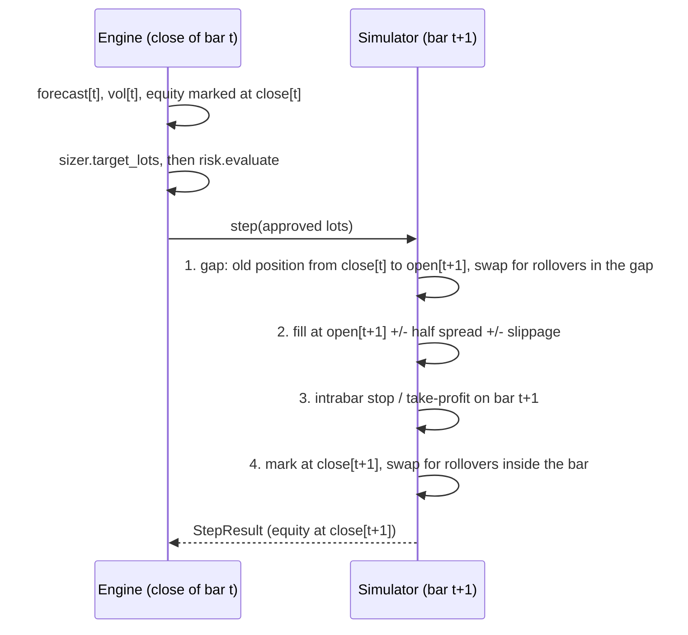

# Execution, costs and backtesting

This page describes how Aurum turns approved positions into P&L. One bar-level simulator,
`aurum.execution.simulator.ExecutionSimulator`, is the single source of truth for P&L. Research
backtests, the RL environment and the LLM-desk replay drive it directly. The paper broker
applies the same `CostModel` arithmetic and the same intrabar exit rule, and a test
(`tests/test_live_paper.py`) requires its equity path to match the simulator's. So the
economics of a strategy cannot differ between research and trading (SPEC §0.2). Orders decided
at a bar's close fill at the next bar's open, at mid ± half the spread ± slippage. Protective
stops and take-profits are resolved inside the bar (stop first), and overnight financing is
charged at each rollover from a point-in-time benchmark rate. The page also covers the backtest
engine (`run_backtest`, `run_target_lots`, `buy_and_hold_benchmark`), the `BacktestResult`
container and every metric `compute_metrics` reports. All numbers in the examples come from
running them against the current code on synthetic data.

**On this page**

- [Timing model](#timing-model)
- [ExecutionSimulator](#executionsimulator)
- [Cost model](#cost-model)
- [Overnight financing](#overnight-financing)
- [Backtest engine](#backtest-engine)
- [BacktestResult](#backtestresult)
- [Metrics](#metrics)
- [Limitations](#limitations)
- [See also](#see-also)

## Timing model

Bars are indexed by their **open** time (UTC). A bar becomes available at
`available_at = open + timeframe`. OHLC are **mid** prices, and `spread` is the full bid/ask
spread in USD/oz ([data.md](data.md)).



A decision at the close of bar `t` (time `available_at[t]`) can only use information up to that
close. The simulator uses bar `t+1` only to settle the order that was decided at `t`: its
range sets the slippage, its high/low trigger protective exits, and its close marks the
position. None of that reaches a decision before `step()` is called.

## ExecutionSimulator

```text
ExecutionSimulator(bars, instrument=XAUUSD, costs=None, initial_equity=100_000.0, *,
                   validate=True, rates=None)
```

| Argument | Meaning |
|---|---|
| `bars` | Canonical bars frame (mid OHLC, `spread`, `available_at`), validated unless `validate=False` |
| `instrument` | Contract spec: lot grid, contract size (100 oz), rollover hour (21 UTC), triple-swap weekday (Wednesday) |
| `costs` | [`CostModel`](#cost-model). `None` means `CostModel()` defaults, including rate financing. |
| `initial_equity` | Starting equity in USD |
| `rates` | Benchmark-rate source for rate financing: `md.macro`, a macro frame with `available_at`, a Series indexed by availability time, or a `RateCurve`. `None` uses `fallback_rate` for every rollover (warned once). |

`reset(start=0, equity=None)` starts flat at the close of bar `start`. The state at "now" is
exposed as `index`, `equity`, `position`, `done`, `peak_equity`, `bankrupt`, `time` (open time
of the current bar), `decision_time` (its `available_at`), `price` (mid close), `spread`,
`drawdown`, `margin_used`, `free_margin` and `snapshot()`.

### What `step()` does

```text
step(target_lots, *, stop_price=None, take_profit=None, reason="signal",
     stop_distance=None, take_profit_distance=None) -> StepResult
```

`step()` is called at the close of bar `t = sim.index` and simulates bar `t+1` in four phases:

1. **Gap segment.** The old position is marked from `close[t]` to `open[t+1]`. It pays swap for
   any rollover strictly after `available_at[t]` and at or before `open[t+1]` (for example a
   daily maintenance break). Rate financing values that notional at `close[t]`.
2. **Fill at the open.** The position is traded to `round_lots(target_lots)`, rounded toward
   zero and clipped to `max_lot`. A buy fills at `open + spread_eff/2 + slippage`, a sell at
   `open - spread_eff/2 - slippage`. Spread and slippage are booked as costs, and the position
   is marked from the **mid**, so `equity change = price P&L at mid - costs + swap` holds
   exactly every bar.
3. **Intrabar protective exits** on bar `t+1` for the position held after the fill (next
   section).
4. **Mark to market** at `close[t+1]`, plus swap for rollovers inside
   `(open[t+1], available_at[t+1]]`, charged on the position held at the close. Rate financing
   values it at `close[t+1]`.

`stop_price` / `take_profit` are absolute mid levels and protect bar `t+1` only: pass them
again on every step to keep them working. `stop_distance` / `take_profit_distance` are the
alternative for a position being *entered* at this open. The level is then anchored at the
fill (`open[t+1] ∓ distance` for a long, mirrored for a short), so a gap cannot put the stop on
the wrong side of the market. The resolved levels come back in `StepResult.stop_price` /
`take_profit`. Passing both a level and a distance for the same order raises `ValueError`.
Calling `step()` when `done` is true (no next bar) raises `RuntimeError`.

`StepResult` fields: `index`, `time`, `equity`, `pnl`, `ret`, `price_pnl`, `costs`
(`spread`, `slippage`, `commission`, `swap`), `fills` (list of `aurum.core.types.Fill`),
`position` (at the close), `position_open` (right after the fill), `done`, `exit_reason`,
`stop_price`, `take_profit`.

### Intrabar stops and take-profits

OHLC bars do not reveal the path inside a bar. `intrabar_exit(pos, o, h, lo, sl, tp)` resolves
it with fixed, conservative rules. The simulator, the paper broker and the live runner share
this function, so all three resolve the same bar the same way. For a **long** position (shorts
are mirrored), checked in this order:

| Condition on bar `t+1` | Exit | Order type |
|---|---|---|
| `open <= stop` | At the **open** (gap through the stop) | Market: half spread + slippage |
| `open >= take_profit` | At the **open** (gap through the take-profit) | Limit: half spread, no slippage |
| `low <= stop` | At `stop`, i.e. `stop - spread_eff/2 - slippage` | Market |
| `high >= take_profit` | At `take_profit`, i.e. `take_profit - spread_eff/2` | Limit |

If both levels lie inside the bar's range, **the stop is assumed to fill first**. The exit
level is a mid price, and the spread and slippage are applied on top, as for any fill.

### Example

```python
import pandas as pd

from aurum.data.schema import make_bars
from aurum.execution.costs import CostModel
from aurum.execution.simulator import ExecutionSimulator, intrabar_exit

idx = pd.date_range("2024-03-05 10:00", periods=4, freq="1h", tz="UTC")
bars = make_bars(pd.DataFrame({
    "open":  [2000.0, 2001.0, 1994.0, 1990.0],
    "high":  [2002.0, 2003.0, 1996.0, 1992.0],
    "low":   [1999.0, 1995.0, 1989.0, 1985.0],
    "close": [2001.0, 1996.0, 1990.0, 1988.0],
}, index=idx), "H1", default_spread=0.30)

sim = ExecutionSimulator(bars, costs=CostModel(financing="none"))
# decided at the close of bar 0; fills at the OPEN of bar 1 (2001.00 + 0.15 + 0.02 + 0.02 * 8.00)
r = sim.step(1.0, stop_distance=4.0)          # stop anchored at the fill: 2001.00 - 4.00 = 1997.00
print(r.fills[0].price, r.stop_price, r.exit_reason, r.position)
print({k: round(v, 2) for k, v in r.costs.items()}, round(r.pnl, 2))

# the intrabar rule on its own: long, stop 1997, bar opens BELOW it -> exit at the open
print(intrabar_exit(1.0, o=1994.0, h=1996.0, lo=1989.0, sl=1997.0, tp=2010.0))
# both levels inside the range: the stop is assumed to fill first
print(intrabar_exit(1.0, o=2000.0, h=2011.0, lo=1996.0, sl=1997.0, tp=2010.0))
print(sim.result().reconcile()["residual"])
```

Output:

```text
2001.33 1997.0 stop 0.0
{'spread': 30.0, 'slippage': 36.0, 'commission': 0.0, 'swap': 0.0} -466.0
(1994.0, 'stop', False)
(1997.0, 'stop', False)
0.0
```

The long entered at 2001.33 (mid 2001.00 plus 0.15 half spread plus 0.18 slippage, since the
bar's range is 8.00). The bar's low of 1995 hit the 1997 stop, so the position was closed in the
same bar. The P&L is −400 at mid (1997 − 2001 on 100 oz), minus 30 of spread and 36 of slippage
for the two fills.

### Trade accounting and bankruptcy

A **trade** is a round trip from flat to flat. A reversal fill is split into a closing leg and
an opening leg, with its costs split pro rata by lots. Scaling in or out stays within one trade:
`entry_price` / `exit_price` are lot-weighted averages of executed prices (including spread
and slippage), and `lots` is the largest absolute size held. Every dollar of price P&L, cost
and swap is attributed to exactly one trade. A position still open at the end is closed
virtually at the last close (`exit_reason="end"`, no liquidation cost), so
`sum(trades.pnl) == equity[-1] - equity[0]`.

There is no margin stop-out model. The only guard is bankruptcy: once equity is at or below
zero, a warning is logged and every later step is forced flat with reason `"risk"`. Margin
limits belong to the [risk manager](portfolio-and-risk.md#risk-manager).

## Cost model

`aurum.execution.costs.CostModel` computes every dollar that leaves the account in a
simulation. It is a frozen dataclass, configured under `costs.*`
([configuration.md](configuration.md)).

| Field | Default | Units | Meaning |
|---|---|---|---|
| `spread_multiplier` | 1.0 | x | Scales the bar's quoted spread (1.5–2.0 to stress-test) |
| `min_spread` | 0.10 | USD/oz | Floor on the effective spread |
| `slippage_fixed` | 0.02 | USD/oz | Adverse slippage per fill |
| `slippage_range_frac` | 0.02 | fraction | Share of the execution bar's high−low range added as slippage |
| `impact_coef` | 0.0 | USD/oz per sqrt(lot) | Square-root market impact |
| `commission_per_lot` | `None` | USD per lot per side | `None` uses `instrument.commission_per_lot` (0.0 for the default XAUUSD instrument) |
| `financing` | `FinancingModel()` | | [Overnight financing](#overnight-financing). A kwargs mapping or a mode name is also accepted. |

The per-ounce components of one fill:

```text
spread_eff = max(spread * spread_multiplier, min_spread)
slippage   = slippage_fixed + slippage_range_frac * (high - low) + impact_coef * sqrt(|lots|)
buy  price = mid + spread_eff / 2 + slippage
sell price = mid - spread_eff / 2 - slippage
```

Limit orders (take-profits) get `limit=True`: half the spread and no slippage. A non-finite or
negative quoted spread is treated as 0, so `min_spread` applies. Fill prices are not rounded to
the tick grid: the error is at most $0.005/oz and leaving them unrounded keeps the P&L identity
exact. `CostModel.zero()` is fully frictionless (no spread, slippage, commission or financing).

Methods: `effective_spread(spread)`, `slippage(bar_range, lots)`,
`fill_price(side, mid, spread, bar_range, lots, *, instrument=XAUUSD, limit=False)` returning
`FillPrice(price, spread_cost, slippage_cost)`, `commission(lots)`,
`swap(lots, nights, *, price=None, rate_nights=None)`,
`swap_between(lots, start, end, *, price=None, rates=None)` and
`round_trip_cost(lots, spread, bar_range=0.0)` (open and close with market orders, excluding
swap).

```python
from aurum.execution.costs import CostModel

cm = CostModel()   # min_spread 0.10, slippage 0.02 + 2% of range, no commission, rate financing

# buy 1 lot at mid 2000.00, quoted spread 0.30, execution-bar range 5.00
fp = cm.fill_price(+1, 2000.0, 0.30, 5.0, 1.0)
print(fp)
# a take-profit (limit=True) fills at the half-spread with no slippage
print(cm.fill_price(-1, 2010.0, 0.30, 5.0, 1.0, limit=True))
# a quoted spread below the floor is charged at min_spread
print(cm.effective_spread(0.04))
print(cm.round_trip_cost(1.0, 0.30, 5.0))
```

Output:

```text
FillPrice(price=2000.27, spread_cost=15.0, slippage_cost=12.000000000000002)
FillPrice(price=2009.85, spread_cost=15.0, slippage_cost=0.0)
0.1
54.0
```

The [forecast combiner](portfolio-and-risk.md#scoring-each-strategy-net-of-costs) uses the
same fields to estimate a per-turnover cost when it weights strategies.

## Overnight financing

A CFD position held over the daily rollover is charged or credited financing by
`aurum.execution.costs.FinancingModel` (`CostModel.financing`, config `costs.financing`).

### Modes

| Mode | What is charged |
|---|---|
| `rate` (default) | Interest on the notional: the USD benchmark rate, minus the gold lease rate, plus or minus a broker markup |
| `fixed` | The instrument's per-lot swap table: `instrument.swap_long_per_lot` (−45) and `swap_short_per_lot` (+15) USD per lot per night. This reproduces the pre-2026 behaviour exactly, and lets you replicate a specific broker's table. The −45/+15 defaults are roughly 9%/yr of a $1,800 notional for a long, far above 2012–2021 benchmark rates; they are kept for backward compatibility, not as realistic values. |
| `none` | Nothing (frictionless benchmarks) |

### The rate formula

A long XAUUSD position is long gold and short USD, so it pays the USD rate. Per financing
night:

```text
long  (lots > 0): swap = -lots * contract_size * P * (r - lease_rate + markup_long)  / day_count
short (lots < 0): swap = -lots * contract_size * P * (r - lease_rate - markup_short) / day_count
```

Swap is signed: positive means received. `P` is the mid at the rollover, and `r` is the
benchmark as of the rollover instant. A short *receives* `r - lease - markup_short`, and pays
when that is negative (as in near-zero-rate years at a retail broker).

| Field | Default | Meaning |
|---|---|---|
| `mode` | `"rate"` | `rate`, `fixed` or `none` |
| `markup_long` | 0.025 | Annual markup a long pays on top of the rate (fraction, in [0, 1)) |
| `markup_short` | 0.025 | Annual markup deducted from what a short receives |
| `lease_rate` | 0.0 | Annual gold lease rate, earned by longs and paid by shorts |
| `rate_series` | `"fedfunds"` | Name of the benchmark series in `md.macro` (FRED DFF) |
| `rate_unit` | `"percent"` | `percent`, `fraction` or `bps` |
| `fallback_rate` | 0.03 | Benchmark (fraction) before the series starts, or without it |
| `day_count` | 360.0 | USD money-market convention |

**Worked example.** One lot long (100 oz) at $2,000 is a $200,000 notional. With a 5.33%
benchmark and the 2.5% markup, one night costs `200,000 × (0.0533 + 0.025) / 360 = $43.50`.
The Wednesday rollover counts three nights: $130.50. The same short receives
`200,000 × (0.0533 − 0.025) / 360 = $15.72` per night. These are illustrative inputs, not
market data.

### When a night is charged

Rollovers happen at `instrument.rollover_hour_utc` (21:00 UTC) on each day. A rollover `R`
is charged to whoever holds the position **immediately before** it, i.e. over an interval
`(t0, t1]` when `t0 < R <= t1`. Weekday weights:

| Rollover on | Nights charged |
|---|---|
| Monday, Tuesday, Thursday, Friday | 1 |
| Wednesday (`triple_swap_weekday = 2`) | 3 (T+2 settlement spans the weekend) |
| Saturday, Sunday | 0 |

A full week therefore counts 7 nights. With H1 bars, the bar opening at 20:00 closes exactly at
the 21:00 rollover, so the position held through that bar pays it. `rollover_nights(start, end)`
and the vectorised `rollover_nights_ns` count nights in O(1) per interval, across weekends and
holidays.

### Point-in-time benchmark

`RateCurve` is a step curve of the annual benchmark. For each rollover instant it returns the
latest value whose `available_at <= R`. When several rows become available at the same instant
(for example FRED's Friday, Saturday and Sunday DFF rows), the last one wins. A rate published
after a rollover is never used for it. `RateCurve.from_source()` accepts `md.macro` (it picks
`rate_series`), a macro frame with `available_at` and a `value` column, a Series indexed by
availability time, or a `RateCurve`. A frame without `available_at`, or tz-naive availability
times, is rejected.

The simulator precomputes the rate for each bar interval at construction and settles each
rollover only in the step that simulates it. It logs a one-time WARNING when there is no series
(every rollover uses `fallback_rate`), when the series starts after the first bar, or when it
ends more than 14 days before the last bar (the last value is carried forward). The provenance
is in `BacktestResult.meta["financing"]`. The backtest engine passes `md.macro` by default, and
`rates=` overrides it. Keep the same rate source for the RL environment (`GoldTradingEnv(...,
rates=)`) and the paper broker (`PaperBroker(..., rates=)`) so they stay in parity with the
engine.

```python
import pandas as pd

from aurum.execution.costs import CostModel, FinancingModel, RateCurve, rollover_nights

fin = FinancingModel()                     # rate mode: benchmark + 2.5% markup, /360
# one night, 1 lot, mid $2,000, benchmark 5.33%
print(round(fin.nightly(+1.0, 2_000.0, 0.0533), 2), round(fin.nightly(-1.0, 2_000.0, 0.0533), 2))

# rollovers at 21:00 UTC; Wednesday counts 3 nights, Sat/Sun none
t = lambda s: pd.Timestamp(s, tz="UTC")
print(rollover_nights(t("2024-03-05 20:00"), t("2024-03-05 21:00")))   # Tuesday
print(rollover_nights(t("2024-03-06 20:00"), t("2024-03-06 21:00")))   # Wednesday
print(rollover_nights(t("2024-03-08 20:00"), t("2024-03-11 20:00")))   # Fri 21:00 only
print(rollover_nights(t("2024-03-04 00:00"), t("2024-03-11 00:00")))   # a full week

# point-in-time benchmark: a print is only used from its available_at on
rates = pd.Series([5.33, 4.83], index=pd.DatetimeIndex(
    [t("2024-01-02 13:00"), t("2024-09-19 13:00")]))           # percent, indexed by availability
curve = RateCurve.from_source(rates, unit="percent")
print(curve)
cm = CostModel()
print(round(cm.swap_between(1.0, t("2024-09-18 20:00"), t("2024-09-18 21:00"),
                            price=2_000.0, rates=curve), 2))    # Wed: 3 nights at 5.33%
print(round(cm.swap_between(1.0, t("2024-09-19 20:00"), t("2024-09-19 21:00"),
                            price=2_000.0, rates=curve), 2))    # Thu: 1 night at 4.83%
print(cm.swap_between(1.0, t("2024-09-19 20:00"), t("2024-09-19 21:00"), price=2_000.0,
                      rates=None))                              # no series -> fallback_rate 3%
print(CostModel(financing="fixed").swap(1.0, 3.0))              # instrument table: -45 USD/lot/night
```

Output:

```text
-43.5 15.72
1.0
3.0
1.0
7.0
RateCurve('fedfunds', n=2, 2024-01-02 13:00:00+00:00 .. 2024-09-19 13:00:00+00:00)
-130.5
-40.72
-30.555555555555557
-135.0
```

### Configuration

```yaml
costs:
  financing:
    mode: rate            # rate | fixed | none
    rate_series: fedfunds # data_store/macro/fedfunds (FRED DFF, %), read as of each rollover
    rate_unit: percent
    markup_long: 0.025
    markup_short: 0.025
    lease_rate: 0.0
    fallback_rate: 0.03
    day_count: 360
```

`run_backtest(..., financing=...)` and `buy_and_hold_benchmark(..., financing=...)` override
`costs.financing` with a `FinancingModel`, its kwargs, or a mode name (`"rate"`, `"fixed"`,
`"none"`).

## Backtest engine

`aurum.backtest.engine` is deliberately thin. P&L comes from the simulator, and sizing and risk
come from the same objects the live runner uses. At the close of each bar `t` of the window:

```text
risk.on_bar(available_at[t], equity)             # peak / day-start equity, kill checks
requested = sizer.target_lots(forecast[t], vol[t], equity, close[t], instrument,
                              current_lots=position, drawdown=dd)
order     = requested, or 0 while a post-stop cooldown blocks that direction
decision  = risk.evaluate(RiskContext(target_lots=order, ...))   # can only reduce, or halt
sim.step(decision.approved_lots, stop levels ...)
```

Engine rules:

- The forecast is aligned to the bars by label. Missing or NaN values become 0, and values are
  clipped to [-1, 1].
- The default `vol` is `ewma_volatility(close)`, computed on the full history so the window
  starts warmed up ([portfolio-and-risk.md](portfolio-and-risk.md#volatility-models)). A `vol`
  Series is forward-filled, and remaining gaps are set to 0.20.
- A non-finite requested size **holds** the current position rather than rounding to 0.
- Any approval outside `[min(0, requested), max(0, requested)]` is clamped, recorded as a risk
  event and counted in `meta["n_risk_clamped"]`. The engine enforces reduce-only even for a
  misbehaving risk manager.
- A fill is tagged `reason="risk"` when risk caused the de-risking (a halt, or a cut of the
  current position that the request did not ask for), otherwise `"signal"`.
- **Protective stops** (`stop_atr_mult`, `take_profit_atr_mult`): when a decision opens or
  reverses a position, the level is set at `entry ∓ k × ATR[t]`. `ATR[t]` is Wilder's ATR over
  bars up to `t` (`average_true_range(bars, n=atr_period)`), and the entry is the fill at the
  open of `t+1`. Levels then stay fixed for the life of the position: no trailing, and scaling
  in keeps the original levels.
- `stop_cooldown_bars`: after a stop-out, re-entry in the same direction is blocked for that
  many decisions. This is applied before the risk manager, so risk sees the order that is
  actually sent, and it is recorded as a `stop_cooldown` risk event.

### run_backtest

```text
run_backtest(md, forecast, *, sizer, risk=None, instrument=XAUUSD, costs=None,
             initial_equity=100_000.0, vol=None, stop_atr_mult=None, start=None, end=None,
             take_profit_atr_mult=None, atr_period=14, stop_cooldown_bars=0, bars_per_year=None,
             event_horizon_hours=24.0, compute_metrics=True, forecast_hook=None, hook_every=1,
             financing=None, rates=None) -> BacktestResult
```

| Argument | Default | Config key | Meaning |
|---|---|---|---|
| `md` | | | `MarketData` (bars, macro, events) or a bars DataFrame |
| `forecast` | | | Series in [-1, 1] decided at each bar's close |
| `sizer` | required | `sizing.*` | A `PositionSizer`, e.g. `VolTargetSizer()` |
| `risk` | `None` | `risk.*` | A `RiskManager`, e.g. `StandardRiskManager(...)` |
| `instrument` | `XAUUSD` | `instrument.*` | Contract spec |
| `costs` | `None` (`CostModel()`) | `costs.*` | Cost model |
| `initial_equity` | 100,000 | `backtest.initial_equity` | USD |
| `vol` | `None` | | Annualised vol per bar (Series or scalar). Default: EWMA. |
| `stop_atr_mult` / `take_profit_atr_mult` | `None` | `backtest.*` | Protective levels at `k × ATR` from the entry |
| `atr_period` | 14 | `backtest.atr_period` | Wilder ATR period |
| `stop_cooldown_bars` | 0 | `backtest.stop_cooldown_bars` | Same-side re-entry block after a stop |
| `start`, `end` | `None` | `backtest.start` / `end` | Inclusive window: bar positions (negative allowed) or timestamps. Inputs are computed on the full history first. |
| `bars_per_year` | `None` | | If given, annualises both the default EWMA vol and `sharpe_bar`. If `None`, the vol uses the nominal timeframe constant and `sharpe_bar` uses the realised bar density of the whole sample (reporting only). |
| `event_horizon_hours` | 24.0 | `backtest.event_horizon_hours` | Width of the upcoming/recent event windows handed to risk |
| `compute_metrics` | `True` | | Fill `result.metrics` |
| `forecast_hook`, `hook_every` | `None`, 1 | | Callback that may replace the forecast before sizing (LLM-desk replay) |
| `financing`, `rates` | `None` | `costs.financing` | Override the cost model's financing / the rate source (default `md.macro`) |

**Forecast hook.** `forecast_hook(bar_index, decision_time, forecast, state)` is called at the
close of every `hook_every`-th window bar. Its return value, clipped to [-1, 1] with non-finite
values mapped to 0, replaces the forecast and is held until the next call. `state` holds
`equity`, `position`, `drawdown`, `peak_equity`, `halted`, `price`, `spread`, `vol`,
`bar_time` and `window_bar`. The hook's output goes through the same sizer and risk manager,
so it can shape exposure but never bypass risk. While the risk manager is halted the approved
position is 0 whatever the hook returns. Call statistics are in `result.meta["hook"]`. See
[llm-desk.md](llm-desk.md) for how `aurum desk replay` uses it.

### run_target_lots

`run_target_lots(md, target_lots, *, risk=None, ...)` backtests a pre-sized path:
`target_lots[t]` is the signed position wanted after the fill at the open of `t+1`. `NaN`
means "no decision, hold". There is no sizer. Risk, stops, financing and every other argument
behave as in `run_backtest` (it has no `forecast_hook`). Inside the package,
`buy_and_hold_benchmark` is built on it. Use it for any externally sized path.

### buy_and_hold_benchmark

`buy_and_hold_benchmark(md, lots=None, notional=None, *, instrument=XAUUSD, costs=None,
initial_equity=100_000.0, start=None, end=None, frictionless=False, compute_metrics=True,
financing=None, rates=None)` buys at the open after the first bar of the window and holds to
the end. The size is `lots`, or `notional` USD converted at the first bar's close (default
`notional = initial_equity`, i.e. 1x leverage), rounded toward zero. It goes through the same
simulator, so by default it pays spread, slippage, commission and CFD financing: the
like-for-like comparison for a CFD strategy. `frictionless=True` removes all costs and
financing. The walk-forward adds this benchmark when `backtest.benchmark: true`.

### Example

```python
import numpy as np

from aurum.backtest.engine import buy_and_hold_benchmark, run_backtest
from aurum.core.types import MarketData
from aurum.data.synthetic import make_synthetic_bars, make_synthetic_events
from aurum.execution.costs import CostModel
from aurum.portfolio.sizing import VolTargetSizer
from aurum.risk.manager import RiskLimits, StandardRiskManager

bars = make_synthetic_bars(6000, "H1", seed=0)          # GBM: no exploitable structure
md = MarketData(bars=bars, events=make_synthetic_events(bars.index[0], bars.index[-1]))

# a toy causal forecast: sign of the trailing 48-bar log return
forecast = np.sign(np.log(bars["close"]).diff(48)).fillna(0.0)

res = run_backtest(
    md, forecast,
    sizer=VolTargetSizer(),                                   # 10% annualised vol target
    risk=StandardRiskManager(RiskLimits(max_spread=2.0, max_drawdown=None,
                                        daily_loss_persistent=False)),  # research-style limits
    costs=CostModel(),                                        # no md.macro -> fallback_rate 3%
    stop_atr_mult=3.0,                                        # optional protective stop
)
m = res.metrics
print({k: round(m[k], 3) for k in ("sharpe", "ann_vol", "max_drawdown", "exposure")})
print(m["n_trades"], round(m["total_costs"], 2), round(m["swap_total"], 2))
print(res.trades["exit_reason"].value_counts().to_dict())
print(len(res.risk_events), res.risk_events.columns.tolist())
print({k: round(v, 6) for k, v in res.reconcile().items()})

bench = buy_and_hold_benchmark(md)                            # 1x notional, same costs and financing
print(bench.meta["lots"], round(bench.metrics["total_return"], 4))
```

Output (stdout; the simulator also logs a one-time WARNING that no `fedfunds` series was
supplied):

```text
{'sharpe': -1.044, 'ann_vol': 0.096, 'max_drawdown': -0.119, 'exposure': 0.991}
393 7792.39 -1230.9
{'signal': 383, 'stop': 9, 'end': 1}
7 ['time', 'bar_time', 'bar', 'current', 'requested', 'approved', 'halted', 'reasons']
{'equity_change': -9958.403105, 'price_pnl': -935.104873, 'costs': 7792.393739, 'swap': -1230.904493, 'residual': 0.0, 'trade_pnl': -9958.403105}
0.55 -0.0774
```

On a random walk a trend rule has no edge, so the result is roughly the cost of trading it:
most of the loss is spread, slippage and financing. This is the expected behaviour, and the
project's leakage tests rely on it. The 7 risk events are event blackouts from the synthetic
calendar.

## BacktestResult

`aurum.backtest.result.BacktestResult` holds a finished backtest. Series are indexed by bar
**open** time.

| Field | Contents |
|---|---|
| `equity` | Equity (USD) marked at each bar's close |
| `returns` | Simple per-bar returns of `equity` (first bar = 0) |
| `positions` | Signed lots held **during** each bar (after the fill at its open) |
| `position_close` | Signed lots at each bar's **close** (after intrabar exits). Equals `positions` unless a stop or take-profit fired. |
| `target` | Signed lots requested at each close (from the engine: after rounding, before risk) |
| `forecast` | Forecast used at each close (`run_backtest` only; with a hook, the forecast actually used) |
| `costs` | Per bar: `spread`, `slippage`, `commission` (positive USD) and `swap` (signed, + = received) |
| `pnl` | Per bar: `price` (mark-to-market at mid), `costs`, `swap`, `net = price - costs + swap` |
| `trades` | Round trips: `entry_time`, `exit_time`, `side`, `lots`, `entry_price`, `exit_price`, `pnl`, `costs`, `swap`, `exit_reason` (`signal`, `risk`, `stop`, `take_profit`, `end`), `entry_bar`, `exit_bar`, `bars_held`, `price_pnl` |
| `fills` | Every fill: `time`, `bar`, `side`, `lots`, `price`, `mid`, `spread_cost`, `slippage_cost`, `commission`, `kind` (`open`, `stop`, `take_profit`), `reason`, `position_after` |
| `risk_events` | Every bar where risk (or the cooldown) changed the request, halted or gave a reason: `time`, `bar_time`, `bar`, `current`, `requested`, `approved`, `halted`, `reasons` |
| `metrics` | The dict from [`compute_metrics`](#metrics) |
| `meta` | Provenance: engine, sizer and risk `repr`, cost model, financing provenance, `bars_per_year`, stop settings, `n_risk_events`, `n_risk_clamped`, `bankrupt`, `timeframe`, `start`, `end`, `n_bars` |

`reconcile()` checks the P&L identity and returns `equity_change`, `price_pnl`, `costs`, `swap`,
`residual = equity_change - (price_pnl - costs + swap)` and `trade_pnl` (the sum of
`trades.pnl`). The residual should be about 0 (under 1e-6 USD), and `trade_pnl` should equal
`equity_change`.

`save(directory)` writes `timeseries.parquet` (equity, returns, positions, target, forecast,
position_close, `cost_*` and `pnl_*` columns), `trades.csv`, `fills.csv`, `risk_events.csv`,
`metrics.json` and `meta.json`. `summary()` returns a short text block of headline metrics.

## Metrics

`aurum.backtest.metrics.compute_metrics(result_or_returns, *, bars_per_year=None, trades=None,
positions=None, costs=None, equity=None, fills=None, bar_duration=None)` returns plain Python
numbers (NaN when a statistic is undefined).

### Conventions

- **Headline statistics use daily returns** annualised with 252 trading days: `sharpe`,
  `ann_vol`, `sortino`, `skew`, `kurtosis`, VaR/CVaR and best/worst day. Per-bar returns are
  autocorrelated through the intraday seasonality of volatility, and annualising them with
  `sqrt(bars_per_year)` overstates precision. The per-bar Sharpe is still reported as
  `sharpe_bar`.
- **Day of an equity mark.** `equity[t]` is marked at the close of bar `t`, so each mark is
  assigned to the UTC date on which that close falls (a close at exactly 00:00 belongs to the
  previous day). The bar duration comes from `meta["timeframe"]` or the index spacing.
- **Weekends are folded into Monday.** Gold reopens on Sunday around 22:00 UTC. Those short
  Sunday stubs (and any Saturday bars) join the following Monday instead of counting as
  near-zero "days". Days without bars are absent, not zero-return days.
- The first day's return is measured against the initial equity.
- **Risk-free rate = 0.** CFD P&L is already an excess return, because financing is paid
  through swap.

### Metric definitions

| Key | Definition |
|---|---|
| `total_return` | `final / initial - 1` |
| `cagr` | `(final / initial) ^ (1 / years) - 1`, with `years` the calendar span of the index (−1 if final equity ≤ 0) |
| `ann_vol` | `std(daily, ddof=1) * sqrt(252)` |
| `sharpe` | `mean(daily) / std(daily, ddof=1) * sqrt(252)` |
| `sharpe_bar` | The same on per-bar returns, annualised with `bars_per_year` |
| `sortino` | `mean(daily) / sqrt(mean(min(daily, 0)^2)) * sqrt(252)` (target 0, over all observations) |
| `max_drawdown` | Most negative `equity / cummax(equity) - 1` (a **negative** fraction) |
| `calmar` | `cagr / \|max_drawdown\|` |
| `max_dd_duration_days` | Longest calendar time from a peak until it is regained (or the sample ends) |
| `skew` | Bias-corrected skewness of daily returns (`pandas.Series.skew`) |
| `kurtosis` | Bias-corrected **excess** kurtosis of daily returns (`pandas.Series.kurt`, normal = 0) |
| `var_95_daily` | `-q5%(daily)`: historical 95% VaR, a positive loss fraction |
| `cvar_95_daily` | `-mean(daily \| daily <= q5%)`: expected shortfall |
| `tail_ratio` | `\|q95%\| / \|q5%\|` |
| `best_day`, `worst_day` | Max and min daily return |
| `n_trades` | Round trips, including the open one closed virtually at the end |
| `trades_per_year` | `n_trades / years` |
| `win_rate` | Share of trades with `pnl > 0` |
| `profit_factor` | `sum(winning pnl) / -sum(losing pnl)` (`inf` with no losing trade) |
| `avg_win`, `avg_loss`, `expectancy` | Mean pnl of winners, of losers, of all trades (USD) |
| `avg_hold_bars` | Mean `bars_held` |
| `exposure` | Share of bars with a non-zero position held during the bar |
| `turnover_lots_per_year` | Total lots filled per year |
| `total_costs` | Spread + slippage + commission (USD, excludes swap) |
| `cost_drag_ann` | `total_costs / mean(equity) / years` |
| `swap_total` | Net financing (USD, signed, + = received) |
| `n_bars`, `n_days`, `years`, `bars_per_year`, `final_equity` | Bookkeeping |

> **Two kurtosis conventions.** `metrics["kurtosis"]` is **excess** kurtosis (normal = 0).
> The research statistics (`aurum.research.stats.sharpe_summary`, and `book_statistics` in the
> walk-forward) report and use **Pearson** kurtosis (normal = 3), as the PSR/DSR formulas
> require. `aurum.research.stats` logs a warning when a value that can only be excess kurtosis
> is passed where Pearson is expected. Add 3 before feeding `metrics["kurtosis"]` to those
> functions. See [research.md](research.md).

Helpers in the same module: `daily_returns(equity, *, initial=None, fold_weekends=True,
bar_duration=None)`, `daily_equity(...)`, `trading_dates(...)`, `drawdown_series(equity)`,
`max_drawdown(equity)`, `max_drawdown_duration_days(equity)` and `infer_bar_duration(index)`.

Metrics describe what happened in one path. They are not evidence of an edge. The walk-forward
adds PSR, the Deflated Sharpe Ratio, bootstrap intervals and PBO ([research.md](research.md)),
and the results live in [RESULTS.md](RESULTS.md).

## Limitations

- **The path inside a bar is unknown.** When a bar touches both the stop and the take-profit,
  the stop is assumed to fill first. In a bar where a protective exit fired, swap is charged on
  the position at the close (flat). This is exact for M1–H1 bars that end on the rollover hour,
  and approximate for H4/D1 bars that contain it.
- **Slippage is a model.** It uses the execution bar's high−low range. That is a cost-model
  input only and never reaches a decision, but it is a proxy, not an order-book simulation.
- **No partial fills, liquidity limits, requotes or rejections**, and no margin stop-out. The
  only guard is bankruptcy at equity ≤ 0.
- **Fixed rollover hour.** The rollover is a fixed UTC hour from the instrument. It does not
  move with New York daylight saving time, so it can be an hour off for about half the year.
- **Financing is an estimate.** The benchmark-plus-markup model and its 2.5% default markup
  approximate a retail CFD broker. Your broker's swap table can differ. To replicate it, set
  `costs.financing.mode: fixed` and put your broker's quotes in
  `instrument.swap_long_per_lot` / `instrument.swap_short_per_lot`.
- **The benchmark's history matters.** Without a `fedfunds` series every rollover uses
  `fallback_rate` (3%).
- **Fixed bars frame.** The simulator works over a fixed bars frame and has no append API.
  The paper broker keeps its own incremental bookkeeping (with the same cost arithmetic).

## See also

- [portfolio-and-risk.md](portfolio-and-risk.md): combiner, sizer, risk manager, volatility models
- [data.md](data.md): the bars schema, `available_at`, macro data and the event calendar
- [research.md](research.md): walk-forward protocol and statistics built on these backtests
- [live-trading.md](live-trading.md): paper broker and live runner parity with the simulator
- [llm-desk.md](llm-desk.md): the desk replay through `forecast_hook`
- [configuration.md](configuration.md): the `costs`, `instrument` and `backtest` sections
- [cli.md](cli.md): `aurum backtest` and `aurum walkforward`
- [INTERFACES.md](INTERFACES.md): module signatures
- [RESULTS.md](RESULTS.md): research results
