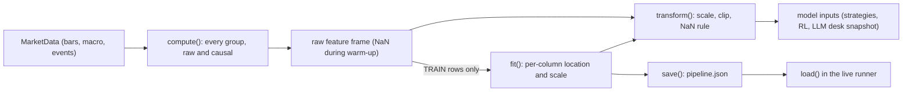

# Features

Aurum's feature library turns a [`MarketData`](data.md#marketdata) bundle into a wide frame
of causal, mostly scale-free columns: 12 registered groups (returns, trend, momentum, mean
reversion, range, volatility, microstructure, session, higher timeframes, macro, calendar
and regime), 174 columns on H1 bars with the five synthetic macro series and 194 with the
ten series `aurum data download` fetches. `FeaturePipeline` computes them, fits a robust
scaler on training rows only, transforms research, backtest and live data identically, and
persists as JSON for the live runner. Every group must pass a future-perturbation leakage
harness and a random-walk test. The code lives in [`aurum/features/`](../aurum/features/).

**On this page**

- [The causal contract](#the-causal-contract)
- [The registry](#the-registry)
- [Feature groups](#feature-groups)
- [FeaturePipeline](#featurepipeline)
- [Configuration](#configuration)
- [Adding a feature group](#adding-a-feature-group)
- [Leakage testing](#leakage-testing)
- [Live parity](#live-parity)
- [Known limitations](#known-limitations)



## The causal contract

A feature function maps `MarketData` to a DataFrame indexed exactly like `md.bars.index`.
**Row `t` may depend only on information available at `md.bars["available_at"].iloc[t]`**:
bars `[0, t]`, plus macro and event rows whose `available_at` is at or before that time
(scheduled event *times* are public in advance; see [Data](data.md#economic-calendar)).
The rules for implementers, from [`aurum/features/base.py`](../aurum/features/base.py) and
the leakage tests:

- no `shift(-k)`, no centred windows, no `bfill`, no full-sample statistics (mean, std or
  quantiles over the whole column): rolling, expanding and EWM operators only;
- warm-up rows are NaN (the pipeline decides what to do with them);
- output columns carry the group prefix, e.g. `trend_ema_slope_20`;
- prefer scale-free outputs (returns, ratios, z-scores, ATR-normalised distances) so models
  transfer across price levels ($300 gold in 2001 versus $2,500 in 2024);
- the column set must depend only on the configuration and on which inputs are present,
  never on how many rows are visible (a live runner starting with a short history must get
  the same columns as research).

Annualised volatilities use a timeframe-based constant (`252 x 23h / bar` intraday, e.g.
5,796 bars for H1) instead of the realised bar density of the whole sample, which would use
future timestamps.

## The registry

Groups register themselves with a decorator:

```text
@register_feature(name, *, family, lookback, requires_macro=(), requires_events=False, **params)
```

This creates a `FeatureSpec(name, family, fn, lookback, requires_macro, requires_events,
params, doc)`. `get_feature(name)` returns it, `list_features()` returns all of them, and
`spec.compute(md, **overrides)` calls the function (registry `params`, then overrides) and
raises `ValueError` if the returned index does not equal `md.bars.index`. Registering a
name twice raises `KeyError`. The built-in modules are imported on first use of the
registry, so `aurum.features` stays cheap to import.

```bash
aurum features list          # add --json for machine-readable output
```

```text
group                   family  lookback  requires                                                                               doc
------------------------------------------------------------------------------------------------------------------------------------
returns                returns        49         -                                              Vol-normalised trailing log returns.
trend                    trend       205         -                                    Trend-following state, expressed in ATR units.
momentum              momentum       481         -                                    Oscillators and time-series-momentum strength.
meanrev                meanrev       101         -             Stretch-from-equilibrium measures used by fade/mean-reversion models.
range                    range        56         -                             Position within recent ranges and single-bar anatomy.
volatility          volatility       481         -               Realised-volatility family (all annualised fractions unless noted).
microstructure  microstructure       121         -                      Spread, volume, gap and short-horizon autocorrelation state.
session                session         0         -           Clock and session features of the decision instant ``available_at[t]``.
mtf                        mtf       576         -  Higher-timeframe trend/momentum/vol + previous-day levels, point-in-time aligned
macro                    macro      2136         -           Per-series changes & level z-scores, and rolling gold correlation/beta.
calendar              calendar         0    events        Event-proximity features for events with ``importance >= min_importance``.
regime                  regime      5820         -                                 Causal, sliding-window-stable regime descriptors.
```

The `lookback` column is the registered value, computed for H1 bars and default parameters.
The pipeline recomputes warm-ups for the actual bar size and overrides (see
[Warm-up](#warm-up)).

## Feature groups

Overview with default parameters. "Warm-up" is the number of bars until every column of the
group is defined.

| Group | Module | Columns | Warm-up (H1 bars) | Needs | What it measures |
|---|---|---|---|---|---|
| `returns` | [technical.py](../aurum/features/technical.py) | 10 | 49 | bars | Vol-normalised trailing log returns |
| `trend` | technical.py | 24 | 205 | bars | EMA distance/slope/crosses, MACD, ADX, regression t-stats, in ATR units |
| `momentum` | technical.py | 16 | 481 | bars | RSI, stochastic, time-series momentum at five horizons |
| `meanrev` | technical.py | 6 | 101 | bars | Z-scores vs rolling means, Bollinger %B and width, streaks |
| `range` | technical.py | 13 | 56 | bars | Donchian position/width, candle anatomy, inside/outside/NR7 |
| `volatility` | [volatility.py](../aurum/features/volatility.py) | 19 | 481 | bars | Close-close and range-based estimators, vol ratios, vol of vol |
| `microstructure` | [microstructure.py](../aurum/features/microstructure.py) | 8 | 121 | bars | Spread, tick volume, gaps, return autocorrelation |
| `session` | microstructure.py | 13 | 0 | timestamps | Clock encodings and DST-aware Asia/London/New York sessions |
| `mtf` | [multi_timeframe.py](../aurum/features/multi_timeframe.py) | 20 | 576 | bars | H4/D1 trend, momentum and vol, previous-day levels |
| `macro` | [macro.py](../aurum/features/macro.py) | 4 per series, + 4 for dxy and real10y | 2,136 | `md.macro` | Changes and z-scores per series, rolling gold correlation/beta vs dxy and real10y |
| `calendar` | [calendar.py](../aurum/features/calendar.py) | 10 | 0 | `md.events` | Proximity to scheduled NFP/CPI/FOMC releases |
| `regime` | [regime.py](../aurum/features/regime.py) | 11 | 5,820 | bars | Bounded vol percentile, efficiency ratio, variance ratio, trend state |

Column counts were produced by computing the default pipeline on
`make_synthetic_bars(3000, "H1")` with synthetic macro and events. `macro` gives 24
columns with the five synthetic series and 44 with the ten downloaded series.

### returns

`returns_log_1` is the raw one-bar log return. `returns_z_{h} = ln(C_t / C_{t-h}) /
(sigma_t * sqrt(h))`, with `sigma_t` a per-bar EWMA volatility (half-life `vol_halflife=48`,
`vol_min_periods=24`) that includes bar `t`: a t-stat-like measure of the recent move that is
comparable across volatility regimes. Default `horizons=(1, 2, 3, 4, 6, 8, 12, 24, 48)`.

### trend

In ATR units (`atr_n=14`): `trend_ema_dist_{s}` = (C - EMA_s) / ATR and `trend_ema_slope_{s}`
(EMA change over `slope_bars=5`) for `ema_spans=(10, 20, 50, 100, 200)`;
`trend_ema_cross_{f}_{s}` for `ema_pairs=((10, 50), (20, 100), (50, 200))`; `trend_macd`,
`trend_macd_signal`, `trend_macd_hist` for `macd=(12, 26, 9)`; `trend_adx_14` (ADX / 100) and
`trend_di_diff_14`; `trend_linreg_t_{n}` and `trend_linreg_r2_{n}`, the signed t-stat and R²
of an OLS fit of log price on time for `linreg_windows=(20, 50, 100)`. The t-stats are
inflated by serially correlated residuals: use them as strength scores, not for inference.
EMAs use `alpha = 2 / (span + 1)` (the MT5 convention).

### momentum

`momentum_rsi_2`, `momentum_rsi_14` (Wilder RSI rescaled to [-1, 1]);
`momentum_stoch_k_14`, `momentum_stoch_d_14` (same scaling); `momentum_tsmom_{h}`, the
h-bar log return over `sigma_t * sqrt(h)` (Moskowitz, Ooi and Pedersen 2012), and
`momentum_tsmom_resp_{h}`, the response `z * exp(-z²/4) / 0.89` of Baz et al. (2015), for
`tsmom_horizons=(24, 72, 120, 240, 480)`; `momentum_tsmom_agg`, the mean sign across
horizons (NaN until every horizon is warm); `momentum_up_frac_24`, the share of up bars in
the last 24 minus 0.5.

### meanrev

`meanrev_z_{n}` = (C - SMA_n) / std_n for `z_windows=(20, 50, 100)`;
`meanrev_bb_pctb_20` (Bollinger %B minus 0.5; 0 on the middle band, ±0.5 on the bands) and
`meanrev_bb_width_20` (band width / SMA, a squeeze detector) with `bb_k=2.0`;
`meanrev_streak`, the signed count of consecutive up or down bars.

### range

`range_donchian_pos_{n}` (close position in the n-bar channel minus 0.5) and
`range_donchian_width_{n}` (width in ATR) for `donchian=(20, 55)`; candle anatomy
`range_body`, `range_upper_wick`, `range_lower_wick`, `range_clv` (all relative to the bar's
range), `range_bar_atr`, `range_body_atr`; flags `range_inside_bar`, `range_outside_bar` and
`range_nr7` (narrowest range of the last `nr_window=7` bars).

### volatility

All annualised fractions unless noted, for `windows=(24, 120)` and `long_window=480`:
close-to-close (`cc`), Parkinson (`pk`), Garman-Klass (`gk`), Rogers-Satchell (`rs`) and
Yang-Zhang (`yz`) estimators (`volatility_{est}_{n}`); slow baselines `volatility_cc_480`
and `volatility_yz_480`; `volatility_ewma` (half-life 48 bars);
`volatility_logratio_yz_24_120` and `volatility_logratio_yz_120_480` (log short/long vol,
above 0 means expansion); `volatility_range_cc_120` (Parkinson / close-close, about 1 for a
random walk); `volatility_volofvol` (rolling std of log yz_24 over 120 bars);
`volatility_chg_24` (24-bar log change of yz_24); `volatility_atr_pct` (ATR / close, per bar).
The estimators are also plain functions (`atr`, `true_range`, `yang_zhang_vol`,
`parkinson_vol`, ...) used by strategies, sizing and risk code.

### microstructure

`microstructure_spread_bps` (spread / close in basis points), `microstructure_spread_z`
(rolling z of log spread over `z_window=120`), `microstructure_spread_atr` (spread / ATR:
cost against a typical bar move), `microstructure_range_spread` ((H - L) / spread),
`microstructure_volume_z` (rolling z of log(1 + tick volume)), `microstructure_gap_atr`
((O_t - C_{t-1}) / ATR_{t-1}), `microstructure_after_gap` (the bar opened more than 1.5 bar
lengths after the previous one: weekends, holidays, breaks) and `microstructure_autocorr_120`
(rolling lag-1 autocorrelation of log returns; negative values suggest bid/ask bounce).

### session

Every column describes the **decision instant** `available_at[t]` (the close of bar `t`;
the next fill is at the open of bar `t+1`, which is the same instant except across breaks
such as weekends). Clock times are known in advance, so this is not look-ahead.
`session_hour_{sin,cos}` (UTC time of day), `session_how_{sin,cos}` (UTC hour of week),
`session_ny_hour_{sin,cos}` (New York local time, DST-aware); flags `session_asia` (Tokyo
08:00-17:00), `session_london` (London 08:00-17:00), `session_ny` (New York 08:00-17:00),
`session_overlap` (London and New York), all Monday to Friday local time;
`session_rollover` (New York 16:00-18:00); `session_week_progress` (hours since the Sunday
17:00 ET open / 120, clipped to [0, 1]); `session_friday_late` (Friday after 12:00 ET). London
and New York switch DST on different dates; `zoneinfo` handles each zone separately.

### mtf

For each timeframe in `htfs=("H4", "D1")` that is slower than the base bars, the base bars
are resampled with the complete-bucket rules (D1 and H4 buckets anchored at
`daily_anchor_hour_utc=22`, the New York close), compact features are computed **on the HTF
series**, and the result is mapped back with `align_htf` (an as-of join on
`available_at`). A base bar therefore only sees HTF bars that were finished at its decision
time. Columns `mtf_{h4,d1}_{name}`: `ret_z_{1,5,20}`, `ema_dist_20`, `ema_slope_20`,
`rsi_14`, `pk_vol_20`, `donchian_pos_20`. Plus previous completed day's levels in base-bar ATR
units: `mtf_pdh_dist`, `mtf_pdl_dist`, `mtf_pdc_dist`, and `mtf_pd_pos` (close position in
the previous day's range minus 0.5). On H4 bars only the D1 block and the previous-day
columns remain (12 columns); on D1 bars the group emits no columns.

### macro

For each series `s` in `md.macro` (default: all of them, sorted by name):
`macro_{s}_chg_{1,5,20}d` (k-observation change: log return for prices, basis-point change
for yields) and `macro_{s}_z` (rolling z-score of the level, or of the log level for prices,
over `z_window=250` observations with `z_min_periods=60`). For `beta_series=("dxy",
"real10y")`: `macro_corr_{s}` and `macro_beta_{s}`, the rolling 60-day correlation and OLS
beta of daily gold log returns on the series' daily change (`corr_min_periods=40`). The
gold daily series comes from the bars themselves, resampled to complete D1 bars anchored at
22:00 UTC, never from a calendar-day `resample().last()`.

Point-in-time details:

- Changes and z-scores are computed on each series' own observation sequence; every
  derived row becomes available at the running maximum of the `available_at` of the inputs
  it uses, and is mapped onto bars with `asof_join(bars.available_at, ...)`.
- Values older than `stale_days=10` at decision time become NaN, so a dead feed is not
  forward-filled forever.
- Whether a series is a yield is decided from its **name** (`DEFAULT_YIELD_SERIES`: `us2y`,
  `us5y`, `us10y`, `us30y`, `real10y`, `real5y`, `breakeven10y`, `breakeven5y`, `fedfunds`,
  `t10y2y`, `sofr`) or from `frame.attrs["kind"]` (`yield`, `rate`, `level` or `spread`),
  never from the values: "any value <= 0" would be a full-sample decision.
- A series that is present but has no visible row yet still produces its columns (all NaN).
- With no macro data at all the group returns an empty frame.

### calendar

Needs `md.events`; the pipeline skips the group when events are `None`. Uses events with
`importance >= min_importance` (3), optionally filtered by `currencies`. All times are
relative to the decision instant, and an event scheduled exactly at that instant counts as
upcoming (its outcome is not known yet). `calendar_hours_to_next` and
`calendar_hours_since_last` (capped at `cap_hours=72`, also when there is no such event);
`calendar_in_30m` and `calendar_in_2h` (an event within ±30 minutes or ±2 hours);
`calendar_pre_2h` and `calendar_post_2h` (one-sided); `calendar_next_{nfp,cpi,fomc}` (type
of the next event, matched on the event name, zero beyond the cap); `calendar_n_next_24h`
(event timestamps in the next 24 hours). Outcomes (`actual`, `forecast`) are not used.

### regime

Model-free and fully window-bounded (fitted HMMs live in `aurum.models.regime`; see
[ML and RL](ml-and-rl.md)):

- `regime_vol_pctrank`: percentile rank (0 to 1) of the 24-bar realised vol among the
  last `W` values, where `W` is `rank_window` bars if given, else `rank_years=1.0` years of
  bars at the bars' own size (5,796 H1, 1,449 H4, 252 D1 bars). It is NaN until the window
  is full. `regime_high_vol` / `regime_low_vol` flag ranks above 0.8 / below 0.2.
- `regime_er_20`, `regime_er_100`: Kaufman efficiency ratio (1 = straight line, about 0 =
  noise).
- `regime_vr_{4,16}` and `regime_hurst_{4,16}`: rolling Lo-MacKinlay variance ratio over
  240 bars and the implied Hurst proxy (above 0.5 persistent, below 0.5 mean-reverting).
- `regime_trend_strength`: |ln(C_t / C_{t-120})| divided by the RMS of the same 120 one-bar
  returns times sqrt(120); `regime_trend_state`: the sign of that return when strength > 1
  and ER(120) > 0.3, else 0.

Because every window is bounded, a value depends only on the last `vol_window + W - 1`
bars: a live runner computing on any window at least as long as the warm-up gets the same
values as research. `expanding=True` adds the legacy `regime_vol_pctrank_exp` (a rank
against *all* past values). It is causal but depends on where the history starts, so it is
off by default. `vol_halflife=<float>` restores the legacy EWMA normaliser for the trend
strength.

<details>
<summary>Full default column list (174 columns on H1, synthetic macro)</summary>

Generated with `FeaturePipeline().compute(md)` on `make_synthetic_bars(3000, "H1", seed=1)`
plus `make_synthetic_macro` and `make_synthetic_events`.

- **returns (10):** returns_log_1, returns_z_1, returns_z_2, returns_z_3, returns_z_4, returns_z_6, returns_z_8, returns_z_12, returns_z_24, returns_z_48
- **trend (24):** trend_ema_dist_10, trend_ema_slope_10, trend_ema_dist_20, trend_ema_slope_20, trend_ema_dist_50, trend_ema_slope_50, trend_ema_dist_100, trend_ema_slope_100, trend_ema_dist_200, trend_ema_slope_200, trend_ema_cross_10_50, trend_ema_cross_20_100, trend_ema_cross_50_200, trend_macd, trend_macd_signal, trend_macd_hist, trend_adx_14, trend_di_diff_14, trend_linreg_t_20, trend_linreg_r2_20, trend_linreg_t_50, trend_linreg_r2_50, trend_linreg_t_100, trend_linreg_r2_100
- **momentum (16):** momentum_rsi_2, momentum_rsi_14, momentum_stoch_k_14, momentum_stoch_d_14, momentum_tsmom_24, momentum_tsmom_resp_24, momentum_tsmom_72, momentum_tsmom_resp_72, momentum_tsmom_120, momentum_tsmom_resp_120, momentum_tsmom_240, momentum_tsmom_resp_240, momentum_tsmom_480, momentum_tsmom_resp_480, momentum_tsmom_agg, momentum_up_frac_24
- **meanrev (6):** meanrev_z_20, meanrev_z_50, meanrev_z_100, meanrev_bb_pctb_20, meanrev_bb_width_20, meanrev_streak
- **range (13):** range_donchian_pos_20, range_donchian_width_20, range_donchian_pos_55, range_donchian_width_55, range_body, range_upper_wick, range_lower_wick, range_clv, range_bar_atr, range_body_atr, range_inside_bar, range_outside_bar, range_nr7
- **volatility (19):** volatility_cc_24, volatility_pk_24, volatility_gk_24, volatility_rs_24, volatility_yz_24, volatility_cc_120, volatility_pk_120, volatility_gk_120, volatility_rs_120, volatility_yz_120, volatility_cc_480, volatility_yz_480, volatility_ewma, volatility_logratio_yz_24_120, volatility_logratio_yz_120_480, volatility_range_cc_120, volatility_volofvol, volatility_chg_24, volatility_atr_pct
- **microstructure (8):** microstructure_spread_bps, microstructure_spread_z, microstructure_spread_atr, microstructure_range_spread, microstructure_volume_z, microstructure_gap_atr, microstructure_after_gap, microstructure_autocorr_120
- **session (13):** session_hour_sin, session_hour_cos, session_how_sin, session_how_cos, session_ny_hour_sin, session_ny_hour_cos, session_asia, session_london, session_ny, session_overlap, session_rollover, session_week_progress, session_friday_late
- **mtf (20):** mtf_h4_ret_z_1, mtf_h4_ret_z_5, mtf_h4_ret_z_20, mtf_h4_ema_dist_20, mtf_h4_ema_slope_20, mtf_h4_rsi_14, mtf_h4_pk_vol_20, mtf_h4_donchian_pos_20, mtf_d1_ret_z_1, mtf_d1_ret_z_5, mtf_d1_ret_z_20, mtf_d1_ema_dist_20, mtf_d1_ema_slope_20, mtf_d1_rsi_14, mtf_d1_pk_vol_20, mtf_d1_donchian_pos_20, mtf_pdh_dist, mtf_pdl_dist, mtf_pdc_dist, mtf_pd_pos
- **macro (24):** macro_dxy_chg_1d, macro_dxy_chg_5d, macro_dxy_chg_20d, macro_dxy_z, macro_real10y_chg_1d, macro_real10y_chg_5d, macro_real10y_chg_20d, macro_real10y_z, macro_spx_chg_1d, macro_spx_chg_5d, macro_spx_chg_20d, macro_spx_z, macro_us10y_chg_1d, macro_us10y_chg_5d, macro_us10y_chg_20d, macro_us10y_z, macro_vix_chg_1d, macro_vix_chg_5d, macro_vix_chg_20d, macro_vix_z, macro_corr_dxy, macro_beta_dxy, macro_corr_real10y, macro_beta_real10y
- **calendar (10):** calendar_hours_to_next, calendar_hours_since_last, calendar_in_30m, calendar_in_2h, calendar_pre_2h, calendar_post_2h, calendar_next_nfp, calendar_next_cpi, calendar_next_fomc, calendar_n_next_24h
- **regime (11):** regime_vol_pctrank, regime_high_vol, regime_low_vol, regime_er_20, regime_er_100, regime_vr_4, regime_hurst_4, regime_vr_16, regime_hurst_16, regime_trend_strength, regime_trend_state

</details>

## FeaturePipeline

[`FeaturePipeline`](../aurum/features/pipeline.py) is the one object research, backtests,
the RL environment and the live runner use to turn `MarketData` into model inputs.

```text
FeaturePipeline(groups=None, overrides=None, scaler="robust", clip=5.0, *, warmup=None, bar_minutes=None)
```

| Parameter | Default | Meaning |
|---|---|---|
| `groups` | `None` | Registry names to compute. `None` means every registered group in canonical order (the SPEC §4 order above, then any other groups sorted by name), independent of import order. Unknown names raise `KeyError`; duplicates raise `ValueError`. |
| `overrides` | `None` | `{group: {param: value}}` forwarded to the group function. Overrides for groups not in `groups` raise `ValueError`. |
| `scaler` | `"robust"` | `"robust"` (median and IQR x 0.7413), `"standard"` (mean and std) or `"none"`. |
| `clip` | `5.0` | Clip scaled values to `[-clip, clip]`; `None` disables. |
| `warmup` | `None` | Explicit warm-up in bars; overrides the computed `max_lookback`. |
| `bar_minutes` | `None` | Bar size for day-based warm-ups. `compute` records it from the bars; H1 is assumed until then. |

### compute

`compute(md)` returns the raw (unscaled) concatenation of all groups, causal row by row,
with `inf` replaced by NaN. It records the bar size, skips groups whose declared needs are
missing (`calendar` without `md.events`) with an INFO log, and raises `ValueError` on
duplicate column names across groups. If a pipeline fitted on one bar size computes another,
it logs a warning: the fitted statistics and warm-ups are specific to one bar size.

### fit and scaling

`fit(raw_train)` estimates one location and scale per column from `raw_train` **only**;
afterwards they are constants, so `transform` is row-wise and cannot leak across time.

| Column kind | Rule | `stats["kind"]` |
|---|---|---|
| All finite training values in {-1, 0, 1} (flags, sign states) | passed through: location 0, scale 1 | `discrete` |
| `scaler="robust"` | median and `IQR x 0.7413` (equal to sigma for a Gaussian), so a few crash bars do not dominate fat-tailed features | `robust` |
| robust, but the IQR is degenerate while the column is not constant | falls back to the standard deviation | `robust_std` |
| `scaler="standard"` / `"none"` | mean and std / 0 and 1 | `standard` / `none` |
| constant, all-NaN or degenerate scale in train | dropped (`pipe.dropped_columns`) | |

`pipe.columns` lists the kept columns, `pipe.stats` is a frame of `loc`, `scale` and
`kind`, and `fit` raises `ValueError` if nothing is left.

### transform and the NaN rule

`transform(raw, *, strict=True)` scales with the fitted statistics, clips, and fills NaN:

- It raises `FeatureSchemaError` (a `ValueError`) if a fitted column is missing, for
  example because the live process was not given macro data or events, and, with
  `strict=True`, if `raw` has columns never seen at fit time (research and live feature
  configurations have diverged).
- A NaN stays NaN while it is **warm-up**: before the column's first valid value in the
  frame and within the first `max_lookback` rows. Any later NaN (a stale macro feed, a
  zero-range bar) becomes 0, which is the training median after scaling, i.e. a neutral
  value. Both rules only look backward. Drop warm-up rows with `dropna()` or skip
  `max_lookback` rows.
- The rule treats the first row of the frame as the start of history. For walk-forward folds
  use `transform(raw_full).iloc[test_idx]` (leak-free, because transform is row-wise), not
  `transform(raw_full.iloc[test_idx])`; the two are equal only when every column has a
  valid value in the fold's first row.

`fit_transform(raw)` is `fit(raw).transform(raw)`.

### Warm-up

`max_lookback` is the number of bars until every column of every group is defined: the
explicit `warmup` if given, else the maximum over groups of the group's warm-up. Each
built-in group attaches a `lookback_fn(params, bar_minutes)` that is evaluated on its
**effective** parameters (function defaults, then registry params, then overrides), so
overriding a window moves the warm-up while non-window parameters do not. Groups without a
`lookback_fn` fall back to their registered `lookback`, raised to the largest integer
override + 1 when overridden.

Day-based groups need a number of days whatever the bar size, and the `regime` window is a
number of years:

| Group | M15 | H1 | H4 | D1 |
|---|---|---|---|---|
| `mtf` | 2,304 | 576 | 144 | 0 (no columns) |
| `macro` | 8,544 | 2,136 | 534 | 89 |
| `regime` | 23,208 | 5,820 | 1,473 | 276 |
| other groups | unchanged (at most 481) | 481 | 481 | 481 |
| **`max_lookback`, all groups** | **23,208** | **5,820** | **1,473** | **481** |

`max_lookback` counts bars until values are *defined*. EWM-based features (EMAs, EWMA
volatilities, the D1 EWM vol in `mtf`) keep a decaying dependence on their first value, so
their values still depend slightly on where the history starts (see
[Live parity](#live-parity)).

### Persistence

`save(path)` writes JSON (human-diffable and safe to ship to the live runner) and
`FeaturePipeline.load(path)` restores it; `to_dict()` / `from_dict()` do the same in memory.
A trimmed example for `FeaturePipeline(groups=["returns"], overrides={"returns":
{"horizons": [1, 24]}})` fitted on synthetic H1 bars:

```json
{
  "format": "aurum.features.FeaturePipeline",
  "version": 1,
  "groups": ["returns"],
  "overrides": {"returns": {"horizons": [1, 24]}},
  "scaler": "robust",
  "clip": 5.0,
  "warmup": null,
  "bar_minutes": 60.0,
  "max_lookback": 25,
  "fitted": true,
  "columns": ["returns_log_1", "returns_z_1", "returns_z_24"],
  "dropped": [],
  "stats": {
    "returns_log_1": {"loc": -5.334385236821504e-05, "scale": 0.0020505307125892615, "kind": "robust"}
  }
}
```

Loading logs a warning if the recomputed `max_lookback` differs from the saved one, which
means the feature registry has changed since the pipeline was fitted.

### Diagnostics

- `parity_report(a, b, atol=1e-8)` compares two feature frames column by column on their
  common index (NaN equals NaN) and returns `in_a`, `in_b`, `n_rows`, `max_abs_diff`,
  `n_mismatch`, `n_nan_mismatch` and `ok` per column. Use it to check live against research
  features.
- `snapshot(frame, at=None, columns=None)` returns a JSON-safe `{column: value}` dict for
  one row (default the last; NaN and inf become `None`). The LLM desk uses it to show
  features to its agents (see [LLM desk](llm-desk.md)).

### End-to-end example

```python
import pandas as pd

from aurum.core.types import MarketData
from aurum.data import make_synthetic_bars, make_synthetic_events, make_synthetic_macro
from aurum.features import FeaturePipeline

bars = make_synthetic_bars(9000, "H1", seed=7, model="regime")
md = MarketData(bars=bars, macro=make_synthetic_macro(bars, seed=7),
                events=make_synthetic_events(bars.index[0], bars.index[-1] + pd.Timedelta(days=14)))

pipe = FeaturePipeline()                       # all 12 groups, robust scaler, clip=5
raw = pipe.compute(md)                         # unscaled, causal, NaN during warm-up
print(raw.shape, "max_lookback =", pipe.max_lookback)

split = 7000                                   # train on rows [0, 7000), test after
pipe.fit(raw.iloc[:split])                     # statistics from TRAIN rows only
X = pipe.transform(raw)                        # row-wise: slicing afterwards is leak-free
X_test = X.iloc[split:]
print(len(pipe.columns), "columns kept, dropped:", pipe.dropped_columns)
print(pipe.stats["kind"].value_counts().to_dict())
print("NaN rows before warm-up:", int(X.isna().any(axis=1).sum()),
      "| NaN in test block:", int(X_test.isna().sum().sum()),
      "| max |x| =", float(X_test.abs().max().max()))
```

```text
(9000, 174) max_lookback = 5820
174 columns kept, dropped: []
{'robust': 152, 'discrete': 21, 'robust_std': 1}
NaN rows before warm-up: 5819 | NaN in test block: 0 | max |x| = 5.0
```

In the walk-forward engine the scaler is refitted per fold on that fold's training rows
(see [Research](research.md)). The ML strategies `ml_gbm` and `meta_label` build and fit their
own pipelines (see [ML and RL](ml-and-rl.md)).

## Configuration

The `features:` section of a config builds the pipeline the walk-forward engine hands to
strategies (see [Configuration](configuration.md)):

```yaml
features:
  enabled: auto        # auto | true | false
  groups: null         # null = every registered group
  overrides: {}        # e.g. {regime: {rank_years: 2.0}}
  scaler: robust
  clip: 5.0
  warmup: null         # explicit warm-up in bars
```

`enabled` decides which strategies receive the fold's pipeline features: a strategy that
declares `uses_features` gets them (or not) as declared; otherwise `true` feeds every
trainable strategy, `auto` (the default) feeds none, and `false` never computes features.
No built-in strategy declares `uses_features`, so with `auto` the ML strategies rely on
their own pipelines. Overrides can be set from the command line, for example
`--set 'features.overrides={regime: {rank_years: 2.0}}'`.

## Adding a feature group

A group is a function decorated with `@register_feature`. This example adds a
volume-weighted price deviation, attaches a warm-up function, checks causality by
truncation, and uses it in a pipeline:

```python
from collections.abc import Mapping
from typing import Any

import pandas as pd

from aurum.core.types import MarketData
from aurum.data import make_synthetic_bars
from aurum.features import FeaturePipeline, get_feature, register_feature
from aurum.features.base import unregister_feature
from aurum.features.volatility import atr, safe_div


def vwap_lookback(p: Mapping[str, Any], bar_minutes: float = 60.0) -> int:
    """Bars until every column is defined, for the EFFECTIVE parameters."""
    return max(int(p.get("n", 50)), int(p.get("atr_n", 14)))


@register_feature("vwap", family="vwap", lookback=50)
def vwap_features(md: MarketData, *, n: int = 50, atr_n: int = 14) -> pd.DataFrame:
    """Close vs its rolling n-bar volume-weighted typical price, in ATR units."""
    bars = md.bars
    typical = (bars["high"] + bars["low"] + bars["close"]) / 3.0
    vol = bars["volume"].astype(float)
    pv = (typical * vol).rolling(n, min_periods=n).sum()      # trailing window only
    vv = vol.rolling(n, min_periods=n).sum()
    vwap = pd.Series(safe_div(pv, vv), index=bars.index)
    dist = safe_div(bars["close"] - vwap, atr(bars, atr_n))   # never emits inf
    return pd.DataFrame({f"vwap_dist_{n}": dist}, index=bars.index)


vwap_features.lookback_fn = vwap_lookback   # lets FeaturePipeline.max_lookback follow overrides

# quick point-in-time check: the past must not change when the future is removed
bars = make_synthetic_bars(1000, "H1", seed=0)
spec = get_feature("vwap")
full = spec.compute(MarketData(bars=bars))
for t in (60, 500, 900):
    cut = spec.compute(MarketData(bars=bars.iloc[: t + 1]))
    assert full.iloc[: t + 1].equals(cut), f"look-ahead at t={t}"

pipe = FeaturePipeline(groups=["returns", "vwap"], overrides={"vwap": {"n": 100}})
raw = pipe.compute(MarketData(bars=bars))
print(pipe.max_lookback, list(raw.columns)[-2:], int(raw["vwap_dist_100"].isna().sum()))

unregister_feature("vwap")   # only needed in a notebook; registering a name twice raises KeyError
```

```text
100 ['returns_z_48', 'vwap_dist_100'] 99
```

The override `n=100` moved the warm-up to 100 bars, and the first 99 rows of the new column
are NaN, as the contract requires. The truncation check above is a quick sanity test, not a
substitute for the full harness.

To make a group part of Aurum itself:

1. Put it in a module under `aurum/features/` and add that module to the list in
   `_ensure_loaded()` in [`base.py`](../aurum/features/base.py). Only listed modules are
   imported automatically, so otherwise `list_features()`, `FeaturePipeline()`, the CLI and
   the leakage tests will not see the group. A group registered outside that list must be
   imported before any pipeline that names it is constructed or loaded, including in the live
   process.
2. Prefix every column with the group name (or family), return exactly `md.bars.index`,
   leave warm-up rows NaN, and return the same columns for any history length, including
   0 to 3 bars.
3. Attach a `lookback_fn(params, bar_minutes)` that returns the bars until every column is
   defined.
4. Optionally add the name to `CANONICAL_GROUP_ORDER` in
   [`pipeline.py`](../aurum/features/pipeline.py); otherwise it is ordered after the built-in
   groups, by name. Either way it joins the default `FeaturePipeline()` (`groups=None`), so
   configs with `features.groups: null` start computing it. The ML and RL strategies use
   explicit group lists and are unaffected.
5. Run the leakage tests below. Once the module is imported by `_ensure_loaded()`, the
   parametrised tests pick the new group up automatically. Its warm-up must fit in the
   harness's 2,400-bar history (or add test-only parameters to `GROUP_TEST_PARAMS`, as
   `regime` does), and a price-driven group must react when the future is perturbed.

## Leakage testing

Three test files keep the feature library honest. They run on synthetic data, offline:

```bash
pytest tests/test_features_leakage.py tests/test_features_randomwalk.py tests/test_stability_regime.py
```

All 70 tests passed when this page was written.

**Future perturbation** ([`tests/test_features_leakage.py`](../tests/test_features_leakage.py)).
On 2,400 H1 bars from the `regime` synthetic model, with synthetic macro and events, and for
cutoffs `t` in (150, 700, 1500, 2150), every registered group is recomputed on two
alternative histories that agree with the original up to `available_at[t]`:

- *perturbed*: every bar after `t` is replaced by an unrelated `jump` path (different seed,
  price level, volatility, spread and volume), and every macro row not yet available at the
  cutoff gets an unrelated value, some of them non-positive;
- *truncated*: bars after `t` and macro rows not yet available are removed.

Rows `<= t` must be bit-identical (NaN equals NaN) in all three. Scheduled event times are
public, so the calendar is not perturbed. Further checks: every column is populated before
the last cutoff and price-driven groups do react to the perturbation (so the check is not
comparing NaN with NaN); columns carry the group prefix; boundary cutoffs (the first bars,
around a weekend, at the 21:00 and 22:00 UTC closes) on H1 and on M30 bars for the
calendar-sensitive groups; and histories of 0 to 3 bars give the same columns and values as
the full history. The `regime` group runs with a 500-bar rank window there, because its
default one-year window exceeds 2,400 bars; the default window is covered in
`test_stability_regime.py`.

Negative controls register deliberately leaky features under temporary names and assert that
the checker flags each one: `shift(-1)`, a full-sample z-score, a centred rolling window, a
`bfill`, and a macro series joined on its observation date instead of `available_at`. A
positive control (a trailing moving average) must pass.

**Random walk** ([`tests/test_features_randomwalk.py`](../tests/test_features_randomwalk.py)).
On 20,000 H1 bars of driftless GBM nothing is predictable, so no feature may be correlated
with the next bar's return. The test computes the full default pipeline, takes the Spearman
correlation of each column with `r[t+1]` after the warm-up, and applies a Bonferroni-corrected
1% family-wise significance level. It requires at least 150 testable columns, no significant
column, and every |rho| below 0.04. A negative control shows that `shift(-1)`, a centred
window and a weak leak buried in noise are all detected.

**Regime stability** ([`tests/test_stability_regime.py`](../tests/test_stability_regime.py)).
Checks that the bounded `regime` columns computed on the live runner's window (3 x warm-up)
equal the full-history values after the warm-up on M15, H1, H4 and D1 bars, that the
expanding rank does not (negative control), and that the default window is point-in-time.

The same perturbation pattern is reused for strategies in
[`tests/test_strategies_leakage.py`](../tests/test_strategies_leakage.py); see
[Strategies](strategies.md) and [Development](development.md).

## Live parity

The live runner recomputes features on a sliding window of closed bars and transforms them
with the pipeline fitted in research (loaded from the artifact's `pipeline.json`; see
[Live trading](live-trading.md)). Points to check:

- **History length.** Unless `history_bars` is set, the runner requests
  `max(ceil(history_multiple x max_lookback), min_history_bars, max(max_lookback + 1, 30))`
  closed bars, with `history_multiple=3.0` and `min_history_bars=300`; `max_lookback` is the
  larger of the pipeline's and the strategies' warm-ups. With every group on H1 bars that is
  3 x 5,820 = 17,460 bars; on M15 it is 3 x 23,208 = 69,624. The runner refuses to decide on
  a bar when fewer than `max(max_lookback + 1, 30)` closed bars are available, so make sure
  the broker feed can serve the history.
- **EWM seeds.** EMA and EWMA-based columns depend slightly on where the history starts. At
  3 x warm-up the difference is tiny but not zero.
- **Bounded regime rank.** The default `regime_vol_pctrank` is bit-stable once its window is
  full; do not enable `expanding=True` for a model that will trade live.

The example computes a pipeline the way the live runner would (from the saved JSON, on the
last 3 x `max_lookback` bars) and compares it with the research features:

```python
import tempfile
from pathlib import Path

from aurum.core.types import MarketData
from aurum.data import make_synthetic_bars
from aurum.features import FeaturePipeline

bars = make_synthetic_bars(6000, "H1", seed=3)
pipe = FeaturePipeline(groups=["trend", "volatility", "regime"],
                       overrides={"regime": {"rank_window": 500}})
research = pipe.compute(MarketData(bars=bars))
pipe.fit(research.iloc[:4000])

with tempfile.TemporaryDirectory() as tmp:          # what ships to the live runner
    live_pipe = FeaturePipeline.load(pipe.save(Path(tmp) / "pipeline.json"))

# live recomputes on a sliding window of 3 x max_lookback closed bars
n_hist = 3 * live_pipe.max_lookback
live = live_pipe.compute(MarketData(bars=bars.iloc[-n_hist:]))
rep = live_pipe.parity_report(research.iloc[-200:], live.iloc[-200:], atol=1e-8)
print("max_lookback", live_pipe.max_lookback, "| history", n_hist, "|", int(rep["ok"].sum()), "of", len(rep), "columns ok")
print(rep.loc[~rep["ok"], ["max_abs_diff", "n_mismatch"]].sort_values("max_abs_diff").to_string())

x_live = live_pipe.transform(live)
snap = live_pipe.snapshot(x_live, columns=["regime_vol_pctrank", "trend_adx_14"])
print({k: round(v, 3) for k, v in snap.items()})
```

```text
max_lookback 524 | history 1572 | 51 of 54 columns ok
                        max_abs_diff  n_mismatch
column                                          
trend_ema_slope_200     2.580651e-08          85
trend_ema_cross_50_200  2.516651e-06         200
trend_ema_dist_200      2.516651e-06         200
{'regime_vol_pctrank': -0.358, 'trend_adx_14': -0.141}
```

Only the 200-bar EMA columns differ, by about 2.5e-6 ATR units; every `regime` and
`volatility` column matches. A longer history shrinks the gap further.

Also check:

- **Same inputs.** A pipeline fitted with macro or calendar columns raises
  `FeatureSchemaError` in live if the macro frames or events are not supplied. The live
  runner has its own macro directory, refresh and maximum-age settings and a rule-based
  calendar by default ([Live trading](live-trading.md)). A macro feed that goes stale for more
  than 10 days turns into NaN and then 0 after the warm-up, so the model silently sees a
  neutral value; monitor feed freshness.
- **Same bar size.** A pipeline fitted on H1 bars warns when it computes other bars; the
  fitted statistics do not transfer.
- **Custom groups** must be imported in the live process before the pipeline is loaded.

## Known limitations

- Feature *usefulness* is not established by any of the above: the tests prove the absence
  of look-ahead, not the presence of alpha. What the strategies built on these features
  achieved out of sample is in [RESULTS.md](RESULTS.md).
- `aurum features list` shows registry warm-ups for H1; the pipeline computes the real
  warm-up for the bar size and overrides.
- For groups without a `lookback_fn`, overridden warm-ups use the largest integer override +
  1, a heuristic. Pass `warmup=` to set it exactly.
- EWM-based features are only approximately history-independent; bit-level live parity needs
  a long history and a `parity_report` check.
- The calendar group uses no outcomes, the rule-based FOMC list ends in 2027, and
  unscheduled events in an imported calendar would leak slightly.
- A macro series whose name is not in `DEFAULT_YIELD_SERIES` and that has no
  `attrs["kind"]` is treated as a price, so its non-positive prints give NaN changes.
- The random-walk test uses one seed and a 1% family-wise false-positive rate by
  construction.

## See also

- [Data](data.md): the inputs, `available_at` and `asof_join`.
- [Strategies](strategies.md) and [ML and RL](ml-and-rl.md): who consumes the features.
- [Research](research.md): per-fold fitting in the walk-forward engine.
- [Live trading](live-trading.md): the artifact, history window and macro refresh.
- [SPEC.md §4](../SPEC.md#4-features-aurumfeatures) is the binding contract for this layer.
