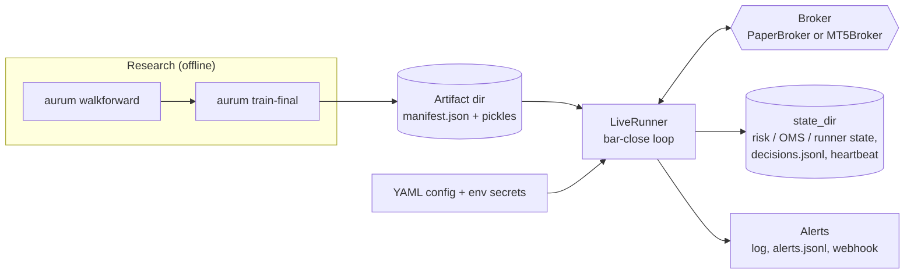
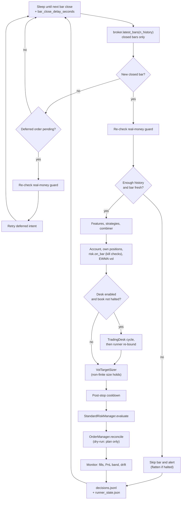
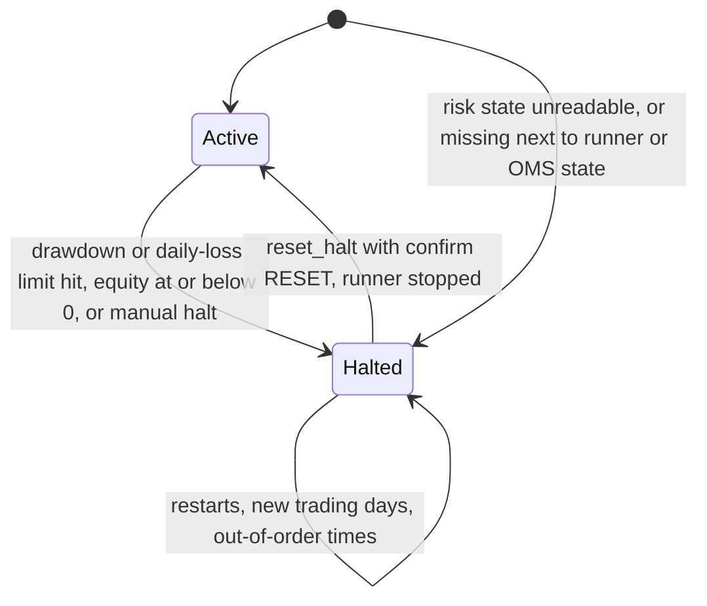

# Live and paper trading

`aurum.live` is the production execution path. It loads a trading **artifact** (fitted
strategies, feature pipeline and combiner), waits for each bar to close, and runs the same
chain as the research backtest: features, strategies, combiner, the optional LLM desk, the
volatility-targeting sizer, the risk manager with a persistent kill switch, and an idempotent
order manager (OMS). The OMS reconciles the target position against a venue: the **paper
broker**, or **MetaTrader 5** on Windows. Everything is safe by default. The runner plans
orders without sending them unless `dry_run` is turned off, and it refuses real-money
accounts unless two separate opt-ins are given. This page covers how the pieces work, every
safety guard, the state the runner keeps on disk, and how to operate it.

**On this page**

- [Read this first](#read-this-first)
- [Overview](#overview)
- [Quick start (offline)](#quick-start-offline)
- [Brokers](#brokers)
- [Trading artifacts](#trading-artifacts)
- [The runner loop](#the-runner-loop)
- [Real money: double opt-in and guards](#real-money-double-opt-in-and-guards)
- [Order management (OMS)](#order-management-oms)
- [The state directory](#the-state-directory)
- [Kill switch](#kill-switch)
- [Monitoring and alerts](#monitoring-and-alerts)
- [Operations runbook](#operations-runbook)
- [Known residual risks](#known-residual-risks)
- [Configuration reference](#configuration-reference)

Related pages: [portfolio-and-risk.md](portfolio-and-risk.md) (sizer and risk limits),
[execution-and-costs.md](execution-and-costs.md) (fills, costs, financing),
[llm-desk.md](llm-desk.md), [configuration.md](configuration.md), [cli.md](cli.md).

---

## Read this first

> [!WARNING]
> Under the project's pre-registered protocol **no strategy has a statistically demonstrated
> edge** ([RESULTS.md](RESULTS.md)). Aurum is a research and paper-trading platform. Trading
> leveraged gold CFDs can lose more than your deposit. The maintainers recommend against
> connecting it to a real-money account.

- Move up one step at a time: **dry-run** (plan only), then **paper fills**, then an **MT5
  demo account**. Stop there unless you have your own evidence and a reviewed operating
  procedure.
- The software guards against its own failure modes (double sends, stale data, forming bars,
  runaway losses), but it cannot guard against a strategy that simply loses money.
- Configs ship with `dry_run: true` and `allow_live_real: false`. Never commit a config that
  flips either.

## Overview



| Module | Role |
|---|---|
| `aurum/live/runner.py` | `LiveRunner` (bar-close loop), `LiveConfig`, artifact save/load, real-money guard, runner CLI |
| `aurum/live/broker.py` | `Broker` protocol, value types (`AccountInfo`, `BrokerPosition`, `OrderRequest`, `OrderResult`, `Quote`), clocks |
| `aurum/live/paper.py` | `PaperBroker` (simulator-identical fills), `ReplayFeed`, `BrokerDataFeed` |
| `aurum/live/mt5.py` | `MT5Broker` (MetaTrader 5, imported lazily) |
| `aurum/live/oms.py` | `OrderManager`: idempotent target-position reconciliation |
| `aurum/live/monitor.py` | PSI drift, slippage, PnL band, alert sinks, heartbeat check |
| `aurum/live/state.py` | Atomic JSON state files, JSONL logs, heartbeats |

Importing `aurum.live` needs neither `MetaTrader5` nor `anthropic`.

## Quick start (offline)

### From the CLI

```bash
aurum train-final -c configs/live_paper.yaml --out artifacts/live_paper   # production fit (runs a walk-forward first)
aurum live run    -c configs/live_paper.yaml --max-cycles 24             # dry-run on the paper broker
```

`configs/live_paper.yaml` replays `data_store/xauusd_H1.parquet` on a simulated clock,
starting after `paper.warmup_bars: 6000` (December 2012). An artifact fitted on all data is
therefore **in-sample** on that replay: it tests the plumbing, not the strategy. For an
out-of-sample replay, fit with `train-final --cutoff <T>` and set
`live.options.paper.start` after `T`.

Real output of a 3-bar dry run on the published data store, using the artifact that the
`train-final` command above produced. Both were written to a scratch directory, so `--set`
points the config at them. Paths are shortened to `<artifact>` and `<state>`:

```text
$ aurum live run -c configs/live_paper.yaml --set live.artifact_dir=<artifact> --set live.state_dir=<state> --max-cycles 3
live: broker=paper dry_run=True allow_live_real=False magic=20260926 artifact=<artifact>
resolved runner config: <state>/aurum_live_config.yaml
aurum live runner [DRY-RUN PAPER] XAUUSD H1 magic=20260926 state=<state>
```

The decisions it logged, summarised with this snippet (pass the state directory as its
argument; it defaults to `live_paper.yaml`'s `runs/live/paper`):

```python
import sys
from aurum.live.state import read_json, read_jsonl

state = sys.argv[1] if len(sys.argv) > 1 else "runs/live/paper"
for r in read_jsonl(f"{state}/decisions.jsonl"):
    if r["type"] == "decision":
        ex = r["execution"] or {}
        print(r["time"], r["status"], f"combined={r['combined']:+.3f}",
              f"approved={r['approved_lots']:+.2f}", [(p["kind"], p["side"], p["lots"]) for p in ex.get("planned", [])])
    else:
        print(r["type"], r.get("mode", r.get("status")))
print("halted:", read_json(f"{state}/risk_state.json")["halted"])
```

```text
start DRY-RUN PAPER
2012-12-17T15:00:00+00:00 dry_run combined=-0.251 approved=-0.15 [('open', -1, 0.15)]
2012-12-17T16:00:00+00:00 dry_run combined=-0.245 approved=-0.15 [('open', -1, 0.15)]
2012-12-17T17:00:00+00:00 dry_run combined=-0.234 approved=-0.14 [('open', -1, 0.14)]
stop stopped
halted: False
```

In dry-run nothing is filled, so the position stays flat and every bar plans the full entry
again. Set `live.dry_run: false` in the YAML to fill on the paper broker. `aurum live run` has
no flag that turns dry-run off.

### From Python, fully synthetic

This runs in about a second with no data files, using two rule strategies that need no
fitting:

```python
import tempfile
from pathlib import Path

from aurum.data.synthetic import make_synthetic_bars
from aurum.live import (LiveConfig, LiveRunner, PaperBroker, ReplayFeed, SimulatedClock,
                        load_artifact, save_artifact)
from aurum.strategies.base import get_strategy

root = Path(tempfile.mkdtemp(prefix="aurum_paper_"))
bars = make_synthetic_bars(1600, "H1", seed=7, model="trend")

# 1) A tiny artifact: two rule strategies (no fitting needed), equal-weight combination.
art_dir = save_artifact(root / "artifact",
                        strategies={"ema_cross": get_strategy("ema_cross"), "donchian": get_strategy("donchian")},
                        symbol="XAUUSD", timeframe="H1", sizer_config={"target_vol": 0.10})

# 2) A paper venue replaying the bars on a simulated clock (instant), starting at bar 1300.
clock = SimulatedClock(bars["available_at"].iloc[1300])
broker = PaperBroker(ReplayFeed(bars), clock=clock, initial_equity=100_000.0)

# 3) The runner: orders are FILLED on the paper broker (dry_run=False), no calendar.
cfg = LiveConfig(artifact_dir=str(art_dir), state_dir=str(root / "state"), dry_run=False, calendar=None)
runner = LiveRunner(cfg, broker=broker, clock=clock, artifact=load_artifact(art_dir))
results = runner.run(max_cycles=5, install_signal_handlers=False)

for r in results:
    print(f"{r.time:%Y-%m-%d %H:%M} combined {r.combined:+.3f} -> approved {r.approved_lots:+.2f} lots "
          f"status={r.status}")
print("mode:", runner.mode, "| halted:", runner.risk.halted)
print(sorted(p.name for p in (root / "state").iterdir()))
```

```text
PaperBroker: rate financing without a 'fedfunds' series; using fallback_rate=0.0300 (pass rates=md.macro or call set_rates)
2020-03-20 15:00 combined +0.757 -> approved +0.32 lots status=filled
2020-03-20 16:00 combined +0.771 -> approved +0.32 lots status=noop
2020-03-20 17:00 combined +0.781 -> approved +0.32 lots status=noop
2020-03-20 18:00 combined +0.790 -> approved +0.32 lots status=noop
2020-03-20 19:00 combined +0.803 -> approved +0.32 lots status=noop
mode: PAPER | halted: False
['decisions.jsonl', 'heartbeat.json', 'oms_state.json', 'risk_state.json', 'runner.lock', 'runner_state.json']
```

The first line is a logged warning (stderr): the default cost model finances overnight
positions at a benchmark rate, and no macro data was passed. `noop` means the sizer's
rebalance band kept the position.

## Brokers

Both venues implement the `Broker` protocol: `account`, `positions(symbol, magic)`,
`place_order`, `close_position`, `close_all`, `latest_bars` (closed bars only), `is_demo`,
`is_hedging`, `server_time`, `quote` and `find_deals`. The runner and the OMS depend only on
this protocol, plus optional hooks (`reconnect`, `shutdown`, `set_rates`) when a venue
provides them.

### Paper broker

`PaperBroker` never touches money. It fills market orders with the **same `CostModel`
arithmetic as the research simulator**: mid ± effective spread/2 ± slippage, commission per
side, and overnight financing per rollover with the triple-swap weekday. Its equity path
matches `ExecutionSimulator` to floating-point precision, which `tests/test_live_paper.py`
enforces. Broker-side SL/TP use the simulator's own `intrabar_exit` rule (a gap through the
level exits at the open, and the stop is checked before the take-profit). `is_demo()` is
always `True`.

The runner builds it from `live.options.paper` (runner key `paper`):

| Key | Default | Meaning |
|---|---|---|
| `data` | `replay` | `replay`: serve `bars_path` progressively on a `SimulatedClock` (instant). `mt5`: paper fills on live MT5 bars and quotes, on the wall clock (needs Windows and a terminal). |
| `bars_path` | (required for `replay`) | Stored bars parquet to replay. |
| `start` | none | Replay start time. Otherwise the decision time of bar `warmup_bars`. |
| `warmup_bars` | 2000 | Bars skipped before the first decision when `start` is not set. |
| `end` | none | Truncate the replayed bars. |
| `initial_equity` | 100000 | Starting balance (USD). |
| `hedging` | `false` | MT5 hedging semantics (one ticket per entry) instead of netting. |

Replay semantics. An order placed just after bar *t* closes executes at the **open of bar
*t+1*** (the simulator's fill convention). Between bars (weekends, the daily break) there is
no quote, and orders are rejected with retcode 10018 (`market_closed`), as on a real MT5
server. A CLI replay stops by itself at the end of the data. The paper book is persisted to
`<state_dir>/paper_broker.json` after every change and restored on restart. With rate-based
financing (`costs.financing.mode: rate`) and a `macro_dir`, benchmark rates are loaded from it
and refreshed with each macro reload. Otherwise the broker uses `fallback_rate` and warns
once.

### MetaTrader 5 adapter

`MT5Broker` drives a locally running MT5 terminal through the official `MetaTrader5` Python
package, which **only exists for Windows** (`pip install -e ".[mt5]"`). Elsewhere it fails
cleanly. Real output on macOS:

```text
aurum: error: MT5UnavailableError: cannot import MetaTrader5: the MetaTrader5 package is only available on Windows (it drives a local MT5 terminal); run the live runner on Windows or use the paper broker (use --traceback for details)
```

**Credentials** come from the environment only and are never logged, stored or put in
exception messages:

| Variable | Meaning |
|---|---|
| `MT5_LOGIN` | Account number (must be an integer). If unset, the adapter attaches to the account the terminal is already logged in to. |
| `MT5_PASSWORD` | Account password (used only with `MT5_LOGIN`). |
| `MT5_SERVER` | Trade server name (used only with `MT5_LOGIN`). |
| `MT5_PATH` | Path to `terminal64.exe`, if not the default. |

**On connect** the adapter selects the symbol and refuses to run (`BrokerError`) if the
venue's contract size differs from the instrument's (100 oz). Sizing would otherwise be wrong.
It refreshes the lot grid (minimum, step, maximum capped at the instrument's `max_lot`) from
`symbol_info`, and warns if AutoTrading is disabled (orders would be rejected with 10027).

**Magic-number isolation.** `positions(symbol, magic)` filters on both. Closing or modifying
a ticket of another magic or symbol is refused (`retcode="ownership"`). Every close is an
opposite deal on the specific ticket (`position=ticket`). The v1 bot filtered by symbol only
and could close other EAs' trades.

**Closed bars only; server time to UTC.** MT5 stamps bars and ticks with the server's wall
clock. With `server_tz: auto` (the default) the offset is detected from a *fresh* tick, one
seen arriving within `tz_probe_seconds`. When it matches the New-York-close convention, the
DST-aware `"NY+7"` rule is used. **If no fresh tick arrives (market closed) and `server_tz`
is `auto`, connecting fails.** Set it explicitly, for example `server_tz: "NY+7"`, to start
while the market is closed. A configured `server_tz` that disagrees with a fresh detection by
15 minutes or more is a fatal error, because bars would be shifted by hours. The forming bar
(close time in the future) is always dropped. MT5 bars are bid bars and are converted to mid
(`+spread/2`) with `price_basis: bid`.

**Order filling.** Candidate filling modes are tried in the order FOK, IOC, RETURN, skipping
modes the symbol does not advertise. The mode that last worked goes first. Retcode 10030
(unsupported filling) moves to the next mode.

**Retcodes** are normalised to venue-independent statuses:

| MT5 retcode(s) | Status | Handling |
|---|---|---|
| 10009 | `filled` | |
| 10010 | `partial` | |
| 10004, 10015, 10020 (requote, invalid price, price changed) | `requote` | Retried with a fresh tick (`requote_retries`, default 3), then reported |
| 10021 (price off) | `market_closed` after fresh-tick retries | OMS defers |
| 10018 | `market_closed` | OMS defers (the runner retries later) |
| 10019 | `no_money` | Rejected |
| 10014, 10034, 10038 | `invalid_volume` | Rejected |
| 10016 | `invalid_stops` | Rejected |
| 10017, 10026, 10027, 10032, 10042 to 10045 | `trade_disabled` | Rejected |
| 10028, 10029 | `rejected` | |
| 10024 | `too_many_requests` | Retryable with backoff |
| 10008 (placed but not confirmed), 10011, 10012 (timeout), 10031 (connection), `order_send` returned `None` | `unknown` | **Verified, never blindly resent** (see [OMS](#order-management-oms)) |
| 10030 after all filling modes | `rejected` | |
| any other code | `rejected` | |

**Broker-side protection.** SL/TP levels travel with the order. Aurum uses mid levels
everywhere. The adapter converts them to MT5's trigger side (longs trigger on the bid, shorts
on the ask) using the current half spread, and converts back when reading positions.

**Demo and account-mode detection** (inputs to the real-money guard and the OMS):

| Question | Rule |
|---|---|
| Is this a demo account? | Only when `account_info().trade_mode == ACCOUNT_TRADE_MODE_DEMO`. Contest, real, missing, non-integer or otherwise garbled modes all count as **real money**. |
| Is it a hedging account? | Only when `margin_mode == ACCOUNT_MARGIN_MODE_RETAIL_HEDGING`. Anything else is treated as **netting**, which is the conservative side. |

`quote()` returns nothing for a tick older than 10 minutes, and the runner treats that as a
closed market when it retries deferred orders. The account holder's name is never exported.

`live.options.mt5` passes keyword arguments to `MT5Broker`:

| Key | Default | Meaning |
|---|---|---|
| `server_tz` | `auto` | `auto`, `NY+7`, `UTC`, `UTC+02:00`, or an IANA zone. |
| `deviation_points` | 20 | Maximum accepted slippage for market orders, in points. |
| `price_basis` | `bid` | `bid` (convert bars to mid) or `mid`. |
| `requote_retries` | 3 | Fresh-tick retries on requote-type codes. |
| `requote_delay_s` | 0.25 | Delay between those retries. |
| `tz_probe_seconds` | 5.0 | How long to wait for a fresh tick when detecting the offset. |

Credential-like keys (`password`, `login`, `token` and so on) are rejected in any config file.

## Trading artifacts

An artifact is a directory with everything the runner needs from research.

**Build it with `aurum train-final`** (recommended). It fits the feature pipeline and
trainable strategies on the training window that ends at `--cutoff` (default: the last bar),
and takes **combiner weights from stitched out-of-sample walk-forward forecasts**: either
from `--from-run WF_DIR`, which must have the same config hash unless
`--allow-config-mismatch` is given, or from a walk-forward it runs on the spot, including a
holdout evaluation that is recorded in the ledger. It refuses configs whose `sizing.method`
is not `vol_target`, because the live runner only implements volatility targeting. See
[research.md](research.md) and [cli.md](cli.md). A config mismatch is refused like this:

```text
aurum: --from-run runs/protocol/trend_core_holdout was produced by config 119941494ce8, this config is 06a2fca027fc: its OOS forecasts validate a different protocol (pass --allow-config-mismatch to use them anyway)
```

`aurum live artifact -c CONFIG [--out DIR] [--at TS] [--from-run WF_DIR] [--overwrite]` is the
older, simpler path. It fits the book on the latest data, and its combiner weights come from
`--from-run`'s OOS forecasts when given. Without it they follow `walkforward.combiner_fit`,
which gives equal weights when there is no OOS history. Prefer `train-final`.

**Contents** (`save_artifact` writes a temporary sibling directory and swaps it in, so a crash
never leaves a half-written artifact):

| File | Content |
|---|---|
| `manifest.json` | Format and version, symbol, timeframe, strategy names, combiner class, `max_lookback`, `n_features`, sizer kwargs, training metadata (for `train-final`: cutoff, fit window, config and data hashes, full config, provenance, OOS source), package versions, git SHA, the **sha256 of every file**, and an optional `hmac`. |
| `strategies.pkl` | `{name: fitted Strategy}` (pickle). |
| `strategies.json` | Human-readable classes, params, warm-up, trainable flag. |
| `combiner.pkl` | Fitted `ForecastCombiner` (optional; without it the runner uses an equal-weight mean). |
| `pipeline.json` | Fitted feature pipeline with its TRAIN scaler statistics (only when a strategy uses features). |
| `feature_reference.json` | PSI reference bins of the TRAIN features, for drift monitoring (only with a pipeline). |
| `backtest.json` | OOS statistics, used by the PnL band monitor. |

**Load checks** (`load_artifact`, run by the runner at start):

1. `manifest.json` exists, has format `aurum.live.artifact`, and a supported version.
2. The aurum **major** version matches, or the load is refused. A different Python minor
   version only logs a warning, because pickle compatibility is not guaranteed.
3. If `AURUM_ARTIFACT_KEY` is set, the manifest's HMAC-SHA256 must verify. An unsigned
   artifact is refused.
4. Every file listed in the manifest exists with the recorded sha256. `strategies.pkl`,
   `combiner.pkl` and `pipeline.json` must be covered by the manifest. All of this is
   checked **before anything is unpickled**.
5. The strategies match the manifest's list and have `generate()`. The combiner has
   `combine()`. The pipeline is fitted.

The runner then refuses an artifact built for another timeframe, and only warns when the
symbol differs (broker suffixes such as `XAUUSD.a`).

**HMAC signing.** Set `AURUM_ARTIFACT_KEY` when saving to sign the manifest. The manifest
holds every file's hash, so the signature covers the whole artifact. Keep the same key in the
environment of the runner. Offline example:

```python
import json, os, tempfile
from pathlib import Path

from aurum.live import ArtifactError, load_artifact, save_artifact
from aurum.strategies.base import get_strategy

os.environ["AURUM_ARTIFACT_KEY"] = "example-only-key"      # use a real secret in practice
path = save_artifact(Path(tempfile.mkdtemp()) / "art", strategies={"donchian": get_strategy("donchian")})
print("signed:", "hmac" in json.loads((path / "manifest.json").read_text()))
print("loaded:", sorted(load_artifact(path).strategies))

(path / "strategies.json").write_text("{}")                 # tamper with any listed file
try:
    load_artifact(path)
except ArtifactError as exc:
    print("refused:", exc)
```

```text
signed: True
loaded: ['donchian']
refused: <tmp>/art: sha256 mismatch for strategies.json (modified or corrupt)
```

**Portability and trust.** Pickles execute code when loaded: **only load artifacts you
produced yourself** (see [SECURITY.md](../SECURITY.md)). The directory can be moved, because
files are referenced relative to it. The strategy classes must be importable in the runner's
environment, with the same aurum major version and ideally the same Python minor version. RL
strategies embed their policy files in the pickle, so the original RL run directory is not
needed. The sizer settings in the manifest are overridden by the config's `sizing` section
when the runner is started through `aurum live run`.

## The runner loop



### Bar-close scheduling

The decision time of a bar is its `available_at` (open + timeframe), as in the backtest. The
runner wakes `bar_close_delay_seconds` (default 5 s, allowed 0 to 600) after the expected
close, so the venue has published the bar, and fetches the latest **closed** bars. If a bar
newer than the last processed one exists, it decides on the **newest bar only**. Bars missed
while the runner was down are not replayed. It remembers the last processed bar, including
across restarts (`runner_state.json`). An adapter that returns a bar with
`available_at > now` has that bar dropped, with a critical `forming_bar` alert.

### History length

The runner requests `n_history` bars:

- `history_bars` if set; otherwise
- `max(ceil(history_multiple * lookback), min_history_bars, min_bars)`, where `lookback` is
  the artifact's `max_lookback`, `history_multiple` defaults to 3.0, `min_history_bars` to
  300, and `min_bars = max(lookback + 1, 30)`.

EWM-based signals depend on how much history they see, so the default of 3 times the
look-back keeps live values close to the backtest's. With fewer than `min_bars` closed bars
the bar is skipped as `insufficient_history`.

### Stale-data guard

A new bar whose close is older than `max_bar_age_seconds` is skipped (`stale`, warning
alert). The default is timeframe + delay + 120 s, which is 3,725 s on H1. Separately, the risk
manager blocks new risk when data is older than `stale_data_seconds`. The runner's default for
that is `max(120, 0.5 * timeframe) + delay`, and `configs/default.yaml` sets 7,200 s in
`risk.live`. On any skipped bar, a **halted** book is still flattened, so the kill switch does
not depend on a healthy feed.

### Decision pipeline

For each new bar:

1. Any deferred order from an earlier bar is superseded.
2. Guards: enough history, and the bar is fresh.
3. **Signals.** Macro frames are filtered to rows with `available_at <= decision time`.
   Calendar outcome columns (`actual`, `surprise` and so on) are blanked for events after
   the decision time. The artifact's pipeline computes and transforms features, each
   strategy generates a forecast (last value clipped to [-1, 1]), and the combiner blends
   them. A failing strategy contributes 0 and raises a critical `strategy_error` alert. If
   every strategy fails, it is a signal error.
4. **Account and risk bookkeeping.** Equity and this magic's positions are read.
   `risk.on_bar` runs the kill checks. Drawdown and EWMA volatility are computed. With
   `stop_cooldown_bars > 0`, a position that vanished is checked against the engine's
   intrabar rule to detect a broker-side stop, which starts the cooldown.
5. **LLM desk** (optional). See [below](#llm-desk-in-the-loop).
6. **Sizing** with `VolTargetSizer.breakdown`. A non-finite size **holds** the current
   position instead of rounding to 0 lots, which would liquidate. This is the same rule as
   the backtest engine.
7. **Post-stop cooldown**, applied to the order before risk, as in the engine.
8. **Risk.** `StandardRiskManager.evaluate` returns the approved lots. The runner clamps the
   approval to [0, order] as defence in depth, and a halted book gets 0.
9. **Orders.** Protective SL/TP distances are computed on entries when `stop_atr_mult` or
   `take_profit_atr_mult` are set (ATR over `atr_period`, anchored at the fill). Adds keep
   the existing levels. Then `OrderManager.reconcile(approved, decision_time)` runs.
10. **Monitoring and logging.** Fills go to the slippage tracker, equity to the PnL band,
    features to the drift monitor. The full decision record is appended to `decisions.jsonl`
    and `runner_state.json` is saved.

**Signal errors.** `on_error: hold` (default) keeps the position (status `error_hold`, no
order). `on_error: flatten` closes it through risk and the OMS.

### Deferred orders

When the OMS reports `deferred` (market closed), the runner keeps the intent and retries it
every `retry_poll_seconds` (default 30), backing off to `retry_poll_max_seconds` (300). This
reproduces the simulator's "fill at the next open". An intent that would **add** risk expires
after `max_defer_seconds` (default 1.5 bars). A **reduction never expires**, so a Friday-close
flatten fills at the reopen. If the risk manager is halted when the retry happens, the intent
is replaced by a flatten. Deferred intents survive restarts.

### LLM desk in the loop

With `live.use_desk: true` (runner key `desk.enabled`) the runner builds a `TradingDesk` whose
policy comes from `agents.policy` and whose `DeskConfig` comes from the flat keys of
`agents.desk`. Journals go to `<state_dir>/desk_journal`. The desk's data provider is
re-pointed every cycle at the runner's current point-in-time window, the live risk-manager
snapshot, and the current positions. It is not anonymised. See [llm-desk.md](llm-desk.md).

- **Halted book.** The desk is **not called**. Recorded as `skipped_halted`.
- **Previous forecast.** The last final forecast is persisted (`prev_final_forecast`) and
  passed as `previous_forecast`, so a `hold` decision or `on_failure: hold` keeps the
  standing forecast across restarts.
- **Re-bound.** The returned forecast is clipped to [-1, 1] and re-bounded by both the desk's
  own policy mode and the configured `desk.mode` (the stricter wins; `overlay` if neither is
  known). A violation raises a critical `desk_policy_violation` alert.
- **Failures.** A cycle that ends `failed` uses the policy's `on_failure` and raises a
  `desk_failed` warning. If the desk *raises*, the runner applies `desk.on_error`:
  `follow_quant` (default), `flat`, or `hold`, which is bounded so it cannot flip or exceed
  the quant forecast. Any other value behaves like `follow_quant`. It also raises a
  `desk_error` warning. Set it with `live.options.desk.on_error`.
- The runner does not check for `ANTHROPIC_API_KEY` at start. A missing key or package shows
  up as failing desk cycles, which fall back as above and raise alerts.

### Dry-run

`dry_run: true` (the default) runs the whole pipeline, including risk. The OMS then plans the
legs, logs `[DRY RUN] would ...`, and returns status `dry_run` **without sending or
recording anything**: `oms_state.json` is not written, and `flatten_on_shutdown` is ignored.
The real-money guard still applies in dry-run.

### Errors, signals and shutdown

- **Venue trouble** (`BrokerError`, `OSError`): alert (`broker_error`, warning, and critical
  from the 5th consecutive failure), heartbeat `degraded`, call `broker.reconnect()` if
  available, back off `min(retry_poll_seconds * 2^(n-1), retry_poll_max_seconds)` and continue.
- **Any other exception** stops the runner with a critical `runner_crash` alert (fail loudly).
- **SIGINT/SIGTERM**: the first signal finishes the current cycle and shuts down. A second
  one forces exit.
- **Shutdown**: if `flatten_on_shutdown: true` (default `false`) and not dry-run, the OMS
  flattens. Then a `stop` record and a final heartbeat are written, the MT5 connection is
  closed and the lock is released. **By default positions stay open when the runner stops.**

## Real money: double opt-in and guards

A non-demo account is traded only when **both** opt-ins are given:

1. `live.allow_live_real: true` in the YAML (a real boolean). With `broker: paper` the config
   is rejected: `live.allow_live_real is meaningless with the paper broker`.
2. `--i-understand-real-money` on the command line.

The CLI prints a note when only one of them is present. Every other guard, as implemented:

| Guard | Behaviour |
|---|---|
| Strict demo detection | Demo only if **both** `broker.is_demo()` and `account().is_demo` are exactly `True`. `None`, `"False"`, `1` or a mock's truthiness mean *real*. For MT5, see the trade-mode rule above. |
| Strict opt-ins | Only a genuine `True` counts as an opt-in. `LiveRunner(i_understand_real_money=...)` must be a bool. |
| Strict safety booleans | `dry_run`, `allow_live_real` and `flatten_on_shutdown` must be YAML booleans. An empty `dry_run:` or a quoted `"false"` is an error, not a silent flip. |
| No smuggling | A key given both under `live:` and at the top level is refused. The runner's `oms` section may not set `dry_run`, `magic`, `symbol`, `state_path`, `sleep`, `broker`, `instrument` or `hedging`. `live.options` may only *add* settings, never override a typed field. Environment variables cannot turn on real money. Secrets are never read from YAML. |
| Kill switch required | Real money with `dry_run: false` refuses to start if `risk.live.max_drawdown` or `risk.live.max_daily_loss` is disabled (`null`). |
| Loud banner | Logged at CRITICAL and printed at start (below). |
| Per-decision re-check | Before **every** decision and every deferred retry, the account is checked again. If a terminal switches or re-logs to a non-demo account mid-run, the runner stops with `RealMoneyGuardError` **without sending anything**, not even the shutdown flatten. The CLI exits with code 2. |

The guard and the strict parser, offline:

```python
from aurum.live import LiveConfig, RealMoneyGuardError, check_real_money_guard

# is_demo=False: a real account with only the config opt-in
try:
    check_real_money_guard(False, allow_live_real=True, i_understand_real_money=False)
except RealMoneyGuardError as exc:
    print("refused:", exc)

# safety switches must be genuine booleans; the oms section cannot touch dry_run
for kwargs in ({"dry_run": "false"}, {"oms": {"dry_run": False}}):
    try:
        LiveConfig(**kwargs)
    except ValueError as exc:
        print("rejected:", exc)
```

```text
refused: broker account is NOT a demo account; refusing to run. Real-money trading requires CLI flag --i-understand-real-money
rejected: dry_run must be true or false (a YAML boolean), got str 'false'
rejected: oms section may not set ['dry_run']: dry_run/magic/symbol come from the live config, the state file from state_dir and the account mode (hedging) from the venue
```

The banner (rendered with a sample account):

```text
!!!!!!!!!!!!!!!!!!!!!!!!!!!!!!!!!!!!!!!!!!!!!!!!!!!!!!!!!!!!!!!!!!!!!!!!!!!!!!
!!!  REAL-MONEY ACCOUNT  -- live orders will move real funds               !!!
!!!  equity 10,000.00 USD  server Broker-Live                              !!!
!!!  dry_run=False: ORDERS WILL BE SENT                                    !!!
!!!!!!!!!!!!!!!!!!!!!!!!!!!!!!!!!!!!!!!!!!!!!!!!!!!!!!!!!!!!!!!!!!!!!!!!!!!!!!
```

Actually sending real orders therefore needs `live.broker: mt5`, `live.dry_run: false`,
`live.allow_live_real: true`, both kill-switch limits, and `--i-understand-real-money`, on
Windows, with credentials in the environment. Again: the maintainers recommend against it.

## Order management (OMS)

`OrderManager.reconcile(target_lots, decision_time)` moves **this strategy's** venue
position (its magic on its symbol) to the target. The venue's positions are the source of
truth, never an internal counter. That way a restart, a manual intervention or a broker-side
stop cannot make it double up.

**Idempotent client ids.** Each order carries `client_id = "{magic}-{decision_time:%Y%m%d%H%M}-{seq}"`
(for example `20260926-202003201500-0`), sent as the MT5 order comment. MT5 truncates
comments beyond 31 characters, so the OMS refuses magic numbers that would not fit.

**Per-decision state** in `oms_state.json`:

- A **write-ahead** leg record (`status: "sending"`) is persisted before each send.
- A decision that completed (target reached, or rejected for a non-transient reason) is
  **never executed again**. Reconciling the same bar returns `duplicate` without sending,
  even if the position has changed since.
- A decision older than the newest one is `stale`. A newer decision `supersedes` an
  unfinished older one.
- **Crash recovery.** When an unfinished decision is reconciled again (for example the same
  bar after a restart), legs left in `sending` are first looked up in the venue's deal
  history by client id (`find_deals`). If the lookup fails, nothing new is sent for that
  decision (`unknown`) until it succeeds. The decision then resumes by recomputing the delta
  against the venue position, with fresh `seq` numbers. A newer bar's decision plans from the
  venue's positions, which already reflect any order that executed.

**Unknown outcomes** (timeout, lost connection) are verified: first by client id in the deal
history, then by the change in net position. The order is resent **only** if it provably did
not execute: both lookups succeeded, no deal carries the id, and the position did not move.
Anything inconclusive is *not* resent, the report says `unknown`, and the next reconcile
re-plans from the venue. Requotes and throttling are retried with exponential backoff.
`market_closed` becomes `deferred`. `no_money`, invalid volume and invalid stops are
`rejected` and not retried for that bar.

| Report status | Meaning |
|---|---|
| `noop` | Already at target |
| `filled` / `partial` | Executed fully or partly |
| `deferred` | Market closed; the runner retries later |
| `rejected` | Venue refused the order |
| `unknown` | Outcome could not be verified. **Not resent**: inspect the venue |
| `duplicate` | This bar was already executed |
| `stale` | Older than the newest decision |
| `conflict` | Foreign position on a netting account, or an unreliable position list |
| `dry_run` | Planned only |
| `error` | Adapter or programming error |

**Netting and hedging accounts.**

| | Netting (one position per symbol, shared by every EA) | Hedging (one ticket per entry) |
|---|---|---|
| Foreign positions on our symbol | The OMS **refuses to trade** (`conflict`), because magic isolation is impossible | Ignored: only our magic's tickets are touched |
| Reversal | Split into a close leg and an open leg (a failed open leaves us flat, not half-reversed) | Opposite-side tickets are closed first |
| Reduction | Close quantity FIFO | Close our tickets by opposite deals, oldest first (FIFO-compatible) |
| Account mode | From the venue, strictly: only a genuine `True` is hedging. Forcing `hedging=True` on a venue that reports netting is refused. | |

Orders larger than `max_order_lots` (default the instrument's `max_lot`) are split. A venue
answer that contains positions of another magic or symbol for a filtered query (a buggy
adapter) makes the OMS refuse to trade instead of acting on it.

`live.options.oms` accepts `max_retries` (3), `backoff_seconds` (0.5), `backoff_max` (8.0),
`max_order_lots` and `keep_decisions` (200, at least 1).

## The state directory

Everything the runner must remember lives in `state_dir` (`runs/live/paper` in
`live_paper.yaml`, `runs/live` by default). JSON state files are written atomically: temp
file, fsync, then `os.replace`. Logs are append-only JSONL.

| File | Content | Written |
|---|---|---|
| `runner.lock` | OS lock (`fcntl.flock` or `msvcrt.locking`) and the holder's PID | At start, before the venue is queried |
| `risk_state.json` | Kill switch and equity state: `halted`, `halt_kind`, `halt_reason`, `halted_at`, `peak_equity`, `day_key`, `day_start_equity`, `trades_today`, `last_time`, `last_equity`, `version` | Every decision, **before** the runner and OMS state |
| `runner_state.json` | `last_bar`, `last_avail`, `n_decisions`, `prev_final_forecast`, cooldown, `last_exec`, PnL-band state, `pending` deferred intent | Every decision |
| `oms_state.json` | Per-decision records and legs (client id, status, retcode, price, ticket) | On sends (not in dry-run) |
| `decisions.jsonl` | One record per event: `start`, `decision`, `stop`, `shutdown_flatten`, `deferred_execution`, `deferred_expired`, `deferred_halted` | Append |
| `alerts.jsonl` | Every alert, redacted | Append, when alerts fire |
| `heartbeat.json` | `time`, `pid`, `status`, `mode`, `broker_time`, `last_bar`, `n_decisions`, `pending`, `halted` | Every loop (throttled to one write per 5 s unless the status changes) |
| `paper_broker.json` | Paper book: balance, positions, deals | Paper broker built by the CLI, on changes |
| `desk_journal/` | LLM desk journals | When the desk is enabled |
| `aurum_live_config.yaml` | The resolved runner config, with no secrets | By `aurum live run` |

A `decision` record contains the decision time, bar time, mode, price and spread, data age,
per-strategy forecasts, the combined and final forecasts, equity and positions, the full
sizing breakdown, requested, order and approved lots, the risk decision with a risk-manager
snapshot, the protective parameters, the full OMS execution report, and a monitor snapshot.

**Locking.** Only one runner can use a `state_dir`. A second process fails at start with
`RunnerLockedError` (`... is locked by another running LiveRunner`). The OS releases the lock
when the process dies, so a crash never leaves a stale lock.

**Restart.** Start the same command again. The runner resumes after `last_bar`, restores a
deferred intent and the previous forecast, and the OMS's idempotency records prevent
re-executing a bar. To start over, use a **new** `state_dir`, and understand that this also
starts a new kill-switch history (see [residual risks](#known-residual-risks)).

**Missing or damaged files:**

| Situation | Result |
|---|---|
| `risk_state.json` unreadable | Starts **HALTED** (`halt_kind: state_file`) |
| `risk_state.json` missing while `runner_state.json` or `oms_state.json` exists | Starts **HALTED**. Deleting the file is not a reset. |
| `oms_state.json` unreadable, or belonging to another magic or symbol | `StateCorruptError`: the runner refuses to start |
| `paper_broker.json` invalid | `StateCorruptError`: refuses to start |
| `runner_state.json` unreadable | Logged and ignored (OMS idempotency still applies) |

## Kill switch

The risk manager's kill switch is persistent (details in
[portfolio-and-risk.md](portfolio-and-risk.md)).



**What trips it** (live limits from `risk.live` in `configs/default.yaml`):

- drawdown from the equity peak reaching `max_drawdown` (0.20);
- loss versus the day's starting equity reaching `max_daily_loss` (0.03). With
  `daily_loss_persistent: true` (the live setting) this does **not** clear at the next day;
- equity at or below 0;
- a manual `halt()`;
- the state-file fail-safes above.

**Effects.** Approved lots are 0, so the book is flattened. The desk is not called. A
deferred intent becomes a flatten. Flattening also happens on bars skipped for stale data or
insufficient history. A critical `risk_halt` alert fires once per episode. The heartbeat shows
`"halted": true`.

**Inspect.** Read `halt_kind`, `halt_reason` and `halted_at` in `risk_state.json`, the
`risk` block of the latest `decision` record, and `alerts.jsonl`.

**Reset safely.** There is no CLI command. A reset is a deliberate Python call:

1. **Stop the runner first.** A running runner keeps the halt in memory and writes it back
   on the next bar.
2. Find out why it halted (decision log, venue statement) and decide whether trading should
   resume at all.
3. Call `reset_halt(confirm="RESET")`. It re-bases the equity peak and the day start to the
   last equity (or to `equity=...`), otherwise the same drawdown would re-trigger at once.
4. Restart, preferably in dry-run first.

```python
import json, tempfile
from pathlib import Path

import pandas as pd
from aurum.risk.manager import RiskLimits, StandardRiskManager

state = Path(tempfile.mkdtemp()) / "risk_state.json"

# Simulate a live session that breaches the daily-loss limit (3% by default).
rm = StandardRiskManager(RiskLimits(), state_path=state)
t0 = pd.Timestamp("2026-03-02 10:00", tz="UTC")
rm.on_bar(t0, 100_000.0)
rm.on_bar(t0 + pd.Timedelta(hours=1), 96_500.0)

# --- operator: inspect (runner STOPPED) -------------------------------------------------
print(json.loads(state.read_text())["halt_reason"])

# --- operator: reset, deliberately --------------------------------------------------------
ops = StandardRiskManager(state_path=state)   # limits are not stored in the file
print("halted after reload:", ops.halted)
ops.reset_halt(confirm="RESET")                # peak / day start re-based to the last equity
print("halted after reset:", StandardRiskManager(state_path=state).halted)
```

```text
daily loss 3.50% vs day start 100,000.00 reached max_daily_loss 3.00%
halted after reload: True
halted after reset: False
```

The kill switch and reset are also logged at CRITICAL and WARNING level. For a live runner,
use `<state_dir>/risk_state.json`. `reset_halt` without `confirm="RESET"` raises
`ValueError`.

**Emergency flatten.** Stop the runner, halt it by hand, and restart. The runner starts
halted and flattens at the next bar close. It stays halted until reset.

```python
from aurum.risk.manager import StandardRiskManager

StandardRiskManager(state_path="runs/live/paper/risk_state.json").halt("operator: manual flatten")
```

Tested offline: a paper position of +0.32 lots was flattened on the first bar after the
restart (`status=filled, approved 0.00, halted=True`). The alternatives are closing the
position in the MT5 terminal, or running with `flatten_on_shutdown: true` and stopping the
runner.

## Monitoring and alerts

**Sinks.** Every alert goes to the Python log and to `<state_dir>/alerts.jsonl` (redacted).
It also goes to a **webhook** when `AURUM_ALERT_WEBHOOK_URL` is set and the alert is at least
`webhook_min_level` (default `warning`). `monitor.webhook: false` turns the webhook off even
when the variable is set.

- `webhook_style: generic` posts `{"text", "content", "level", "kind", "time", "data"}`.
  Slack reads `text` and Discord reads `content`.
- `webhook_style: telegram` posts `{"chat_id", "text"}`, with `chat_id` from
  `AURUM_ALERT_TELEGRAM_CHAT_ID`. Point `AURUM_ALERT_WEBHOOK_URL` at your bot's `sendMessage`
  endpoint.
- The URL is never logged, and payloads are scrubbed of credential-like keys and secret
  values. Delivery failures are logged and swallowed, so alerting never stops trading.
- The same alert kind and level is re-sent at most once per `alert_cooldown_seconds`
  (default 900).

| Monitor | How it works | Defaults (`live.options.monitor`) |
|---|---|---|
| **Feature drift (PSI)** | Population Stability Index of the recent live features against the artifact's TRAIN reference bins (or a cruder Gaussian approximation from the pipeline's scaler statistics). Runs every `drift_every` decisions over the last `drift_window` rows. Alerts `feature_drift` when any feature is at or above `psi_alert`, and `feature_missing` when referenced features are absent. **Needs a feature pipeline in the artifact**: an artifact of rule strategies without shared features (such as `live_paper.yaml`'s) has no drift monitoring. | `psi_warn` 0.10, `psi_alert` 0.25, `drift_every` 24, `drift_window` 500, `drift_min_obs` 100 |
| **Slippage** | Each fill's shortfall against the decision mid (USD/oz) is compared with what the backtest cost model charges. Alerts `slippage` when the mean over the last 50 fills exceeds 2x the model cost + 0.05 USD/oz (after at least 10 fills). | fixed in code |
| **PnL band** | Cumulative live log return against the backtest's daily distribution: `z = (sum r - n*mu) / (sigma*sqrt(n))`, with weekend sessions folded into Monday. `pnl_band` warns at `z <= z_warn` and is critical at `z <= z_alert`, after at least 5 days. Needs OOS stats in `backtest.json`: `train-final` artifacts have them, and `live artifact` only with `--from-run`. | `z_warn` -2.0, `z_alert` -3.0 |
| **Heartbeat** | The runner rewrites `heartbeat.json`. An **external** watchdog must check it. | see below |
| **Macro staleness** | `macro_stale` when the newest macro row is older than `macro_max_age_days`. | 7 days (runner key) |

**Heartbeat watchdog.** Run a check like this from cron or a systemd timer, and alert
through your own channel, because a dead runner cannot alert about itself. In production
the call is `check_heartbeat("runs/live/paper/heartbeat.json", max_age_seconds=3 * 3600)`,
which returns `None` while the file is fresh and an `Alert` otherwise. The example below
writes a heartbeat with a fixed time so that its output is reproducible:

```python
import tempfile
from pathlib import Path

import pandas as pd

from aurum.live import check_heartbeat
from aurum.live.state import write_heartbeat

# a heartbeat written at 10:00 UTC by a runner that has since stopped
with tempfile.TemporaryDirectory() as tmp:
    hb = Path(tmp) / "heartbeat.json"
    write_heartbeat(hb, time=pd.Timestamp("2026-09-28 10:00", tz="UTC"), status="stopped")
    for now in ("2026-09-28 11:00", "2026-09-28 14:00"):
        alert = check_heartbeat(hb, max_age_seconds=3 * 3600, now=pd.Timestamp(now, tz="UTC"))
        print(now, "->", None if alert is None else (alert.level, alert.message))
    alert = check_heartbeat(Path(tmp) / "missing.json", max_age_seconds=3 * 3600)
    print("missing ->", (alert.level, alert.message))
```

```text
2026-09-28 11:00 -> None
2026-09-28 14:00 -> ('critical', 'runner heartbeat is 14400s old (status stopped)')
missing -> ('critical', 'heartbeat file missing')
```

The heartbeat is rewritten once per loop iteration, not while the runner sleeps. The runner
wakes at every expected bar close, including weekends, and more often while a deferred order
is being retried. That means roughly one write per bar, so choose `max_age_seconds`
comfortably above one bar length, for example 2 to 3 hours on H1.

**Alert kinds the runner emits:**

| Kind | Level | Meaning |
|---|---|---|
| `risk_halt` | critical | Kill switch engaged |
| `real_money_guard` | critical | Account turned non-demo mid-run; runner stopped |
| `execution_unknown`, `execution_conflict` | critical | Order outcome unverifiable, or ownership conflict |
| `execution_rejected`, `execution_partial`, `execution_error` | warning | Order not (fully) executed |
| `broker_error` | warning, then critical from the 5th in a row | Venue or transport failure |
| `runner_crash` | critical | Unhandled exception stopped the runner |
| `forming_bar` | critical | Adapter returned an unclosed bar (dropped) |
| `stale_data`, `insufficient_history` | warning | Bar skipped |
| `strategy_error`, `signal_error`, `sizing_error` | critical | Pipeline failure (`on_error` applies) |
| `desk_policy_violation` | critical | Desk forecast outside its policy (re-bounded) |
| `desk_failed`, `desk_error` | warning | Desk fell back |
| `macro_stale` | warning | Macro data old |
| `feature_drift`, `feature_missing`, `slippage` | warning | Model or execution drift |
| `pnl_band` | warning or critical | Live PnL below the backtest band |

## Operations runbook

### Before the first start

- Unit tests pass on the target machine (`pytest -m "not network"`).
- Artifact built with `train-final` from a reviewed config. `AURUM_ARTIFACT_KEY` is set for
  both signing and loading.
- **A unique `magic` and a unique `state_dir` per runner.** One runner per account and symbol
  is simplest.
- The machine clock is NTP-synchronised. For MT5, `server_tz` is set explicitly, or the start
  happens while the market is open.
- `risk.live` is reviewed: `max_drawdown` and `max_daily_loss` set, sensible `max_spread` and
  `stale_data_seconds`.
- Webhook configured and tested. External heartbeat watchdog scheduled.
- Decide whether you want broker-side stops (`backtest.stop_atr_mult`,
  `take_profit_atr_mult`). They are off in the shipped configs.
- Run dry-run, then paper fills, then an MT5 **demo**, each long enough to see weekends,
  rollovers and news events.

### Daily checks

1. The heartbeat is fresh and `status` is `running`. `halted` is `false` (or halted for a
   known reason).
2. `alerts.jsonl`: no new critical alerts.
3. `decisions.jsonl`: statuses are `noop`, `filled` or `dry_run`. No `unknown`, `conflict`,
   `rejected` or `error_*`.
4. Venue positions for your magic match the last decision's `execution.actual_after`.
5. Monitor snapshot in the latest decision record: PnL-band `z`, slippage ratio, drift.
6. If the desk is on: `desk.status` and `desk.cost_usd` per decision, and journals in
   `<state_dir>/desk_journal`.

### Restart

1. Send SIGINT or SIGTERM **once** and wait for the `stop` record and the final heartbeat.
   A second signal forces an immediate exit.
2. Start the same command again. `RunnerLockedError` means another process still holds the
   state directory.
3. Check that the `start` record shows the expected mode and `risk_halted` value.

### Incident response

| Symptom | Action |
|---|---|
| `risk_halt` | The book is being flattened. Find the cause in `risk_state.json` and the decision log. Reset only after review, with the runner stopped ([Kill switch](#kill-switch)). |
| `execution_unknown` | An order may or may not be at the venue, and it was not resent. Check the terminal's positions and deal history for the client id. The next reconcile re-plans from the venue. |
| `execution_conflict` | A foreign position on a netting account, a hedging mismatch, or an adapter returning foreign positions. The runner will not trade until it is resolved: move the other EA or use a separate or hedging account. |
| `execution_rejected` | Check the retcode: margin (`no_money`), volume grid, stops distance, trading disabled or AutoTrading off. |
| `real_money_guard` | The terminal logged into a non-demo account. The runner stopped and sent nothing. Fix the terminal before restarting. |
| Repeated `broker_error` | Terminal disconnected or credentials wrong. The runner backs off and reconnects by itself. Check the terminal and network. |
| `stale_data`, `forming_bar` | Feed or clock problem. Check NTP, `server_tz` and the terminal's connection. |
| `strategy_error`, `signal_error` | Artifact or environment mismatch (package versions, missing macro data). With `on_error: hold` the position is held. |
| `pnl_band`, `feature_drift`, `slippage` | Live behaviour differs from research. Consider stopping, re-validating and retraining. These are not handled automatically. |
| Stale heartbeat | The runner died or hung. Check the process and logs, then restart. Positions stay open while it is down. |
| `StateCorruptError` at start | Inspect the named file. Do **not** delete state files to get going: a missing risk state starts halted, and a lost OMS state loses the in-flight order record. |

## Known residual risks

These gaps remain after the adversarial safety audit (`tests/test_final_live_safety.py`).
Treat them as operating rules:

1. **Same magic on two runners.** The lock is per `state_dir`. Two runners with different
   state directories but the **same magic** on one account would both reconcile the same
   book and fight over it or double it. Give every runner its own magic and its own
   `state_dir`.
2. **Deleting the whole state directory.** The missing-file fail-safe only triggers when some
   state remains. A deleted (or new) `state_dir` starts **un-halted**, with the equity peak
   and day start re-based to the current equity: effectively an unreviewed kill-switch reset.
   The OMS plans from the venue's positions, so losing its state does not double the position
   (the audit tests this for lost OMS and runner state), but the halt history is gone. Protect
   the directory with permissions and backups.
3. **Clock skew.** The MT5 adapter treats the local clock as "now". It only switches to the
   tick time when a tick is more than 30 s *ahead* of the local clock. A local clock running
   **fast** is not detected, and could make a forming bar look closed or distort the stale
   checks. Keep the machine NTP-synchronised.
4. **Discretionary desk mode.** With the desk in `discretionary` mode, the LLM chooses the
   direction and size up to `max_abs_forecast`, including against the quant book. The risk
   manager still caps exposure, but it cannot judge the call. Prompt injection through data
   feeds could steer it within those bounds. Use `overlay` (the default) or `advisory`.

Also worth knowing:

- **No broker-side stops by default.** The shipped configs set `stop_atr_mult: null`, so
  while the runner is down (crash, reboot, network) open positions have no protection and the
  kill switch cannot act.
- The webhook is best-effort, and the heartbeat needs an external watchdog.
- Artifacts are pickles: only load your own.

## Configuration reference

`aurum live run` builds the runner config from the typed `live` section **plus** the same
instrument, costs, sizing and live-risk settings the research runs use: `risk.live`,
`sizing`, `costs`, the `backtest.*` stop settings, `data.macro` and `data.events`. The
`live` section (see [configuration.md](configuration.md)):

| Key | Default | Meaning |
|---|---|---|
| `broker` | `paper` | `paper` or `mt5` |
| `dry_run` | `true` | Plan and log only |
| `allow_live_real` | `false` | First real-money opt-in (invalid with `paper`) |
| `magic` | `20260926` | Positive 32-bit MT5 magic number |
| `poll_seconds` | `30.0` | Retry poll (runner `retry_poll_seconds`) |
| `symbol` | `instrument.symbol` | Venue symbol (suffixes allowed) |
| `history_bars` | `null` | `null` means 3x the artifact's look-back |
| `state_dir` | `runs/live` | [State directory](#the-state-directory) |
| `artifact_dir` | `artifacts/live` | [Artifact](#trading-artifacts) |
| `use_desk` | `false` | Enable the [LLM desk](#llm-desk-in-the-loop) |
| `options` | `{}` | Extra runner keys and sections (below). They may add settings but never override a typed one, and never hold credentials. |

Runner keys you can add through `live.options`, with their runner defaults:

| Key | Default | Meaning |
|---|---|---|
| `bar_close_delay_seconds` | 5.0 | Wait after each bar close (0 to 600) |
| `history_multiple`, `min_history_bars` | 3.0, 300 | History sizing |
| `max_bar_age_seconds` | timeframe + delay + 120 s | Stale-bar guard |
| `retry_poll_max_seconds` | 300 | Backoff ceiling |
| `max_defer_seconds` | 1.5 bars | Expiry for deferred risk-adding orders |
| `spread_source` | `bar` | `bar` or `quote`: the spread the risk manager sees |
| `on_error` | `hold` | Signal errors: `hold` or `flatten` |
| `flatten_on_shutdown` | `false` | Flatten on a clean stop (not in dry-run) |
| `macro_refresh_hours`, `macro_max_age_days` | 24, 7 | Macro reload cadence and staleness alert |
| `paper`, `mt5`, `oms`, `monitor` | `{}` | Sections described above |
| `desk.on_error` | `follow_quant` | Desk exception fallback: `follow_quant`, `flat` or `hold` |

The runner can also be started directly with its own flags:
`python -m aurum.live.runner --config RESOLVED.yaml [--no-dry-run] [--i-understand-real-money] [--max-cycles N] [--until TS] [--log-level LEVEL]`.
It takes the resolved runner config, like the `aurum_live_config.yaml` that `aurum live run`
writes. `aurum live run` itself accepts `--i-understand-real-money`, `--max-cycles` and
`--until`, and returns exit code 2 on a refusal. See [cli.md](cli.md).
