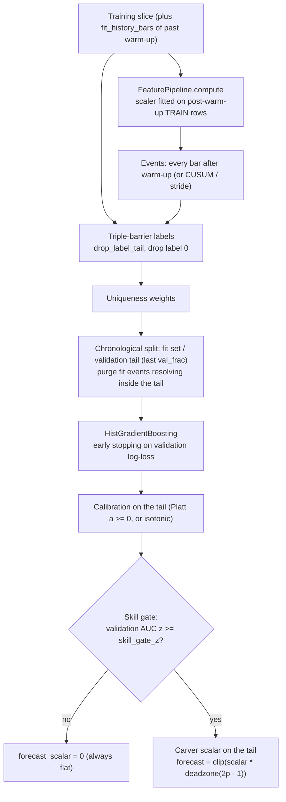
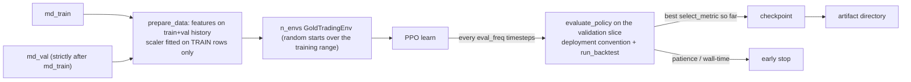

# Machine learning and reinforcement learning

Aurum has three learned strategies that go beyond the rule-based catalogue in
[strategies.md](strategies.md). `ml_gbm` is a calibrated gradient-boosted direction
classifier. `meta_label` sizes the bets of a primary rule with a second classifier.
`rl_ppo` is a PPO policy trained on the same simulator, sizer and risk manager used
everywhere else. They share one set of defences against the usual ways machine learning
fools itself on financial data: forward-looking labels that stay inside the training slice,
overlap-aware sample weights, a purged time-ordered validation tail, and a **skill gate**
that keeps a model flat unless it beats a coin flip on validation data. Be clear about the
outcome before you start. In the pre-registered walk-forward, `ml_gbm` failed its skill gate
in every fold and never traded, `meta_label` showed no demonstrated edge, and `rl_ppo` has
not been evaluated under the protocol at all. See [RESULTS.md](RESULTS.md).

**On this page**

- [Triple-barrier labels](#triple-barrier-labels)
- [Overlapping labels and uniqueness weights](#overlapping-labels-and-uniqueness-weights)
- [`ml_gbm`: direction classifier](#ml_gbm-direction-classifier)
- [`meta_label`: meta-labelling a primary](#meta_label-meta-labelling-a-primary)
- [Parameters of the ML strategies](#parameters-of-the-ml-strategies)
- [Warm-up history: `fit_history_bars`](#warm-up-history-fit_history_bars)
- [Stacking-leak protection for trainable primaries](#stacking-leak-protection-for-trainable-primaries)
- [RL environment: `GoldTradingEnv`](#rl-environment-goldtradingenv)
- [PPO training](#ppo-training)
- [The `rl_ppo` strategy adapter](#the-rl_ppo-strategy-adapter)
- [What the evidence says](#what-the-evidence-says)
- [Tests that guard these components](#tests-that-guard-these-components)

The ML strategies need scikit-learn and SciPy, which are core dependencies. RL needs the
optional extra: `pip install -e ".[rl]"` (torch, gymnasium, stable-baselines3).
`import aurum.rl` and `import aurum.strategies.rl` import neither torch nor
stable-baselines3; they are loaded only when a policy is trained or run.

---

## Triple-barrier labels

Module `aurum/labels/triple_barrier.py`, following López de Prado, *Advances in Financial
Machine Learning* (AFML, 2018), ch. 3.

> [!WARNING]
> **Every label looks into the future by construction.** A label for the event at bar `t`
> is a function of bars `t+1 .. t1`. Labels are training targets only. They may be
> computed inside a strategy's `fit()` on the training slice it was given, and nowhere
> else. Never join a label, or anything derived from one (`ret`, `t1`, `barrier_hit`,
> uniqueness weights), onto features, forecasts, sizing or risk inputs.

**Barriers.** For an event at the close of bar `t`, with entry price `close[t]` and a
volatility target `trgt[t]` known at `t`:

| Barrier | Level |
|---|---|
| Upper | `entry * exp(+u * trgt[t])` |
| Lower | `entry * exp(-d * trgt[t])` |
| Vertical | `max_holding_bars` bars after the event |

Without a side, `u = pt_mult` and `d = sl_mult`; touching the upper barrier gives +1 and the
lower -1. With a side (meta-labelling), the profit-take `pt_mult` lies in the direction of
the bet and the stop `sl_mult` against it; labels are +1 (profit-take first), -1 (stop
first) or 0 (vertical). A multiplier of `None`, `0` or `inf` disables that barrier.

**Touches** are detected on the high and low of each following bar. A close-only check would
miss intrabar stops and be optimistic. Because the path inside a bar is unknown:

- If a bar **opens** beyond a barrier (a gap), that barrier was hit first, at the open.
- If both barriers lie inside one bar's range (**both touched**), the conservative
  convention of the execution simulator applies: with a side, the **stop is assumed first**
  (label -1). Without a side there is no "stop", so the event is labelled 0 with
  `barrier_hit="ambiguous"`.

**Exit price** is the barrier level (or the gapped open) for a horizontal touch, and the
close of the vertical-barrier bar otherwise. `ret = side * ln(exit / entry)`.
`vertical_label="zero"` labels timeouts 0; `"sign"` labels them with the sign of `ret` (0
when `|ret| <= min_ret`).

**The end of the data.** An event whose vertical barrier lies beyond the last bar, and that
has not touched a horizontal barrier by then, is undecided. It is dropped by default
(`drop_incomplete=True`) or kept with a NaN label and `barrier_hit="incomplete"`. The
functions never read past the frame they are given. `drop_label_tail(labels, n_bars,
max_holding_bars)` goes further and removes **every** event that starts within
`max_holding_bars` of the end, not just the unresolved ones. Otherwise only fast barrier
touches would survive near the end, a selection bias.

**Positions and purging.** `t_idx` and `t1_idx` are integer positions in the bars frame;
`t_event` and `t1` are the matching bar open times, and the label frame is indexed by
`t_event`. A label's outcome is known at `bars["available_at"].iloc[t1_idx]`.
`label_end_positions(labels, n_bars)` gives the per-bar label end used by the purged
splitters in `aurum.research.splits` (see [research.md](research.md)).

Other helpers: `ewm_vol` (causal per-bar EWM standard deviation of log returns, AFML 3.1),
`cusum_filter` (symmetric CUSUM event sampler, AFML 2.4), `get_events` and
`apply_triple_barrier` (the two-step AFML API), `fixed_horizon_labels` (sign of the
vol-normalised `h`-bar forward return, with a dead band) and `meta_labels`.

```python
import numpy as np
import pandas as pd

from aurum.data.synthetic import make_synthetic_bars
from aurum.labels import (
    average_uniqueness, drop_label_tail, ewm_vol, label_end_positions, meta_labels,
    triple_barrier_labels, uniqueness_weights,
)

bars = make_synthetic_bars(2000, "H1", seed=4)
h = 24
vol = ewm_vol(bars["close"], span=100) * np.sqrt(h)   # 1 sigma of a 24-bar move, known at t

# No side: upper barrier -> +1, lower -> -1, vertical -> sign of the return
labels = triple_barrier_labels(bars, pt_mult=1.0, sl_mult=1.0, max_holding_bars=h,
                               vol=vol, vertical_label="sign")
labels = drop_label_tail(labels, len(bars), h)        # purge events that could reach the end
cols = ["label", "ret", "barrier_hit", "t_idx", "t1_idx", "holding_bars"]
print(labels[cols].iloc[40:44].round(5).to_string())
print(labels["barrier_hit"].value_counts().to_dict())

# With a side (meta-labelling): PT in the bet's direction, SL against it
side = pd.Series(np.where(np.arange(len(bars)) % 2 == 0, 1.0, -1.0), index=bars.index)
meta = triple_barrier_labels(bars, pt_mult=1.0, sl_mult=1.0, max_holding_bars=h,
                             vol=vol, side=side)
y = meta_labels(meta, vertical="return_sign")         # 1 = PT first (or timeout in profit)
print(meta["barrier_hit"].value_counts().to_dict(), "success rate", round(y.mean(), 3))

# Overlap: average uniqueness (AFML ch. 4) and per-bar label ends for purged splits
u = average_uniqueness(labels, n_bars=len(bars))
print(f"avg uniqueness: mean {u.mean():.3f}, min {u.min():.3f}, max {u.max():.3f}")
w = uniqueness_weights(labels, n_bars=len(bars))      # same, normalised to mean 1
le = label_end_positions(labels, len(bars))
print("label_end[200:203] =", le[200:203].tolist())
```

```text
                           label      ret barrier_hit  t_idx  t1_idx  holding_bars
time                                                                              
2020-01-08 17:00:00+00:00   -1.0 -0.00904          sl     65      80            15
2020-01-08 18:00:00+00:00   -1.0 -0.00906          sl     66      90            24
2020-01-08 19:00:00+00:00   -1.0 -0.00916          sl     67      80            13
2020-01-08 20:00:00+00:00   -1.0 -0.00912          sl     68      90            22
{'pt': 719, 'vertical': 628, 'sl': 604}
{'sl': 669, 'pt': 657, 'vertical': 628} success rate 0.501
avg uniqueness: mean 0.065, min 0.042, max 0.238
label_end[200:203] = [221, 222, 208]
```

Without a side, `barrier_hit` still says `"pt"` or `"sl"`, meaning the upper or lower
barrier. A 24-bar label can resolve on its 24th bar by a barrier touch (row `t_idx=66`)
rather than at the vertical barrier.

## Overlapping labels and uniqueness weights

Triple-barrier labels overlap in time. With an event on every bar and a 24-bar horizon, each
bar's return is shared by many labels, so treating them as independent over-weights long,
overlapping episodes and inflates the apparent sample size (AFML ch. 4).

- **Concurrency** `c_t` is the number of labels whose return span `(t_idx, t1_idx]` covers
  bar `t`.
- **Average uniqueness** of label `i` is the mean of `1 / c_t` over its span, in `(0, 1]`.
  In the example above it averages 0.065: the 1,951 labels sum to about 126, the
  "effective" number of independent observations that the skill gate uses.
- `sample_weight` in the ML strategies chooses the weighting: `"uniqueness"` (default),
  `"return_attribution"` (`|sum r_t / c_t|` over the span, AFML 4.10),
  `"uniqueness_x_return"` or `"none"`. `time_decay` < 1 adds AFML 4.11 piecewise-linear
  decay (1 = no decay; negative values zero the oldest fraction). Weights are normalised to
  mean 1.

Uniqueness also drives the skill gate's effective sample size, described next.

---

## `ml_gbm`: direction classifier

Module `aurum/strategies/ml.py`, class `MLGBMStrategy`, registered as `ml_gbm`
(trainable).

**Rationale.** Gold's short-horizon direction is close to a random walk, but weak,
state-dependent regularities may exist: trend persistence in calm regimes, reversal after
stretched moves, session and event effects, macro co-movement. A tree ensemble can combine
many such weak, non-linear effects that single rules express one at a time. Whether it finds
anything real is decided by the validation tail and the skill gate, not assumed.



### Features

`ml_gbm` builds and fits its **own** `FeaturePipeline` on every training slice (the
`features.enabled: auto` default in the configs). Groups default to `DEFAULT_PRICE_GROUPS`:
`returns`, `trend`, `momentum`, `meanrev`, `range`, `volatility`, `microstructure`,
`session`, `mtf` and `regime`. `macro` is added when the fit-time `MarketData` has macro
frames (and `include_macro` is true), and `calendar` when it has events (and
`include_calendar` is true). The robust scaler is fitted on post-warm-up training rows only.
The groups and their look-backs are documented in [features.md](features.md).

- `feature_groups` replaces the group list; `feature_overrides` passes group parameters.
- `drop_features` is a list of regex patterns of columns to exclude. Use it for level-type
  features (for example long-window z-scores of macro levels) that can act as time stamps
  and let the trees memorise regimes of overlapping labels.
- `primary_features` adds other strategies' forecasts as feature columns
  `primary_<name>`.
- A strategy fitted on externally supplied `features` must be given them at `generate`
  time too; leading NaNs of external features are treated as warm-up, and such rows are
  never events and forecast 0.

### Target and events

- `target="triple_barrier"` (default): symmetric barriers of `pt_mult` = `sl_mult` = 1.0
  times the barrier unit, `max_holding_bars` = 24, `vertical_label="sign"`. With
  `barrier_vol="horizon"` the unit is `ewm_vol(span=vol_span) * sqrt(max_holding_bars)`
  (one sigma of the full horizon); `"bar"` uses the per-bar sigma.
- `target="fixed_horizon"`: the sign of the vol-normalised `max_holding_bars` forward return,
  with a dead band `fixed_threshold`.
- Labels equal to 0 (ambiguous bars, dead band) are dropped. The target is binary: up vs
  down.
- Events are every bar after the warm-up whose features are all defined
  (`event_filter="all"`), or bars picked by a CUSUM filter at `cusum_mult` × `ewm_vol`
  (`"cusum"`), thinned by `event_stride`.
- `drop_label_tail` removes every event that starts within `max_holding_bars` bars of the
  end of the training slice, so no label resolves after the slice ends. `label_horizon` (= `max_holding_bars`) is read by the
  walk-forward engine, whose purge between train and test is never shorter than it.

### Classifier, validation tail and calibration

`CalibratedGBM` wraps scikit-learn's `HistGradientBoostingClassifier`.

1. Events are kept in chronological order. The last `val_frac` (20%) form the **validation
   tail**, never shuffled. Fit-set events whose label resolves at or after the first
   validation event minus `embargo_bars` are **purged**, so the tail is a genuine
   pseudo-out-of-sample block.
2. **Class balance** (`class_weight="balanced"` for `ml_gbm`) is applied separately within
   the fit set and within the tail, so `p = 0.5` means "no conditional information" and
   neither the model nor the calibrator can simply bet on a period's drift.
3. **Early stopping.** The model is fitted with `max_iter` trees; the iteration with the
   lowest weighted validation log-loss is chosen, and the model is refitted with that many
   trees (same seed, identical trees).
4. **Calibration** on the tail. Platt scaling on the logit of the raw probability,
   `p = sigmoid(a * logit(p_raw) + b)`, with `a` constrained to `[0, 50]`: calibration can
   shrink a signal but never flip it. `"isotonic"` (non-decreasing) and `"none"` are the
   alternatives.
5. At least `min_train_events` (200) events before the tail and a tail of at least
   `max(20, min_train_events // 10)` events are required, with both classes present in the
   fit set and in the tail. Otherwise `fit` raises `ValueError`.

Model defaults (`CalibratedGBM.DEFAULT_MODEL`, override any of them through the `model`
parameter):

| Key | Default |
|---|---|
| `max_iter` | 300 |
| `learning_rate` | 0.05 |
| `max_leaf_nodes` | 15 |
| `max_depth` | 4 |
| `min_samples_leaf` | 200 |
| `l2_regularization` | 1.0 |
| `max_features` | 0.5 |
| `max_bins` | 255 |

`class_weight`, `early_stopping`, `random_state`, `validation_fraction` and
`n_iter_no_change` are managed by `CalibratedGBM` and are rejected inside `model`.

### Forecast mapping and the skill gate

- `f = 2p - 1` from the calibrated probability.
- A continuous dead zone, `sign(f) * max(|f| - dead_zone, 0) / (1 - dead_zone)`
  (`dead_zone=0.02`), so coin flips produce no churn and the map has no jump.
- A **Carver scalar**, fixed at fit time, makes the average absolute forecast on the
  validation tail equal `target_abs_forecast` (0.5), capped at `max_forecast_scalar` (20).
  The result is clipped to `[-1, 1]`.
- **The skill gate.** Carver scaling normalises any forecast's average size, so it would
  blow pure noise up to full size. The gate prevents that. Under "no skill" the AUC has
  variance `(n1 + n0 + 1) / (12 n1 n0)` (Hanley & McNeil 1982). Overlapping labels are not
  independent, so `n` is the **effective** size of the tail: the sum of its labels' average
  uniqueness. Unless `z = (AUC - 0.5) / se >= skill_gate_z` (2.0), the scalar is set to 0
  and the strategy is flat until its next refit. `skill_gate_z=None` disables the gate. The
  same tail also chose the iteration count and the calibration, so the test is mildly
  optimistic: it is a guard against sizing up noise, not a proof of skill.

This is why the model abstains so often. On a driftless random walk:

```python
import logging

from aurum.core.types import MarketData
from aurum.data.synthetic import make_synthetic_bars
from aurum.strategies import get_strategy

logging.basicConfig(level=logging.WARNING, format="%(levelname)s %(name)s: %(message)s")

bars = make_synthetic_bars(8000, "H1", seed=11)            # driftless random walk: no edge
train = MarketData(bars=bars.iloc[:6000])
full = MarketData(bars=bars)

gbm = get_strategy("ml_gbm", feature_groups=("returns", "momentum", "volatility"),
                   importance_repeats=2)
gbm.fit(train)                                             # TRAINING slice only
rep = gbm.fit_report_
for k in ("n_labels", "n_fit", "n_val", "n_purged_before_val", "best_iter", "val_auc",
          "val_n_eff", "val_auc_z", "skill_gate_passed", "forecast_scalar"):
    v = rep[k]
    print(f"{k:22s} {round(v, 4) if isinstance(v, float) else v}")
f = gbm.generate(full)
print("non-zero forecasts:", int((f != 0).sum()))
print(gbm.importance_by_group().round(4).to_dict())
```

```text
WARNING aurum.strategies.ml: ml_gbm: validation AUC 0.5003 (z=0.00, n_eff=75) below the skill gate z >= 2.0 - forecasts will be zero
n_labels               5495
n_fit                  4373
n_val                  1099
n_purged_before_val    23
best_iter              2
val_auc                0.5003
val_n_eff              74.7402
val_auc_z              0.0049
skill_gate_passed      False
forecast_scalar        0.0
non-zero forecasts: 0
{'volatility': 0.0001, 'returns': 0.0, 'momentum': -0.0254}
```

The validation tail holds 1,099 events but only about 75 effectively independent ones, so
the AUC has to be well above 0.5 to pass. The three small feature groups keep the example
fast; the default groups include `regime`, whose 5,820-bar look-back needs about a year of
H1 history before the first event.

### Feature importances and reports

With `importance="permutation"` (default), `fit` computes the mean drop in validation AUC
when each feature is permuted (Breiman 2001), on up to `importance_max_rows` rows of the
tail with `importance_repeats` repeats. On noise these values hover around zero and can be
negative, as above.

| Attribute / method | Content |
|---|---|
| `feature_importances_` | Per-column permutation importance, sorted. |
| `importance_by_group()` | Importances summed by column prefix (feature family). |
| `fit_report_` | Label counts, `barrier_counts`, `mean_holding_bars`, `n_fit` / `n_val` / `n_purged_before_val`, `best_iter`, `fit_auc` / `val_auc`, log-losses (base, model, calibrated), calibration parameters, gate statistics (`val_n_eff`, `val_auc_se`, `val_auc_z`, `skill_gate_passed`), `forecast_scalar`, `val_abs_forecast`, `val_frac_active`, `first_event_bar`. |
| `explain(top=15)` | JSON-serialisable summary: params, model, fit report, top features and group importances. |
| `predict_proba(md)` | Calibrated `P(up)` per bar (NaN in the warm-up), for diagnostics. |

A large gap between `fit_auc` and `val_auc` is the usual sign of memorisation. Features
that dominate the importances while `val_auc` stays near 0.5 are candidates for
`drop_features`.

`fit` is **transactional**: it runs on a fresh instance and commits only on success, so a
failed refit leaves the previous model intact and self-consistent. In a walk-forward run a
fit that raises follows `walkforward.on_strategy_error` (`raise` by default, or `drop`).

---

## `meta_label`: meta-labelling a primary

Class `MetaLabelStrategy`, registered as `meta_label` (trainable). AFML 3.6 and ch. 10.

**Rationale.** A simple primary model decides the **side**; a secondary classifier learns
**when** the primary is likely to be right (for example trend signals in calm, trending
regimes) and sizes the bet. The meta-model never reverses the primary.

**Labels.** Events are bars where the primary takes a side (`|forecast| > min_primary_abs`)
after the warm-up (`event_filter`: `"all"`, `"cusum"`, or `"flip"` = only bars where the
side changes). Each event gets a side-aware triple-barrier label. The target is 1 if the
profit-take was hit first and 0 if the stop was. Timeouts count as a success when the bet's
return is positive (`meta_vertical="return_sign"`, AFML `getBins`, the default). The strict
alternative `"fail"` (timeout = 0) is available, but it makes the label partly a
"barrier-touch" indicator that is predictable from the volatility state and weekend gaps
even on a random walk, without any directional edge. Events without a usable label are dropped.

**Features** are the same own-pipeline features as `ml_gbm`, plus `meta_primary_forecast`
and `meta_primary_side`. `class_weight` defaults to `None` here, because bet sizing needs
true success probabilities.

**Bet sizing** (AFML snippets 10.1 and 10.3):

1. `z = (p - 1/2) / sqrt(p (1 - p))`, `m = 2 Phi(z) - 1`, set to 0 when `p < p_threshold`
   (and never negative).
2. A Carver scalar, fitted on the un-discretised validation bets, targets an average size
   of `target_abs_forecast`. The skill gate applies exactly as for `ml_gbm`.
3. The size is clipped to `[0, 1]` and rounded to multiples of `step_size` (0.1) to avoid
   trading on tiny probability changes.
4. `forecast = sign(primary) * size`, optionally times `|primary forecast|`
   (`scale_by_primary=True`).

`primary` accepts a registered name, a `(name, params)` pair, a `Strategy` class or an
instance; `primary_params` are merged in. The default is `tsmom`.

The next example shows the gate doing its job. The Platt slope collapses to 0 on noise, so
the calibrated probability is a constant. With the gate on, the forecast is 0. With it off,
the Carver scalar inflates that constant into a 0.5 bet on every primary signal:

```python
import logging

from aurum.core.types import MarketData
from aurum.data.synthetic import make_synthetic_bars
from aurum.strategies import get_strategy
from aurum.strategies.ml import bet_size_from_probability, discretize_bet

logging.basicConfig(level=logging.WARNING, format="%(levelname)s %(name)s: %(message)s")

bars = make_synthetic_bars(8000, "H1", seed=11)            # driftless random walk: no edge
train, full = MarketData(bars=bars.iloc[:6000]), MarketData(bars=bars)
common = dict(primary="ema_cross", feature_groups=("returns", "momentum", "volatility"),
              importance="none")

for gate in (2.0, None):                                   # default gate, then gate OFF
    meta = get_strategy("meta_label", skill_gate_z=gate, **common).fit(train)
    r = meta.fit_report_
    cal = r["calibration_params"]
    f = meta.generate(full).iloc[6000:]
    print(f"skill_gate_z={gate}: val_auc={r['val_auc']:.3f} z={r['val_auc_z']:.2f} "
          f"best_iter={r['best_iter']} platt_a={cal['a']:.2f} scalar={r['forecast_scalar']:.2f} "
          f"mean|f| after train={f.abs().mean():.3f}")

for p in (0.50, 0.55, 0.60, 0.70):                        # AFML bet size, then 0.1 steps
    m = float(bet_size_from_probability(p))
    print(f"p={p:.2f} -> m={m:.3f} -> {float(discretize_bet(m, 0.1)):.1f}")
```

```text
WARNING aurum.strategies.ml: meta_label: validation AUC 0.4607 (z=-0.58, n_eff=75) below the skill gate z >= 2.0 - forecasts will be zero
skill_gate_z=2.0: val_auc=0.461 z=-0.58 best_iter=1 platt_a=0.00 scalar=0.00 mean|f| after train=0.000
skill_gate_z=None: val_auc=0.461 z=-0.58 best_iter=1 platt_a=0.00 scalar=5.38 mean|f| after train=0.500
p=0.50 -> m=0.000 -> 0.0
p=0.55 -> m=0.080 -> 0.1
p=0.60 -> m=0.162 -> 0.2
p=0.70 -> m=0.337 -> 0.3
```

Do not switch the gate off for real research. The tests do so only to exercise code paths on
synthetic data.

---

## Parameters of the ML strategies

Shared by `ml_gbm` and `meta_label` (from `_MLStrategyBase.default_params()`):

| Parameter | Default | Meaning |
|---|---|---|
| `primary_oos_frac` | `0.5` | Trainable primaries are fitted on this leading fraction of the training slice; see [below](#stacking-leak-protection-for-trainable-primaries). Must be in `[0, 1)`. |
| `feature_groups` | `None` | `None` = `DEFAULT_PRICE_GROUPS` (+ `macro` / `calendar` when available). |
| `feature_overrides` | `{}` | Per-group parameter overrides for the pipeline. |
| `drop_features` | `()` | Regex patterns of raw feature columns to exclude. |
| `include_macro` | `True` | Add the `macro` group when `md.macro` is present. |
| `include_calendar` | `True` | Add the `calendar` group when `md.events` is present. |
| `scaler` | `"robust"` | Pipeline scaler. |
| `max_holding_bars` | `24` | Vertical barrier / label horizon (bars). Also the walk-forward purge floor. |
| `pt_mult` | `1.0` | Profit-take (upper) barrier width in barrier units. |
| `sl_mult` | `1.0` | Stop (lower) barrier width in barrier units. |
| `barrier_vol` | `"horizon"` | Barrier unit: per-bar sigma × `sqrt(max_holding_bars)` (`"horizon"`) or per-bar sigma (`"bar"`). |
| `vol_span` | `100` | Span of `ewm_vol`. |
| `event_filter` | `"all"` | `"all"`, `"cusum"`; `meta_label` also accepts `"flip"`. |
| `cusum_mult` | `2.0` | CUSUM threshold in multiples of `ewm_vol`. |
| `event_stride` | `1` | Keep every n-th event. |
| `sample_weight` | `"uniqueness"` | `"uniqueness"`, `"return_attribution"`, `"uniqueness_x_return"` or `"none"`. |
| `time_decay` | `1.0` | AFML 4.11 `last_weight`, in `(-1, 1]`; 1 = no decay. |
| `model` | `{}` | Overrides of `CalibratedGBM.DEFAULT_MODEL`. |
| `val_frac` | `0.2` | Size of the chronological validation tail. |
| `embargo_bars` | `0` | Extra purge between fit set and tail. |
| `early_stopping` | `True` | Choose the tree count on the tail. |
| `calibration` | `"platt"` | `"platt"`, `"isotonic"` or `"none"`. |
| `min_train_events` | `200` | Minimum fit-set events. |
| `importance` | `"permutation"` | `"permutation"` or `"none"`. |
| `importance_repeats` | `3` | Permutation repeats. |
| `importance_max_rows` | `5000` | Row cap for permutation importance. |
| `target_abs_forecast` | `0.5` | Carver target for the average absolute forecast or bet. |
| `max_forecast_scalar` | `20.0` | Cap on the Carver scalar. |
| `skill_gate_z` | `2.0` | Minimum validation-AUC z-score; `None` disables the gate. |
| `seed` | `0` | Model seed. In a config run it is set to the config's top-level `seed` unless you give one. |
| `n_threads` | `None` | OpenMP thread cap for the model (via `threadpoolctl`). |

`ml_gbm` only:

| Parameter | Default | Meaning |
|---|---|---|
| `target` | `"triple_barrier"` | Or `"fixed_horizon"`. |
| `fixed_threshold` | `0.0` | Dead band on the normalised return for `fixed_horizon`. |
| `primary_features` | `()` | Strategies whose forecasts become feature columns. |
| `class_weight` | `"balanced"` | Or `None`. |
| `dead_zone` | `0.02` | Continuous dead zone on `2p - 1`, in `[0, 1)`. |

`meta_label` only:

| Parameter | Default | Meaning |
|---|---|---|
| `primary` | `"tsmom"` | Name, `(name, params)`, class or instance. |
| `primary_params` | `{}` | Merged into the primary's parameters. |
| `min_primary_abs` | `0.0` | The absolute primary forecast must exceed this to count as a bet. |
| `meta_vertical` | `"return_sign"` | Or `"fail"` (timeouts are failures). |
| `p_threshold` | `0.5` | No bet when `P(success)` is below this. |
| `step_size` | `0.1` | Bet discretisation; 0 disables it. |
| `scale_by_primary` | `False` | Also multiply the bet size by the absolute primary forecast (capped at 1). |
| `class_weight` | `None` | Keep true success probabilities. |

Unlike the rule-based strategies, `ml_gbm` and `meta_label` do **not** reject unknown
parameter names: a misspelt key is silently ignored. Option values (for example
`event_filter`, `calibration`) are validated at the start of `fit`, before any expensive
work.

## Warm-up history: `fit_history_bars`

The default feature groups need 5,820 H1 bars (about a year, set by the `regime` group)
before every column is defined. Without help, a rolling 3-year training window would lose a
third of itself to warm-up.

`Strategy.fit_history_bars` (default 0) declares how many bars **before** the training
window `fit` may receive purely for feature warm-up. The ML strategies return their
`warmup_bars` when they compute their own features (0 when they are given external
features, which arrive warmed up). The walk-forward engine prepends that many past bars to
the fit slice, and `train-final` does the same. Events still start only once every feature
is defined, which is then the start of the training window, and every label still resolves
inside the fit slice.

This is not leakage: the extra bars are strictly older than every test row.
`tests/test_fit_history.py` checks that the fit slice can reach back but never includes a
bar at or after the fold's test start. The purge between the training and test blocks is
described in [research.md](research.md).

## Stacking-leak protection for trainable primaries

A trainable primary (`meta_label`'s `primary`, or an entry in `ml_gbm`'s
`primary_features`, for example `intraday_seasonality`) would otherwise be fitted on the very
bars being labelled. Its in-sample forecasts are over-fitted, and the second-stage model
would learn to trust them far more than their out-of-sample quality warrants. This is the
stacking leak of Wolpert (1992).

With `primary_oos_frac=0.5` (default) such a primary is fitted on the first half of the
training slice only, and the ML model learns only from events after that point, where the
primary's forecasts are out of sample. `primary_oos_frac=0` restores in-sample fitting and
logs a warning. Non-trainable primaries such as `tsmom` are unaffected.

---

## RL environment: `GoldTradingEnv`

Module `aurum/rl/env.py`, a gymnasium environment built on the shared execution stack. The
module docstring explains why it replaced the legacy environment, which let observations
see bar `t+1`, compounded shaped rewards into "equity", and only ever sampled the first 20k
bars.

**One simulator.** Every step runs the same chain as `aurum.backtest.engine.run_backtest`:
forecast → `VolTargetSizer` → optional `StandardRiskManager` (reduce-only) →
`ExecutionSimulator`. Costs (spread, slippage, commission, overnight financing) are the
engine's. The equity path of an evaluation rollout is identical to the engine's for the same
forecast series (`tests/test_rl_env.py`). See
[execution-and-costs.md](execution-and-costs.md) and
[portfolio-and-risk.md](portfolio-and-risk.md).

**Observation** at decision bar `t`:

- the flattened feature rows `t - window + 1 .. t` of a transformed `FeaturePipeline` frame
  (scaler fitted on training rows only). Warm-up rows are never observed; later NaNs become
  0, the neutral scaled median;
- four agent-state entries, computed at the close of `t`:

| Entry | Meaning |
|---|---|
| `state_position` | Current lots divided by the lots a +1 forecast would get now (clipped to ±1.5). |
| `state_upnl_vol` | Unrealised log return of the open position vs its average entry, in daily-vol units (clipped to ±5). |
| `state_time_in_trade` | `log1p(bars held) / log1p(trade_time_norm)` (capped at 2). |
| `state_drawdown` | Drawdown from the episode's equity peak × 10 (capped at 5). |

The whole vector is clipped to `±obs_clip`.

**Actions.** `"discrete"` (default): an index into `action_levels`, default
`(-1.0, -0.5, 0.0, 0.5, 1.0)`. `"continuous"`: a `Box[-1, 1]` forecast. The action decided
on the observation at the close of `t` fills at the **open of `t+1`**, and its reward is
realised over bar `t+1`.

**Reward is not equity.**

```text
reward = reward_scale * ln(E_{t+1} / E_t)
       - dd_penalty * reward_scale * max(0, DD_{t+1} - DD_t)
       - turnover_penalty * |lots traded| / lots of a +1 forecast
```

The log-growth term sums to the episode's log return (the growth-optimal criterion). The
drawdown term penalises only *increases* in drawdown. The turnover term is a cost prior on
top of the simulated costs. Shaping never touches the simulator: `info` carries the true
equity, PnL, cost breakdown and each reward component separately.

**Episodes.** In training mode (`random_start=True`) each episode starts uniformly at random
over the whole eligible range, after the feature warm-up, using the env's seeded
`np_random`, and lasts `episode_length` decisions. An episode **terminates** on ruin
(bankruptcy, or equity at or below `min_equity_frac` of the episode's starting equity) or on
a risk-manager kill switch when `terminate_on_halt=True`. A transient daily-loss halt (the
env's default risk limits set `daily_loss_persistent=False`) does not end it. An episode is
**truncated** at the end of the range or after `episode_length` steps.

**Risk limits in the env** are `RiskLimits` defaults with `daily_loss_persistent=False`, so
the 20% max-drawdown kill switch is active and ends the episode. This differs from the
research risk section of `default.yaml`, which sets `max_drawdown: null`.

**Financing** uses `CostModel` defaults: rate-based, Fed funds plus markup, read point in
time at each rollover from `rates=` (the training code passes `md.macro`). Without a
`fedfunds` series every rollover uses the 3% fallback and the simulator logs a warning, as in
the example below.

```python
from aurum.core.types import MarketData
from aurum.data.synthetic import make_synthetic_bars
from aurum.features.pipeline import FeaturePipeline
from aurum.rl.env import STATE_NAMES, EnvConfig, GoldTradingEnv

bars = make_synthetic_bars(3000, "H1", seed=0)
md = MarketData(bars=bars)
n_train = 2000

pipe = FeaturePipeline(groups=["returns", "volatility"])
raw = pipe.compute(md)
pipe.fit(raw.iloc[pipe.max_lookback:n_train])             # scaler statistics: TRAIN rows only
x = pipe.transform(raw)

cfg = EnvConfig(window=4, episode_length=256)
env = GoldTradingEnv(bars, x, cfg, end=n_train - 1, random_start=True)
print("obs:", env.observation_space.shape, "=", cfg.window, "x", env.n_features, "+", len(STATE_NAMES))
print("actions:", env.action_space, "->", cfg.action_levels)

obs, info = env.reset(seed=42)                            # random start inside the train range
print("episode starts at bar", info["bar"], "with equity", info["equity"])
for action in (4, 4, 2):                                  # +1, +1, then flat
    obs, reward, terminated, truncated, info = env.step(action)
    print(f"decide@{info['decision_bar']} fill@{info['bar']}: forecast {info['forecast']:+.1f} "
          f"lots {info['approved_lots']:+.2f} equity {info['equity']:,.2f} "
          f"reward {reward:+.4f} growth {info['reward_components']['growth']:+.4f}")
print("cost keys:", sorted(info["costs"]))
print("agent state:", {k: round(float(v), 3) for k, v in zip(STATE_NAMES, obs[-4:])})
```

```text
rate financing: no 'fedfunds' series supplied (md.macro / rates=); every rollover uses fallback_rate=0.0300
obs: (120,) = 4 x 29 + 4
actions: Discrete(5) -> (-1.0, -0.5, 0.0, 0.5, 1.0)
episode starts at bar 595 with equity 100000.0
decide@595 fill@596: forecast +1.0 lots +0.40 equity 99,851.00 reward -0.1491 growth -0.1491
decide@596 fill@597: forecast +1.0 lots +0.40 equity 99,634.37 reward -0.2172 growth -0.2172
decide@597 fill@598: forecast +0.0 lots +0.00 equity 99,624.73 reward -0.0097 growth -0.0097
cost keys: ['commission', 'slippage', 'spread', 'swap']
agent state: {'state_position': 0.0, 'state_upnl_vol': 0.0, 'state_time_in_trade': 0.0, 'state_drawdown': 0.038}
```

`EnvConfig` (JSON round-trippable via `to_dict` / `from_dict`; unknown keys are rejected):

| Field | Default | Meaning |
|---|---|---|
| `window` | `4` | Feature rows per observation. |
| `action_mode` | `"discrete"` | `"discrete"` or `"continuous"`. |
| `action_levels` | `(-1.0, -0.5, 0.0, 0.5, 1.0)` | Forecast levels of the discrete action space (at least 2, within `[-1, 1]`). |
| `episode_length` | `1024` | Decisions per training episode. |
| `reward_scale` | `100.0` | Multiplier of the per-step log growth (1% = 1.0). |
| `dd_penalty` | `0.0` | Weight of drawdown increases. |
| `turnover_penalty` | `0.0` | Reward units per full position traded. |
| `initial_equity` | `100000.0` | Equity at every episode start (USD). |
| `sizer` | `{"target_vol": 0.10, "max_leverage": 2.0, "rebalance_band": 0.10}` | `VolTargetSizer` keyword arguments. |
| `risk` | `{"daily_loss_persistent": False}` | `RiskLimits` keyword arguments, or `None` for no risk manager. |
| `costs` | `{}` | `CostModel` keyword arguments (`{}` = defaults, including rate-based financing). |
| `vol_halflife` | `48.0` | Half-life (bars) of the causal EWMA vol used by the sizer (the engine's default). |
| `min_equity_frac` | `0.5` | Ruin threshold as a fraction of the episode's starting equity. |
| `terminate_on_halt` | `True` | End the episode on a kill switch. |
| `obs_clip` | `10.0` | Observation clip. |
| `trade_time_norm` | `240` | Bars at which `state_time_in_trade` reaches 1. |
| `episode_anchor` | `"M"` | For deterministic rollouts (validation, `rl_ppo`): start a fresh episode at the first bar of each `"W"`, `"M"` or `"Q"` period; `None` = one continuous account. |

## PPO training

Module `aurum/rl/train.py`, using stable-baselines3 PPO (Schulman et al. 2017) with an
`MlpPolicy`.



1. `md_train` and `md_val` must be time-ordered and non-overlapping. They are concatenated
   only to give the validation slice its feature and volatility warm-up. The pipeline's
   scaler is fitted on training rows only.
2. `n_envs` training environments (`DummyVecEnv`) sample random fixed-length episodes over
   the whole training range. `VecNormalize` normalises rewards only
   (`normalize_reward=True`).
3. Every `eval_freq` environment timesteps, `evaluate_policy` rolls the **deterministic**
   policy through the validation slice with the same convention the deployed `rl_ppo`
   strategy uses (fresh episodes at `episode_anchor`, kill switches restart the simulated
   account). It starts one anchor period early so the forecasts match exactly. The forecast
   series is then backtested with the real engine (same sizer, risk limits, costs and vol)
   and scored with the standard metrics. A parity diagnostic checks that the engine
   reproduces the simulated account to the cent.
4. The checkpoint with the best `select_metric` (default `"sharpe"`, the validation daily
   Sharpe) is kept. Training stops after `patience` evaluations without an improvement of
   more than `min_delta`, or when `max_wall_time_s` is reached.

> [!CAUTION]
> **Selection bias.** Choosing the best of `K` validation evaluations inflates the
> validation Sharpe (Bailey & López de Prado 2014). `metrics.json` records `n_evals` so the
> figure can be deflated (`aurum.research.stats.sharpe_summary(..., n_trials=n_evals)`), and
> it carries a note saying so. A clean out-of-sample test needs data after the validation
> slice.

### `aurum rl train`

```bash
aurum rl train --help
```

```text
usage: aurum rl train [-h] --config CONFIG [--set KEY=VALUE]

options:
  -h, --help            show this help message and exit
  --config CONFIG, -c CONFIG
                        YAML config file (see configs/)
  --set KEY=VALUE       override a config value, e.g. --set
                        walkforward.test=3M (repeatable)
```

It reads the `rl` section of the config and the data from the `data` section (bars, macro and
events):

| Key | `default.yaml` | Meaning |
|---|---|---|
| `rl.train_start` | `"2013-01-01"` | First training bar (`null` = start of the data). |
| `rl.train_end` | `"2019-12-31"` | Last training day (inclusive). |
| `rl.val_end` | `"2021-12-31"` | Validation runs from the day after `train_end` to this day (inclusive). |
| `rl.out_dir` | `runs/rl/ppo` | Artifact directory. |
| `rl.params` | `{total_timesteps: 200000, n_envs: 4}` | `RLTrainConfig` fields; `env` takes `EnvConfig` fields. `seed` defaults to the config's top-level `seed`. |

```bash
aurum rl train -c configs/default.yaml \
  --set rl.params.total_timesteps=50000 --set rl.params.env.dd_penalty=0.5
```

The command refuses to start with fewer than 1,000 training or 100 validation bars. It
prints the split and the artifact path, then the numeric validation metrics as JSON. Without
the `[rl]` extra it exits with an error that tells you to install it.

Two things to keep in mind:

- The environment takes its sizer, risk limits and costs from `rl.params.env`
  (`EnvConfig`), **not** from the config's top-level `sizing`, `risk` and `costs` sections.
  The defaults coincide for the cost model and the sizer, but not for risk: the env uses
  the 20% max-drawdown kill switch described above.
- This command is not part of the pre-registered protocol. With the default dates the
  policy is trained on 2013–2019 and selected on 2020–2021, so only data from 2022 on is
  out of sample for it, and that overlaps the protocol's walk-forward period and holdout.

A standalone experiment script with a train / validation / optional untouched test split and
simple baselines is also available: `python -m aurum.rl.train --help`.

### `RLTrainConfig`

| Field | Default | Field | Default |
|---|---|---|---|
| `feature_groups` | `("returns", "trend", "momentum", "volatility", "regime", "session", "mtf")` | `n_epochs` | `10` |
| `feature_overrides` | `{}` | `learning_rate` | `3e-4` |
| `scaler` | `"robust"` | `gamma` | `0.99` |
| `feature_clip` | `5.0` | `gae_lambda` | `0.95` |
| `env` | `EnvConfig()` | `clip_range` | `0.2` |
| `total_timesteps` | `200000` | `ent_coef` | `0.01` |
| `n_envs` | `4` | `vf_coef` | `0.5` |
| `n_steps` | `512` | `max_grad_norm` | `0.5` |
| `batch_size` | `256` | `net_arch` | `(128, 128)` |
| `activation` | `"tanh"` | `normalize_reward` | `True` |
| `eval_freq` | `20000` | `patience` | `5` (`None` = no early stopping) |
| `min_delta` | `0.0` | `select_metric` | `"sharpe"` |
| `max_wall_time_s` | `None` | `seed` | `0` |
| `device` | `"cpu"` (`"auto"` picks CUDA, then Apple MPS, then CPU) | `torch_threads` | `None` |
| `verbose` | `0` | | |

CPU training is seeded and deterministic; GPU kernels may not be bit-reproducible.

### Artifacts

| File | Content |
|---|---|
| `policy.zip` | The selected SB3 policy. |
| `pipeline.json` | The fitted `FeaturePipeline` (groups, scaler statistics, bar size). |
| `config.json` | The full `RLTrainConfig`, including `EnvConfig`. |
| `metrics.json` | `val` metrics of the selected checkpoint, `selected_timesteps`, `select_metric`, `n_evals`, `timesteps_trained`, `early_stopped`, `wall_time_s`, `device`, `n_features`, `obs_dim`, the evaluation `history`, the data hashes, `git_sha`, package `versions` and the selection-bias `note`. |
| `data_hash.json` | SHA-256 of the train and validation bars, their ranges and bar counts, timeframe, macro series names and whether events were used. |
| `history.csv` | One row per validation evaluation (written when there was at least one). |

`policy.zip`, `pipeline.json` and `config.json` define the policy's behaviour. `load_artifact`
and `load_artifact_bytes` rebuild it; `rollout_artifact` runs it over new data with its own
simulated account; `backtest_forecast` backtests any forecast series with the policy's
sizer, risk limits and costs, for like-for-like comparisons. A policy refuses bars of a
different size than it was trained on (`check_bar_size` raises `ValueError`).

## The `rl_ppo` strategy adapter

Module `aurum/strategies/rl.py`, class `RLPolicyStrategy`, registered as `rl_ppo`
(trainable).

**Forecast semantics.** The policy observes its own position, unrealised PnL, time in trade
and drawdown, so `generate` rolls the deterministic policy forward bar by bar with its
**own simulated account**, using the training sizer, costs and risk limits. The forecast at
`t` is the policy's action at the close of `t` (the discrete levels by default).

- **Episode anchors.** With `episode_anchor="auto"` (default) the adapter uses the
  artifact's validated convention (`"M"` unless changed in training): a fresh, flat episode
  starts at the first bar of every month. A forecast then depends only on the bars since the
  last anchor, plus the feature warm-up, and not on where the history window starts, so a
  live runner fed a sliding window reproduces the backtest.
  `warmup_bars` = pipeline look-back + `window` - 1 + one conservative anchor period
  (10 / 34 / 95 calendar days for W / M / Q, converted to bars). Earlier forecasts are 0.
- **Simulated kill switches restart in place.** When a kill switch or ruin would end a
  training episode, it fires and flattens as in training, then the simulated account starts
  a new episode in place (drawdown peak and risk state re-based). Forecasts keep flowing, and
  the policy never sees a drawdown deeper than the ones that ended its training episodes. The
  real risk manager downstream still decides what is actually traded.
- `features` passed to `fit` or `generate` are ignored. The artifact's own pipeline
  recomputes exactly the columns and scaling the policy was trained with.

**Portable artifacts.** Attaching an artifact (`load(artifact_dir)`, `from_artifact`, or the
`artifact_dir` parameter) reads `policy.zip`, `pipeline.json`, `config.json` (and
`metrics.json`) once, and embeds their bytes plus a SHA-256 fingerprint in the strategy.
Clones and pickles, including the live trading artifact and walk-forward worker processes,
are self-contained: the directory is provenance only and may be moved or deleted.
Overwriting it later has no effect, and embedded bytes that no longer match the fingerprint
are refused. The torch network is rebuilt lazily and never pickled.

**`fit(md)`** holds out the trailing `val_fraction` of `md` for validation, trains with
`train_ppo`, and writes each fit into a **new** subdirectory of `out_dir`
(`rl_ppo_<last bar>_<random>`), so clones fitted on different folds never overwrite each
other's policy.

| Parameter | Default | Meaning |
|---|---|---|
| `artifact_dir` | `None` | Attach a trained artifact at construction. |
| `config` | `None` | `RLTrainConfig` or its dict form, used by `fit`. `None` = `RLTrainConfig()` defaults. |
| `val_fraction` | `0.25` | Trailing fraction of the `fit` data used for validation, in `(0, 1)`. |
| `min_val_bars` | `500` | `fit` raises if the split leaves fewer validation bars. |
| `out_dir` | `None` | Parent of the per-fit artifact directories (default: a new temporary directory). |
| `device` | `"cpu"` | Torch device for inference. |
| `episode_anchor` | `"auto"` | `"auto"`, `"W"`, `"M"`, `"Q"` or `None`. Overriding the validated convention changes the policy's behaviour. |

The example trains a deliberately tiny policy, attaches it, deletes the directory, and
backtests the forecasts on bars **after** the validation slice only:

```python
import json
import pickle
import shutil
import tempfile
from pathlib import Path

from aurum.core.types import MarketData
from aurum.data.synthetic import make_synthetic_bars
from aurum.rl.train import RLTrainConfig, backtest_forecast, train_ppo
from aurum.strategies.rl import RLPolicyStrategy

bars = make_synthetic_bars(5000, "H1", seed=0)
md_train, md_val = MarketData(bars=bars.iloc[:3000]), MarketData(bars=bars.iloc[3000:4000])

cfg = RLTrainConfig.from_dict({                  # deliberately tiny: a smoke run, not a model
    "feature_groups": ["returns", "volatility"], "total_timesteps": 2048, "n_envs": 1,
    "n_steps": 256, "batch_size": 64, "n_epochs": 1, "eval_freq": 512, "patience": 2,
    "net_arch": [32], "env": {"episode_length": 256}, "seed": 0,
})
out = Path(tempfile.mkdtemp()) / "ppo_demo"
res = train_ppo(md_train, md_val, config=cfg, out_dir=out)

print(sorted(p.name for p in out.iterdir()))
m = json.loads((out / "metrics.json").read_text())
print({k: m[k] for k in ("n_evals", "selected_timesteps", "timesteps_trained", "early_stopped")})

strat = RLPolicyStrategy.from_artifact(out)      # files embedded + SHA-256 fingerprint
print("warmup_bars:", strat.warmup_bars, "| episode_anchor:", strat.episode_anchor)
clone = pickle.loads(pickle.dumps(strat))
shutil.rmtree(out)                               # the directory is provenance only now
md_all = MarketData(bars=bars)
f = clone.generate(md_all)
print("embedded:", clone.has_embedded_policy, "| levels used:", sorted(f.unique().tolist()))

# score bars AFTER the validation slice only, with the policy's own sizer/risk/costs
bt = backtest_forecast(md_all, f, res.config.env, start=4000)
print({k: round(float(bt.metrics[k]), 3) for k in ("sharpe", "total_return", "n_trades")})
```

```text
rate financing: no 'fedfunds' series supplied (md.macro / rates=); every rollover uses fallback_rate=0.0300
['config.json', 'data_hash.json', 'history.csv', 'metrics.json', 'pipeline.json', 'policy.zip']
{'n_evals': 4, 'selected_timesteps': 1024, 'timesteps_trained': 2048, 'early_stopped': True}
warmup_bars: 1300 | episode_anchor: M
embedded: True | levels used: [-1.0, -0.5, 0.0, 0.5, 1.0]
{'sharpe': -5.523, 'total_return': -0.056, 'n_trades': 224.0}
```

A 2,048-step policy on a random walk trades often and pays for it; the negative result is
the expected outcome, not a benchmark. The 1,300-bar warm-up is 484 bars of features and
window plus 816 bars (34 days) of monthly anchor span.

> [!IMPORTANT]
> **`fit` always trains a new policy, even when `artifact_dir` is set.** The walk-forward
> engine and `train-final` call `fit` on every trainable strategy, so an entry such as
> `{name: rl_ppo, params: {artifact_dir: ...}}` in a config does not evaluate that artifact.
> Each fold instead trains a fresh PPO policy with `params.config` (the full
> `RLTrainConfig()` defaults, 200,000 timesteps, if unset), which takes hours (the comment
> next to the strategy list in `configs/default.yaml` says so too). To evaluate a pre-trained artifact, attach it
> in Python and backtest its forecasts on data **after its validation end date**, as in the
> example above.

## What the evidence says

- **`ml_gbm`** failed its validation skill gate in every walk-forward fold and made no
  trades. That is the gate working as designed: it shows zero rather than a loss.
- **`meta_label`** traded, but, like every other strategy, it showed no statistically
  demonstrated edge after costs.
- **`rl_ppo`** was not part of either pre-registered configuration, so there is **no**
  out-of-sample evidence for it. Its own module warns that financial rewards have a very low
  signal-to-noise ratio and that PPO readily overfits the training period, and its
  validation metrics are selection-biased by construction.

The numbers are in [RESULTS.md](RESULTS.md). Any new ML or RL configuration you evaluate is
another trial and must be counted in the Deflated Sharpe Ratio (see
[RESEARCH_PROTOCOL.md](RESEARCH_PROTOCOL.md) and [research.md](research.md)).

## Tests that guard these components

| Test file | What it checks |
|---|---|
| `tests/test_labels_triple_barrier.py` | Barrier order, gaps, both-touched rule, side-aware labels, undecided tail, never reading past the data end, vectorised vs reference implementation, uniqueness vs brute force, CUSUM and `ewm_vol` causality. |
| `tests/test_strategies_ml.py` | Positive controls on planted signals, no edge on a random walk, future-perturbation leakage, labels ending inside the training slice, calibration not re-learning the validation drift, out-of-sample fitting of trainable primaries, transactional refits. |
| `tests/test_strategies_leakage.py` | Output contract and point-in-time checks for every registered strategy, including `ml_gbm`, `meta_label` and `rl_ppo` (with small test-only parameters). |
| `tests/test_fit_history.py` | `fit_history_bars` reaches back but never into a test block. |
| `tests/test_rl_env.py` | Observation layout, warm-up never observed, no future bars in observations, reward realised over the next bar, shaping never touching equity, random starts covering the range, kill-switch termination, rollout equity equal to `run_backtest`, episode anchors. |
| `tests/test_rl_train.py` | Scaler fitted on training rows only, deterministic training, early stopping, validated forecasts equal to the deployed strategy's forecasts, bar-size checks. |
| `tests/test_rl_strategy.py`, `tests/test_stability_rl_artifact.py` | Torch-free import, causality, history-start independence, per-fit artifact directories, tamper refusal, self-contained pickles that survive a deleted artifact directory. |

How to run the suite is described in [development.md](development.md).
