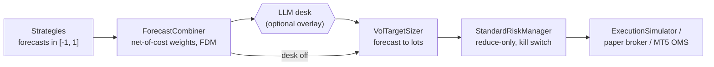

# Portfolio construction and risk

This page covers everything between the strategies and the execution simulator. The
**forecast combiner** blends strategy forecasts into one forecast in [-1, 1], scoring each
strategy net of estimated trading costs. The **sizer** turns that forecast into signed lots
by volatility targeting. The **risk manager** is the last gate: it can only *reduce* the
requested position, and it owns the kill switch that survives restarts. The page also covers
the VaR/ES and stress-test tools and the volatility and regime models in `aurum.models`.
Every formula, default and behaviour below is taken from `aurum/portfolio/`, `aurum/risk/`,
`aurum/models/` and `aurum/core/config.py`, and every example was run against the current code.

**On this page**

- [The decision chain](#the-decision-chain)
- [Forecast combiner](#forecast-combiner)
- [Position sizing](#position-sizing)
- [Risk manager](#risk-manager)
- [VaR, ES and stress tests](#var-es-and-stress-tests)
- [Volatility models](#volatility-models)
- [Regime model (HMM)](#regime-model-hmm)
- [Limitations](#limitations)
- [See also](#see-also)

## The decision chain



Three rules hold along this chain (SPEC §0.3):

- Strategies only emit forecasts. They never size positions.
- The sizer is the only place where a forecast becomes lots.
- The risk manager can only move the requested position toward zero, or halt. Nothing after it
  can add exposure. The backtest engine also clamps any approval that exceeds the request
  and logs it (see [execution-and-costs.md](execution-and-costs.md#backtest-engine)).

The research backtests, the RL environment, paper trading and the live runner use the same
sizer and risk manager classes. The LLM desk sits between the combiner and the sizer, and
its output goes through the same sizer and risk manager ([llm-desk.md](llm-desk.md)).

## Forecast combiner

`aurum.portfolio.combiner.ForecastCombiner` learns one weight per strategy and a forecast
diversification multiplier (FDM) on **training data only**, then combines row by row:

```text
combined[t] = clip(FDM * sum_i w_i * f_i[t], -1, 1)
```

`combine()` uses only row `t`, so it is causal on any later window. `fit()` restricts `close`
(and `bars`) to the forecasts' own index, so passing a longer price series cannot leak.

### Scoring each strategy net of costs

Each strategy is scored on its **unit-volatility return stream**:

```text
u_i[t] = f_i[t] * r[t+1] / vol[t]
```

Here `r[t+1]` is the next bar's log return and `vol[t]` is a causal per-bar EWMA volatility
(half-life `vol_halflife = 48` bars, `min_periods = 20`, not annualised). This is the return a
vol-targeted position earns per unit of target volatility, so calm and turbulent periods
are comparable. The last training row has no forward return and is dropped.

When cost information is passed to `fit()`, the stream is charged for forecast turnover:

```text
net_i[t] = u_i[t] - c_t * |f_i[t] - f_i[t-1]|

c_t = (spread_eff[t] / 2 + slippage[t] + commission_per_oz) / (close[t] * vol[t])
spread_eff = max(spread * spread_multiplier, min_spread)
slippage   = slippage_fixed + slippage_range_frac * (high - low)
```

How `c_t` is derived, in short: the vol-target sizer holds `f * sigma_b / vol[t]` of equity
(with `sigma_b` the per-bar target vol), so a change `|Δf|` trades `sigma_b * |Δf| / vol[t]` of
equity. Each unit of notional crossed costs `k_t / close[t]`, where `k_t` is the per-ounce
concession of one fill (half the effective spread plus slippage plus commission per ounce).
Dividing the cost by `sigma_b` puts it in the same units as `u`, and the target vol cancels.
The spread, slippage and commission terms come from the same
[`CostModel`](execution-and-costs.md#cost-model) the simulator charges.

The estimate is deliberately simple, and it errs on the conservative side:

- Bar `t`'s spread and range stand in for the execution bar `t+1`.
- The `sqrt(lots)` impact term is ignored (lots are unknown here).
- Trades caused by volatility changes at a constant forecast are ignored.
- The sizer's rebalance band suppresses small trades, so jittery forecasts are over-charged.
- Each strategy pays for its own turnover, whereas opposite trades of different strategies
  net out in the blend.
- Overnight financing is a holding cost, not a turnover cost, and is not included.

Cost inputs to `fit()`:

| Argument | Effect |
|---|---|
| `bars=` (with a `spread` column, ideally `high`/`low`) or `spread=` | Estimate `c_t` from `costs` (default `CostModel()`) and `instrument` (default XAUUSD) |
| `cost_per_turnover=` (scalar or Series, unit-vol units) | Use this `c_t` instead of the estimate. Takes precedence. |
| nothing | Score **gross** streams. `explain()["cost_basis"]` and `notes` say so. |

`cost_multiplier` scales the estimated `c_t` (1 = the cost model's estimate, above 1
stress-tests, 0 = score gross). It does not apply to an explicit `cost_per_turnover`. Rows
without a cost estimate are charged the window's median `c_t`, never zero. The walk-forward
always passes the bars, the configured cost model and the instrument, so research weights are
net of costs.

### Weighting methods

| Method | Raw weight | Notes |
|---|---|---|
| `sharpe_shrink` (default) | `w_i ∝ SR_i_shrunk / std(u_i)` with `SR_shrunk = (1 - λ) SR_i + λ mean(SR_j : SR_j > 0)` | Diagonal mean-variance with James–Stein-style shrinkage (`λ = shrinkage`). A strategy with a non-positive **net** Sharpe gets zero weight and is excluded from the shrinkage target. |
| `equal` | `1/N` over active strategies | DeMiguel, Garlappi & Uppal (2009). |
| `inverse_vol` | `w_i ∝ 1 / std(u_i)` | Naive risk parity. |
| `hrp` | Hierarchical Risk Parity | Single-linkage clustering on `sqrt((1 - ρ)/2)` of the streams, then top-down inverse-variance splits along the dendrogram (López de Prado, 2016). |
| `fixed` (config only) | `strategies[].weight`, normalised to sum to 1 | Not a `ForecastCombiner` method. It is built by `aurum.research.walkforward` from the config. A strategy without `weight` counts as 1.0. Setting `weight` with any other method is a config error. |

The Sharpe ratios are per-bar statistics of the (net) streams. Annualisation only affects the
reported `train_sharpe`: it uses the realised bar density of the forecasts' index, or 252
without a DatetimeIndex. A strategy whose forecast is constant over the training window
carries no information and gets zero weight. `fit()` needs at least 30 valid rows.

### Weight cap and unallocated risk

Weights are capped at `max_weight` (default 0.4), and the excess is redistributed
proportionally among the strategies the method scored positively. If the cap is infeasible
for the number of active strategies (`max_weight * N_active < 1`), it is relaxed to
`1/N_active` and a note is recorded.

With `allow_unallocated=True` (the default), the cap never pushes weight onto strategies scored
at zero. When the positively scored strategies cannot absorb the whole budget under the cap,
the rest stays **unallocated**: the weights sum to less than 1 and the book carries
proportionally less risk. When no strategy has a positive net Sharpe, `sharpe_shrink` leaves
the book **flat** (all weights 0). The alternative would be to force weight onto strategies
with negative expected net returns just to satisfy a concentration cap.

`allow_unallocated=False` restores the older behaviour: weights always sum to 1, the excess
is redistributed onto zero-scored strategies (logged as a WARNING and noted),
`sharpe_shrink` shrinks toward the mean over all active strategies, zeroes non-positive
shrunk Sharpes, and falls back to inverse-vol when none is positive. `equal`, `inverse_vol`
and `hrp` score every active strategy positively, so both settings give weights that sum to 1
for them.

### Forecast diversification multiplier

Averaging imperfectly correlated forecasts shrinks their dispersion. The FDM (Carver, 2015,
*Systematic Trading*, ch. 8) restores it:

```text
FDM = min(fdm_cap, max(1, sum(w) / sqrt(w' H w)))
```

`H` is the correlation matrix of the active training forecasts, with correlations floored at
`corr_floor` (default 0, as Carver recommends). Normalising by `sum(w)` makes the FDM a
property of the allocated sub-portfolio, so unallocated weight still reduces the combined
forecast instead of being scaled back up. Carver's derivation assumes forecasts share a
common scale. The combiner does not rescale strategies whose typical magnitude differs; it
reports `avg_abs_forecast` instead. The `fixed` method uses `max(1, 1/sqrt(w' H w))` with its
normalised weights, capped at `fdm_cap`.

### Parameters

| Constructor argument | Config key (`combiner.*`) | Default | Meaning |
|---|---|---|---|
| `method` | `method` | `"sharpe_shrink"` | `sharpe_shrink`, `equal`, `inverse_vol`, `hrp` (config also accepts `fixed`) |
| `shrinkage` | `shrinkage` | 0.5 | λ in [0, 1]. 1 ignores Sharpe differences. |
| `max_weight` | `max_weight` | 0.4 | Per-strategy cap, in (0, 1] |
| `fdm_cap` | `fdm_cap` | 2.5 | Cap on the FDM (must be ≥ 1) |
| `vol_halflife` | `vol_halflife` | 48.0 | Half-life (bars) of the per-bar EWMA vol in `u` |
| `min_periods` | `min_periods` | 20 | Warm-up bars for that vol |
| `corr_floor` | `corr_floor` | 0.0 | Floor on pairwise forecast correlations in the FDM |
| `bars_per_year` | (not exposed) | `None` | Annualisation of reported Sharpes. `None` infers it from the index. |
| `allow_unallocated` | `allow_unallocated` | `True` | See above |
| `cost_multiplier` | `cost_multiplier` | 1.0 | Scales the estimated `c_t` (≥ 0) |

### Example

A runnable example on synthetic data: three toy forecasts, one of which has a real (built-in)
edge after costs.

```python
import numpy as np
import pandas as pd

from aurum.data.synthetic import make_synthetic_bars
from aurum.execution.costs import CostModel
from aurum.portfolio.combiner import ForecastCombiner

# synthetic H1 bars with mild return autocorrelation (a toy trend process)
bars = make_synthetic_bars(4000, "H1", seed=3, model="trend", regime_params={"phi": 0.1})
close = bars["close"]
ret = np.log(close).diff()

# three toy forecasts in [-1, 1]; each row uses bars <= t only
forecasts = pd.DataFrame({
    "fast_trend": np.sign(ret.rolling(24).sum()).fillna(0.0),
    "slow_trend": np.tanh(ret.rolling(240).sum() / 0.02).fillna(0.0),
    "fade": -np.sign(ret.rolling(6).sum()).fillna(0.0),
})
train, test = forecasts.iloc[:3000], forecasts.iloc[3000:]

comb = ForecastCombiner()                             # sharpe_shrink, shrinkage 0.5, max_weight 0.4
comb.fit(train, close, bars=bars, costs=CostModel())  # net of estimated trading costs
info = comb.explain()
print("net Sharpe  :", {k: round(v, 2) for k, v in info["train_sharpe"].items()})
print("gross Sharpe:", {k: round(v, 2) for k, v in info["train_sharpe_gross"].items()})
print("weights     :", {k: round(v, 3) for k, v in info["weights"].items()})
print("unallocated :", round(info["unallocated"], 3), "| fdm:", round(info["fdm"], 3))

legacy = ForecastCombiner(allow_unallocated=False).fit(train, close, bars=bars, costs=CostModel())
print("legacy sum-to-1 weights:", {k: round(v, 3) for k, v in legacy.weights_.items()})

combined = comb.combine(test)                         # clip(fdm * sum(w_i f_i), -1, 1), row-wise
print("combined range:", round(combined.min(), 3), round(combined.max(), 3))
print("avg c_t:", round(info["avg_cost_per_turnover"], 4))
```

Output (printed lines; the legacy fit also logs a WARNING about forced weight):

```text
net Sharpe  : {'fast_trend': -0.25, 'slow_trend': 1.77, 'fade': -5.24}
gross Sharpe: {'fast_trend': 0.81, 'slow_trend': 2.06, 'fade': -3.13}
weights     : {'fast_trend': 0.0, 'slow_trend': 0.4, 'fade': 0.0}
unallocated : 0.6 | fdm: 1.0
legacy sum-to-1 weights: {'fast_trend': 0.3, 'slow_trend': 0.4, 'fade': 0.3}
combined range: -0.398 0.397
avg c_t: 0.077
```

`fast_trend` looks profitable gross, but its turnover costs make it a net loser, so it gets
no weight. Only `slow_trend` is positive after costs. With a 0.4 cap it takes 40% of the risk
budget and 60% stays unallocated. The legacy mode would have put 60% on the two net losers.
These numbers come from synthetic data built with an edge; they say nothing about real gold.

### How research fits the combiner

In the walk-forward ([research.md](research.md)), `walkforward.combiner_fit` chooses what each
fold's combiner is fitted on:

| Mode | Fitted on | Notes |
|---|---|---|
| `oos` (default) | The stitched **out-of-sample** forecasts of earlier folds, strictly before this fold's test block, limited to the last `walkforward.train` bars (all of them when `anchored`) | Until `walkforward.combiner_min_obs` (default 500) such rows exist, or if that fit fails, the fold uses **equal** weights. Activity flags and the FDM then come from training-window forecast correlations (no returns). |
| `train` | The fold's training-window forecasts | In-sample for trainable strategies, so the weights are biased toward them. The report notes this. |
| `fixed` method | The training window, for correlations only | Weights come from the config, so returns never enter. |

`aurum train-final` always fits the production combiner in `oos` mode on the stitched OOS
forecasts of a walk-forward run (plus its holdout forecasts, if any). It prints a note when
the config says `combiner_fit: train`, and a WARNING when the OOS history is too short and
it falls back to equal weights.

### Inspecting a fitted combiner

`explain()` returns a JSON-friendly dict for reports and the LLM desk: `weights`,
`weights_sum`, `unallocated`, `allow_unallocated`, `train_sharpe` (net),
`train_sharpe_gross`, `sharpe_basis`, `cost_basis`, `avg_cost_per_turnover`,
`train_turnover`, `train_cost_per_bar`, `train_stream_std`, `avg_abs_forecast`, `fdm`,
`fdm_raw`, `fdm_cap`, `avg_forecast_correlation`, `shrinkage`, `max_weight`, `n_obs`,
`train_start`, `train_end` and `notes`. Always read `notes`: that is where unallocated risk,
inactive strategies, a relaxed cap, a capped FDM and gross scoring are reported.

Other methods: `fit_combine()` (fit and combine the same data, for in-sample diagnostics
only), `unit_vol_streams()` and `turnover_cost()`.

## Position sizing

Both sizers live in `aurum.portfolio.sizing` and implement
`aurum.core.interfaces.PositionSizer`:

```text
target_lots(forecast, vol_ann, equity, price, instrument, *, current_lots=0.0, drawdown=0.0) -> float
```

`drawdown` is a positive fraction below the equity peak (the backtest engine tracks the peak
from the equity at each close). Sizes are always rounded **toward zero** onto the
instrument's lot grid, and anything below `min_lot` becomes 0, so rounding never adds risk.

### VolTargetSizer

The default sizer (Carver, 2015; Moreira & Muir, 2017) holds a notional proportional to the
forecast and inversely proportional to the volatility forecast:

```text
notional = forecast * target_vol / max(vol_ann, min_vol) * equity
```

A forecast of ±1 therefore targets `target_vol` annualised volatility. The steps, in the order
`VolTargetSizer.breakdown()` records them:

1. A zero or non-finite forecast gives 0 lots. The forecast is clipped to [-1, 1]. Invalid
   equity, price or volatility also gives 0 lots, with a logged warning.
2. The volatility is floored at `min_vol`.
3. `|notional|` is capped at `max_leverage * equity`, or at `kelly_cap * equity / vol` when
   that is tighter.
4. The drawdown multiplier is applied: the smallest multiplier among the `drawdown_derisk`
   steps whose threshold has been reached. With the default `((0.10, 0.5), (0.15, 0.25))`,
   exposure is halved at 10% below the peak and quartered at 15%. The multiplier depends
   on the current drawdown, so full size returns once equity recovers above the thresholds.
5. Lots are `notional / (contract_size * price)`, capped at `min(max_lots, instrument.max_lot)`.
6. Lots are rounded toward zero on the lot grid.
7. The **rebalance band**: the current position is kept if both positions are non-zero and on
   the same side, the current position is within the caps, and
   `|target - current| < rebalance_band * max(|target|, |current|)`. Reversals and moves to or
   from flat always trade.

| Constructor argument | Config key (`sizing.*`) | Default | Meaning |
|---|---|---|---|
| `target_vol` | `target_vol` | 0.10 | Annualised vol for a forecast of ±1 |
| `max_leverage` | `max_leverage` | 2.0 | Cap on `\|notional\| / equity` |
| `max_lots` | `max_lots` | `None` | Absolute lot cap (the instrument's `max_lot`, 50, always applies) |
| `rebalance_band` | `rebalance_band` | 0.10 | Relative no-trade band, in [0, 1) |
| `kelly_cap` | `kelly_cap` | `None` | Cap on the position's ex-ante annualised vol as a fraction of equity |
| `drawdown_derisk` | `drawdown_derisk` | `[[0.10, 0.5], [0.15, 0.25]]` | `(threshold, multiplier)` steps. `null` disables them. |
| `min_vol` | `min_vol` | 0.02 | Floor on the vol forecast used for sizing |

`sizing.method: vol_target` (the default) selects this sizer. The default vol forecast is
`ewma_volatility`, which is already clipped at 0.03, so `min_vol` only matters for custom vol
series (see [Volatility models](#volatility-models)).

```python
from aurum.core.instrument import XAUUSD
from aurum.portfolio.sizing import FixedFractionalSizer, VolTargetSizer

sizer = VolTargetSizer()      # target_vol 0.10, max_leverage 2.0, band 0.10, dd steps (0.10, 0.5), (0.15, 0.25)

# forecast 0.8, 15% annualised vol, $100k equity, gold at $2,000
bd = sizer.breakdown(0.8, 0.15, 100_000, 2_000.0, XAUUSD)
print(bd.raw_notional, bd.final_lots)

# same inputs 12% below the equity peak: the 0.10 step halves exposure
print(sizer.target_lots(0.8, 0.15, 100_000, 2_000.0, XAUUSD, drawdown=0.12))

# already holding 0.25 lots: 0.26 is inside the 10% no-trade band, so the position is kept
print(sizer.target_lots(0.8, 0.15, 100_000, 2_000.0, XAUUSD, current_lots=0.25))

# a very low vol forecast hits the leverage cap (2x equity = 1.00 lot at $2,000)
bd = sizer.breakdown(1.0, 0.03, 100_000, 2_000.0, XAUUSD)
print(bd.caps_hit, bd.final_lots)

ff = FixedFractionalSizer()   # risk 0.5% of equity per trade, stop 2 x ATR
print(ff.stop_distance(0.15, 2_000.0), ff.target_lots(1.0, 0.15, 100_000, 2_000.0, XAUUSD))
```

Output:

```text
53333.33333333334 0.26
0.13
0.25
['max_leverage 2.00'] 1.0
37.79644730092272 0.13
```

`breakdown()` returns a `SizingBreakdown` (`raw_notional`, `capped_notional`,
`drawdown_mult`, `raw_lots`, `rounded_lots`, `final_lots`, `kept_current`, `caps_hit`,
`note`, and `to_dict()`), the audit trail the live runner logs and the LLM desk can read.

### FixedFractionalSizer

A stop-based alternative (`sizing.method: fixed_fractional`): risk a fixed fraction of
equity if the stop is hit.

```text
lots = |forecast| * risk_per_trade * equity * drawdown_mult / (stop_atr * ATR * contract_size)
```

Without an `atr=` argument, ATR is proxied from the vol forecast as
`price * vol_ann / sqrt(atr_periods_per_year)` (a one-period price standard deviation,
daily by default: 252 periods per year). Lots are capped by `max_leverage`, `max_lots` and the
instrument's `max_lot`, rounded toward zero, then passed through the same rebalance band.

| Argument | Config key | Default |
|---|---|---|
| `risk_per_trade` | `sizing.risk_per_trade` | 0.005 (must be in (0, 0.2)) |
| `stop_atr` | `sizing.stop_atr` | 2.0 |
| `max_leverage`, `max_lots`, `rebalance_band`, `drawdown_derisk` | `sizing.*` | as for `VolTargetSizer` |
| `atr_periods_per_year` | (not exposed) | 252.0 |

Two caveats. The backtest engine calls `target_lots()` without `atr=`, so backtests always use
the vol proxy. And the sizer does not place a stop: a protective stop in a backtest comes from
`backtest.stop_atr_mult`, which uses a Wilder ATR on the bar timeframe. The two are not linked
automatically. **The live runner only implements `vol_target`**: a config with
`sizing.method: fixed_fractional` is refused for live trading, because live positions would
not match the backtests.

## Risk manager

`aurum.risk.manager.StandardRiskManager(limits=None, instrument=XAUUSD, state_path=None, *, events=None)`
implements `aurum.core.interfaces.RiskManager`. At every bar close the engine (and the live
runner) calls `on_bar(time, equity)` and then `evaluate(RiskContext(...))`, which returns a
`RiskDecision(approved_lots, halted, reasons)`.

### The reduce-only invariant

The approved position always lies between 0 and the requested target (same sign, equal or
smaller size). When a "no new risk" rule fires, it also never exceeds the current position in
the risk-increasing direction: on the same side it becomes `min(|approved|, |current|)`, and a
reversal or a new position from flat becomes 0. Existing positions can always be reduced
or closed. A final guard clamps any violation of the invariant and logs an error. Every
intervention appends a readable reason to `RiskDecision.reasons`.

### Evaluation order

1. **Equity update and kill switch.** The peak and the day-start equity are updated, and the
   hard kills are checked (see [Kill switch](#kill-switch)). A halted manager approves 0
   (flatten) with the reason "HALTED (...)". A non-finite target is treated as 0 (flatten).
2. **Exposure caps.** The target is shrunk toward 0 to the tightest of: instrument
   `max_lot`, `max_lots`, `max_leverage * equity / (contract_size * price)` and
   `max_margin_utilisation * equity / (contract_size * price * margin_rate)`.
3. **Event blackout** around scheduled high-importance releases.
   `blackout_mode="flatten"` sets the position to 0, `"no_new_risk"` only blocks new exposure.
4. **No-new-risk guards**: spread above `max_spread` (or unknown while `max_spread` is set),
   stale data (`ctx.data_age_seconds` above `stale_data_seconds`, or non-finite),
   `max_trades_per_day` reached, invalid price, invalid equity.
5. **Rounding** toward zero on the lot grid.

A committed decision that changes the position counts toward `max_trades_per_day`.

### RiskLimits

All fields of `RiskLimits`, with the dataclass default and the effective values for research
and live runs under `configs/default.yaml`. Research limits are
`RESEARCH_RISK_DEFAULTS` (`daily_loss_persistent: false`, `max_drawdown: null`) with
`risk.research` layered on top. Live limits are `risk.live` layered over the `RiskLimits`
defaults.

| Field | Meaning | `RiskLimits` default | Research (`default.yaml`) | Live (`default.yaml`) |
|---|---|---|---|---|
| `max_lots` | Absolute cap on the position in lots (`None` = instrument cap only) | `None` | `None` | `None` |
| `max_leverage` | Cap on `\|notional\| / equity` | 3.0 | 3.0 | 3.0 |
| `max_daily_loss` | Kill when equity falls this fraction below the day's start | 0.03 | 0.03 | 0.03 |
| `max_drawdown` | Kill when equity falls this fraction below its peak | 0.20 | `None` (off) | 0.20 |
| `max_spread` | Block new risk above this spread (USD/oz) | `None` | 2.0 | 1.5 |
| `event_blackout_before_min` | Minutes before an event | 30 | 30 | 30 |
| `event_blackout_after_min` | Minutes after an event | 30 | 30 | 30 |
| `event_min_importance` | Events with importance ≥ this trigger a blackout | 3 | 3 | 3 |
| `blackout_mode` | `"no_new_risk"` or `"flatten"` | `"no_new_risk"` | `"no_new_risk"` | `"no_new_risk"` |
| `max_trades_per_day` | After this many position changes in a day, only reductions | `None` | `None` | `None` |
| `stale_data_seconds` | Block new risk when the latest bar is older than this | `None` | `None` | 7200 |
| `max_margin_utilisation` | Cap on required margin / equity | 0.5 | 0.5 | 0.5 |
| `daily_reset` | Day boundary: `"utc"` (midnight) or `"rollover"` (`instrument.rollover_hour_utc`, 21 UTC) | `"utc"` | `"utc"` | `"utc"` |
| `daily_loss_persistent` | `True`: a daily-loss halt needs a manual reset. `False`: it clears at the next day. | `True` | `False` | `True` |
| `event_lookahead_min` | Extra minutes added before each event (set to the bar length on coarse timeframes) | 0.0 | 0.0 | 0.0 |

Notes on these values:

- The sizer's own `max_leverage` (2.0) is tighter than the risk manager's (3.0), so with
  default settings the leverage cap binds in the sizer first.
- `stale_data_seconds` only acts when `RiskContext.data_age_seconds` is set, which only the
  live runner does. If `risk.live` leaves it unset, the runner uses
  `max(120, bar_seconds / 2) + bar_close_delay_seconds` (1805 s on H1).
- Research runs switch off the permanent drawdown kill and make daily-loss halts
  non-persistent. A research backtest measures the *strategy*, and one −3% day must not flatten
  a 14-year sample. The sizer's drawdown de-risking still applies and every halt is reported.
- `risk.enabled: false` removes the risk manager from research backtests entirely.
- Real-money order sending requires both `max_drawdown` and `max_daily_loss` in `risk.live`.
  The runner refuses to start otherwise ([live-trading.md](live-trading.md)).

Validation: `max_daily_loss` and `max_drawdown` must be in (0, 1) or `None`. The other numeric
caps must be positive or `None`, and blackout windows must be non-negative. Unknown keys under
`risk.research` / `risk.live` are reported with the list of valid ones
([configuration.md](configuration.md)).

### Kill switch

The kill switch sets `halted=True`. From then on every decision approves 0 lots, so the book is
flattened and stays flat. It fires on:

| `halt_kind` | Trigger |
|---|---|
| `daily_loss` | `1 - equity / day_start_equity >= max_daily_loss` |
| `drawdown` | `1 - equity / peak_equity >= max_drawdown`. The peak is the running maximum of every equity mark seen. |
| `equity` | Equity ≤ 0 |
| `manual` | `halt(reason)`, called from your own code (`kind="manual"` is the default) |
| `state_file` | Unreadable state file at start-up, or (live runner) a missing one, see below |

The day-start equity is the equity at the day boundary when a decision falls exactly on it.
Otherwise it is the last equity observed before the boundary, i.e. the equity at the open of
the day's first bar. A mark exactly on the boundary is also the close of the previous day's
last bar, so it is first settled against the previous day's start. This way the final bar of a
day (all of it on D1) cannot escape the daily-loss limit. A mark with a timestamp earlier
than the last one never rolls the day over (so it cannot re-base the day-start equity), but
the kill checks still run on it.

With `daily_loss_persistent=False` a daily-loss halt clears automatically at the next trading
day. A drawdown, equity, manual or state-file halt never clears by itself.

### Persistence and restarts

With `state_path` set (the live runner uses `<live.state_dir>/risk_state.json`), the state
(halt flag, kind, reason, peak, day key, day-start equity, trades today, last time and equity)
is written as JSON after every change. The write is atomic: a temporary file is flushed,
fsynced and then renamed over the old one. The file is read back strictly: any unexpected
type (for example `"halted": "false"` as a string), a missing `halted` key or invalid JSON
makes the manager **start HALTED** with `halt_kind="state_file"`.

The live runner adds one more rule. Every decision persists the risk state before the runner
and OMS state, so if `runner_state.json` or `oms_state.json` exists in the state directory but
`risk_state.json` does not, the file was deleted or lost. The runner then starts **HALTED**
(`halt_kind="state_file"`). Deleting the file is not a way to reset the kill switch.

### Resetting a halt

Only an explicit call clears a halt:

```python
from aurum.risk.manager import StandardRiskManager

rm = StandardRiskManager(state_path="runs/live/paper/risk_state.json")   # your live.state_dir
print(rm.halted, rm.halt_reason)
rm.reset_halt(confirm="RESET")   # anything other than "RESET" raises ValueError
```

`reset_halt(confirm="RESET", *, equity=None)` clears the flag and re-bases the equity peak and
the day-start equity to `equity` (default: the last observed equity). Otherwise the same
drawdown would trigger the kill again at once. The reset is logged, recorded in
`events_frame()` and persisted. There is no CLI command for it. Stop the runner before
resetting: a running runner keeps its own in-memory (halted) state and would write it back
on its next decision.

### Event blackouts

A decision at time `t` is in a blackout when an eligible event lies in
`[t - event_blackout_after_min, t + event_blackout_before_min + event_lookahead_min]`.
Events come from the `events=` frame given to the constructor (or `set_events()`) and from
`RiskContext.upcoming_events` / `recent_events`. Frames need a `time` column (UTC) and ideally
`importance`. A missing or non-numeric importance counts as high (fail safe). Scheduled release
times are public in advance, so using future event times is point-in-time safe. The backtest
engine passes `md.events` windows of `event_horizon_hours` (24 by default) before and after
each decision, and strips outcome columns such as `actual` from the upcoming window. With
`data.events: rule_based`, the configs in `configs/` block new risk around NFP and FOMC
(both importance 3), see [data.md](data.md).

### Example

```python
import tempfile
from pathlib import Path

import pandas as pd

from aurum.core.interfaces import RiskContext
from aurum.risk.manager import RiskLimits, StandardRiskManager

state = Path(tempfile.mkdtemp()) / "risk_state.json"
rm = StandardRiskManager(RiskLimits(max_spread=1.5), state_path=state)   # otherwise the live defaults


def ctx(t, equity, current, target, spread=0.3):
    return RiskContext(time=pd.Timestamp(t, tz="UTC"), equity=equity, current_lots=current,
                       target_lots=target, price=2000.0, spread=spread, vol_ann=0.15)


# 1. exposure cap: 3x leverage at $100k equity and $2,000/oz = 1.50 lots
d = rm.evaluate(ctx("2024-03-04 10:00", 100_000, 0.0, 2.0))
print(d.approved_lots, d.reasons)

# 2. wide spread: new risk is blocked, the position can still be reduced
print(rm.evaluate(ctx("2024-03-04 11:00", 100_000, 0.5, 0.8, spread=2.0)).approved_lots)
print(rm.evaluate(ctx("2024-03-04 12:00", 100_000, 0.5, 0.2, spread=2.0)).approved_lots)

# 3. a 3% loss versus the day's starting equity trips the daily-loss kill switch
d = rm.evaluate(ctx("2024-03-04 13:00", 96_900, 0.5, 0.5))
print(d.approved_lots, d.halted, rm.state.halt_kind)

# 4. the halt is persisted: a new manager on the same file starts HALTED
rm2 = StandardRiskManager(RiskLimits(max_spread=1.5), state_path=state)
print(rm2.halted, rm2.evaluate(ctx("2024-03-05 10:00", 96_900, 0.0, 0.3)).approved_lots)

# 5. only an explicit operator reset clears it (peak and day start are re-based)
rm2.reset_halt(confirm="RESET")
print(rm2.halted, rm2.evaluate(ctx("2024-03-05 11:00", 96_900, 0.0, 0.3)).approved_lots)

# 6. an unreadable state file fails safe
state.write_text("{not json")
print(StandardRiskManager(state_path=state).state.halt_kind)
```

Output (stdout; the manager also logs the kill switch and the reset):

```text
1.5 ['max_leverage 3x: +2.00 -> +1.50 lots']
0.5
0.2
0.0 True daily_loss
True 0.0
False 0.3
state_file
```

### Other methods

| Method | Purpose |
|---|---|
| `evaluate(ctx, *, commit=False)` | Side-effect-free preview: state and intervention log are restored afterwards. |
| `on_bar(time, equity)` | Update the peak, day start and kill checks. Call once per bar close. |
| `halt(reason, *, time=None, kind="manual")` | Manual kill switch, persisted. |
| `set_events(df)` | Register a calendar for blackouts (O(log n) lookups). |
| `events_frame()` | All interventions: `time`, `requested`, `current`, `approved`, `halted`, `reasons`. |
| `snapshot()` | JSON-friendly state: halt fields, peak, last equity, drawdown, day start, day return, trades today, limits. |
| `halted`, `halt_reason` | Properties. |

In backtests, `BacktestResult.risk_events` records every bar where risk changed the request,
halted, or gave a reason ([execution-and-costs.md](execution-and-costs.md#backtestresult)).
The walk-forward reports the number of risk events, halt bars and halt episodes per book.

## VaR, ES and stress tests

`aurum.risk.var` is a set of library tools for your own analysis and reports. The backtest
engine, walk-forward, LLM desk and live runner do not call it, and it enforces nothing. (The
`var_95_daily` / `cvar_95_daily` backtest metrics are computed separately, see
[execution-and-costs.md](execution-and-costs.md#metrics).) VaR and ES are positive
loss fractions (`var = 0.02` means a 2% loss is not exceeded with probability `level`), and
ES ≥ VaR.

| Function | What it does |
|---|---|
| `var_es(returns, level=0.95, method="historical", *, horizon=1)` | VaR and ES by `historical`, `gaussian` or `cornish_fisher`. Parametric methods aggregate moments over `horizon`. Historical results are scaled by `sqrt(horizon)` (approximate). |
| `historical_var_es`, `gaussian_var_es`, `cornish_fisher_var_es`, `cornish_fisher_quantile` | The estimators. Cornish–Fisher (modified VaR) corrects the Gaussian quantile for skew and excess kurtosis, with the closed-form modified ES of Boudt, Peterson & Croux (2008). ES is floored at VaR. |
| `kupiec_pof(n_obs, n_breaches, level)` | Kupiec (1995) proportion-of-failures test |
| `rolling_var_backtest(returns, level, *, window=250, method)` | Strictly out-of-sample VaR back-test (the VaR for day `t` uses days before `t`) |
| `position_var(lots, price, vol_ann, *, level=0.99, horizon_days=1.0, ...)` | Gaussian USD VaR/ES of a position from an annualised vol (zero drift) |
| `gap_shock(lots, price, pct, *, spread=0.0)` | USD P&L of an instant gap, plus the cost of exiting at a (widened) spread |
| `stress_test(lots, price, equity, *, scenarios=None, spread=0.0)` | Applies each scenario, sorted worst first |
| `risk_report(result, *, level=0.95, ...)` | JSON-friendly summary of a `BacktestResult`: per-bar and daily VaR/ES by all methods, moments, drawdown, a rolling VaR back-test and a stress test of the final position |

The named scenarios in `DEFAULT_STRESS_SCENARIOS` (for example "2013-04-15 crash (approx -9%)")
are rounded, approximate magnitudes, not verified data. Override them where precision matters.

```python
import numpy as np

from aurum.risk.var import gap_shock, position_var, stress_test, var_es

rng = np.random.default_rng(0)
daily = rng.standard_t(df=4, size=1500) * 0.007          # fat-tailed toy daily returns

for method in ("historical", "gaussian", "cornish_fisher"):
    r = var_es(daily, level=0.99, method=method)
    print(f"{method:15s} VaR {r['var']:.4f}  ES {r['es']:.4f}")

# 0.5 lots long at $2,000: USD loss of a 5% gap, exiting at a widened $2.00 spread
print(gap_shock(0.5, 2_000.0, -0.05, spread=2.0))

# 1-day 99% Gaussian VaR of the same position at 15% annualised vol
print(round(position_var(0.5, 2_000.0, 0.15)["var_usd"], 2))

print(stress_test(0.5, 2_000.0, 100_000).head(3).to_string(index=False))
```

Output:

```text
historical      VaR 0.0238  ES 0.0298
gaussian        VaR 0.0217  ES 0.0249
cornish_fisher  VaR 0.0268  ES 0.0381
-5050.0
2198.19
                       scenario  shock_pct  pnl_usd  pnl_pct_equity  equity_after
                 gap_down_10pct      -0.10 -10000.0           -0.10       90000.0
  2013-04-15 crash (approx -9%)      -0.09  -9000.0           -0.09       91000.0
2011-09-23 selloff (approx -6%)      -0.06  -6000.0           -0.06       94000.0
```

## Volatility models

`aurum.models.volatility` holds the volatility forecasters. All of them are causal: the value
at row `t` uses returns up to and including `t` and is the forecast for the next period.

**Only `ewma_volatility` is wired into the pipeline.** The backtest engine (by default), the
walk-forward, the RL environment and the live runner all size with it. GARCH, HAR-RV and
`blend_vol` are research tools. To size a backtest with them, pass the series as
`run_backtest(..., vol=...)`. The live runner would still use EWMA, so that creates a
research/live mismatch.

### EWMA (the default)

```text
r[t]   = log(close[t] / close[t-1])
var[t] = EWM(r^2, halflife = 48 bars, min_periods = 20, adjust = False)
vol[t] = clip(sqrt(var[t] * bars_per_year), 0.03, 2.0)      # warm-up rows: 0.20
```

`ewma_volatility(close, *, halflife_bars=48.0, bars_per_year=None, min_periods=20, floor=0.03, cap=2.0)`
annualises with a **nominal**, timeframe-based constant, never with the density of the data.
The bar length is the median spacing of the first 200 timestamps, and
`nominal_bars_per_year(minutes)` gives `252 * 23 * 60 / minutes` intraday (5,796 for H1) and
`252 * 1440 / minutes` for daily or slower bars. So a decision never depends on how many bars
arrive later. Passing `bars_per_year` (also through `run_backtest`) overrides the constant.
Warm-up rows get a conservative constant 0.20 and are never back-filled from later estimates.

### GARCH(1,1)

`Garch11(*, mean="zero", bars_per_year=None, floor=None, cap=None, max_iter=500, min_obs=250)`
is Bollerslev's GARCH(1,1), fitted by Gaussian quasi-maximum likelihood with SLSQP from five
starting points under `omega > 0`, `alpha, beta >= 0` and `alpha + beta <= 1 - 1e-6`.
Returns are standardised before optimisation. The variance recursion starts from the
training-sample variance (`h0_`), which is reused when forecasting later data.

- `fit(train_returns)` needs at least `min_obs` finite returns. Non-finite returns are
  dropped, which joins returns across gaps.
- `forecast(returns, *, horizon=1, annualise=True)`: row `t` is the volatility over bars
  `t+1..t+horizon` given returns up to `t`. Missing returns are replaced by their conditional
  expectation.
- Annualisation uses `bars_per_year` if given, otherwise the realised bar density of the
  **training** index (not the nominal constant EWMA uses). `floor`/`cap` apply to annualised
  output only.
- `summary()`, `aic`, `bic`, `conditional_variance()`, and `params_` (`GarchParams` with
  `persistence`, `unconditional_variance`, `half_life`).

### HAR-RV

`daily_realised_variance(bars, *, anchor_hour_utc=0, complete_only=True, fold_weekends=True)`
sums squared intraday log returns per session and returns `rv`, `n_obs` and `available_at`
(the `available_at` of the session's last bar), so it can be aligned point-in-time with
`aurum.data.pit.asof_join`. Weekend sessions are folded into Monday, and an incomplete final
session is dropped.

`HarRV(lags=(1, 5, 22), *, log=False)` is Corsi's (2009) regression of next-day RV on trailing
daily, weekly and monthly means. `har_rv_forecast(daily_rv, *, lags=(1, 5, 22), log=False,
min_train=250, refit_every=21, window=None, output="vol", periods_per_year=252.0)` refits it
walk-forward. Each refit uses only (regressor, target) pairs whose target is known at the
origin. It returns annualised vol `sqrt(252 * RV_hat)` (or the variance) and is NaN before
the first fit.

### Blending

`blend_vol(*series, weights=None, name="vol_blend")` averages **variances**, not
volatilities. Series are outer-aligned, and weights are renormalised over the inputs present
at each row.

```python
import numpy as np

from aurum.core.timeframes import nominal_bars_per_year
from aurum.data.synthetic import make_synthetic_bars
from aurum.models.regime import GaussianHMM
from aurum.models.volatility import (Garch11, blend_vol, daily_realised_variance, ewma_volatility,
                                     har_rv_forecast)

bars = make_synthetic_bars(8000, "H1", seed=2, model="regime")
close = bars["close"]
ret = np.log(close).diff()

print(nominal_bars_per_year(60))                       # H1 annualisation constant
ewma = ewma_volatility(close)                          # the engine's default sizing vol
print(round(ewma.iloc[-1], 4))

garch = Garch11().fit(ret.iloc[:5000])                 # fit on TRAIN returns only
g = garch.forecast(ret)                                # causal, annualised, same index
print({k: round(v, 4) for k, v in garch.summary().items() if k in ("alpha", "beta", "persistence")})

rv = daily_realised_variance(bars)                     # one row per trading day
har = har_rv_forecast(rv["rv"], min_train=150)         # walk-forward refits, annualised vol
print(len(rv), int(har.notna().sum()))

blend = blend_vol(ewma, g)                             # equal weights, averaged in VARIANCE space
print(round(blend.iloc[-1], 4))

hmm = GaussianHMM(n_states=2, seed=0).fit(ret.iloc[1:5000])
probs = hmm.filter(ret.iloc[1:])                       # P(state_t | x_0..x_t), causal
print(probs.columns.tolist(), [round(float(d), 1) for d in hmm.expected_durations_])
```

Output:

```text
5796.0
0.1813
{'alpha': 0.105, 'beta': 0.8926, 'persistence': 0.9976}
336 186
0.168
['p_state_0', 'p_state_1'] [140.4, 192.8]
```

## Regime model (HMM)

`aurum.models.regime.GaussianHMM(n_states=2, seed=0, *, n_iter=200, tol=1e-4, n_init=3, var_floor=1e-3, init_stay=0.95)`
is a Gaussian hidden Markov model with diagonal covariances (Hamilton, 1989), fitted by
Baum–Welch EM with Rabiner scaling. The first restart is a deterministic quantile split, the
others are seeded perturbations, and the best training likelihood wins. States are sorted by
scale-free variance, so **state 0 is the calmest regime**.

- `fit(x)` must see training data only. It uses the forward-backward smoother, which is fine
  for estimation but never for decisions.
- `filter(x)` returns `P(s_t | x_0..x_t)` (columns `p_state_k`). It is causal, and row `t`
  depends only on `x[:t+1]`.
- `predict_next(x)` returns `P(s_{t+1} | x_0..x_t)`. `filtered_state(x)` returns the most likely
  current state.
- Missing observations contribute no likelihood. For multivariate inputs, missing components
  are marginalised.
- DataFrame inputs are re-ordered by the fitted column names, and a width mismatch raises.
- `summary()`, `score(x)`, `stationary_distribution_`, `expected_durations_` (`1 / (1 - A_kk)`
  observations).

There is deliberately no public smoother or Viterbi path (both look ahead). Like GARCH and
HAR, the HMM is a library tool: no default strategy or pipeline step uses it. For the causal
regime *features*, see [features.md](features.md).

## Limitations

- **Combiner.** The cost estimate `c_t` is an approximation (see
  [Scoring each strategy net of costs](#scoring-each-strategy-net-of-costs)). In-sample
  Sharpe estimates are noisy even after shrinkage. The FDM assumes forecasts share a common
  scale. Weights are static within a fold.
- **Sizing.** Volatility targeting only works as well as the vol forecast. EWMA reacts to a
  shock after it happens, and gaps (weekends, releases) are not forecast.
- **Risk manager.** Blackouts use scheduled times only; unscheduled news is not covered. The
  stale-data check needs `data_age_seconds`, so only the live runner uses it. With a
  `state_path` the JSON state is rewritten whenever it changes (every bar when equity moves).
  Event frames passed in `RiskContext` are cached by object identity and must not be mutated
  in place.
- **Gap risk.** The kill switch acts at the next decision. A weekend or news gap can take the
  loss past `max_daily_loss` or `max_drawdown` before any order can be sent. `gap_shock` and
  `stress_test` exist to size that risk, but nothing enforces them.
- **VaR.** Scaling historical VaR by `sqrt(h)` ignores drift and serial dependence.
  Cornish–Fisher is only reliable for moderate skew and kurtosis.
- **Models.** GARCH is Gaussian QMLE only, with no Student-t innovations and no standard
  errors. HAR is plain OLS. The HMM has diagonal covariances and Gaussian emissions only.

None of these components creates an edge. For what the full stack achieved on real data,
read [RESULTS.md](RESULTS.md).

## See also

- [execution-and-costs.md](execution-and-costs.md): the simulator, cost model, financing, backtest engine and metrics
- [strategies.md](strategies.md): where the forecasts come from
- [research.md](research.md): walk-forward, `combiner_fit`, statistics
- [configuration.md](configuration.md): the `combiner`, `sizing` and `risk` sections
- [live-trading.md](live-trading.md): the live runner, state directory and real-money guards
- [llm-desk.md](llm-desk.md): how the desk's output is bounded before sizing and risk
- [INTERFACES.md](INTERFACES.md): module signatures
- [RESULTS.md](RESULTS.md): research results
