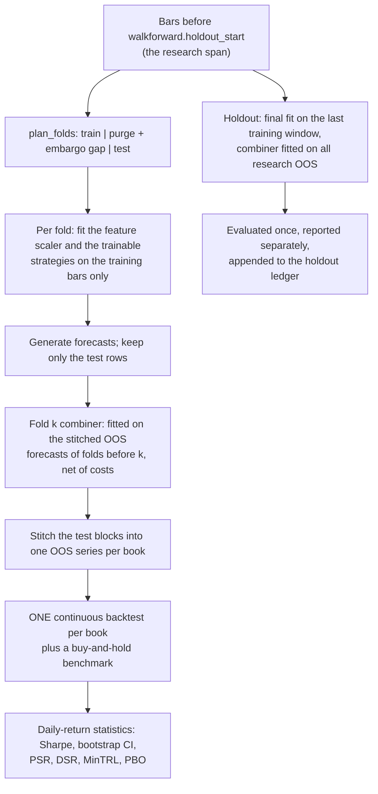

# Research: walk-forward, statistics and the holdout

This page explains how Aurum turns a configuration into an honest out-of-sample estimate.
It covers the walk-forward protocol (fold geometry, per-fold refits, out-of-sample-only
combiner weights, and one stitched backtest per book), the statistics reported on daily
returns (bootstrap confidence interval, PSR, Deflated Sharpe, minimum track record and
PBO), the final holdout and the ledger that records every look at it, every file a run
writes, the HTML tearsheet, provenance, single-split backtests, the purged k-fold and CPCV
splitters, and a checklist for running your own pre-registered study. Everything below is
taken from [`aurum/research/`](../aurum/research/), [`aurum/cli.py`](../aurum/cli.py) and
[`aurum/core/config.py`](../aurum/core/config.py), and every command and snippet was run
against the current code. Published results live in [RESULTS.md](RESULTS.md) and the
protocol that produced them in [RESEARCH_PROTOCOL.md](RESEARCH_PROTOCOL.md); this page
does not restate them.

**On this page**

- [Commands at a glance](#commands-at-a-glance)
- [A first run on synthetic data](#a-first-run-on-synthetic-data)
- [The walk-forward protocol](#the-walk-forward-protocol)
- [Statistics](#statistics)
- [The holdout and the ledger](#the-holdout-and-the-ledger)
- [Output directory reference](#output-directory-reference)
- [The tearsheet](#the-tearsheet)
- [Provenance and reproducibility](#provenance-and-reproducibility)
- [Single-split backtests](#single-split-backtests)
- [Splitters: walk-forward, purged k-fold, CPCV](#splitters-walk-forward-purged-k-fold-cpcv)
- [Running your own pre-registered study](#running-your-own-pre-registered-study)
- [Limitations](#limitations)
- [See also](#see-also)

## Commands at a glance

| Command | What it does |
|---|---|
| `aurum walkforward -c C` | The full protocol: folds, per-fold refits, stitched OOS backtests, statistics and, when `walkforward.holdout_start` is inside the data, the one-time holdout evaluation. |
| `aurum backtest -c C --start S` | One train/test split: fit before `S`, evaluate from `S`. Without `--start` it is in-sample. See [Single-split backtests](#single-split-backtests). |
| `aurum report --run DIR [--json]` | Reprint the summary of a run directory from its `summary.json`. |
| `aurum config show\|validate -c C` | Print or check the resolved configuration and its hash ([configuration.md](configuration.md)). |
| `aurum train-final -c C --out DIR` | Production fit whose combiner weights come from walk-forward OOS forecasts ([live-trading.md](live-trading.md)). |

`aurum walkforward` options (from `aurum walkforward --help`):

| Option | Meaning |
|---|---|
| `--config`, `-c` | YAML config file (required). |
| `--set KEY=VALUE` | Override a config value; repeatable ([configuration.md](configuration.md)). |
| `--out DIR` | Run directory. Default: `output.dir/walkforward_<utc>_<hash8>`. The holdout ledger then lives in the **parent** of `DIR`. |
| `--jobs N` | Parallel workers (`0` = auto). Sets `walkforward.n_jobs`. |
| `--executor auto\|process\|thread\|serial` | Sets `walkforward.executor`. |
| `--no-write` | Do not write the run directory. A holdout look is still recorded in `output.dir/holdout_ledger.jsonl`. |
| `--no-tearsheet` | Skip the HTML tearsheets. |

Exit codes are shared by all commands: `0` success, `1` runtime error, `2` usage or
configuration error, `3` optional component unavailable, `4` confirmation required
([cli.md](cli.md)).

## A first run on synthetic data

You do not need the downloaded data store to see the whole pipeline. The overrides below
replace the bars with 30,000 synthetic H1 bars from a driftless random walk
(`data.synthetic.model` defaults to `gbm`), move the holdout into that sample, and send the
run and its holdout ledger to their own directory so the look is not mixed with real
research:

```bash
aurum walkforward -c configs/fast.yaml \
  --set data.synthetic.n=30000 \
  --set walkforward.holdout_start=2024-01-01 \
  --set output.dir=runs/synthetic_demo
```

Standard output (stderr also carries logging warnings: synthetic macro data has no
`fedfunds` series, so rate financing uses `costs.financing.fallback_rate`, and the
bootstrap drops the non-finite Sharpe samples of `intraday_seasonality`, which never trades
here):

```text
loaded 30000 H1 bars 2020-01-06 00:00:00+00:00 -> 2024-11-04 11:00:00+00:00 (0.0s); 7 strategies
== walkforward: fast  config a43d060dbaea  data 898857d3942e
OOS 2022-01-05 18:00:00+00:00 -> 2023-12-31 23:00:00+00:00  (12310 bars, 4 fold(s), train 12418 / test 3105 bars, purge 0, embargo 24, n_trials 23)

book                  sharpe  ci_lower  ci_upper    psr    dsr    cagr  ann_vol  max_drawdown  n_trades  total_costs  n_halt_episodes
-------------------------------------------------------------------------------------------------------------------------------------
combined              -0.247    -1.424     0.930  0.362  0.010  -0.014    0.052        -0.105       139        2,045                0
tsmom                 -0.548    -1.948     0.872  0.218  0.003  -0.031    0.053        -0.127       282        3,265                0
ema_cross             -0.198    -1.490     1.091  0.389  0.013  -0.012    0.053        -0.107       113        1,626                0
donchian              -0.184    -1.657     1.211  0.396  0.013  -0.013    0.060        -0.117        88        1,419                0
zscore_fade           -0.428    -1.644     0.837  0.267  0.005  -0.012    0.026        -0.048       298        5,176                0
rsi2                  -0.783    -1.963     0.689  0.124  0.001  -0.024    0.030        -0.054       518        7,618                0
macro_factor           0.542    -0.708     1.930  0.781  0.118   0.030    0.056        -0.059        56        1,080                0
intraday_seasonality       -         -         -      -      -   0.000    0.000         0.000         0        0.000                0
benchmark             -0.064    -1.371     1.316  0.464  0.464  -0.024    0.162        -0.233         1       18.426                0

PBO (CSCV, 16 splits, 7 strategies): 0.477  prob OOS loss of IS-best 0.498

== FINAL HOLDOUT (evaluated once) 2024-01-01 00:00:00+00:00 -> 2024-11-04 11:00:00+00:00
book                  sharpe  ci_lower  ci_upper    psr    dsr    cagr  ann_vol  max_drawdown  n_trades  total_costs  n_halt_episodes
-------------------------------------------------------------------------------------------------------------------------------------
combined              -0.168    -2.514     2.093  0.438  0.017  -0.005    0.027        -0.041        27      187.038                0
tsmom                  0.613    -1.516     2.792  0.718  0.081   0.042    0.068        -0.060       155        1,331                0
ema_cross              0.900    -1.308     3.153  0.803  0.128   0.058    0.063        -0.041        58      647.378                0
donchian               0.412    -1.747     2.533  0.650  0.057   0.027    0.069        -0.057        37      593.182                0
zscore_fade           -1.472    -3.257     0.672  0.071  0.000  -0.038    0.025        -0.049       116        2,056                0
rsi2                  -1.207    -3.010     0.804  0.114  0.000  -0.039    0.031        -0.049       224        3,186                0
macro_factor          -0.188    -2.510     2.010  0.430  0.016  -0.016    0.071        -0.100        24      412.414                0
intraday_seasonality       -         -         -      -      -   0.000    0.000         0.000         0        0.000                0
benchmark             -0.287    -2.360     1.794  0.394  0.394  -0.059    0.161        -0.214         1       12.734                0

notes:
  - fold 0 combiner: inactive in train (zero weight): ['intraday_seasonality']
  - fold 1 combiner: inactive in train (zero weight): ['intraday_seasonality']
  - fold 2 combiner: inactive in train (zero weight): ['intraday_seasonality']
  - fold 3 combiner: inactive in train (zero weight): ['intraday_seasonality']
  - 1 fold(s) used equal combiner weights (not enough earlier OOS history)

timing: features 0.0s, strategies 3.4s, combine 0.0s, backtests 1.3s, holdout 1.1s, stats 0.1s, write 1.6s, wall 7.8s

report dir: runs/synthetic_demo/walkforward_20260928T104253Z_a43d060d
tearsheet:  runs/synthetic_demo/walkforward_20260928T104253Z_a43d060d/tearsheet.html
```

A random walk has no edge by construction, and the statistics say so. Every confidence
interval contains zero, every DSR is far below 0.95, and PBO is close to 0.5. Note the
holdout rows: three trend strategies show positive holdout Sharpes of 0.4 to 0.9 on pure
noise over ten months. That is what luck looks like, and it is why a single holdout number
is never read on its own. The run is deterministic: re-running it (with any executor)
reproduces these numbers exactly. Only the timestamps change.

## The walk-forward protocol



The entry points are `aurum walkforward` and
[`run_walk_forward(md, config, *, strategies=None, out_dir=None, write=None, holdout_ledger=None)`](../aurum/research/walkforward.py).

### Fold geometry

**Durations become bars.** `walkforward.train`, `test`, `step` and `embargo` accept a bar
count (`500`, `"500bars"`, `"500b"`) or a duration: `Y` (365.25 days), `M` (months,
upper case only), `W`, `D`, `h` and `min`. A duration is converted with the **calendar
density** of the research span:

```math
\text{bars\_per\_day} = \frac{n_\text{research} - 1}{\text{span of the research index in days}}, \qquad
\text{bars} = \max\bigl(1,\ \operatorname{round}(\text{days} \times \text{bars\_per\_day})\bigr)
```

The density counts weekends and the daily break in the span but not in the bar count, so it
depends only on the trading calendar, never on prices. On the data behind
[RESULTS.md](RESULTS.md) (H1, research span 2013-01 to 2024-12) it is about 16.3 bars per
calendar day, so `3Y` resolves to 17,834 bars and `6M` to 2,972 bars. For the same reason
an intraday duration is **not** a count of trading hours: `"12h"` on H1 is about 8 bars, not
12. Give short gaps such as the embargo in bars.

**Folds.** With `gap = purge + embargo`, fold `j` tests on
`[t_j, min(t_j + test, n_research))` where `t_j = train + gap + j * step`. Its training
window is the `train` bars that end `gap` bars before the test block (`anchored: false`,
rolling) or everything from the first bar up to that point (`anchored: true`, expanding).

```text
rolling windows (anchored: false)          gap = purge + embargo bars
fold 0  [======== train ========]..gap..[-- test --]
fold 1              [======== train ========]..gap..[-- test --]
fold 2                          [======== train ========]..gap..[-- test --]
                                                         research span ends | holdout_start
holdout                             [======== train ========]..gap..|[==== holdout ====]
```

| Rule | Behaviour |
|---|---|
| `step` | Defaults to `test` (contiguous OOS blocks). `step < test` is an error: overlapping test blocks cannot be stitched. `step > test` is allowed; bars between test blocks are not OOS and are traded flat (the report notes it). |
| Last block | A truncated final test block is kept only if it has at least `min_test_bars` bars (default 20). |
| Minimum training | A resolved `train` below `min_train_bars` (default 500) is an error, and so is a holdout whose final training window would be shorter. |
| No fold fits | Configuration error that names the bar counts involved. |

**Purge.** `purge: auto` (the default) uses the largest label horizon declared by a
**trainable** strategy: a `label_horizon` attribute, or one of the parameters
`label_horizon`, `horizon`, `max_holding`, `max_holding_bars`, `vertical_barrier`,
`hold_bars` or `forward_bars`. An explicit purge (bars or a duration) is raised to that
horizon when it is smaller. In the default strategy set `ml_gbm` and `meta_label` declare 24
bars; a set without trainable label horizons (such as `trend_core.yaml`) gets a purge of 0.
Non-trainable strategies learn nothing, so they need no purge.

**Embargo.** All training data precede the test block in a walk-forward, so there is no
post-test data to embargo in the López de Prado sense. The embargo is applied as an
*additional* pre-test gap, so the same `(purge, embargo)` pair is never less conservative
in any splitter. `default.yaml` uses 24 bars (one trading day on H1).

**Holdout fold.** When `walkforward.holdout_start` falls inside the data, every bar from
that timestamp on is removed from the research span. After the research folds, one more
fit is made on the last training window ending `gap` bars before the holdout, and it is
evaluated on the holdout once.

You can inspect the plan without fitting anything. This uses `default.yaml` on synthetic
bars, so `purge: auto` resolves to the 24-bar horizon of `ml_gbm` and `meta_label`:

```python
from aurum.core.config import load_config
from aurum.research.walkforward import plan_folds

cfg = load_config("configs/default.yaml", overrides=[
    "data.synthetic.n=30000",              # synthetic H1 bars instead of data_store/
    "walkforward.holdout_start=2024-01-01",
])
md = cfg.data.load()
plans, holdout, s = plan_folds(md.bars.index, cfg, cfg.build_strategies())
print({k: s[k] for k in ("bars_per_day", "train", "test", "purge", "embargo", "n_folds")})
print("label horizons:", {k: v for k, v in s["label_horizons"].items() if v})
for p in [*plans, holdout]:
    print(f"{p.key:>7}  train [{p.train_start}, {p.train_end})  test [{p.test_start}, {p.test_end})"
          f"  gap {p.test_start - p.train_end}")
```

```text
{'bars_per_day': 16.9997996737544, 'train': 18628, 'test': 3105, 'purge': 24, 'embargo': 24, 'n_folds': 2}
label horizons: {'ml_gbm': 24, 'meta_label': 24}
      0  train [0, 18628)  test [18676, 21781)  gap 48
      1  train [3105, 21733)  test [21781, 24752)  gap 48
holdout  train [6076, 24704)  test [24752, 30000)  gap 48
```

Positions are bar indices in the loaded frame and ends are exclusive. Fold 1's test block
is the truncated last block (2,971 bars).

### What is refit per fold

| Component | Fitted on | Notes |
|---|---|---|
| Feature pipeline scaler | The fold's training rows | Only when some strategy consumes the shared pipeline features (`features.enabled`, see [features.md](features.md)). `ml_gbm` and `meta_label` build and fit their own pipeline inside `fit`. |
| Trainable strategies | The fold's training bars, plus `fit_history_bars` older bars for warm-up when the strategy uses no pipeline features | Each fold works on a fresh `clone()`. Macro frames passed to `fit` are truncated to rows published by the close of the last training bar (`available_at <= train end`). |
| Forecast generation | Bars from `hist_start` (bar 0, or `train_start - history_bars` when `walkforward.history_bars` is set) to the end of the test block | Warm-up uses bars before the test block, which is legitimate because they are the past. Only the test rows are kept. |
| Non-trainable strategies | Nothing to fit | Causal by contract (the strategy leakage tests enforce it), so they are generated once on the research span (and once on the full data for the holdout) and sliced. `regenerate_per_fold: true` forces the strict per-fold path; the result is identical, only slower. |
| Combiner | Earlier folds' OOS forecasts (next section) | |

Forecasts that are not finite are set to 0 and forecasts outside [-1, 1] are clipped, with
a warning. If a strategy raises, `walkforward.on_strategy_error: raise` (the default)
aborts the run; `drop` removes that strategy, lists it under `dropped` in `summary.json`
and adds a note.

### Combiner fitting on out-of-sample forecasts only

With `walkforward.combiner_fit: oos` (the default) the
[`ForecastCombiner`](portfolio-and-risk.md#forecast-combiner) for fold `k` is fitted on the
stitched OOS forecasts of folds before `k`, strictly before fold `k`'s test block. With
rolling windows only the last `train` bars of that history are used; with
`anchored: true`, all of it. Weights therefore come from how each strategy performed out of
sample in the past (Timmermann 2006), never from in-sample fits.

- Until at least `combiner_min_obs` OOS bars exist (default 500), the fold uses **equal
  weights** (DeMiguel, Garlappi and Uppal 2009). The first fold always does. Activity flags
  and the diversification multiplier then come from the training-window forecast
  *correlations*; no returns are involved. A failed OOS fit also falls back to equal
  weights.
- Strategies are scored **net of estimated trading costs**. The combiner gets the bars'
  spreads and ranges plus the same `costs` and `instrument` as the backtests. Under
  `sharpe_shrink` a strategy with a non-positive net Sharpe gets zero weight, and the
  weights may sum to less than 1 (`combiner.allow_unallocated`). See
  [How research fits the combiner](portfolio-and-risk.md#how-research-fits-the-combiner).
- `combiner_fit: train` fits on the training-window forecasts instead. Those are in-sample
  for trainable strategies, so the weights are biased toward them. The OOS evaluation is
  still out of sample, and the report adds a note.
- `combiner.method: fixed` ignores returns in either mode and uses the configured
  `strategies[].weight` values.

Each fold's basis is recorded in `folds.csv` (`combiner_basis`, for example
`equal (OOS history 0 < 500 bars)` or `oos_history(3105 bars)`) and its weights and FDM in
`weights.csv`. The holdout's combiner is fitted on the research OOS history with the same
window rule.

### One stitched backtest per book

Test blocks are contiguous and do not overlap, so each strategy's OOS forecasts and the
`combined` forecast form one strictly increasing series (the code asserts it). Each book is
then backtested **once**, continuously, from the first to the last OOS bar, through
[`run_backtest`](execution-and-costs.md#run_backtest) with:

- the configured sizer (`sizing`, see [portfolio-and-risk.md](portfolio-and-risk.md#position-sizing));
- a fresh risk manager with the **research** limits (`risk.research` layered over
  `RESEARCH_RISK_DEFAULTS`: the daily-loss halt clears the next day and the permanent
  max-drawdown kill switch is off; every halt is counted and reported). `risk.enabled: false`
  removes the risk manager from research backtests;
- the configured cost model and overnight financing ([execution-and-costs.md](execution-and-costs.md));
- the `backtest` section's stop/take-profit, ATR and event settings.

Equity carries across fold boundaries; it is never reset per fold. Because the sizer is
equity-dependent (rebalance band, drawdown de-risking), a different start bar can change a
book's path even when its forecasts are identical ([RESULTS.md](RESULTS.md) discusses one
such case).

With `walkforward.strategy_backtests: true` (the default) every strategy also gets its own
standalone book. These books feed the per-strategy rows of `stats.csv`, the PBO matrix and
the cross-sectional DSR.

Per-fold numbers (`folds.csv` `oos_sharpe` and `oos_return`, and `fold_sharpe.csv`) are
**slices of the stitched equity**, not separate backtests. A fold covers the decisions
taken at the closes inside its test block; their PnL runs from the equity at the close of
its first bar to the close of the bar after its last one, so consecutive folds chain
exactly. A fold with fewer than five daily returns gets a `NaN` Sharpe.

### The benchmark

`backtest.benchmark: true` (the default) adds a buy-and-hold book over the same span: long
a notional equal to `backtest.initial_equity` (1x leverage) at the open after the first bar,
held to the end, through the same simulator. It pays the same spread, slippage, commission
and CFD financing as the strategies, so it is a financed CFD long, not a vault holding. It
is not vol-targeted, so it runs at gold's own volatility; compare risk-adjusted numbers. Its
DSR uses one trial. Details: [`buy_and_hold_benchmark`](execution-and-costs.md#buy_and_hold_benchmark).

### Parallelism and determinism

Work is spread over a `concurrent.futures` pool. `walkforward.n_jobs: 0` means
`min(cpu_count, 8)`, capped at the number of tasks. `executor: auto` chooses serial for one
job; processes when the research span has at least 20,000 bars or a heavy trainable strategy
is present (`ml_gbm`, `meta_label`, `rl_ppo`, or any with `fit_history_bars > 0`); threads
otherwise. Strategies that consume the shared feature matrix always run on threads in the
parent process. Neither setting is part of the config hash, and results do not depend on
them: the demo above gives identical tables with `--executor serial`.

If you call `run_walk_forward` from a Python script, protect the entry point with
`if __name__ == "__main__":`. Worker processes are started with `spawn`, which re-imports
the main module; without the guard the script fails with a multiprocessing bootstrapping
error.

```python
from aurum.core.config import load_config
from aurum.research.walkforward import run_walk_forward


def main() -> None:
    cfg = load_config("configs/fast.yaml", overrides=[
        "data.synthetic.n=30000",                  # synthetic random-walk H1 bars
        "walkforward.holdout_start=2024-01-01",
        "output.dir=runs/api_demo",                # its own run dirs and holdout ledger
    ])
    md = cfg.data.load()
    rep = run_walk_forward(md, cfg)                # writes runs/api_demo/walkforward_<utc>_<hash8>/
    cols = ["sharpe", "ci_lower", "ci_upper", "psr", "dsr"]
    print(rep.stats.loc[["combined", "benchmark"], cols].round(3))
    print("n_trials:", rep.n_trials, "| PBO:", round(rep.pbo.pbo, 3))
    print("fold bases:", list(rep.folds["combiner_basis"]))
    print("holdout:", rep.holdout.stats.loc["combined", cols].round(3).to_dict())
    print("ledger:", rep.holdout.ledger_path, rep.holdout.prior_looks["n_prior_configs"])


if __name__ == "__main__":   # required: the default executor may start worker processes
    main()
```

```text
           sharpe  ci_lower  ci_upper    psr    dsr
combined   -0.247    -1.424     0.930  0.362  0.010
benchmark  -0.064    -1.371     1.316  0.464  0.464
n_trials: 23 | PBO: 0.477
fold bases: ['equal (OOS history 0 < 500 bars)', 'oos_history(3105 bars)', 'oos_history(6210 bars)', 'oos_history(9315 bars)']
holdout: {'sharpe': -0.168, 'ci_lower': -2.514, 'ci_upper': 2.093, 'psr': 0.438, 'dsr': 0.017}
ledger: runs/api_demo/holdout_ledger.jsonl 0
```

The returned `WalkForwardReport` holds everything the run directory contains: `stats`,
`folds`, `weights`, `fold_sharpe`, `costs`, `oos_forecasts`, `pbo`, `n_trials`, the
`combined`, `strategy_results` and `benchmark` `BacktestResult`s, `holdout`, `settings`,
`provenance`, `timing`, `notes` and `dropped`.

## Statistics

All headline statistics are computed by
[`book_statistics`](../aurum/research/walkforward.py) and
[`aurum.research.stats`](../aurum/research/stats.py) on **daily** returns, one row per book.

### Sharpe convention

- **Daily simple returns** of the equity curve, from
  [`aurum.backtest.metrics.daily_returns`](execution-and-costs.md#metrics): a day is the UTC
  date of the bar open time, Saturday and Sunday bars are folded into the following Monday,
  and days without bars are absent rather than counted as zero-return days.
- **Annualised** with `sqrt(252)`, sample standard deviation (`ddof=1`), **zero risk-free
  rate**. Financing is already inside the equity curve.
- Inside `aurum.research.stats`, functions without a `periods` argument take **per-period**
  (daily) Sharpe ratios, and kurtosis is **Pearson** kurtosis (3 for a normal
  distribution). A value below `1 + skew**2` cannot be Pearson kurtosis, so the functions
  warn when they receive what looks like excess kurtosis.
- The per-bar Sharpe (`sharpe_bar`) is in each book's `metrics.json`; it is not the headline
  number.

Symbols below: `SR` is the per-period Sharpe, `T` the number of daily returns, `g3` the
skewness, `g4` the Pearson kurtosis, `Φ` the standard normal CDF.

### Confidence interval: stationary bootstrap

`ci_lower`/`ci_upper` form a 95% percentile interval for the annualised Sharpe from the
stationary bootstrap of Politis and Romano (1994). Resamples are built from blocks with
random starts and geometric lengths, which keeps volatility clustering and the serial
dependence of overlapping positions. An iid bootstrap would destroy that dependence and
usually produce intervals that are too narrow. The mean block length is chosen
automatically (Politis and White 2004, with the Patton, Politis and White 2009 correction)
and clipped to `[1, ceil(min(3 sqrt(T), T/3))]`; it collapses to 1 for serially
uncorrelated returns. The number of resamples is `walkforward.n_boot` (default 1000) and
the seed is the top-level `seed`.

### Probabilistic Sharpe Ratio (PSR)

The probability that the true Sharpe exceeds a benchmark `SR*` (here 0), given the sample
length and the non-normality of the returns (Bailey and López de Prado 2012; the standard
error is Mertens 2002 / Opdyke 2007):

```math
\mathrm{PSR}(SR^*) = \Phi\!\left(\frac{(SR - SR^*)\sqrt{T-1}}{\sqrt{1 - g_3\,SR + \frac{g_4 - 1}{4}\,SR^2}}\right)
```

Negative skew and fat tails widen the sampling distribution and lower the PSR of a positive
Sharpe. `sharpe_se` in `stats.csv` is the same standard error, annualised.

### Deflated Sharpe Ratio (DSR) and `n_trials`

A reported Sharpe is usually the best of many attempts. The DSR (Bailey and López de Prado
2014) is the PSR measured against the Sharpe you would expect from the **best of N
skill-less trials**:

```math
SR_0 = \sqrt{V}\left[(1-\gamma)\,\Phi^{-1}\!\left(1 - \tfrac{1}{N}\right) + \gamma\,\Phi^{-1}\!\left(1 - \tfrac{1}{N e}\right)\right],
\qquad \mathrm{DSR} = \mathrm{PSR}(SR_0)
```

where `γ` is the Euler–Mascheroni constant. Two variants are reported:

| Column | `V` (variance of the trials' Sharpe) | Question it answers |
|---|---|---|
| `dsr` | `1/(T-1)`, the sampling variance of a Sharpe estimate whose true value is 0 | Could the best of N pure-noise strategies look this good? This is the right null for a set of distinct configurations and the number the protocol uses. |
| `dsr_xs` | The cross-sectional variance of this run's per-strategy OOS Sharpes, with `N = max(n_trials, number of strategies)` | The paper's parameter-sweep setting. It treats genuine dispersion between strategies as noise, so it is much more conservative. Reported for completeness. |

`sr0` in `stats.csv` is `SR_0` annualised. With `N = 1` the DSR equals the PSR.

`N` is `n_trials` for the run:

```text
n_trials = (walkforward.n_trials, or the number of strategies in the run when it is null)
         + (distinct OTHER config hashes that evaluated an overlapping holdout window before, per the ledger)
```

The second term is explained under [How n_trials rises](#how-n_trials-rises). It applies to
every DSR of the run, the research OOS rows and the holdout rows alike. Benchmark rows
always use one trial. `n_trials` should count **every configuration you evaluated on this
data**, not only the ones in the current config: the protocol pre-registered
`n_trials: 23` (21 strategy configurations plus 2 combined books, see
[RESEARCH_PROTOCOL.md](RESEARCH_PROTOCOL.md)), and `default.yaml` carries that value, so
every config that extends it (including `fast.yaml` with its 7 strategies) inherits it.

### Minimum track record length (MinTRL)

The number of daily observations needed for `PSR(0) >= 0.95` at the observed Sharpe,
skewness and kurtosis (Bailey and López de Prado 2012):

```math
\mathrm{MinTRL} = 1 + \left(1 - g_3\,SR + \frac{g_4 - 1}{4}\,SR^2\right)\left(\frac{\Phi^{-1}(0.95)}{SR - SR^*}\right)^2
```

`stats.csv` reports it in years (`min_trl_years` = MinTRL / 252). It is infinite when
`SR <= 0`. Compare it with the length of the OOS sample (`n_days`).

The building blocks are public, and `sharpe_summary` computes the whole set for any return
series:

```python
import numpy as np
from aurum.research.stats import (deflated_sharpe, min_track_record_length, probabilistic_sharpe,
                                  return_moments, sharpe, sharpe_summary)

rng = np.random.default_rng(0)
r = rng.standard_t(df=5, size=1260) * 0.006 + 0.0003     # ~5 years of fat-tailed daily returns

s = sharpe_summary(r, 252, n_trials=23, n_boot=1000, seed=0)
for k in ("sharpe", "ci_lower", "ci_upper", "psr", "sr0", "dsr", "min_trl_years", "bootstrap_block"):
    print(f"{k:>15}: {s[k]:.3f}")

# the same numbers from the building blocks (per-period Sharpe, Pearson kurtosis)
sr = sharpe(r, periods=1)
skew, kurt = return_moments(r)
print(round(probabilistic_sharpe(sr, len(r), skew, kurt), 3),
      round(deflated_sharpe(sr, len(r), skew, kurt, n_trials=23), 3),
      round(min_track_record_length(sr, skew, kurt) / 252, 3))
```

```text
         sharpe: 0.416
       ci_lower: -0.454
       ci_upper: 1.315
            psr: 0.825
            sr0: 0.878
            dsr: 0.150
  min_trl_years: 15.504
bootstrap_block: 1.000
0.825 0.15 15.504
```

Five years at a Sharpe of about 0.4 give a PSR of 0.83, but after deflating for 23 trials
the DSR is 0.15, and the minimum track record for 95% confidence is about 15 years. The
module also provides `haircut_sharpe` (Harvey and Liu 2015), `adjust_pvalues` (Bonferroni,
Šidák, Holm, BH, BHY), `sharpe_ci(method="analytic")` and `optimal_block_length`.

### Probability of Backtest Overfitting (PBO, CSCV)

PBO (Bailey, Borwein, López de Prado and Zhu 2017) asks whether the procedure "pick the
strategy that looked best in-sample" has any skill. The run builds a `T x N` matrix of the
standalone strategy books' daily OOS returns (the combined book and the benchmark are not
columns; days where any strategy lacks a return are dropped), then:

1. cuts the rows into `S = walkforward.pbo_splits` contiguous blocks (default 16; reduced
   by 2 until there are at least `2S` rows);
2. for each of the `C(S, S/2)` ways to call half the blocks in-sample (12,870 for `S = 16`),
   selects the configuration with the best in-sample per-period Sharpe;
3. computes its relative out-of-sample rank `w = rank / (N + 1)` and `λ = ln(w / (1 - w))`;
4. reports `PBO = share of combinations with λ <= 0`, i.e. how often the in-sample winner is
   no better than the out-of-sample median.

PBO needs at least two strategy books. `summary.json` stores `pbo`, `logit_mean`,
`prob_oos_loss` (the share of combinations in which the in-sample winner loses money out
of sample), `degradation_slope`/`degradation_intercept` (an OLS fit of OOS on IS
performance of the winner; a negative slope is the classic overfitting signature),
`n_combinations`, `n_splits` and `n_strategies`.

PBO describes **selection among the strategies in this run**. It is not a property of the
combined book, whose combiner does not pick the in-sample winner. A single PBO estimate is
also noisy:

```python
import numpy as np
from aurum.research.stats import pbo_cscv

# 20 skill-less configurations, 2,000 days each; PBO of one noise sample is itself noisy
pbos = [pbo_cscv(np.random.default_rng(s).normal(0, 0.01, (2000, 20)), n_splits=16).pbo
        for s in range(20)]
print(f"noise: mean PBO {np.mean(pbos):.2f}, range {min(pbos):.2f}-{max(pbos):.2f} over 20 samples")

m = np.random.default_rng(0).normal(0, 0.01, (2000, 20))
m[:, 0] += 0.0015                                   # one configuration with a real edge
res = pbo_cscv(m, n_splits=16)
print(f"one real edge: PBO {res.pbo:.2f}, P[OOS loss of IS-best] {res.prob_oos_loss:.2f}, "
      f"{res.n_combinations} combinations")
```

```text
noise: mean PBO 0.54, range 0.26-0.88 over 20 samples
one real edge: PBO 0.00, P[OOS loss of IS-best] 0.00, 12870 combinations
```

### Reading the numbers

| Statistic | What it measures | Read it as |
|---|---|---|
| `sharpe` | Annualised daily Sharpe of the OOS book | A point estimate with wide error bars on a few years of data. |
| `ci_lower`, `ci_upper` | 95% stationary-bootstrap interval | An interval that contains 0 means the sign of the Sharpe is not established. |
| `psr` | P[true Sharpe > 0], ignoring selection | An upper bound on your confidence: it forgets how many things you tried. |
| `dsr` | P[true Sharpe > 0] after selection among `n_trials` | The protocol's bar is 0.95. It is only as honest as `n_trials`. |
| `min_trl_years` | Years of data needed for PSR >= 0.95 | Compare with the OOS length; `inf` for non-positive Sharpes. |
| PBO | How often the in-sample best strategy is below the OOS median | Near 0: selection works. Near 0.5 or above: selection has no skill. A single estimate is noisy. |
| `n_halt_episodes` | Research risk-limit halts in the book | Non-zero means the risk manager intervened; see `risk_events.csv`. |

## The holdout and the ledger

A holdout is only worth something the first time it is looked at. Aurum makes every look
visible and prices it into the DSR.

### What counts as a look

A look is an evaluation of holdout bars. `run_walk_forward` reads the ledger **before** the
holdout is evaluated and appends one JSON line **after** the evaluation and the write:

| Action | Holdout evaluated | Recorded in the ledger |
|---|---|---|
| `aurum walkforward` with `holdout_start` inside the data | Yes | Yes: `holdout_ledger.jsonl` in the parent of the run directory (`output.dir/` for default run directories, `DIR/../` with `--out DIR`) |
| `aurum walkforward --no-write` | Yes (printed) | Yes: `output.dir/holdout_ledger.jsonl` |
| `aurum train-final` without `--from-run`, cutoff after `holdout_start` | Yes (it runs the walk-forward) | Yes |
| `aurum train-final` with a cutoff before `holdout_start` | No (runs without a holdout, and says so) | No |
| `aurum train-final --from-run DIR` | No new evaluation (reuses that run's forecasts) | No |
| `run_walk_forward(..., write=False)` with the default `holdout_ledger=None` | Yes | **No** (a note in the report says so); pass `holdout_ledger=PATH` to record it |
| `run_walk_forward(..., holdout_ledger=False)` | Yes | **No** |
| `aurum backtest --include-holdout` | Yes | **No**: a warning note only |
| `aurum desk replay` over holdout dates | Yes | **No**: a printed warning only |
| `walkforward.holdout_start: null` | No holdout | Nothing to record |

The last rows are gaps in the audit trail: those evaluations spend the holdout without
leaving a ledger entry. Record them yourself (in your protocol notes and in `n_trials`) if
you use them.

### How `n_trials` rises

Before the evaluation the run collects every ledger entry whose holdout window
`[holdout_start, holdout_end]` **overlaps** its own and whose `symbol` matches (entries
without a symbol also match). Among them:

- entries with the **same config hash** are re-runs of a deterministic configuration and
  are not new trials (`n_prior_same_config`);
- each **distinct other config hash** is a selection opportunity: it raises `n_trials` by
  one for every DSR in the run, logs a WARNING and adds a note to the report and to the
  holdout tearsheet.

Any hashed change makes a new config hash, including changes that do not affect results
(for example `live.state_dir`, `data.dir`, the order of `strategies`, or writing an embargo
as `"24bars"` instead of `24`); see [the config hash](configuration.md#the-config-hash). The
match ignores the data hash, so a synthetic run whose holdout window overlaps real dates
also counts. Keep synthetic and smoke runs in their own `output.dir`.

Running a second configuration against the ledger written by the demo above:

```bash
aurum walkforward -c configs/fast.yaml \
  --set data.synthetic.n=30000 --set walkforward.holdout_start=2024-01-01 \
  --set output.dir=runs/synthetic_demo --set costs.slippage_fixed=0.03
```

```text
2026-09-28 10:43:31,182 WARNING aurum.research.walkforward: the holdout window 2024-01-01 00:00:00+00:00 -> 2024-11-04 11:00:00+00:00 was evaluated before by 1 other config(s) (1 prior look(s) since 2026-09-28T10:43:01.286626+00:00, ledger runs/synthetic_demo/holdout_ledger.jsonl): it is no longer an untouched holdout; DSR n_trials is raised by 1
== walkforward: fast  config b39a6d0e4f5e  data 898857d3942e
OOS 2022-01-05 18:00:00+00:00 -> 2023-12-31 23:00:00+00:00  (12310 bars, 4 fold(s), train 12418 / test 3105 bars, purge 0, embargo 24, n_trials 24)
```

(The first line is the stderr warning; the other two are the start of standard output.)

### Where the ledger lives

The ledger is `holdout_ledger.jsonl` in the **root of the output directory**, next to the
run directories. Each output root has its own ledger, and a ledger only knows about looks
that were written to it. In particular:

- `--out` in a different parent directory starts from an empty ledger. The protocol runs
  used `--out runs/protocol/...` and therefore `runs/protocol/holdout_ledger.jsonl`
  ([RESULTS.md](RESULTS.md) discusses the consequence).
- `runs/` is git-ignored. A fresh clone starts with an empty ledger and cannot know that
  the 2025–26 holdout has already been used.

Each entry holds `timestamp`, `kind`, `name`, `config_hash`, `data_hash`, `symbol`,
`timeframe`, `holdout_start`, `holdout_end`, `n_holdout_bars`, `strategies`, `n_trials`,
`prior_looks`, `metrics` (`combined`: sharpe, psr, dsr, total_return, cagr, ann_vol,
max_drawdown, n_trades, total_costs, n_days; `strategy_sharpe`: every non-combined row of
the holdout stats, which includes `benchmark`), `run_dir` and `git_sha`. Lines are
flushed and fsynced; unreadable lines are skipped with a warning when the ledger is read.
The helpers are public:

```python
from aurum.research.walkforward import prior_holdout_looks, read_holdout_ledger

entries = read_holdout_ledger("runs/synthetic_demo/holdout_ledger.jsonl")   # [] if the file is missing
looks = prior_holdout_looks(entries, start="2024-06-01", end="2024-12-31",
                            config_hash=entries[0]["config_hash"], symbol="XAUUSD")
print(looks)
```

```text
{'n_prior_looks': 2, 'n_prior_configs': 1, 'prior_config_hashes': ['b39a6d0e4f5eb5566d5a5b12efd31c6569b1005caa2c12f830559eef7002ec40'], 'n_prior_same_config': 1, 'first_look': '2026-09-28T10:43:01.286626+00:00'}
```

## Output directory reference

A walk-forward writes to `--out DIR`, or `output.dir/output.run_name` when `run_name` is
set, or `output.dir/walkforward_<YYYYmmddTHHMMSSZ>_<first 8 hex of the config hash>`
(`_2`, `_3`, ... are appended when two runs start in the same second). `aurum backtest`
uses the prefix `backtest_`. `output.save_results: false` or `--no-write` writes nothing
(except the ledger line described above).

| Path | Contents |
|---|---|
| `summary.json` | Everything `aurum report` prints: `kind`, `name`, `config_hash`, `data_hash`, `oos_start`, `oos_end`, `n_oos_bars`, `settings` (resolved bar counts, `bars_per_day`, `purge`, `embargo`, `anchored`, `label_horizons`, `n_folds`, `holdout_start`, `stitched_gaps`, `executor`, `n_jobs`, `n_trials_base`, `n_trials_prior_looks`), `n_folds`, `n_strategies`, `n_trials`, `combined`, `stats`, `pbo`, `folds`, `weights`, `costs`, `holdout`, `timing`, `notes`, `dropped`, `provenance`, `out_dir`. Non-finite numbers are written as `null`. |
| `config.yaml` | The resolved configuration, `--set` overrides included and secrets excluded. Loading it gives the same config hash. |
| `provenance.json` | See [Provenance](#provenance-and-reproducibility). |
| `stats.csv` | One row per book (`combined`, each strategy, `benchmark`): `sharpe`, `psr`, `dsr`, `dsr_xs`, `sr0`, `sharpe_se`, `ci_lower`, `ci_upper`, `skew`, `kurtosis` (Pearson), `min_trl_years`, `n_days`, `total_return`, `cagr`, `ann_vol`, `sortino`, `max_drawdown`, `calmar`, `n_trades`, `win_rate`, `exposure`, `turnover_lots_per_year`, `total_costs`, `cost_drag_ann`, `swap_total`, `n_risk_events`, `n_halt_bars`, `n_halt_episodes`, `n_trials`. |
| `costs.csv` | Per book, in USD: `spread`, `slippage`, `commission`, `swap` (signed, positive = received), `total_costs` (spread + slippage + commission), `gross_pnl` (mid-price PnL), `net_pnl`, `costs_pct_gross`. |
| `folds.csv` | Per fold: `train_start`, `train_end`, `test_start`, `test_end` (timestamps, inclusive), `n_train`, `n_test`, `gap_bars`, `oos_sharpe` and `oos_return` of the combined book, `fdm`, `n_active`, `top_weight`, `combiner_basis`. |
| `weights.csv` | Combiner weight of each strategy per fold, plus `fdm`. |
| `fold_sharpe.csv` | Per-fold OOS Sharpe of each standalone strategy book. |
| `oos_forecasts.parquet` | The stitched OOS forecasts in [-1, 1]: one column per strategy, `combined`, and `fold` (the fold key). `train-final --from-run` reads it. |
| `tearsheet.html` | The combined book's OOS tearsheet ([below](#the-tearsheet)). |
| `books/<book>/` | One directory per book: `combined`, each strategy id (characters outside `A-Za-z0-9_.-` become `_`) and `benchmark`. |
| `books/<book>/timeseries.parquet` | Per bar: `equity`, `returns`, `positions`, `target`, `forecast`, `position_close`, `cost_spread`, `cost_slippage`, `cost_commission`, `cost_swap`, `pnl_price`, `pnl_costs`, `pnl_swap`, `pnl_net`. |
| `books/<book>/trades.csv`, `fills.csv` | Round trips and individual fills. |
| `books/<book>/risk_events.csv` | Bars where the risk manager changed or blocked the requested position (`time`, `bar_time`, `bar`, `current`, `requested`, `approved`, `halted`, `reasons`). |
| `books/<book>/metrics.json`, `meta.json` | The full metric set ([execution-and-costs.md](execution-and-costs.md#metrics)) and the backtest's settings (costs, financing, sizer, risk limits, instrument, span). |
| `holdout/stats.csv`, `holdout/costs.csv` | As above, for the holdout evaluation. |
| `holdout/holdout.json` | `start`, `end`, `stats`, `weights`, `fdm`, `combiner_basis`, `costs`, `prior_looks`, `ledger`. |
| `holdout/oos_forecasts.parquet` | Holdout forecasts of the model fitted before the holdout (strategies and `combined`). `train-final --from-run` appends them to the combiner history. |
| `holdout/books/combined/`, `holdout/books/benchmark/` | Holdout books. Per-strategy holdout books are not written; their statistics are in `holdout/stats.csv`. |
| `holdout/tearsheet.html` | The holdout tearsheet, titled "FINAL HOLDOUT (evaluated once)". |
| `../holdout_ledger.jsonl` | The ledger, one level up ([above](#where-the-ledger-lives)). |

A single-split backtest writes the same files without `holdout/`.

## The tearsheet

`tearsheet.html` is one self-contained file: charts are PNGs rendered with matplotlib's Agg
canvas and inlined as base64, so it opens offline and can be attached anywhere. With
`output.dark_charts: true` (the default) every chart is rendered twice, for light and dark
colour schemes, and CSS shows the one matching the reader's setting (roughly twice the file
size). The generator is [`write_tearsheet`](../aurum/research/report.py), which you can also
call on any `BacktestResult`.

Sections, in order:

1. **Header and tiles**: period, bar count, timeframe, years and equity; tiles for total
   return, CAGR, daily Sharpe, max drawdown, annual volatility and PSR.
2. **Equity**: log-scale equity against the rebased buy-and-hold benchmark, with the
   benchmark's total return, Sharpe, max drawdown, and the book's daily correlation and beta
   to it.
3. **Drawdown**: the underwater curve.
4. **Rolling Sharpe**: 126-day window (shorter on short samples; needs at least 40 days).
5. **Monthly returns** table.
6. **Return distribution**: histogram of daily returns.
7. **Position & exposure**: signed lots and the combined forecast; time in market,
   long/short share, average and maximum lots, lots traded.
8. **Cost attribution**: spread, slippage, commission and net swap paid; net cost, cost drag
   per year, PnL before and after costs.
9. **Trade statistics**, overall and by exit reason.
10. **Statistical confidence**: Sharpe and its standard error, 95% bootstrap CI with the
    mean block length, bootstrap P[Sharpe <= 0], PSR, DSR with its `N`, `SR_0`, MinTRL
    against the years available, skewness and kurtosis, the Harvey–Liu haircut Sharpe (BHY
    adjustment for `N` trials) and PBO, followed by a one-line verdict on whether the Sharpe
    is significant at 95% after deflation.
11. **Walk-forward folds** (research tearsheet only): OOS Sharpe per fold as a bar chart plus
    the `folds.csv` table.
12. **Strategy weights**: per-fold weights (research) or the holdout weights.
13. **Risk-manager interventions** (when there were any): counts by rule with first and last
    time.
14. **All metrics**.
15. **Notes & provenance**: the book's backtest settings, the resolved config (research
    tearsheet), the run notes, and extra tables: per-strategy statistics, per-fold strategy
    Sharpes and costs by book (research), or holdout statistics and costs by book (holdout).
    The holdout tearsheet also carries the ledger WARNING when the window was seen before.

The CSV and JSON files are the numbers of record. The tearsheet recomputes its confidence
block from the equity curve with its own bootstrap settings (`n_boot=1000`, `seed=0`), so its
bootstrap interval can differ slightly from `stats.csv` when `walkforward.n_boot` or `seed`
differ; the Sharpe, PSR and DSR agree.

## Provenance and reproducibility

`provenance.json` records what produced the run:

| Key | Contents |
|---|---|
| `created_utc`, `argv`, `python`, `platform` | When and how the run was started. |
| `git_sha`, `git_dirty` | The commit of the `aurum` checkout, and whether tracked files had uncommitted changes (`null` outside a git checkout). Untracked files are not considered. |
| `packages` | Installed versions of `aurum`, numpy, pandas, scipy, scikit-learn, pyarrow, matplotlib, pyyaml, anthropic, torch, stable-baselines3 and gymnasium (those present). |
| `config_hash`, `config_source` | The SHA-256 [config hash](configuration.md#the-config-hash) and the file it was loaded from. |
| `data` | `bars_hash` (SHA-256 of the bars frame's index, column names and values, independent of the pandas version), `n_bars`, `first_bar`, `last_bar`, `timeframe`, `macro_hashes` per series and `events_hash`. |

For a walk-forward the data hash covers the full loaded data, holdout included; a
single-split backtest hashes the data after removing the holdout, so the two hashes differ
on the same file.

To reproduce a run:

1. Check out the recorded `git_sha` and install the recorded package versions.
2. Make sure your data hashes match `provenance.json`. Dukascopy and FRED can revise
   history, and a later download extends the data; `aurum data info` prints the bar-file
   hashes ([data.md](data.md#storage-hashes-and-the-manifest)).
3. Re-run the saved configuration: `aurum walkforward -c runs/<run>/config.yaml`. It
   contains every `--set` override, and it loads to the same config hash (checked with
   `aurum config validate -c runs/<run>/config.yaml`).

The computation is deterministic for a given config, data and code: every stochastic
component takes a seed, and the executor does not change results. If the holdout is inside
the data, reproducing the run is itself a look at the holdout. It is recorded as a re-run of
the same config (not a new trial) as long as it writes to the same ledger.

## Single-split backtests

`aurum backtest` is the quick, single-split counterpart of the walk-forward, implemented by
[`run_single_backtest`](../aurum/research/walkforward.py):

```bash
aurum backtest -c configs/trend_core.yaml --start 2020-01-01 --end 2021-12-31
```

| Option | Meaning |
|---|---|
| `--start S` | Evaluation start. Strategies are fitted on **all** bars from the first loaded bar up to `S` minus `purge + embargo` (anchored; `walkforward.train` is not used) and need at least `walkforward.min_train_bars` of them. Defaults to `backtest.start`. |
| `--end E` | Evaluation end; a date-only value includes that whole day. Defaults to `backtest.end`. |
| no `--start` | **In-sample**: strategies and combiner are fitted on the evaluated period. The run logs a warning and adds an `IN-SAMPLE` note. The printed header still says `OOS`, because the summary printer is shared. |
| `--strategy ID` | Restrict to these strategy ids or names (repeatable). |
| `--include-holdout` | Also evaluate bars from `walkforward.holdout_start` on. This spends the holdout, and it is **not** recorded in the ledger. Without it, holdout bars are removed, and a `--start` inside the holdout is a configuration error (exit code 2). |
| `--out`, `--jobs`, `--no-write`, `--no-tearsheet` | As for `walkforward`. |

Things to know:

- There is no earlier OOS history, so with the default `walkforward.combiner_fit: oos` the
  combiner always uses **equal weights** (`combiner_basis` is `equal (OOS history 0 < 500 bars)`).
  Use `--set walkforward.combiner_fit=train` for fitted (in-sample) weights, or
  `combiner.method: fixed`.
- Statistics are the same as in a walk-forward, with `n_trials` = `walkforward.n_trials`
  (or the number of strategies run). The ledger is not consulted.
- One split is one path through history. Use it to debug a strategy, not to estimate
  performance.

## Splitters: walk-forward, purged k-fold, CPCV

[`aurum.research.splits`](../aurum/research/splits.py) provides leak-free splitters on
integer positions `0..n-1` (López de Prado 2018, *Advances in Financial Machine Learning*,
chapters 7 and 12). All return sorted `int64` arrays, and train and test never intersect.

| Function | Use |
|---|---|
| `walk_forward_splits(n, train, test, step=None, anchored=False, purge=0, embargo=0, *, min_test=1, label_end=None)` | The splitter behind the walk-forward. `label_end` (an inclusive label-end position per observation, such as triple-barrier touch times) additionally drops training rows whose label resolves inside the embargo zone or the test block. |
| `purged_kfold(n, k=5, purge=0, embargo=0, *, label_end=None)` | K contiguous test blocks, no shuffling. Training may lie after the test block, which is acceptable for model selection (not for backtesting) because rows whose labels reach into the test block are purged and the rows after it are embargoed. |
| `cpcv_splits(n, n_groups=6, k_test=2, purge=0, embargo=0, *, label_end=None)` | Combinatorial purged CV: every combination of `k_test` of `n_groups` groups is a test set, giving `C(N, k)` splits and `C(N-1, k-1)` complete backtest paths. `assemble_paths(predictions)` stitches per-split OOS predictions into those paths, giving a distribution of OOS results instead of the single walk-forward path. |
| `purge_train(train_idx, test_idx, *, n, purge=0, embargo=0, label_end=None)` | The purge/embargo rule on its own. |

The contaminated span of a test block `[a, b]` is `[a, max(label_end[a..b]) + embargo]`,
with `label_end[i] = i + purge` by default. A training row is dropped when its label
interval intersects that span.

```python
import numpy as np
from aurum.research.splits import cpcv_splits, purged_kfold, walk_forward_splits

for tr, te in walk_forward_splits(1000, train=400, test=200, purge=10, embargo=5):
    print(f"walk-forward  train {tr[0]}..{tr[-1]}  test {te[0]}..{te[-1]}")

tr, te = purged_kfold(1000, k=5, purge=10, embargo=5)[1]
before, after = tr[tr < te[0]].max(), tr[tr > te[-1]].min()
print(f"purged k-fold test {te[0]}..{te[-1]}  last train before {before}  first train after {after}")

cv = cpcv_splits(1000, n_groups=6, k_test=2, purge=10, embargo=5)
print(f"CPCV          {cv.n_splits} splits, {cv.n_paths} paths; split 0 tests groups {cv.test_groups[0]}")
paths = cv.assemble_paths([np.ones(te.size) for _, te in cv.splits])
print("assembled paths:", paths.shape)
```

```text
walk-forward  train 0..399  test 415..614
walk-forward  train 200..599  test 615..814
walk-forward  train 400..799  test 815..999
purged k-fold test 200..399  last train before 189  first train after 415
CPCV          15 splits, 5 paths; split 0 tests groups (0, 1)
assembled paths: (5, 1000)
```

`cpcv_splits` returns a `CPCVSplits` object. Unpacking it yields `(splits, paths)`; loop
over `res.splits` for the train/test pairs. The walk-forward command does not use CPCV or
purged k-fold; they are tools for your own model-selection code (for example inside a
trainable strategy's `fit`).

## Running your own pre-registered study

The value of the published results comes from the order of events: protocol first, runs
second, and the holdout exactly once. [RESEARCH_PROTOCOL.md](RESEARCH_PROTOCOL.md) is the
template and [RESULTS.md](RESULTS.md) the write-up. To run your own study:

- [ ] **Decide what is still unseen.** On this repository's data, the 2016–2024
  walk-forward OOS and the 2025-01-01 → 2026-09-25 holdout have already been evaluated and
  published. The only genuinely untouched holdout is data that arrives after you write your
  protocol. If you reuse old dates, count the published configurations in `n_trials` and
  say so.
- [ ] **Write the protocol before any run** and commit it: data span and source, the
  holdout start, the exact configurations you will evaluate, the statistics you will report,
  the selection rule (for example "higher walk-forward DSR, ties by lower drawdown") and the
  pass criteria (for example "DSR > 0.95, bootstrap CI lower bound > 0, holdout Sharpe > 0").
- [ ] **Freeze the configs.** Commit the YAML files and record
  `aurum config validate -c <file>` for each; the printed hash is what the ledger and
  `train-final --from-run` compare.
- [ ] **Set `walkforward.n_trials`** to every configuration you have evaluated on this data,
  including exploratory ones, not just the ones in the file.
- [ ] **Pick one output root and keep it.** The ledger is per `output.dir` (or per parent of
  `--out`). Do not delete it, and keep synthetic or smoke runs in a different `output.dir`.
- [ ] **Run the selection without the holdout.** Exclude it from the data entirely, as the
  protocol's selection runs did:
  `--set data.end=<day before the holdout>T23:59:59Z --set walkforward.holdout_start=null`.
  With the holdout excluded this way, the research folds are the same ones the final run
  will use.
- [ ] **Apply the selection rule mechanically** to the walk-forward statistics.
- [ ] **Evaluate the holdout once**, for the selected configuration only, with
  `holdout_start` set and the same output root. Do not spend it through
  `aurum backtest --include-holdout` or a desk replay; those looks are not recorded.
- [ ] **Report everything**, whatever it shows: every configuration's walk-forward table,
  the holdout table, PBO, the benchmark, the ledger's `prior_looks`, and the provenance
  (git SHA, data hashes, package versions). Record any deviation from the protocol and why.

## Limitations

- **Short samples.** Even a decade of daily returns gives wide Sharpe intervals, and the
  MinTRL of a modest Sharpe is often longer than the sample. The statistics quantify this;
  they cannot remove it.
- **`n_trials` is self-reported.** The DSR is only as honest as the count of configurations
  you tried. The ledger counts other configurations' holdout looks automatically, but not
  your exploratory runs on the research span.
- **Gaps in the ledger.** `aurum backtest --include-holdout`, desk replays over holdout dates
  and `run_walk_forward(write=False)` without an explicit ledger path evaluate holdout bars
  without recording a look.
- **Hash granularity.** Any hashed change, including settings that do not affect research
  results (the `live`, `agents` and `rl` sections, `data.dir`), makes a new config for the
  ledger. That over-counts rather than under-counts.
- **One path.** The walk-forward is a single historical path; CPCV-style path distributions
  are available as a library but are not part of the command.
- **PBO scope.** PBO covers selection among the strategy books of one run, and a single
  estimate is noisy.
- **The benchmark is not risk-matched.** Buy-and-hold runs at 1x notional and gold's own
  volatility; compare risk-adjusted numbers.
- **Synthetic data proves plumbing, not edge.** Synthetic runs use fallback financing
  rates and generated macro series.

## See also

- [RESEARCH_PROTOCOL.md](RESEARCH_PROTOCOL.md) and [RESULTS.md](RESULTS.md): the
  pre-registered study and its results.
- [configuration.md](configuration.md): every `walkforward`, `backtest` and `output` key,
  `--set` syntax and the config hash.
- [strategies.md](strategies.md) and [ml-and-rl.md](ml-and-rl.md): what is trainable and
  which label horizons drive the purge.
- [portfolio-and-risk.md](portfolio-and-risk.md): the combiner, the sizer and the research
  risk limits.
- [execution-and-costs.md](execution-and-costs.md): the simulator, costs, financing and
  metric definitions.
- [live-trading.md](live-trading.md): `aurum train-final` and how OOS forecasts become
  production weights.
- [cli.md](cli.md): every command and exit code.
