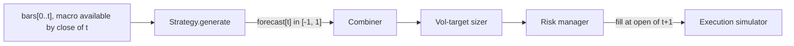

# Strategies

A strategy (an "alpha model") turns point-in-time market data into a **forecast**: one
number per bar in `[-1, 1]`, decided at the close of that bar. Aurum registers 15
strategies. Twelve are described on this page: 11 fixed rules and the learned
`intraday_seasonality`. `ml_gbm`, `meta_label` and `rl_ppo` have their own page
([ml-and-rl.md](ml-and-rl.md)). A forecast is a statement of conviction, not a position
size. The combiner, the volatility-targeting sizer and the risk manager downstream
([portfolio-and-risk.md](portfolio-and-risk.md)) turn it into lots. This page covers the
forecast contract, the scaling convention every rule shares, the full catalogue with
defaults, how to configure strategies, and how to write and register your own. None of the
rationales below is evidence that a rule works on gold. The out-of-sample evidence is in
[RESULTS.md](RESULTS.md).

**On this page**

- [The forecast contract](#the-forecast-contract)
- [Forecast scaling (Carver's convention)](#forecast-scaling-carvers-convention)
- [Catalogue at a glance](#catalogue-at-a-glance)
- [Trend](#trend): `tsmom`, `ema_cross`, `donchian`, `kalman_trend`
- [Mean reversion](#mean-reversion): `zscore_fade`, `rsi2`, `bollinger_revert`
- [Breakout](#breakout): `vol_squeeze`, `orb`
- [Macro](#macro): `macro_factor`, `risk_off`
- [Learned seasonality](#learned-seasonality-intraday_seasonality): `intraday_seasonality`
- [Which configuration runs which strategy](#which-configuration-runs-which-strategy)
- [Configuring strategies in YAML](#configuring-strategies-in-yaml)
- [Writing and registering a custom strategy](#writing-and-registering-a-custom-strategy)
- [Evidence](#evidence)

---

## The forecast contract

The contract is defined in `aurum/strategies/base.py` and enforced by the test suite.

| Rule | What it means |
|---|---|
| Range | `forecast[t]` is a float in `[-1, +1]`. `+1` is maximum long conviction, `-1` maximum short, `0` flat. |
| Timing | `forecast[t]` is decided at the **close** of bar `t`, i.e. at `bars["available_at"][t]`. The simulator executes it at the **open** of bar `t+1`. |
| Causality | `forecast[t]` may depend only on bars `0..t` and on macro rows whose `available_at` is at or before `available_at[t]`. |
| Warm-up | The first `warmup_bars` rows are exactly `0.0`, never NaN. |
| Clean output | No NaN or inf. The index equals `md.bars.index`. |
| Magnitude | Conviction, **not lots**. Volatility targeting happens in `aurum.portfolio`. |
| Training | `fit(md, features)` receives training data only (the walk-forward engine guarantees this). Anything learned is stored on `self`. |
| Cloning | Strategies are cheap to deep-copy. The walk-forward engine clones one per fold. |



Every strategy class declares:

| Attribute | Meaning |
|---|---|
| `name` | Registry key, e.g. `"tsmom"`. It is also the default forecast-column id in configs. |
| `description` | One-line summary, printed by `aurum strategies list`. |
| `trainable` | `True` if `fit` learns from data. Trainable strategies are refit on every walk-forward fold. |
| `default_params()` | Class method returning every parameter and its default. |
| `warmup_bars` | Property: bars of history needed before the forecast is meaningful. |
| `fit_history_bars` | Property (default 0): extra bars *before* the training window that `fit` may receive purely for feature warm-up. See [ml-and-rl.md](ml-and-rl.md#warm-up-history-fit_history_bars). |

`Strategy._finalize(forecast, index)` implements the output rules in one place. It aligns
to the index, maps inf and NaN to 0, clips to `[-1, 1]` and zeroes the warm-up. Every
built-in strategy calls it at the end of `generate`.

Example on synthetic data (`aurum.data.synthetic` builds valid bars offline):

```python
from aurum.core.types import MarketData
from aurum.data.synthetic import make_synthetic_bars
from aurum.strategies import get_strategy

bars = make_synthetic_bars(5000, "H1", seed=1)          # driftless GBM, H1, with spreads
md = MarketData(bars=bars)

strat = get_strategy("tsmom")                            # defaults: horizons (120, 480, 1440)
f = strat.generate(md)

print(strat)
print("warmup_bars:", strat.warmup_bars)
print("zeros in warm-up:", bool((f.iloc[: strat.warmup_bars] == 0).all()))
print("range:", round(f.min(), 3), round(f.max(), 3))
print("mean |f| after warm-up:", round(f.iloc[strat.warmup_bars:].abs().mean(), 3))
print(f.tail(3))
```

```text
TimeSeriesMomentum({'horizons': (120, 480, 1440), 'weights': None, 'response': 'linear', 'vol_halflife': 240.0, 'vol_min_periods': 120})
warmup_bars: 1441
zeros in warm-up: True
range: -1.0 1.0
mean |f| after warm-up: 0.439
time
2020-10-25 23:00:00+00:00   -1.0
2020-10-26 00:00:00+00:00   -1.0
2020-10-26 01:00:00+00:00   -1.0
Name: tsmom, dtype: float64
```

Causality is not taken on trust. For several cutoffs, `tests/test_strategies_leakage.py`
builds two alternative histories: one where every bar after the cutoff comes from an
unrelated random path (and unpublished macro rows are scrambled), and one truncated at the
cutoff. A causal strategy must return a bit-identical forecast up to the cutoff in the
original and in both alternatives. See
[Writing and registering a custom strategy](#writing-and-registering-a-custom-strategy) for
how a new strategy is picked up by this harness.

## Forecast scaling (Carver's convention)

All rule-based strategies share one scaling convention, taken from Carver (*Systematic
Trading*, 2015, ch. 7). The average absolute forecast should be half the cap: 10 on Carver's
±20 scale, which is **0.5** on Aurum's `[-1, 1]` scale. The helpers live in
`aurum/strategies/trend.py` and are imported by the other rule modules.

- **Signals are built as dimensionless statistics that are about N(0, 1) under a driftless
  random walk.** Examples are a vol-normalised return, a vol-normalised EMA spread and a
  Kalman slope t-statistic. Volatility is a zero-mean EWMA of squared log returns
  (`bar_volatility`), using the normalised (`adjust=True`) form, so a short live history and
  a long research history agree once both span a few half-lives.
- **The scalar is analytic, not fitted.** Multiplying an N(0, 1) statistic by
  `Z_FORECAST_SCALAR = 0.5 / E|Z| = 0.5 / sqrt(2/pi) = 0.6267` gives `E|forecast| = 0.5`
  under the null, before the ±1 cap. Nothing is estimated from the sample, so there is no
  look-ahead and no sample dependence.
- **Combining correlated sub-signals.** Averaging several sub-forecasts shrinks their
  magnitude. Carver's forecast diversification multiplier `FDM = 1 / sqrt(w' C w)` restores
  it. Here `C` is the correlation *under the null*, computed analytically: `sqrt(h_min / h_max)`
  for vol-normalised returns over overlapping horizons (arcsine-transformed for sign
  responses). Negative correlations are floored at 0 and the FDM is capped at `MAX_FDM = 2.5`.
- **Fixed-size rules pick a level instead.** `donchian` holds `±level` while in a
  position. Its default `level=0.8` was chosen so that the long-run average |forecast| on a
  random walk, where it is in the market about 62% of the time, is close to 0.5.
- **Learned strategies set their scalar at fit time.** `intraday_seasonality` scales its
  table to an average |forecast| of 0.5 on training data. `ml_gbm` and `meta_label` fit a
  Carver scalar on their validation tail, behind a skill gate
  ([ml-and-rl.md](ml-and-rl.md#forecast-mapping-and-the-skill-gate)).

The cap at ±1 trims the realised average below 0.5. On a synthetic random walk:

```python
from aurum.core.types import MarketData
from aurum.data.synthetic import make_synthetic_bars, make_synthetic_macro
from aurum.strategies import get_strategy
from aurum.strategies.trend import Z_FORECAST_SCALAR

bars = make_synthetic_bars(20_000, "H1", seed=3)         # driftless random walk
md = MarketData(bars=bars, macro=make_synthetic_macro(bars, seed=3))
print(f"Z_FORECAST_SCALAR = {Z_FORECAST_SCALAR:.4f}")
for name in ("tsmom", "ema_cross", "kalman_trend", "donchian", "vol_squeeze", "macro_factor"):
    s = get_strategy(name)
    f = s.generate(md).iloc[s.warmup_bars:]
    print(f"{name:13s} mean|f| = {f.abs().mean():.3f}   share at +/-1 = {(f.abs() == 1).mean():.3f}")
```

```text
Z_FORECAST_SCALAR = 0.6267
tsmom         mean|f| = 0.414   share at +/-1 = 0.084
ema_cross     mean|f| = 0.465   share at +/-1 = 0.118
kalman_trend  mean|f| = 0.432   share at +/-1 = 0.087
donchian      mean|f| = 0.465   share at +/-1 = 0.000
vol_squeeze   mean|f| = 0.114   share at +/-1 = 0.024
macro_factor  mean|f| = 0.507   share at +/-1 = 0.170
```

`vol_squeeze` is well below 0.5 because it is flat most of the time; it only trades after
a squeeze releases. These are properties of the scaling on noise, not performance figures.

## Catalogue at a glance

`warmup_bars` is for the default parameters (bar counts, so it scales with the timeframe
you run). "Stateful" means the forecast depends on a position state machine, not only on a
trailing window: a run that starts later can disagree with a full-history run until the
state converges, which is why some warm-ups are longer than their longest window.

| Strategy | Family | Trainable | Stateful | Long/short | `warmup_bars` | Needs beyond OHLC bars |
|---|---|---|---|---|---|---|
| `tsmom` | Trend | no | no | both | 1441 | – |
| `ema_cross` | Trend | no | no | both | 385 | – |
| `donchian` | Trend / breakout | no | **yes** | both | 241 | – |
| `kalman_trend` | Trend | no | no | both | 721 | – |
| `zscore_fade` | Mean reversion | no | **yes** | both | 50 | – |
| `rsi2` | Mean reversion | no | **yes** | both | 201 | – |
| `bollinger_revert` | Mean reversion | no | **yes** | both | 49 | – |
| `vol_squeeze` | Breakout | no | **yes** | both | 67 | – |
| `orb` | Breakout | no | **yes** | both | 0 | H1 or faster bars |
| `macro_factor` | Macro | no | no | both | 0 | `md.macro["dxy"]`, `md.macro["real10y"]` |
| `risk_off` | Macro | no | **yes** | **long only** | 0 | `md.macro["vix"]` (`"dxy"` optional) |
| `intraday_seasonality` | Learned | **yes** | no | both | 0 | – (its cost estimate uses the bars' `spread` column) |
| `ml_gbm` | ML | **yes** | no | both | 5820 | see [ml-and-rl.md](ml-and-rl.md#ml_gbm-direction-classifier) |
| `meta_label` | ML | **yes** | no | follows primary | 5820 | see [ml-and-rl.md](ml-and-rl.md#meta_label-meta-labelling-a-primary) |
| `rl_ppo` | RL | **yes** | **yes** | both | 0 until an artifact is attached | `pip install -e ".[rl]"`, see [ml-and-rl.md](ml-and-rl.md#the-rl_ppo-strategy-adapter) |

The registry itself, from `aurum strategies list` (description column truncated by the CLI):

```bash
aurum strategies list
```

```text
strategy              trainable  warmup_bars                                                                                 description
----------------------------------------------------------------------------------------------------------------------------------------
bollinger_revert          False           49  Bollinger(48, 2) reversion: enter when price closes back inside a band, target the middle 
donchian                  False          241  Turtle-style Donchian breakout (120-bar entry, 60-bar exit channel, 2.5 ATR stop on H1); s
ema_cross                 False          385  EWMAC fast/slow EMA crossover (32/128 H1 bars); continuous forecast = EMA spread normalise
intraday_seasonality       True            0  Hour-of-week (New York clock) drift learned on training data with empirical-Bayes shrinkag
kalman_trend              False          721  Local-linear-trend Kalman filter on log price (≈240-bar memory on H1); forecast = filtered
macro_factor              False            0  Macro momentum: long gold when the dollar (DXY) and 10y real yields have been falling over
meta_label                 True         5820  Meta-labelling: an ML classifier predicts whether the primary strategy's bet (default tsmo
ml_gbm                     True         5820  HistGradientBoosting classifier on causal features predicting the triple-barrier (or vol-n
orb                       False            0  Opening-range breakout for the London and New York opens (60-min range, DST-aware local ti
risk_off                  False            0  Safe-haven regime: long gold (only) after a VIX spike vs its 60-day EWMA baseline, standin
rl_ppo                     True            0  PPO policy (stable-baselines3) trained on the shared simulator with vol-targeted sizing an
rsi2                      False          201  Connors RSI(2) pullback: buy RSI2<10 above the 200-bar SMA (sell RSI2>90 below it), exit o
tsmom                     False         1441  Multi-horizon time-series momentum (1w/1m/3m on H1): vol-normalised past returns, Carver-s
vol_squeeze               False           67  TTM-style squeeze: when Bollinger(20,2) exits Keltner(20,1.5 ATR) after a compression, tra
zscore_fade               False           50  Fade |z| > 2 of log price vs its 48-bar mean, only when Kaufman's efficiency ratio says th
```

All rule-based strategies reject unknown parameter names with a `ValueError` (a typo such as
`horizon` instead of `horizons` would otherwise be silently ignored). The defaults below were
chosen for H1 bars (about 23 bars per trading day). Window parameters are in **bars**, so
running another timeframe changes their meaning in calendar time.

---

## Trend

Module `aurum/strategies/trend.py`. Time-series momentum, where an asset's own past return
predicts its future return, is one of the best documented anomalies across asset classes
(Moskowitz, Ooi & Pedersen 2012; Hurst, Ooi & Pedersen 2017). Proposed mechanisms are
behavioural under-reaction followed by delayed over-reaction, and slow-moving capital. Gold's
drivers (real rates, the dollar, reserve demand) move in persistent regimes. At intraday
horizons the edge is thinner and costs matter more, so the defaults favour multi-day
horizons.

### `tsmom`: time-series momentum

**Rationale.** The sign and strength of past returns over several lookbacks predict the next
period's return. Blends of 1-, 3- and 12-month lookbacks have been the most robust
historically (Hurst et al. 2017). On H1 the defaults are shorter: about 1 week, 1 month and
3 months.

**Signal.**

1. For each horizon `h`: `z_h = ln(C_t / C_{t-h}) / (sigma_t * sqrt(h))`, where `sigma_t`
   is the EWMA per-bar volatility.
2. Apply a response: `linear` (`z * 0.6267`), `sign` (`sign(z) * 0.5`, as in Moskowitz et
   al.) or `baz` (`z * exp(-z^2/4) / 0.89`, Baz et al. 2015, which fades very stretched
   trends; rescaled to `E|.| = 0.5`).
3. Take the weighted mean across horizons, multiply by the null-correlation FDM (1.253 for
   the default horizons with the linear response), and clip to `[-1, 1]`.

| Parameter | Default | Meaning |
|---|---|---|
| `horizons` | `(120, 480, 1440)` | Lookbacks in bars. |
| `weights` | `None` | Horizon weights (non-negative, normalised). `None` = equal. |
| `response` | `"linear"` | `"linear"`, `"sign"` or `"baz"`. |
| `vol_halflife` | `240.0` | EWMA half-life (bars) of the volatility normaliser. |
| `vol_min_periods` | `120` | Bars before the volatility estimate is defined. |

**Warm-up:** `max(max(horizons), vol_min_periods) + 1` (1441). **Stateful:** no.

**References:** Moskowitz, Ooi & Pedersen (2012), "Time series momentum", *JFE* 104(2);
Hurst, Ooi & Pedersen (2017), *JPM* 44(1); Baz et al. (2015), SSRN 2695101; Carver (2015).

### `ema_cross`: EWMAC crossover

**Rationale.** The spread between a fast and a slow EMA of price is a smoothed momentum
measure, a linear filter of past returns (Levine & Pedersen 2016 show crossovers and TSMOM
are both such filters). It captures the same persistence premium as `tsmom` with less
turnover from single-bar noise.

**Signal.** `d_t = EMA_fast(ln C) - EMA_slow(ln C)`, divided by its exact standard deviation
under a random walk, `sigma_t * sqrt(V)`, where `V` is given by `ema_spread_variance(fast,
slow)` (14.404 for 32/128). This replaces Carver's empirically fitted forecast scalar with an
analytic one. The result is multiplied by 0.6267 and clipped.

| Parameter | Default | Meaning |
|---|---|---|
| `fast` | `32` | Fast EMA span (bars). Must satisfy `1 <= fast < slow`. |
| `slow` | `128` | Slow EMA span (bars). |
| `vol_halflife` | `240.0` | EWMA half-life of the volatility normaliser. |
| `vol_min_periods` | `120` | Bars before volatility is defined. |

**Warm-up:** `max(3 * slow, vol_min_periods) + 1` (385). The EMAs are seeded with the
first price; after three slow spans the seed's weight is below 0.3%. **Stateful:** no.

**References:** Carver (2015), ch. 7 and App. B; Levine & Pedersen (2016), "Which Trend Is
Your Friend?", *FAJ* 72(3).

### `donchian`: Turtle-style channel breakout

**Rationale.** A close above the highest high of the last `entry_n` bars means supply at
previous resistance has been absorbed. Breakouts are a non-linear trend filter that enters
once a move is established and cuts losers quickly, which gives positive skew. They were the
core of the Turtle system (Faith 2007).

**Rules** (evaluated at each close):

- Flat → long when `close_t > max(high over the previous entry_n bars)`; short symmetric.
  The channel excludes the current bar.
- Long → flat when `close_t < min(low over the previous exit_n bars)` (exit channel) or
  `close_t < entry_close - stop_atr * ATR_at_entry` (the stop is fixed at entry).
- A stop-out can reverse on the same bar if the opposite breakout fires.
- No entries while ATR is undefined or zero.
- The forecast is `±level` while in a position.

| Parameter | Default | Meaning |
|---|---|---|
| `entry_n` | `120` | Entry channel length (bars). |
| `exit_n` | `60` | Exit channel length (bars). |
| `atr_n` | `48` | ATR period (Wilder smoothing). |
| `stop_atr` | `2.5` | Stop distance in ATRs at entry. `None` disables the stop. |
| `level` | `0.8` | Forecast magnitude while in a position, in `(0, 1]`. |

**Warm-up:** `2 * max(entry_n, exit_n, atr_n) + 1` (241). **Stateful:** yes. A trade opened
long ago stays open while the exit channel and stop hold. The doubled warm-up lets a
shorter history converge to the full-history position (the module docstring records the
check on 2012–19 H1 gold).

**References:** Donchian (1960), *FAJ* 16(6); Faith (2007), *Way of the Turtle*; Hurst, Ooi
& Pedersen (2017).

### `kalman_trend`: local-linear-trend Kalman slope

**Rationale.** Model log price as a level plus a slowly varying drift, buried in noise. The
Kalman filter is the optimal linear estimator of that drift from the past (Harvey 1989). It
is a trend filter like an EMA crossover, with weights derived from an explicit
signal-to-noise model instead of ad-hoc spans.

**Signal.** The steady-state gain of the local linear trend model is solved once from the
discrete algebraic Riccati equation, with `slope_noise = 1 / lookback^2` (the slope's random
walk moves by one return-sigma over `lookback` bars). The filter is run as an ARMA recursion
(`scipy.signal.lfilter`) on `ln C_t - ln C_0`. The forecast is the filtered slope divided by
its exact random-walk standard deviation, `sigma_t * ||g||` (a t-statistic), times 0.6267,
clipped.

| Parameter | Default | Meaning |
|---|---|---|
| `lookback` | `240` | Filter memory in bars (sets `slope_noise`). Must be `>= 2`. |
| `level_noise` | `1.0` | Level process variance, as a multiple of the per-bar return variance. |
| `obs_noise` | `0.1` | Observation noise variance, same units. |
| `vol_halflife` | `240.0` | EWMA half-life of the volatility normaliser. |
| `vol_min_periods` | `120` | Bars before volatility is defined. |

**Warm-up:** `max(3 * lookback, vol_min_periods) + 1` (721). **Stateful:** no (the filter
starts at the first price with zero slope; the warm-up covers that seed).

**References:** Harvey (1989), *Forecasting, Structural Time Series Models and the Kalman
Filter*; Durbin & Koopman (2012); Benhamou (2016), SSRN 2747102.

---

## Mean reversion

Module `aurum/strategies/mean_reversion.py`. At short horizons, price moves driven by
order-flow imbalance rather than information tend to partially reverse. Liquidity providers
absorb the imbalance, demand a premium, and lay the inventory off (Grossman & Miller 1988;
Nagel 2012). The effect is regime dependent: fading a move in an information-driven trend is
ruinous, so each rule here has a regime or trend filter.

All three are long/short and stateful through the vectorised `latch` state machine
(`aurum/strategies/trend.py`). A long opens on an entry signal and is held until its exit or
an opposite entry. When an entry and an exit fire on the same bar the entry wins, and
simultaneous long and short entries cancel. The magnitude is continuous and decays as the
trade works.

### `zscore_fade`: z-score fade in non-trending regimes

**Rationale.** When the price path is inefficient (Kaufman's efficiency ratio
`|C_t - C_{t-n}| / sum|dC|` is low), large deviations from the local mean are more likely
liquidity overshoots than information (Lo & MacKinlay 1990). When the ratio is high the
market is trending, so fading is switched off and open fades are closed.

**Rules.**

- `z = (ln C - rolling mean) / rolling std` over `n` bars.
- The regime gate is `ER(er_n)` measured on the window ending at the **previous** bar, so
  the shock being faded cannot itself open the gate.
- Enter long when `z < -entry_z` and the gate is open; short symmetric.
- Exit a long when `z >= -exit_z` (reverted) or the gate closes; short symmetric.
- Forecast while in a trade: `sign * min(1, |z| / (2 * entry_z))`, i.e. 0.5 at entry.

| Parameter | Default | Meaning |
|---|---|---|
| `n` | `48` | z-score window (bars), `>= 3`. |
| `entry_z` | `2.0` | Entry threshold. |
| `exit_z` | `0.5` | Exit band. Must satisfy `0 <= exit_z < entry_z`. |
| `er_n` | `48` | Efficiency-ratio window (bars), `>= 2`. |
| `er_max` | `0.3` | Gate: trade only when `ER < er_max`. `None` disables the gate. |

**Warm-up:** `max(n, er_n + 1) + 1` (50; without the gate, `n + 1`). **Stateful:** yes.

**References:** Kaufman (1995), *Smarter Trading*; Lo & MacKinlay (1990), *RFS* 3(2); Nagel
(2012), *RFS* 25(7).

### `rsi2`: Connors RSI(2) pullback

**Rationale.** Buy short, sharp pullbacks inside an uptrend and sell rallies inside a
downtrend. The trend filter aligns the trade with slower momentum while the entry exploits
short-horizon reversal (Connors & Alvarez 2008 document it on equity indices).

**Rules.**

- Long when `RSI(rsi_n) < lower` and `close > SMA(trend_n)`. Exit when `close > SMA(exit_n)`.
- Short when `RSI > upper` and `close < SMA(trend_n)`. Exit when `close < SMA(exit_n)`.
- The magnitude is set at each entry signal from the RSI depth and held:
  `0.5 + 0.5 * (lower - RSI) / lower` for longs (0.5 at the threshold, 1.0 at RSI 0), and
  symmetrically for shorts.

| Parameter | Default | Meaning |
|---|---|---|
| `rsi_n` | `2` | Wilder RSI period. |
| `lower` | `10.0` | Long entry threshold. Must satisfy `0 < lower < upper < 100`. |
| `upper` | `90.0` | Short entry threshold. |
| `trend_n` | `200` | Trend-filter SMA (bars). `None` disables the filter. |
| `exit_n` | `5` | Exit SMA (bars). |

**Warm-up:** `max(trend_n or 0, exit_n, 5 * rsi_n) + 1` (201). **Stateful:** yes.

**References:** Connors & Alvarez (2008), *Short Term Trading Strategies That Work*; Wilder
(1978), *New Concepts in Technical Trading Systems*.

### `bollinger_revert`: Bollinger-band reversion

**Rationale.** Closes outside `mid ± k·sd` are statistically stretched. With `confirm=True`
the entry waits until the close is back inside the band, which is Bollinger's own advice
for avoiding a "walk up the band" (a genuine breakout). A protective exit caps the loss when
the excursion becomes a trend.

**Rules.**

- Long when the previous close was below the lower band and the current close is back
  inside and below the middle band. Exit at `close >= mid` or `close < mid - stop_k * sd`.
  Short symmetric.
- `confirm=False` enters directly on a close outside the band (but not beyond the stop).
- Forecast while in a trade: `sign * min(1, |close - mid| / (k * sd))`, about 1 at the band
  and falling to 0 at the middle.

| Parameter | Default | Meaning |
|---|---|---|
| `n` | `48` | SMA and standard-deviation window (bars), `>= 3`. |
| `k` | `2.0` | Band width in standard deviations. Must satisfy `0 < k < stop_k`. |
| `stop_k` | `3.5` | Protective exit distance in standard deviations. |
| `confirm` | `True` | Wait for a close back inside the band before entering. |

**Warm-up:** `n + 1` (49). **Stateful:** yes.

**References:** Bollinger (2001), *Bollinger on Bollinger Bands*; Lo & MacKinlay (1990).

---

## Breakout

Module `aurum/strategies/breakout.py`. Volatility clusters and mean-reverts, so unusually
low realised ranges tend to be followed by expansion. When a compressed range resolves, the
first move often carries because resting stop orders cluster just outside the range (Osler
2003, 2005). Both rules are stateful loops over bars, evaluated at each close with data up
to that close only.

### `vol_squeeze`: Bollinger-inside-Keltner squeeze release

**Rationale.** Bollinger bands inside the Keltner channel mean close-to-close dispersion is
unusually low relative to bar ranges, i.e. a volatility compression. The release tends to be
directional, so the trade follows the prevailing momentum (Carter 2005).

**Rules.**

- The squeeze is ON when both Bollinger bands (`SMA ± bb_k·sd`) lie strictly inside the
  Keltner channel (`EMA ± kc_mult·ATR`).
- When it turns OFF after at least `min_squeeze` consecutive ON bars, enter in the direction
  of the vol-normalised `mom_n`-bar momentum `z`.
- Hold for at most `hold` bars. Exit early if momentum flips sign or becomes undefined.
- Forecast while in a trade: `sign * min(1, 0.6267 * |z|)`.

| Parameter | Default | Meaning |
|---|---|---|
| `n` | `20` | Bollinger/Keltner window (bars), `>= 2`. |
| `bb_k` | `2.0` | Bollinger width (standard deviations). |
| `kc_mult` | `1.5` | Keltner width (ATRs). |
| `atr_n` | `20` | ATR period. |
| `min_squeeze` | `6` | Minimum consecutive squeeze bars before a release counts. |
| `mom_n` | `20` | Momentum horizon (bars). |
| `hold` | `36` | Maximum holding period (bars). |
| `vol_halflife` | `120.0` | EWMA half-life of the momentum normaliser. |
| `vol_min_periods` | `60` | Bars before volatility is defined. |

**Warm-up:** `max(n, atr_n, mom_n, vol_min_periods) + min_squeeze + 1` (67).
**Stateful:** yes.

**References:** Carter (2005), *Mastering the Trade*, ch. 11; Osler (2005), *JIMF* 24(2);
Bollinger (2001).

### `orb`: London and New York opening-range breakout

**Rationale.** Overnight order flow and news get priced in the first minutes after a major
session opens. A close outside that opening range suggests one side has won the auction
(Crabel 1990; Zarattini & Aziz 2023). Gold's two main liquidity windows are the London open
and the New York open (COMEX, 08:30 ET US data).

**Rules**, per session and per local trading day (weekdays only):

- The opening range (OR) is the high/low of bars whose **open** lies in
  `[open, open + range_minutes)` local time and that **end** by the OR end. Bars longer than
  the range cannot form one: on H4 or D1 the strategy logs a warning and returns 0.
- From the OR end until the local session end, at each close: go long on the first close
  above the OR high, short on the first close below the OR low. At most one entry per
  session.
- Exit on a close back beyond the opposite side of the OR (or flip, with
  `allow_reversal=True`). Always flat from the session end.
- Optional width filter: skip the session when the OR width is outside
  `[min_range_atr, max_range_atr] × ATR(atr_n)`.
- Each active session contributes `±level`. Overlapping sessions add and are capped at ±1.

Session times are converted from local wall-clock time with `zoneinfo`, so London and New
York DST are handled independently. Defaults (`DEFAULT_SESSIONS`): `london` =
`Europe/London` 08:00–16:00 and `new_york` = `America/New_York` 08:00–16:00.

| Parameter | Default | Meaning |
|---|---|---|
| `sessions` | `("london", "new_york")` | Sessions to trade (a single string is accepted). |
| `session_times` | `None` | Mapping `name -> (tz, "HH:MM" open, "HH:MM" end)` that overrides or extends the defaults. |
| `range_minutes` | `60` | Opening-range length. Must end before the session end. |
| `level` | `0.5` | Forecast per active session, in `(0, 1]`. |
| `allow_reversal` | `False` | Flip instead of exiting on a close beyond the opposite side. |
| `min_range_atr` | `0.0` | Width filter lower bound (ATRs). |
| `max_range_atr` | `None` | Width filter upper bound (ATRs). `None` = no upper bound. |
| `atr_n` | `24` | ATR period for the width filter. |

**Warm-up:** 0, or `atr_n + 1` when the width filter is enabled. **Stateful:** yes (resets
every session). If no bar fits the opening range over a week or more of data (for example
H1 bars stamped at :30), it logs a warning instead of silently returning zeros.

**References:** Crabel (1990), *Day Trading with Short Term Price Patterns and Opening Range
Breakout*; Zarattini & Aziz (2023), SSRN 4416622; Osler (2005).

---

## Macro

Module `aurum/strategies/macro.py`. Gold is a non-yielding, dollar-denominated asset. Its
best documented macro drivers are US real interest rates (the opportunity cost of holding
it; Erb & Harvey 2013) and the US dollar (Capie, Mills & Wood 2005). Gold has also been a
short-lived safe haven in equity stress (Baur & Lucey 2010), except in "dash for cash"
squeezes such as March 2020.

**Point-in-time handling.** Each macro series is transformed on its own observation
sequence. A derived row is available at the running maximum of its inputs' `available_at`,
and is mapped onto bars with `aurum.data.pit.asof_join` against `bars["available_at"]`, with
a staleness tolerance (`stale_days`). A dead feed therefore decays to "no signal" instead of
being carried forever. A configured series that is missing, or that has no usable value at
the latest bar, is logged once as a WARNING. Warm-up is governed by the macro history, not
by bar counts, so `warmup_bars` is 0 and rows without enough macro history are 0. Macro data
and its publication lags are described in [data.md](data.md).

### `macro_factor`: dollar and real-yield momentum

**Rationale.** Real yields and the dollar follow persistent, policy-driven trends. Recent
declines in DXY and 10-year TIPS yields therefore suggest continued support for gold, and
rises suggest pressure. Using the drivers' *momentum*, rather than contemporaneous changes,
keeps the rule strictly point-in-time.

**Signal.**

1. For each series in `series` (name → sign of gold's exposure), compute multi-horizon,
   vol-normalised momentum on its own daily observations. Prices use log changes; yields
   (named in `DEFAULT_YIELD_SERIES` or with `attrs["kind"]` `"yield"`/`"rate"`) use level
   changes.
2. Align each z-score to the bars as of `available_at`, with the `stale_days` tolerance.
3. Combine the signed z's as `sum(w_i z_i) / sqrt(sum w_i^2)` over the series available at
   that bar, then multiply by 0.6267 and clip. With no series available the forecast is 0.

| Parameter | Default | Meaning |
|---|---|---|
| `series` | `{"dxy": -1.0, "real10y": -1.0}` | Macro series name → sign (and weight) of gold's exposure. |
| `horizons` | `(5, 20, 60)` | Momentum horizons in **observations** (about 1 week, 1 month, 1 quarter of daily data). |
| `vol_halflife` | `60.0` | EWMA half-life (observations) of the change volatility. |
| `vol_min_obs` | `20` | Observations before volatility is defined. |
| `stale_days` | `10.0` | Staleness tolerance of the as-of join (days). |

**Warm-up:** 0 (see above). **Stateful:** no.

**References:** Erb & Harvey (2013), "The Golden Dilemma", *FAJ* 69(4); Capie, Mills & Wood
(2005), *JIFMIM* 15(4); Barsky & Summers (1988), *JPE* 96(3).

### `risk_off`: VIX-spike safe-haven regime (long only)

**Rationale.** Gold tends to gain in the days and weeks after acute equity stress (Baur &
Lucey 2010; Baur & McDermott 2010). A jump of log VIX far above its own recent baseline
marks the onset (Whaley 2000). In a dollar squeeze, leveraged holders sell gold for
liquidity, so the rule stands aside when dollar momentum is extreme. It is long-only by
design: calm markets carry no symmetric short signal.

**Signal** (daily, on the VIX's own observations):

- `z = (ln VIX_t - m_{t-1}) / s_{t-1}`, where `m` and `s` are the EWMA mean and standard
  deviation of log VIX up to the **previous** print.
- The regime switches on when `z > entry_z` and off when `z < exit_z` (hysteresis).
- While on: `forecast = min(1, 0.5 * (z - exit_z) / (entry_z - exit_z))`. That is 0.5 at the
  entry threshold, larger for bigger spikes, and decays as fear subsides.
- Forced to 0 while the `dxy_horizon`-day vol-normalised DXY momentum exceeds `dxy_z_max`
  (disabled with `None`, or when the DXY series is missing).

| Parameter | Default | Meaning |
|---|---|---|
| `vix_series` | `"vix"` | Name of the VIX series in `md.macro`. |
| `dxy_series` | `"dxy"` | Name of the dollar-index series. |
| `halflife` | `60.0` | EWMA half-life (observations) of the VIX baseline. |
| `min_obs` | `40` | Observations before the baseline is defined. |
| `entry_z` | `1.5` | Regime-on threshold. Must be `> exit_z`. |
| `exit_z` | `0.5` | Regime-off threshold. |
| `dxy_z_max` | `2.0` | Dollar-squeeze filter threshold. `None` disables it. |
| `dxy_horizon` | `5` | DXY momentum horizon (observations). |
| `stale_days` | `10.0` | Staleness tolerance of the as-of join (days). |

**Warm-up:** 0. **Stateful:** yes (hysteresis on daily observations).

**References:** Baur & Lucey (2010), *Financial Review* 45(2); Baur & McDermott (2010),
*JBF* 34(8); Whaley (2000), *JPM* 26(3).

---

## Learned seasonality: `intraday_seasonality`

Module `aurum/strategies/seasonal.py`. This is the only trainable strategy on this page.

**Rationale.** Gold's order flow runs on a clock: Asian physical buying, the London open and
LBMA auctions, the COMEX open and 08:30 ET US data, the 17:00 ET rollover and Friday
de-risking. Recurring liquidity demand can produce periodic return patterns (Heston,
Korajczyk & Sadka 2010; Cai, Cheung & Wong 2001 for COMEX gold). The patterns are small
relative to noise, so estimates must be shrunk hard. They are also small relative to a
retail CFD's spread, so positions must be chosen net of costs.

**`fit` (training data only).**

1. For every decision bar `t`, the target is the vol-normalised open-to-close return of the
   bar the position will actually hold: `y_t = ln(C_{t+1} / O_{t+1}) / sigma_t`. It is
   grouped by the local hour-of-week bucket of `available_at[t]` (New York clock by default,
   DST-aware).
2. Buckets seen fewer than `min_obs` times are dropped.
3. **Homogeneity pre-test.** Unless Welch's heteroskedastic one-way ANOVA rejects "all
   bucket means equal" at level `significance`, the table is flat. With `demean=False` the
   null is "all means zero" (chi-square test).
4. **Shrinkage.** Bucket means are shrunk towards the precision-weighted mean with an
   empirical-Bayes estimator: `B_b = tau^2 / (tau^2 + se_b^2)`, using each bucket's own
   variance, and `tau^2` from the DerSimonian & Laird moment estimator. A numeric
   `shrinkage` uses a fixed prior strength `B_b = n_b / (n_b + lambda)` instead.
5. The effects are scaled so their average |forecast| is 0.5 (Carver), and capped at 1.
6. **Cost-aware positions** (`cost_aware=True`). Per-bucket trading cost `kappa_b` is
   estimated from the training bars' spreads and ranges with the `CostModel`, in the same
   volatility units as the edge. Positions solve a periodic mean-variance problem with
   proportional costs over the weekly cycle (dynamic programming on an 81-point position
   grid): `max sum_b [f_b alpha_b - (gamma/2) f_b^2 - lambda kappa_b |f_b - f_{b-1}|]`. The
   solution is a no-trade band. A position change must earn `lambda` times its cost, adjacent
   same-sign buckets are held as one position, and a lone bucket only trades if its edge
   clears the round-trip cost by the margin.

**`generate`.** A pure function of the bar timestamps and the fitted table, so it is
trivially point-in-time. A bucket not seen in training holds the preceding bucket's
position. Financing is **not** modelled in the fit.

The fitted diagnostics are in `fit_summary_` (test statistic and p-value, `tau2`, mean
shrinkage, active buckets, expected turnover, gross edge and cost per week, and the
frictionless turnover for comparison).

| Parameter | Default | Meaning |
|---|---|---|
| `tz` | `"America/New_York"` | Clock used for the buckets. |
| `bucket_minutes` | `60` | Bucket width, in `[1, 1440]`. |
| `shrinkage` | `"empirical_bayes"` | Or a non-negative prior strength in observations. |
| `demean` | `True` | Remove the training-period average drift (pure timing signal). |
| `min_obs` | `30` | Buckets seen fewer times forecast 0 / are held through. |
| `significance` | `0.05` | Level of the homogeneity pre-test. `None` disables the test. |
| `cost_aware` | `True` | Choose positions net of costs. `False` = the frictionless table. |
| `costs` | `None` | `CostModel` or its keyword arguments. `None` = `CostModel()` defaults. |
| `cost_multiplier` | `2.0` | Required edge/cost margin `lambda`. `0` = frictionless. |
| `dead_zone` | `"auto"` | `"auto"` = the cost-implied threshold only. A number in `[0, 1)` also zeroes every forecast whose absolute value is below it. |
| `vol_halflife` | `240.0` | EWMA half-life of the volatility normaliser. |
| `vol_min_periods` | `120` | Bars before volatility is defined. |

**Warm-up:** 0 (the forecast is a function of the clock). **Stateful:** no. `generate`
raises `RuntimeError` if called before `fit`.

**References:** Heston, Korajczyk & Sadka (2010), *JF* 65(4); Cai, Cheung & Wong (2001),
*JFM* 21(3); Efron & Morris (1975), *JASA* 70; DerSimonian & Laird (1986); Welch (1951),
*Biometrika* 38; Garleanu & Pedersen (2013), *JF* 68(6); McLean & Pontiff (2016), *JF*
71(1); Carver (2015).

---

## Which configuration runs which strategy

Checked with `load_config(...).enabled_strategies()` on the files in `configs/`.
`live_paper.yaml` and `desk_overlay.yaml` extend `default.yaml` without changing its
strategy list.

| Strategy | `default` / `live_paper` / `desk_overlay` | `trend_core` | `fast` |
|---|:-:|:-:|:-:|
| `tsmom` | ✓ | ✓ | ✓ |
| `ema_cross` | ✓ | ✓ | ✓ |
| `donchian` | ✓ | ✓ | ✓ |
| `kalman_trend` | ✓ | ✓ | |
| `zscore_fade` | ✓ | | ✓ |
| `rsi2` | ✓ | | ✓ |
| `bollinger_revert` | ✓ | | |
| `vol_squeeze` | ✓ | ✓ | |
| `orb` | ✓ | | |
| `macro_factor` | ✓ | ✓ | ✓ |
| `risk_off` | ✓ | ✓ | |
| `intraday_seasonality` | ✓ | | ✓ |
| `ml_gbm` | ✓ | | |
| `meta_label` | ✓ | | |
| `rl_ppo` | | | |
| **Count** | 14 | 7 | 7 |

`rl_ppo` is in no shipped configuration because it trains a PPO policy inside every fold.
See [ml-and-rl.md](ml-and-rl.md#the-rl_ppo-strategy-adapter) before adding it.
`default` and `trend_core` are the two pre-registered configurations of
[RESEARCH_PROTOCOL.md](RESEARCH_PROTOCOL.md). `fast` is a smoke/CI configuration and is
never evidence.

## Configuring strategies in YAML

Each entry of the `strategies:` list is a `StrategyConfig`:

| Key | Default | Meaning |
|---|---|---|
| `name` | required | Registry name. |
| `params` | `{}` | Keyword arguments, merged over `default_params()`. |
| `id` | `name` | Forecast-column id. Must be unique, so the same strategy can appear twice with different parameters. |
| `enabled` | `true` | `false` keeps the entry but skips it. |
| `weight` | `null` | Only used when `combiner.method: fixed`. |

A config that extends the default and runs two `tsmom` variants (lists replace, they are not
merged, so the whole strategy list is restated):

```yaml
# configs/my_trend.yaml
extends: default.yaml
name: my_trend
strategies:
  - {name: tsmom}
  - {name: tsmom, id: tsmom_fast, params: {horizons: [24, 120, 480]}}
  - {name: donchian, params: {entry_n: 240, exit_n: 120}}
  - {name: rsi2, enabled: false}
```

`aurum config validate` checks the file's structure but does **not** build the strategies.
Unknown strategy names and misspelt parameters are reported when a run builds them
(`backtest`, `walkforward`, `train-final`), in one `ConfigError`:

```text
ConfigError 2 configuration problems:
  - strategies[0] (tsmom): tsmom: unknown parameter(s) ['horizon']; valid: ['horizons', 'response', 'vol_halflife', 'vol_min_periods', 'weights']
  - strategies[1].name: unknown strategy 'sma_distance' (registered: ['bollinger_revert', 'donchian', 'ema_cross', 'intraday_seasonality', 'kalman_trend', 'macro_factor', 'meta_label', 'ml_gbm', 'orb', 'risk_off', 'rl_ppo', 'rsi2', 'tsmom', 'vol_squeeze', 'zscore_fade'])
```

Two details of `build_strategies`: a strategy whose `default_params()` contains `seed` gets
the config's top-level `seed` unless you set one, and the ML strategies (`ml_gbm`,
`meta_label`) and `rl_ppo` do **not** reject unknown parameter names, so check their
spelling carefully. For how configs are layered and overridden (`extends:`, `--set`), see
[configuration.md](configuration.md). The CLI commands are in [cli.md](cli.md).

Every strategy you add to a configuration and evaluate is a new trial. Under the research
protocol it must be counted in the Deflated Sharpe Ratio's `n_trials`
(`walkforward.n_trials`); see [research.md](research.md).

## Writing and registering a custom strategy

A strategy is a subclass of `aurum.strategies.Strategy` with a unique `name`, decorated with
`@register_strategy`. The minimum is `generate()`. Override `default_params()` and
`warmup_bars` whenever your rule has parameters or needs history. The helpers in
`aurum.strategies.trend` (`log_close`, `bar_volatility`, `z_to_forecast`, `check_params`,
`latch`, `momentum_z`, `diversification_multiplier`) give you the shared scaling convention
for free.

```python
from typing import Any

import numpy as np
import pandas as pd

from aurum.core.types import MarketData
from aurum.data.synthetic import make_synthetic_bars
from aurum.strategies import Strategy, get_strategy, list_strategies, register_strategy
from aurum.strategies.trend import bar_volatility, check_params, log_close, z_to_forecast


@register_strategy
class SMADistance(Strategy):
    """Distance of log price above its n-bar SMA, in units of per-bar volatility.

    Rationale: a (crude) trend filter; long when price sits above its moving average.
    """

    name = "sma_distance"
    description = "Log price minus its n-bar SMA, vol-normalised and Carver-scaled."

    @classmethod
    def default_params(cls) -> dict[str, Any]:
        return {"n": 200, "vol_halflife": 240.0, "vol_min_periods": 120}

    def __init__(self, **params: Any) -> None:
        super().__init__(**params)
        check_params(self)                       # reject typos in parameter names
        self.params["n"] = int(self.params["n"])
        if self.params["n"] < 2:
            raise ValueError("n must be >= 2")

    @property
    def warmup_bars(self) -> int:
        p = self.params
        return max(p["n"], p["vol_min_periods"]) + 1

    def generate(self, md: MarketData, features: pd.DataFrame | None = None) -> pd.Series:
        p = self.params
        lc = log_close(md.bars)                                  # causal: rows <= t only
        sigma = bar_volatility(lc, p["vol_halflife"], p["vol_min_periods"])
        dist = lc - lc.rolling(p["n"], min_periods=p["n"]).mean()
        # ~N(0,1)-ish statistic -> Carver scaling -> clip to [-1, 1]
        z = dist / (sigma * np.sqrt(p["n"] / 3.0))
        return self._finalize(pd.Series(z_to_forecast(z), index=md.bars.index), md.bars.index)


md = MarketData(bars=make_synthetic_bars(3000, "H1", seed=2))
s = get_strategy("sma_distance", n=100)
f = s.generate(md)
print("registered:", "sma_distance" in list_strategies())
print("warmup_bars:", s.warmup_bars, "| zeros in warm-up:", bool((f.iloc[: s.warmup_bars] == 0).all()))
print("finite and in [-1, 1]:", bool(np.isfinite(f).all() and f.abs().max() <= 1))

# causality check: truncating the future must not change the past
t = 2000
f_trunc = s.generate(MarketData(bars=md.bars.iloc[: t + 1]))
print("causal at t=2000:", bool((f.iloc[: t + 1].to_numpy() == f_trunc.to_numpy()).all()))

try:
    get_strategy("sma_distance", lenght=50)
except ValueError as exc:
    print("ValueError:", exc)
```

```text
registered: True
warmup_bars: 121 | zeros in warm-up: True
finite and in [-1, 1]: True
causal at t=2000: True
ValueError: sma_distance: unknown parameter(s) ['lenght']; valid: ['n', 'vol_halflife', 'vol_min_periods']
```

(`sqrt(n/3)` is the approximate random-walk standard deviation of the distance, in units of
the per-bar volatility, so the statistic is roughly N(0, 1) under the null.)

For a **trainable** strategy, also set `trainable = True`, implement `fit(md, features)`
using only the data passed in, store what you learn on `self`, and set
`self.is_fitted = True`. Raise in `generate` if it is called before `fit`. If the targets
look forward in time, see the label and purging rules in [ml-and-rl.md](ml-and-rl.md).

### How a new strategy is picked up

Registration happens when the module that defines the class is imported. The registry is
populated lazily by `_ensure_loaded()` in `aurum/strategies/base.py`, which imports a
**fixed list** of modules (`trend`, `mean_reversion`, `breakout`, `macro`, `seasonal`, `ml`,
`rl`). Configs, the CLI and `get_strategy` all go through it.

| You want | What happens automatically | What you must add by hand |
|---|---|---|
| Use it from a Python script | `@register_strategy` registers it when your module is imported. | Import your module before calling `get_strategy`. |
| Use it from a YAML config or the CLI | Nothing, unless its module is in the fixed list. | Put the class in an existing `aurum/strategies/*.py` module, or add your new module to the tuple in `_ensure_loaded()` in `aurum/strategies/base.py`. |
| Leakage and output-contract tests | `tests/test_strategies_leakage.py` parametrises over **every registered strategy** from the modules it imports: output contract, determinism, clone equality, point-in-time at four cutoffs (perturbed and truncated futures), a non-vacuous check, and, for trainable strategies, that `fit` ignores macro rows not yet published. | A new module must be added to `OWNED_MODULES` (rule-based) or `OTHER_MODULES` in that test file. Add the name to `OWNED` so build failures and all-zero forecasts **fail** instead of being skipped (it also enables the M15 variant). Add `TEST_PARAMS` overrides if the defaults are flat on synthetic data, and `TIME_ONLY` if the forecast depends only on the clock. |
| Random-walk no-edge test | Nothing. | Add the name to `RULES` in `tests/test_strategies_rules_randomwalk.py` (and a positive control if your rule should earn on a synthetic trend or mean-reverting market). |
| Walk-forward refits and purge | Trainable strategies are cloned, fitted per fold on training bars only, and generated on history before the test block. | If `fit` uses forward-looking labels, declare the horizon (a `label_horizon` property, or a parameter such as `max_holding_bars` or `horizon`) so the engine's purge is at least that long. Override `fit_history_bars` if `fit` needs warm-up bars before the training window. |
| Walk-forward worker processes | The process executor uses `spawn`, so strategies are pickled into workers. | Define the class in an importable module, not in a notebook cell. Use `--executor thread` or `serial` while experimenting. |

## Evidence

The catalogue above describes what each rule does and why someone might expect it to work.
It is not evidence that it does. Under the pre-registered protocol, on real XAUUSD H1 data
with realistic costs, **no strategy or book showed a statistically demonstrated edge**. The
hourly mean-reversion rules and the opening-range breakout lost reliably after costs, and the
trend rules were regime dependent. All numbers, the holdout and the verdict are in
[RESULTS.md](RESULTS.md), and the protocol is in [RESEARCH_PROTOCOL.md](RESEARCH_PROTOCOL.md).
To reproduce or extend the research, see [research.md](research.md).
